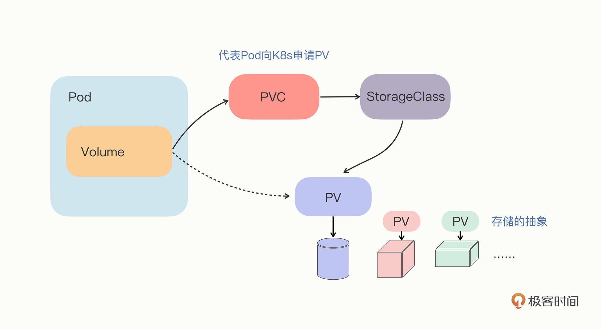
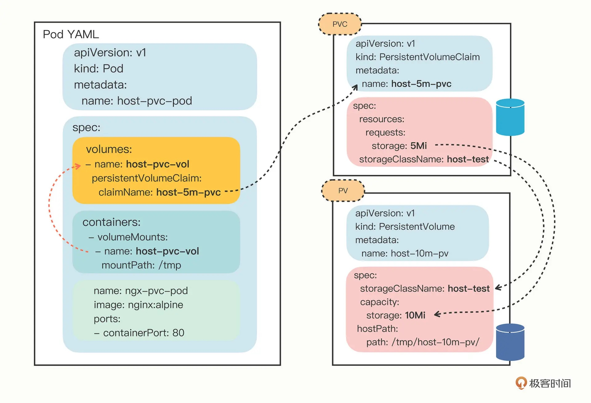

# 《Kubernetes 入門實戰課》學習筆記 Day 11

## Persistent Volume: 怎麼解決數據持久化問題

### 什麼是 PersistentVolume

前面提到**Pod 沒有持久化功能，導致無法永久存儲數據**。因為 Pod 里的容器是由鏡像產生的，而鏡像文件本身是只讀的，進程要讀寫磁盤只能用一個臨時的存儲空間，一旦 Pod 銷毀，臨時存儲也就會立即回收釋放，數據也就丟失了。

Kubernetes 的 Volume 對數據存儲已經有一個很好的抽象，它只是定義了有這麼一個存儲卷，而這個存儲卷是什麼類型、有多大容量、怎麼存儲，我們可以自定義。Pod 不需要關心那些專業、複雜的細節，只要設置好 `volumeMounts`，就可以把 Volume 加載進容器里使用。

Kubernetes 就順著 Volume 的概念，延伸出了 `PersistentVolume` 對象，**它專門用來表示持久存儲設備，但隱藏了存儲的底層實現**，我們只需要知道它能安全可靠地保管數據就可以了（由於 PersistentVolume 這個詞很長，一般都把它簡稱為 PV）。

作為存儲的抽象，**PV 實際上就是一些存儲設備、文件系統**，比如 Ceph、GlusterFS、NFS，甚至是本地磁盤，管理它們已經超出了 Kubernetes 的能力範圍，所以，**一般會由系統管理員單獨維護，然後再在 Kubernetes 里創建對應的 PV**。要注意的是，**PV 屬於集群的系統資源，是和 Node 平級的一種對象**，Pod 對它沒有管理權，只有使用權。

### 什麼是 PersistentVolumeClaim / StorageClass

單有 PV，還無法直接透過 Pod 使用。因為不同存儲設備的差異太大：如有的速度快，有的速度慢；有的可以共享讀寫，有的只能獨佔讀寫；有的容量小，只有幾百 MB，有的容量大到 TB、PB 級別。

這麼多種存儲設備，只用一個 PV 對象來管理不符合單一職責的原則，且讓 Pod 直接去選擇 PV 也很不靈活。於是 Kubernetes 就又增加了兩個新對象，`PersistentVolumeClaim` 和 `StorageClass`，用的還是中間層的思想，把存儲卷的分配管理過程再次細化。

- PersistentVolumeClaim，簡稱 PVC，從名字上看比較好理解，就是**用來向 Kubernetes 申請存儲資源的**。**PVC 是給 Pod 使用的對象**，它相當於是 Pod 的代理，代表 Pod 向系統申請 PV。一旦資源申請成功，Kubernetes 就會把 PV 和 PVC 關聯在一起，這個動作叫做綁定（bind）
- StorageClass 的作用有點像 IngressClass，它抽象了特定類型的存儲系統（比如 Ceph、NFS），**在 PVC 和 PV 之間充當協調者的角色，幫助 PVC 找到合適的 PV**。也就是說它可以簡化 Pod 掛載虛擬盤的過程，讓 Pod 看不到 PV 的實現細節



### 如何使用 YAML 描述 PersistentVolume

Kubernetes 中有很多類型的 PV，最容易的為本地存儲 `HostPath`

- 前提**需要系統管理員先在本地建立每個節點或是相對應的節點建立目錄**
- 無法直接透過 kubectl create 創建 PV 對象
```yaml
apiVersion: v1
kind: PersistentVolume
metadata:
  name: host-10m-pv

spec:
  storageClassName: host-test
  accessModes:
  - ReadWriteOnce
  capacity:
    storage: 10Mi
  hostPath:
    path: /tmp/host-10m-pv/
```

- storageClassName：對存儲類型的抽象 StorageClass。這個 PV 是我們手動管理的，名字可以任意即可
- accessModes：定義了存儲設備的訪問模式，簡單來說就是虛擬盤的讀寫權限，和 Linux 的文件訪問模式差不多，目前 Kubernetes 里有 3 種：
    - `ReadWriteOnce`：存儲卷可讀可寫，但只能被**一個節點**上的 Pod 掛載
    - `ReadOnlyMany`：存儲卷只讀不可寫，可以被任意節點上的 Pod 多次掛載
    - `ReadWriteMany`：存儲卷可讀可寫，也可以被任意節點上的 Pod 多次掛載。
- capacity：表示存儲容量，Kubernetes 裡定義存儲容量使用的是國際標準，我們日常習慣使用的 KB/MB/GB 的基數是 1000，要寫成 Ki/Mi/Gi (1024)，一定要小心不要寫錯了，否則單位不一致實際容量就會對不上。
- hostPath：指定存儲卷的本地路徑，也就是節點上的本機目錄

需要注意的點，為這 **3 種訪問模式限制的對象是節點而不是 Pod**，因為存儲是系統級別的概念，不屬於 Pod 里的進程。

因此，**本地存儲只能在本機使用，所以 PV 使用了 ReadWriteOnce**。

### 如何使用 YAML 描述 PersistentVolumeClaim

有了 PV，就表示集群里有了這麼一個持久化存儲可以供 Pod 使用，我們需要再定義 PVC 對象，向 Kubernetes 申請存儲。

```yaml
apiVersion: v1
kind: PersistentVolumeClaim
metadata:
  name: host-5m-pvc

spec:
  storageClassName: host-test
  accessModes:
    - ReadWriteOnce
  resources:
    requests:
      storage: 5Mi
```

PVC 的內容與 PV 很像，但它不表示實際的存儲，而是一個申請或者聲明，**spec 里的字段描述的是對存儲的期望狀態**。Kubernetes 就會根據 PVC 里的描述，去找能夠匹配 StorageClass 和容量的 PV，然後把 PV 和 PVC「綁定」在一起，實現存儲的分配。

### 如何在 Kubernetes 中使用 PersistentVolume

