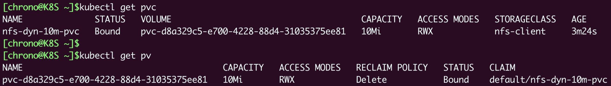

# 《Kubernetes 入門實戰課》學習筆記 Day 12

## Persistent Volume + NFS: 怎麼使用網路共享存儲

前面提到 Kubernetes 把持久化對象 PersistentVolume、PersistenVolumeClaim、StorageClass 結合就可以為 Pod 提供一個虛擬盤，不過當時採用的是 HostPath，存儲卷只能在本機操作，但 Pod 本身是不固定於某個節點的，所以此種方式不是特別實用。

要讓**存儲卷真正能被 Pod 任意掛載，需要改成網路存儲**，這樣 Pod 無論在哪裡運行，只要知道 IP 地址或者域名，就可以通過網路訪問存儲設備。

**網路存儲是一個非常熱門的應用領域，有很多知名的產品，如 AWS、Azure、Ceph，Kubernetes 還專門定義了 CSI（Container Storage Interface）規範**，不過這些存儲類型的安裝、使用都比較複雜，部署難度比較高。

此次以相對簡單的 NFS (Network File System) 進行操作說明如何在 Kubernetes 里使用網路存儲，以及靜態存儲卷和動態存儲卷的概念。

### 如何安裝 NFS 服務器

為一個經典的網路存儲系統，NFS 有著近 40 年的發展歷史，基本上已經成為了各種 UNIX 系統的標準配置，**NFS 採用的是 Client/Server 架構**，需要選定一台主機作為 Server，安裝 NFS 服務端；其他要使用存儲的主機作為 Client，安裝 NFS 客戶端工具。


- 在 Linux Ubuntu 中安裝 NFS 服務器
```shell
$ sudo apt -y install nfs-kernel-server
```

- 需要給 NFS 指定一個存儲位置，也就是網路共享目錄
```shell
# 目錄位置自定義
$ mkdir -p /tmp/nfs
```

- 配置 NFS 目錄訪問權限，修改 `/etc/exports`，指定目錄名、允許訪問的網段，以及權限等參數
```shell
/tmp/nfs 192.168.10.0/24(rw,sync,no_subtree_check,no_root_squash,insecure)
```

- 調整好後，需要使用 `exportfs -ra` 通知 NFS，使其生效
- 使用 `exportfs -v`進行驗證
```shell
$ sudo exportfs -ra
$ sudo exportfs -v
```


- 使用 `systemctl` 啟動 NFS 服務器
```shell
$ sudo systemctl start  nfs-server
$ sudo systemctl enable nfs-server
$ sudo systemctl status nfs-server
```


- 另外，可以使用 `showmount` 檢查 NFS 網路掛載情況
```shell
$ showmount -e 127.0.0.1
```

### 如何安裝 NFS 客服端

為了讓 Kubernetes 集群能夠訪問 NFS 存儲服務，我們還需要在每個節點上都安裝 NFS 客戶端。
```shell
$ sudo apt -y install nfs-common
```

- 一樣可以檢查節點 NFS 掛載情況


#### 手動掛載 NFS 網路存儲

- 一樣先創立共享目錄
```shell
$ mkdir -p /tmp/test
```

- 使用 `mount` 把 NFS 服務器的共享目錄掛載到剛剛建立的本地目錄
```shell
$ sudo mount -t nfs 192.168.10.208:/tmp/nfs /tmp/test
```

- 驗證是否成功與否，在客戶端創建文件，再到 NFS 服務器檢查是否有文件出現即可。之後集群里的任意節點，只要通過 NFS 客戶端，就能把數據寫入 NFS 服務器，實現網路存儲。
```shell
$ touch /tmp/test/x.yml
```

### 如何使用 NFS 存儲卷

現在我們已經為 Kubernetes 配置好了 NFS 存儲系統，就可以使用它來創建新的 PV 存儲對象。

- 手動分配一個存儲卷
    - storageClassName： nfs
    - accessModes： ReadWriteMany，這是由 NFS 的特性決定的，它**支持多個節點同時訪問一個共享目錄**。
- 需要在 YAML 指定 NFS 服務器的 IP 地址和共享目錄名
    - 如在 NFS 服務器的 /tmp/nfs 目錄里又創建了一個新的目錄 1g-pv，表示分配了 1GB 的可用存儲空間，相應的，PV 里的 capacity 也要設置成同樣的數值，也就是 1Gi
```yaml
apiVersion: v1
kind: PersistentVolume
metadata:
  name: nfs-1g-pv

spec:
  storageClassName: nfs
  accessModes:
    - ReadWriteMany
  capacity:
    storage: 1Gi

  nfs:
    path: /tmp/nfs/1g-pv
    server: 192.168.10.208
```

- 創建 PV 對象
    - **spec.nfs 里的 IP 地址一定要正確，路徑一定要存在（需事先創建好）**，否則 Kubernetes 按照 PV 的描述會無法掛載 NFS 共享目錄，PV 就會處於pending狀態無法使用
```shell
$ kubectl apply -f nfs-static-pv.yml
$ kubectl get pv
```


- 再創建 Pod 對象時候，把 PVC 掛載成一個 volume，用 `persistentVolumeClaim` 指定 PVC 名稱即可
```yaml
apiVersion: v1
kind: Pod
metadata:
  name: nfs-static-pod

spec:
  volumes:
  - name: nfs-pvc-vol
    persistentVolumeClaim:
      claimName: nfs-static-pvc

  containers:
    - name: nfs-pvc-test
      image: nginx:alpine
      ports:
      - containerPort: 80

      volumeMounts:
        - name: nfs-pvc-vol
          mountPath: /tmp
```

- Pod、PVC、PV 和 NFS 存儲的關係如下圖


因為在 PV/PVC 里指定了 storageClassName 是 nfs，節點上也安裝了 NFS 客戶端，所以 Kubernetes 就會自動執行 NFS 掛載動作，把 NFS 的共享目錄 /tmp/nfs/1g-pv 掛載到 Pod 里的 /tmp，完全不需要我們去手動管理。

- 可以檢查 Pod 是否正常存取 NFS 網路存儲


- 以及檢查 NFS 服務器的共享目錄是否有相同檔案


跟 HostPath 不同的是，NFS 是一個網路服務，不會受 Pod 調度位置的影響，只要網路通暢，這個 PV 對象就會一直可用，數據也就實現了真正的持久化存儲。

### 如何部署 NFS Provisioner

為什麼需要 NFS Provisioner？看似Kubernetes 里的數據持久化問題就已經解決了，但沒有完全解決。

- 因為 **PV 還是需要人工管理**，必須要由系統管理員手動維護各種存儲設備，再根據開發需求逐個創建 PV，而且 PV 的大小也很難精確控制，容易出現空間不足或者空間浪費的情況

如何自動化部署 PV？
- 這個在 Kubernetes 里就是**動態存儲卷**的概念，它可以用 **StorageClass 綁定一個 Provisioner 對象**，而這個 Provisioner 就是一個能夠自動管理存儲、創建 PV 的應用，代替了原來系統管理員的手工操作

目前，**Kubernetes 里各種存儲設備都有相應的 Provisioner 對象**
- NFS：Provisioner 為 [NFS subdir external provisioner](https://github.com/kubernetes-sigs/nfs-subdir-external-provisioner)
- Local Storage：Provisioner 可以用 [sig-storage-local-static-provisioner](https://github.com/kubernetes-sigs/sig-storage-local-static-provisioner)

NFS Provisioner 也是以 Pod 的形式運行在 Kubernetes 里的，在 GitHub 的 deploy 目錄里是部署它所需的 YAML 文件，一共有三個，分別是 `rbac.yaml`、`class.yaml` 和 `deployment.yaml`。

- 需要修改一些地方：
    - rbac.yaml: 默認為 default 命名空間，需要調整，避免與普通應用混在一起
    - deployment.yaml: 同樣需要修改 命名空間，**重點要修改 volumes 和 env 里的 IP 地址和共享目錄名，必須和集群里的 NFS 服務器配置一樣**
```yaml
...
spec:
  template:
    spec:
      serviceAccountName: nfs-client-provisioner
      containers:
      ...
          env:
            - name: PROVISIONER_NAME
              value: k8s-sigs.io/nfs-subdir-external-provisioner
            - name: NFS_SERVER
              value: 192.168.10.208        #改IP地址
            - name: NFS_PATH
              value: /tmp/nfs              #改共享目錄名
      volumes:
        - name: nfs-client-root
          nfs:
            server: 192.168.10.208         #改IP地址
            Path: /tmp/nfs                 #改共享目錄名
...
```

- YAML 文件調整好，即可在 Kubernetes 中創建 NFS Provisioner
```shell
$ kubectl apply -f rbac.yaml
$ kubectl apply -f class.yaml
$ kubectl apply -f deployment.yaml
```


### 如何使用 NFS 動態存儲卷

比起靜態存儲卷，動態存儲卷的用法簡單了很多。因為有了 Provisioner，我們就不再需要手工定義 PV 對象了，**只需要在 PVC 里指定 StorageClass 對象**，它再關聯到 Provisioner。

- NFS 默認 StorageClass 定義
    - `provisioner`: 指定使用哪個 Provisioner
    - `archiveOnDelete`: false 為自動回收存儲空間
```yaml
apiVersion: storage.k8s.io/v1
kind: StorageClass
metadata:
  name: nfs-client

provisioner: k8s-sigs.io/nfs-subdir-external-provisioner 
parameters:
  archiveOnDelete: "false"
```

- 或是根據自己的需求，任意定制具有不同存儲特性的 StorageClass
    - `onDelete`: retain 暫時保留分配的存儲，之後再手動刪除
```yaml
apiVersion: storage.k8s.io/v1
kind: StorageClass
metadata:
  name: nfs-client-retained

provisioner: k8s-sigs.io/nfs-subdir-external-provisioner
parameters:
  onDelete: "retain"
```

- 定義一個 PVC，跟系統申請 10MB 的存儲空間
```yaml
apiVersion: v1
kind: PersistentVolumeClaim
metadata:
  name: nfs-dyn-10m-pvc

spec:
  storageClassName: nfs-client
  accessModes:
    - ReadWriteMany

  resources:
    requests:
      storage: 10Mi
```

- 在 Pod 中用 volumes 和 volumeMounts 掛載，Kubernetes 就會自動找到 NFS Provisioner，在 NFS 共享目錄創建合適的 PV 對象
```yaml
apiVersion: v1
kind: Pod
metadata:
  name: nfs-dyn-pod

spec:
  volumes:
  - name: nfs-dyn-10m-vol
    persistentVolumeClaim:
      claimName: nfs-dyn-10m-pvc

  containers:
    - name: nfs-dyn-test
      image: nginx:alpine
      ports:
      - containerPort: 80

      volumeMounts:
        - name: nfs-dyn-10m-vol
          mountPath: /tmp
```



- Pod、PVC、StorageClass 和 Provisioner 關係圖如下


### 小結

- 在 Kubernetes 集群里，網路存儲系統更適合數據持久化，NFS 是最容易使用的一種網路存儲系統，要事先安裝好服務端和客戶端
- **可以編寫 PV 手工定義 NFS 靜態存儲卷，要指定 NFS 服務器的 IP 地址和共享目錄名**
- 使用 NFS 動態存儲卷必須要部署相應的 Provisioner，在 YAML 里正確配置 NFS 服務器
- **動態存儲卷不需要手工定義 PV，而是要定義 StorageClass**，由關聯的 Provisioner 自動創建 PV 完成綁定


