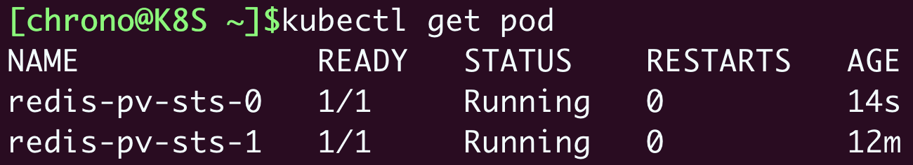

# 《Kubernetes 入門實戰課》學習筆記 Day 13

## Statefulset: 如何管理有狀態應用

前面說到 Deployment 和 DaemonSet 兩種 API 對象，它們都屬於無狀態應用，無法用於管理有狀態應用。

### 什麼是有狀態應用

PersistentVolume，為 Kubernetes 帶來了持久化存儲的功能，讓應用可以把數據存放在本地或者遠程的硬盤上。

有了持久化存儲，應用就可以把一些運行時的關鍵數據落盤，相當於有了一份保險，如果 Pod 發生意外崩潰，等重啓後掛載 Volume，再加載原數據就能恢復之前的狀態繼續運行，這裡的狀態就是指**某時刻的運行狀態**。

無狀態應用典型的例子就是 Nginx 這樣的 Web 服務器，它只是處理 HTTP 請求，本身不生產數據（日誌除外），不需要特意保存狀態，無論以什麼狀態重啓都能很好地對外提供服務。還有一些應用，運行狀態訊息就相對重要了，如果因為重啓而丟失了狀態是絕對無法接受的，這樣的應用就是有狀態應用，如 `Redis`、`MySQL` 數據庫。

雖然 Deployment + PersistentVolume 來達到高可用以及管理有狀態應用的目的，但 Kubernetes 認為的狀態不只是數據狀態持久化，包含**在集群化、分布式的場景里，有多實例的`依賴關係`、`啓動順序`和`網路標識`等問題需要解決，而這些問題剛好是 Deployment 無法做到的**。
   
 - 因為使用 Deployment，多個實例之間是無關的，啓動的順序不固定，Pod 的名字、IP 地址、域名也都是完全隨機的，而這正是無狀態應用的特點

對於有狀態應用，多個實例之間可能存在依賴關係，如 master/slave、active/passive，需要依次啓動才能保證應用正常運行，外界的客戶端也可能要使用固定的網路標識來訪問實例，而且這些信息還必須要保證在 Pod 重啓後不變。

因此，Kubernetes 在 Deployment 基礎上，再創建一個 API 對象為 StatefulSet，用來管理有狀態應用。

### 如何使用 YAML 描述 StatefulSet

樣板與 Deployment 差不多，多了 serviceName
- `serviceName`: 指定 service 名稱
```yaml
apiVersion: apps/v1
kind: StatefulSet
metadata:
  name: redis-sts

spec:
  serviceName: redis-svc
  replicas: 2
  selector:
    matchLabels:
      app: redis-sts

  template:
    metadata:
      labels:
        app: redis-sts
    spec:
      containers:
      - image: redis:5-alpine
        name: redis
        ports:
        - containerPort: 6379
```

### 如何在 Kubernetes 中使用 StatefulSet

StatefulSet 管理的 Pod 標號不在是隨機數字，而是順序編號，從 0 開始依序命名（ 0 號比 1 號 AGE還長），這**解決了有狀態應用第一個問題：啟動順序**。

```shell
$ kubectl apply -f redis-sts.yml
$ kubectl get sts
$ kubectl get pod
```


有了啓動的先後順序，應用該怎麼知道自己的身份，進而確定互相之間的依賴關係？

- Kubernetes 給出的方法是使用 hostname，也就是每個 Pod 里的主機名

```sehll
$ kubectl exec -it redis-sts-0 -- sh
```


有了這個唯一的名字，應用就可以自行決定依賴關係了，比如在這個 Redis 例子里，就可以讓先啓動的 0 號 Pod 是主實例，後啓動的 1 號 Pod 是從實例.

解決了啓動順序和依賴關係，**還剩下第三個問題：網路標識，這就需要用到 Service 對象。**

- 無法用命令 `kubectl expose` 直接為 StatefulSet 生成 Service，只能手動編寫 YAML
- 需要注意的是，**`metadata.name` 必須和 StatefulSet 里的 `serviceName` 相同，`selector` 里的標籤也必須和 StatefulSet 里的一致**

```yaml
apiVersion: v1
kind: Service
metadata:
  name: redis-svc # 與 StatefulSet 里的一致

spec:
  selector: # StatefulSet 里的一致
    app: redis-sts 

  ports:
  - port: 6379
    protocol: TCP
    targetPort: 6379
```


可以看到這個 Service 並沒有什麼特殊的地方，也是用標籤選擇器找到 StatefulSet 管理的兩個 Pod，然後找到它們的 IP 地址。

特殊點在於，StatefulSet 的域名。

前面說到，Service 會有自己的一個域名，格式是對象名. 名字空間，每個 Pod 也會有一個域名，形式是 IP 地址. 名字空間。但因為 IP 地址不穩定，所以 **Pod 的域名並不實用，一般我們會使用穩定的 Service 域名**。

當我們把 **Service 對象應用於 StatefulSet 的時候**，情況就不一樣了。Service 發現這些 Pod 不是一般的應用，而是有狀態應用，需要有穩定的網路標識，所以就會為 Pod 再多創建出一個新的域名，格式是`<podName>.<service>.<namespace>.svc.cluster.local`。當然，這個域名也可以簡寫成`<podName>.<service>`。


從圖中可以觀察到，兩個 Pod 在 StatefulSet 皆有穩定的域名，也就是網路標識。雖然 Pod 的 IP 地址可能會變，但這個有編號的域名由 Service 對象維護，是穩定不變的.

**通過 StatefulSet 和 Service 的聯合使用，Kubernetes 就解決了有狀態應用的`依賴關係`、`啓動順序`和`網路標識`這三個問題**，剩下的多實例之間內部溝通協調等事情就需要應用自己去處理了。

另外需要注意的是，**Service 原本的目的是負載均衡，應該由它在 Pod 前面來轉發流量**，但是對 StatefulSet 來說，這項功能反而是不必要的，**因為 Pod 已經有了穩定的域名**，外界訪問服務就不應該再通過 Service 這一層了。所以，**從安全和節約系統資源的角度考慮，我們可以在 Service 里添加一個字段 `clusterIP: None` ，告訴 Kubernetes 不必再為這個對象分配 IP 地址**。

- StatefulSet 與 Service 對象的關係圖


### 如何實現 StatefulSet 的數據持久化

採用前面學的 PersistentVolume 和 NFS 的知識，我們可以很容易地定義 StorageClass，然後編寫 PVC，再給 Pod 掛載 Volume。

**為了強調持久化存儲與 StatefulSet 的一對一綁定關係**，Kubernetes 為 StatefulSet 專門定義了一個字段`volumeClaimTemplates`，直接把 PVC 定義嵌入 StatefulSet 的 YAML 文件里。這樣能**保證創建 StatefulSet 的同時，就會為每個 Pod 自動創建 PVC，讓 StatefulSet 的可用性更高**。

- 調整前面提到的 Redis StatefulSet 對象，加上持久化功能
    - `volumeClaimTemplates`：里定義了一個 PVC，名字是 redis-100m-pvc，申請了 100MB 的 NFS 存儲。在 Pod 模板里用 volumeMounts 引用了這個 PVC，把網盤掛載到了 /data 目錄，也就是 Redis 的數據目錄
```yaml
apiVersion: apps/v1
kind: StatefulSet
metadata:
  name: redis-pv-sts

spec:
  serviceName: redis-pv-svc

  volumeClaimTemplates:
  - metadata:
      name: redis-100m-pvc
    spec:
      storageClassName: nfs-client
      accessModes:
        - ReadWriteMany
      resources:
        requests:
          storage: 100Mi

  replicas: 2
  selector:
    matchLabels:
      app: redis-pv-sts

  template:
    metadata:
      labels:
        app: redis-pv-sts
    spec:
      containers:
      - image: redis:5-alpine
        name: redis
        ports:
        - containerPort: 6379

        volumeMounts:
        - name: redis-100m-pvc
          mountPath: /data
```

- StatefulSet 對象關係圖


創建及查看 StatefulSet 對象
```shell
$ kubectl apply -f redis-pv-sts.yml
$ kubectl get pvc
```


可以從圖中看到，命名也是有規律的，用的是 PVC 名稱 + StatefulSet 名稱的組合。所以，即使 Pod 被刪除，只要 PVC 能夠被找到，即可再次綁定之前使用的存儲數據。

- 驗證數據，模擬 Pod 被刪除情況
```shell
$ kubectl exec -it redis-pv-sts-0 -- redis-cli
$ kubectl delete pod redis-pv-sts-0
```

- 可以看到 Pod 很快就被重建
 



因為我們採用 NFS 網路存儲，且掛載到了 Pod 的 /data 目錄，Redis 就會定期把數據落盤保存，所以新創建的 Pod 再次掛載目錄的時候會從備份文件里恢複數據，內存里的數據就恢復原狀了。

### 小結

API 對象 StatefulSet，它與 Deployment 非常相似，差別在於有多實例的`依賴關係`、`啓動順序`和`網路標識`。

- StatefulSet 的 YAML 描述和 Deployment 幾乎完全相同，只是多了一個關鍵字段 `serviceName`
- 要為 StatefulSet 里的 Pod 生成穩定的域名，需要定義 Service 對象，它的名字必須和 StatefulSet 里的 serviceName 一致
- **訪問 StatefulSet 應該使用每個 Pod 的單獨域名，形式是 `<pod>.<service>`，不應該使用 Service 的負載均衡功能**
- 在 StatefulSet 里可以用字段`volumeClaimTemplates`直接定義 PVC，讓 Pod 實現數據持久化存儲


