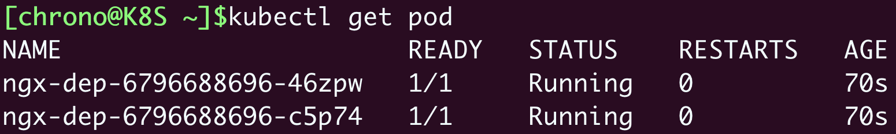

# 《Kubernetes 入門實戰課》學習筆記 Day 14

## 滾動更新：如何做到平滑升降級應用

只是把應用發布到集群是不夠的，還需要有持續的運維，讓應用穩定運行。

### Kubernetes 如何定義應用版本

在 Kubernetes 中版本更新不是使用 API 對象，而是採用指令方式
- kubectl apply
- kubectl rollout

在 Kubernetes 中應用都是以 Pod 方式運行，Pods 被 Deployment等對象管理，因此**應用的版本更新為整個 Pod 的更新。**

- Pod 在對象的 YAML 描述中是 `template` 字段
- 所以**應用版本變化為 template 中的 Pod 變化**

但是 template 包含太多資訊，無法直接當作版本號，因此採用了摘要算法計算 template 的 Hash 作為版本號。

- Pod 名字中的隨機數字為 Pod 的 Hash



- 如果變動了 Pod YAML 描述，可以觀察到隨機數字跟著改變，就表示版本更新了


### Kubernetes 如何實現應用更新

- 如調整 Nginx Deployment 的 YAML 描述文件，指定版本號為 1.21
```yaml
apiVersion: apps/v1
kind: Deployment
metadata:
  name: ngx-dep

spec:
  replicas: 4
  ... ...
      containers:
      - image: nginx:1.21-alpine
  ... ...
```

- 文件命名為 ngx-v1.yml，藉由 kubectl post-forward 轉發查看
```shell
$ kubectl apply -f ngx-v1.yml
$ kubectl port-forward svc/ngx-svc 8080:80 &
$ curl 127.1:8080
```


- 再者，調整 Nginx 版號為 1.22，為了方便觀察，可以加上 `minReadySeconds`，讓 Kubernetes 在更新過程等待長一些。
```yaml
apiVersion: apps/v1
kind: Deployment
metadata:
  name: ngx-dep

spec:
  minReadySeconds: 15      # 等待確認Pod就緒的等待時間 
  replicas: 4
  ... ...
      containers:
      - image: nginx:1.22-alpine
  ... ...
```

- 執行更新指令，可以使用 `kubectl rollout status` 查看更新狀態
- 可以從更新狀態觀察到，**Pod 更新過程是逐步替換的**，而不是一次全部更換
```shell
$ kubectl apply -f ngx-v2.yml
$ kubectl rollout status deployment ngx-dep
```


- 可以使用 `kubectl describe` 查看 Pod 的變化
```shell
$ kubectl describe deploy ngx-dep
```


- 滾動更新 關係圖如下
    - 逐步替換更新
    

### Kubernetes 如何管理應用更新

Kubernetes 滾動更新功能很方便，但更新中途遇到錯誤、更新後出現問題，需要使用 `kubectl rollout` 指令解決。

- 查看更新歷史
    - 加上參數 `--revision` 可以拿到更詳細訊息
```shell
$ kubectl rollout history deploy ngx-dep
$ kubectl rollout history deploy ngx-dep --revision=2
```


### Kubernetes 如何添加更新描述

在 Deployment 中的 metadata 加入 annotations 字段即可

- `annotations`：添加的訊息一般是給 Kubernetes 內部的各種對象使用的，有點像是擴展屬性。**會自動忽略不合理的 Key-Value pairs**
- `labels`：主要面對的是 Kubernetes 外部的用戶，用來篩選、過濾對象的

如果創建了 3 個版本的 Nginx 應用，並添加 metadata 描述（更新說明）
```yaml

apiVersion: apps/v1
kind: Deployment
metadata:
  name: ngx-dep
  annotations:
    kubernetes.io/change-cause: v1, ngx=1.21
... ...
---

apiVersion: apps/v1
kind: Deployment
metadata:
  name: ngx-dep
  annotations:
    kubernetes.io/change-cause: update to v2, ngx=1.22
... ...
---

apiVersion: apps/v1
kind: Deployment
metadata:
  name: ngx-dep
  annotations:
    kubernetes.io/change-cause: update to v3, change name
... ...
```

- 可以透過指令看到 `kubectl rollout history` 滾動歷史
- 因為加了更新說明，所以在查看表訊息上會容易理解許多


### 小結

滾動更新：它會自動縮放新舊版本的 Pod 數量，能夠在用戶無感知的情況下實現服務升級或降級

- 在 Kubernetes 里應用的版本不僅僅是容器鏡像，而是整個 Pod 模板，為了便於處理使用了摘要算法，計算模板的 Hash 值作為版本號
- Kubernetes 更新應用採用的是滾動更新策略，減少舊版本 Pod 的同時增加新版本 Pod，保證在更新過程中服務始終可用
- 管理應用更新使用的命令是 `kubectl rollout`，子命令有 `status、`history`、`undo` 等
- Kubernetes 會記錄應用的更新曆史，可以使用 `history --revision` 查看每個版本的詳細信息，也可以在每次更新時添加註解 `kubernetes.io/change-cause`
- 需要更精細控制，可以調整 `spec.strategy.rollingUpdate` 內等字段，一般用默認值足以
    - maxSurge：控制最多新增 Pod 數
    - maxUnavailable：控制最多不可用 Pod 數


