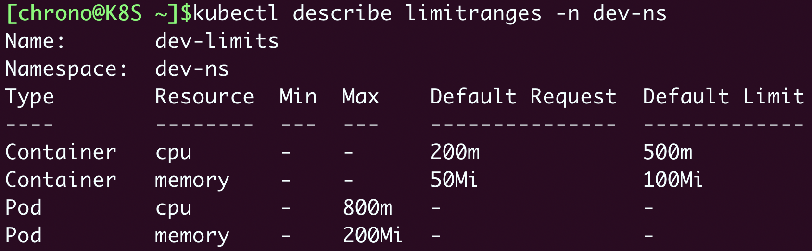

# 《Kubernetes 入門實戰課》學習筆記 Day 16

## 集群管理：如何用命名空間分隔系統資源

### 為什麼要有命名空間 Namespace

- Kubernetes 的命名空間並不是一個實體對象，只是一個邏輯上的概念
- 面對大規模集群、眾多節點的一種分配方式。**大量節點使得資源爭搶和命名衝突的概率大大增加**，情形和單機 Linux 系統里是非常相似的
    - 如，假設現在有一個 Kubernetes 集群，前端組、後端組、測試組都在使用它。這個時候就很容易命名衝突，比如後端組先創建了一個 Pod 叫 Web ，這個名字就被佔用了，之後前端組和測試組就只能絞盡腦汁再新起一個不衝突的名字。接著資源爭搶也容易出現，比如某一天，測試組不小心部署了有 Bug 的應用，在節點上把資源都給吃掉了，就會導致其他組的同事根本無法工作。
- **Kubernetes 把集群適當局部化，給每一類用戶創造出自己的工作空間**

### 如何使用命名空間

命名空間也是一個 API 對象，使用指令 `kubectl api-resources` 可以看到命名空間的簡稱

```shell
$ kubectl create namespace test-ns 
$ kubectl create ns test-ns 
$ kubectl get ns
```
Kubernetes 初始化集群的時候也會預設 4 個名字空間，常用的為前兩個：
- default: 默認命名空間
- kube-system: 系統組件的命名空間
- kube-public
- kube-node-lease

**想要把一個對象放入特定的名字空間，需要在它的 `metadata` 里添加一個 `namespace` 字段，或是在下指令時候，加上 `-n` 參數指令**

```shell
apiVersion: v1
kind: Pod
metadata:
  name: ngx
  namespace: test-ns # 指定命名空間

spec:
  containers:
  - image: nginx:alpine
    name: ngx
```

同上，**在取資訊或是操作其他命名空間，需要加上 `-n` 參數指令**，否則用默認 default 命名空間

```shell
$ kubectl get pod -n test-ns
```


- 需要留意的是，**一旦刪除命名空間，屬於命名空間內的對象也會一併被刪除**


### 什麼是資源配額
> Ref:
> - [Resource Quotas](https://kubernetes.io/docs/concepts/policy/resource-quotas/)
> 

有了命名空間，我們就可以像管理容器一樣，給命名空間設定配額，把整個集群的計算資源分割成不同的大小，按需分配給團隊或項目使用。

**命名空間的資源配額需要使用一個專門的 API 對象，叫做 ResourceQuota，簡稱是 quota**

```shell
$ export out="--dry-run=client -o yaml"
$ kubectl create quota dev-qt $out
---
apiVersion: v1
kind: ResourceQuota
metadata:
  creationTimestamp: null
  name: dev-qt
spec: {}
status: {}
```
因為**資源配額對象必須依附在命名空間**上，所以在它的 **metadata 字段裡必須明確寫出 namespace**（否則就會應用到 default 名字空間）。

```yaml

apiVersion: v1
kind: Namespace
metadata:
  name: dev-ns

---

apiVersion: v1
kind: ResourceQuota
metadata:
  name: dev-qt
  namespace: dev-ns

spec:
  ... ...
```

ResourceQuota 對象的使用方式比較靈活，既可以限制整個命名空間的配額，也可以使用 `scopeSelector` 只限制某些類型的對象。

因為細節過多，這邊只簡單敘述，詳情請參考子標題的 Reference
- `hard`：硬性全局控制
    - CPU 和內存配額，使用 `request.*`、`limits.*`，和容器資源限制是一樣的
    - 存儲容量配額，使 `requests.storage` 限制的是 PVC 的存儲總量，也可以用 `persistentvolumeclaims` 限制 PVC 的個數
    - 核心對象配額，使用對象的名字（英語複數形式），如 `pods`、`configmaps`、`secrets`、`services`
    - 其他 API 對象配額，使用 `count/name.group` 的形式，如 `count/jobs.batch`、`count/deployments.apps`

```yaml
apiVersion: v1
kind: ResourceQuota
metadata:
  name: dev-qt
  namespace: dev-ns

spec:
  hard:
    requests.cpu: 10
    requests.memory: 10Gi
    limits.cpu: 10
    limits.memory: 20Gi

    requests.storage: 100Gi
    persistentvolumeclaims: 100

    pods: 100
    configmaps: 100
    secrets: 100
    services: 10

    count/jobs.batch: 1
    count/cronjobs.batch: 1
    count/deployments.apps: 1
```

上面 YAML 文件描述為：
- 所有 Pod 的需求總量最多是 10 個 CPU 和 10GB 的內存，上限總量是 10 個 CPU 和 20GB 的內存
- 只能創建 100 個 PVC 對象，使用 100GB 的持久化存儲空間
- 只能創建 100 個 Pod，100 個 ConfigMap，100 個 Secret，10 個 Service
- 只能創建 1 個 Job，1 個 CronJob，1 個 Deployment

也可以切分成小 YAML 管理
```yaml
apiVersion: v1
kind: ResourceQuota
metadata:
  name: cpu-mem-qt
  namespace: dev-ns

spec:
  hard:
    requests.cpu: 10
    requests.memory: 10Gi
    limits.cpu: 10
    limits.memory: 20Gi
---
apiVersion: v1
kind: ResourceQuota
metadata:
  name: core-obj-qt
  namespace: dev-ns

spec:
  hard:
    pods: 100
    configmaps: 100
    secrets: 100
    services: 10
```

### 如何使用資源配額

透過 `quota` 對象查看資源配額
```yaml
$ kubectl apply -f quota-ns.yml
$ kubectl get quota -n dev-ns
```


- 使用 `kubectl describe` 便於查閱
```yaml
$ kubectl describe quota -n dev-ns
```


實際驗證看看，上面針對命名空間的資源限制是否有效果
```yaml
$ kubectl create job echo1 -n dev-ns --image=busybox -- echo hello
$ kubectl create job echo2 -n dev-ns --image=busybox -- echo hello
```


ResourceQuota 限制了命名空間里最多只能有一個 Job，可以看到 `超出資源限制` 的訊息，也可以看到 Job 資源達到上限。


### 默認資源配額
> Ref:
> - [Limit Range](https://kubernetes.io/docs/concepts/policy/limit-range/)

**一旦加上命名空間資源配額限制後，Kubernetes 會要求所有在裡面運行的 Pod 都必須用字段 resources 聲明資源需求，否則就無法創建**。
```yaml
$ kubectl run ngx --image=nginx:alpine -n dev-ns
```


每次創建 Pod 都手動需要加上這些資源配額很累人的，是否有更加容易或是給個默認值的方法？

- `LimitRange`: Kubernetes 提供了一個很小但很有用的輔助對象，簡稱是 `limits`，**它能為 API 對象添加默認的資源配額限制**

可以採用指令 `kubectl explain limits` 來查看它的 YAML 字段詳細說明

```yaml
apiVersion: v1
kind: LimitRange
metadata:
  name: cpu-resource-constraint
spec:
  limits:
  - default: # this section defines default limits
      cpu: 500m
    defaultRequest: # this section defines default requests
      cpu: 500m
    max: # max and min define the limit range
      cpu: "1"
    min:
      cpu: 100m
    type: Container
```

- `spec.limits`: 是它的核心屬性，描述了默認的資源限制
- `type`: 是要限制的對象類型，可以是 `Container`、`Pod`、`PersistentVolumeClaim`
- `default`: 是默認的資源上限，對應容器里的 `resources.limits`，只適用於 Container
- `defaultRequest`: 默認申請的資源，對應容器里的 `resources.requests`，同樣也只適用於 Container
- `max`、`min`: 是對象能使用的資源的最大最小值

```yaml
apiVersion: v1
kind: LimitRange
metadata:
  name: dev-limits
  namespace: dev-ns

spec:
  limits:
  - type: Container
    defaultRequest:
      cpu: 200m
      memory: 50Mi
    default:
      cpu: 500m
      memory: 100Mi
  - type: Pod
    max:
      cpu: 800m
      memory: 200Mi
```
它設置了每個容器默認申請 0.2 的 CPU 和 50MB 內存，容器的資源上限是 0.5 的 CPU 和 100MB 內存，每個 Pod 的最大使用量是 0.8 的 CPU 和 200MB 內存。

- 創建 limits 後，也可以透過 `kubectl describe limits` 查看
```shell
$ kubectl describe limitranges -n dev-ns
$ kubectl describe limits -n dev-ns
```


再次透過上面指令創建 Pod，可以看到默認加上的資源配額
```yaml
$ kubectl run ngx --image=nginx:alpine -n dev-ns
```


### 小結

- 名字空間是一個邏輯概念，沒有實體，它的目標是為資源和對象劃分出一個邏輯邊界，避免衝突
- `ResourceQuota` 對象可以為名字空間添加資源配額，限制全局的 CPU、內存和 API 對象數量
- **`LimitRange` 對象可以為容器或者 Pod 添加默認的資源配額，簡化對象的創建工作**


