# 《Kubernetes 入門實戰課》學習筆記 Day 17

## 系統監控：如何使用 Metrics Server 和 Prometheus

Kubernetes 為集群提供 2 種系統級別的監控項目： 
- Metrics Server
- Prometheus
以及基於它們的 HorizontalPodAutoscaler（HPA）

### Metrics Service
> Ref:
> - [Metrics Server](https://github.com/kubernetes-sigs/metrics-server)
> 

Kubernetes 像 linux 也提供了類似的命令來查詢程序的 CPU 及內存使用率，就是 `kubectl top`，不過默認情況下這個命令不會生效，必須要安裝一個插件 `Metrics Server` 才可以。

Metrics Server 是一個專門用來收集 Kubernetes 核心資源指標（metrics）的工具，它定時從所有節點的 kubelet 里採集信息，但是對集群的整體性能影響極小，**每個節點只大約會佔用 1m 的 CPU 和 2MB 的內存**，所以性價比非常高。
- Metric Server 工作流程

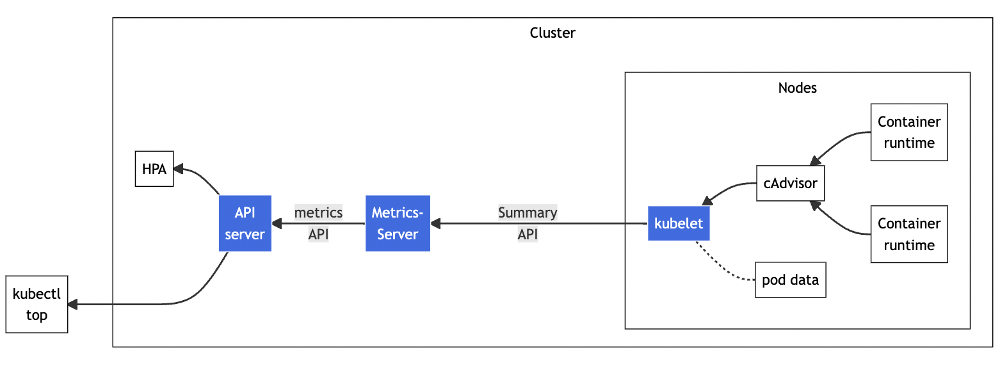

- 安裝教學可以參考 Reference

Metrics Server 將所有依賴都放到一個 YAML 描述文件
```shell
$ wget https://github.com/kubernetes-sigs/metrics-server/releases/latest/download/components.yaml
```

在**開發環境，有一個地方需要調整**：
- 修改 YAML 描述，在 Deployment 對象加上 `--kubelet-insecure-tls`
    - 因為 Metrics Server 默認使用 TLS 協議，需要驗證憑證才能正常啟動，與 kubelet 安全通訊
```yaml
apiVersion: apps/v1
kind: Deployment
metadata:
  name: metrics-server
  namespace: kube-system
spec:
  ... ... 
  template:
    spec:
      containers:
      - args:
        - --kubelet-insecure-tls
        ... ... 
```

調整完，直接部署即可
```shell
$ kubectl apply -f components.yaml
```

Metrics Server 屬於 kube-system 命名空間
```shell
$ kubectl get pod -n kube-system
```
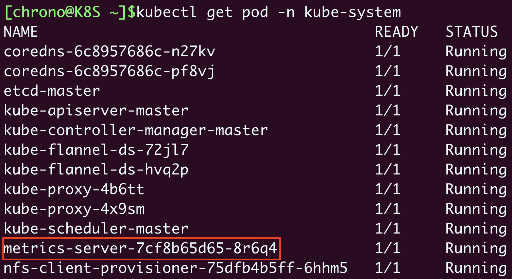

我們就可以透過 `kubectl top` 查看當前集群資源運行狀況
- `kubectl top node`
- `kubectl top pod`

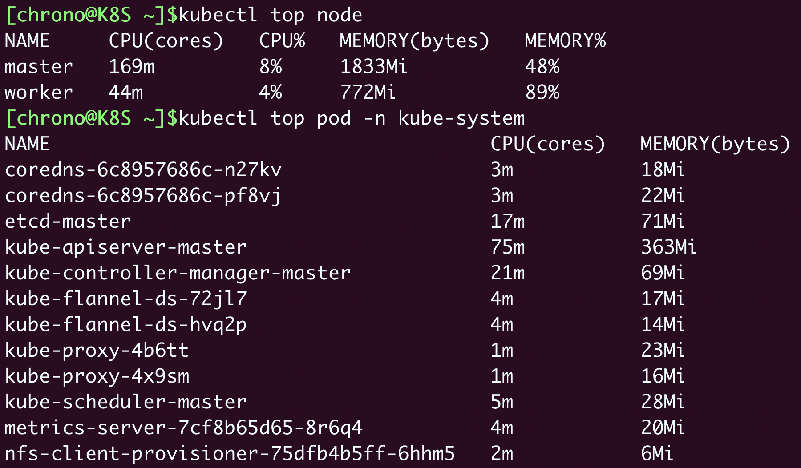

### HorizontalPodAutoscaler

有了 Metrics Server，我們就可以輕鬆地查看集群的資源使用狀況了，不過**它另外一個更重要的功能是輔助實現應用的水平自動伸縮**。

前面筆記有提到 **`kubectl scale` 任意調整 Deployment 部署的 Pod 數量，也就是水平方向的擴容和縮容**。但是手動調整應用實例數量還是比較麻煩的，需要人工參與，也很難準確把握時機，難以及時應對生產環境中突發的大流量。

Kubernetes 提供了一個 API 對象，`HorizontalPodAutoscaler`，簡稱 `hpa`，**它是專門用來自動伸縮 Pod 數量的對象，適用於 `Deployment` 和 `StatefulSet`**，但不能用於 `DaemonSet`。

- **HorizontalPodAutoscaler 的能力完全基於 Metrics Server**，它從 Metrics Server 獲取當前應用的運行指標，主要是 CPU 使用率，再依據預定的策略增加或者減少 Pod 的數量。

需要 Deployment 和 Service，HPA 才能運作
```yaml
apiVersion: apps/v1
kind: Deployment
metadata:
  name: ngx-hpa-dep

spec:
  replicas: 1
  selector:
    matchLabels:
      app: ngx-hpa-dep

  template:
    metadata:
      labels:
        app: ngx-hpa-dep
    spec:
      containers:
      - image: nginx:alpine
        name: nginx
        ports:
        - containerPort: 80

        resources:
          requests:
            cpu: 50m
            memory: 10Mi
          limits:
            cpu: 100m
            memory: 20Mi
---

apiVersion: v1
kind: Service
metadata:
  name: ngx-hpa-svc
spec:
  ports:
  - port: 80
    protocol: TCP
    targetPort: 80
  selector:
    app: ngx-hpa-dep
```

這邊 YAML 描述文件重點為，需要使用 HPA，所以一定需要加上 `resources` 資源配額，否則沒法抓取到資源指標。

我們使用指令 `kubectl autoscale` 創建 HPA 文件，
```shell
export out="--dry-run=client -o yaml"              
$ kubectl autoscale deploy ngx-hpa-dep --min=2 --max=10 --cpu-percent=5 $out
```
- min：Pod 數量的最小值，也就是縮容的下限
- max：Pod 數量的最大值，也就是擴容的上限
- cpu-percent：CPU 使用率指標，當大於這個值時擴容，小於這個值時縮容

YAML 描述文件
```yaml
apiVersion: autoscaling/v1
kind: HorizontalPodAutoscaler
metadata:
  name: ngx-hpa

spec:
  maxReplicas: 10
  minReplicas: 2
  scaleTargetRef:
    apiVersion: apps/v1
    kind: Deployment
    name: ngx-hpa-dep
  targetCPUUtilizationPercentage: 5
```
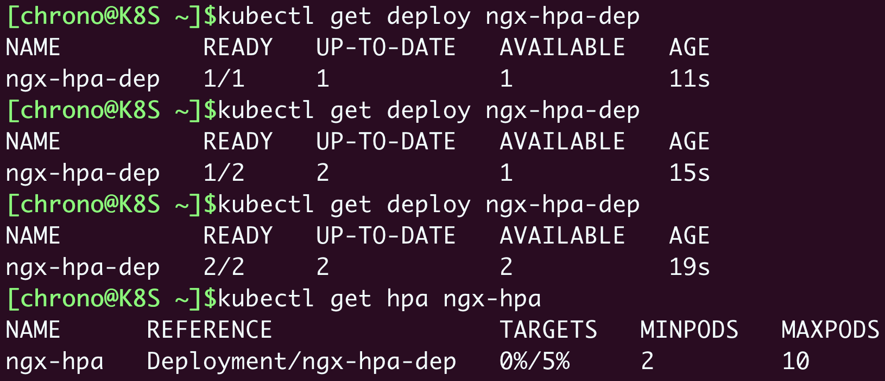

從圖中可以看，因為 HPA 最小副本是 2，所以自動先把 Pod 從 1 擴容為 2，再通過 Metrics Server 不斷地監測 Pod 的 CPU 使用率。

我們可以使用 ab 工具 （Apache Bench）給 Nginx 加上壓力流量。
- 使用的鏡像是 `httpd:alpine`，它裡面有 HTTP 性能測試工具 ab
```shell
$ kubectl run test -it --image=httpd:alpine -- sh
```
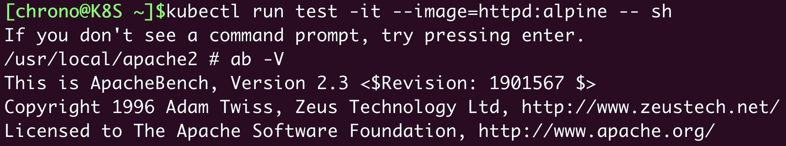


向 Nginx 發送一百萬個請求，持續 1 分鐘，再用 kubectl get hpa 來觀察 HorizontalPodAutoscaler 的運行狀況
```shell
$ ab -c 10 -t 60 -n 1000000 'http://ngx-hpa-svc/'
```
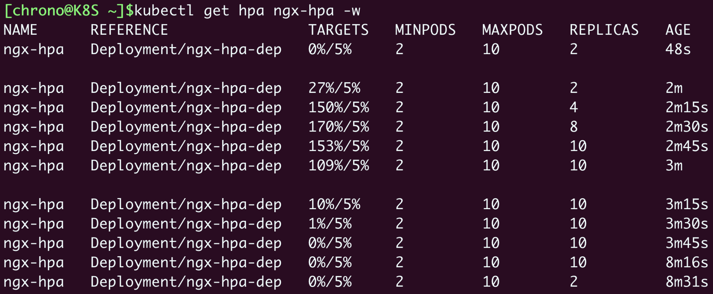

因為 **Metrics Server 大約每 15 秒採集一次數據**，所以 HorizontalPodAutoscaler 的自動化擴容和縮容也是按照這個時間點來逐步處理。

### Prometheus
> Ref:
> - [Prometheus](https://prometheus.io)
> - [kube-prometheus](https://github.com/prometheus-operator/kube-prometheus/)
>
因為 Metrics Server 能夠獲取的指標還是太少了，只有 CPU 和內存，想要監控到更多更全面的應用運行狀況，還得搭配監控權威項目 Prometheus。

- Prometheus 官方架構圖


Prometheus 系統的核心是它的 Server，裡面有一個時序數據庫 TSDB，用來存儲監控數據，另一個組件 Retrieval 使用拉取（Pull）的方式從各個目標收集數據，再通過 HTTP Server 把這些數據交給外界使用。

在 Prometheus Server 之外還有三個重要的組件：
- `Push Gateway`: 用來適配一些特殊的監控目標，把默認的 Pull 模式轉變為 Push 模式
- `Alert Manager`: 告警中心，預先設定規則，發現問題時就通過郵件等方式告警
- `Grafana`: Web 圖形化界面，可以定制大量直觀的監控儀錶盤

因為 Prometheus 組件太多，這邊採用 `kube-prometheus` 項目（參考 Reference）

```shell
$ wget https://github.com/prometheus-operator/kube-prometheus/archive/refs/tags/v0.12.0.tar.gz
```

一樣有地方需要修改：
- 修改 `prometheus-service.yaml`、`grafana-service.yaml`
    - 添加 `type: NodePort`，直接通過節點的 IP 地址訪問（當然也可以配置成 Ingress）

調整完，我們先部署命名空間等基礎對象，再部署相關服務
```shell
$ kubectl create -f manifests/setup
$ kubectl create -f manifests
```

透過 `kubectl get` 查看狀態，Prometheus 屬於 monitoring 命名空間
```shell
$ kubectl get pod -n monitoring
```
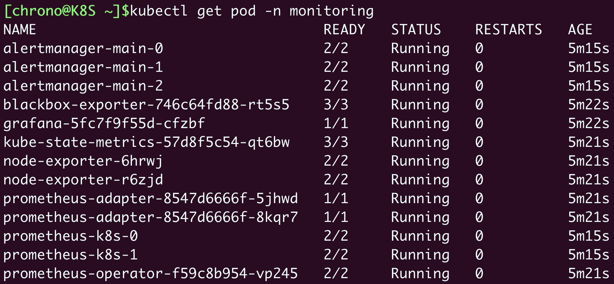

確認 Pod 正常運行後，可以再確認 service 是否正常
- 這邊就可以看到前面修改加上的 NodePort 部分，暴露了兩個對外端口：
    -  Grafana：為 30358
    -  Prometheus：2 個端口，web 為 30827
```shell
$ kubectl get svc -n monitoring
```
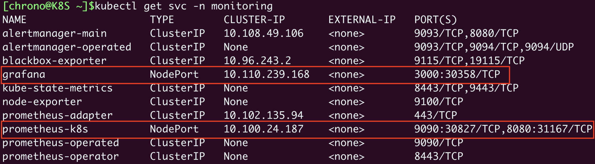

- Prometheus 和 Grafana 介面，IP 需要參照自己 IP 調整
    - Grafana 內部已經預置了很多強大易用的儀錶盤，你可以在左側菜單欄的 Dashboards - Browse 里任意挑選一個
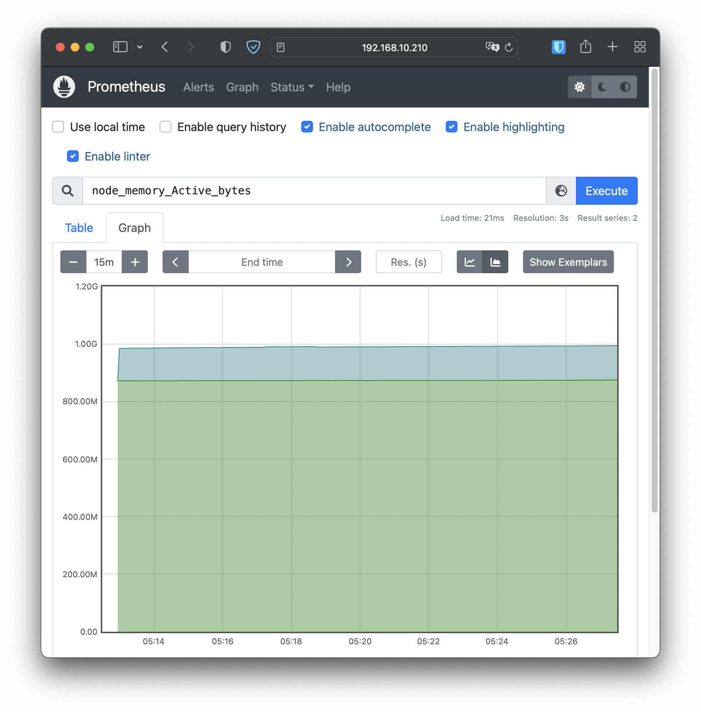
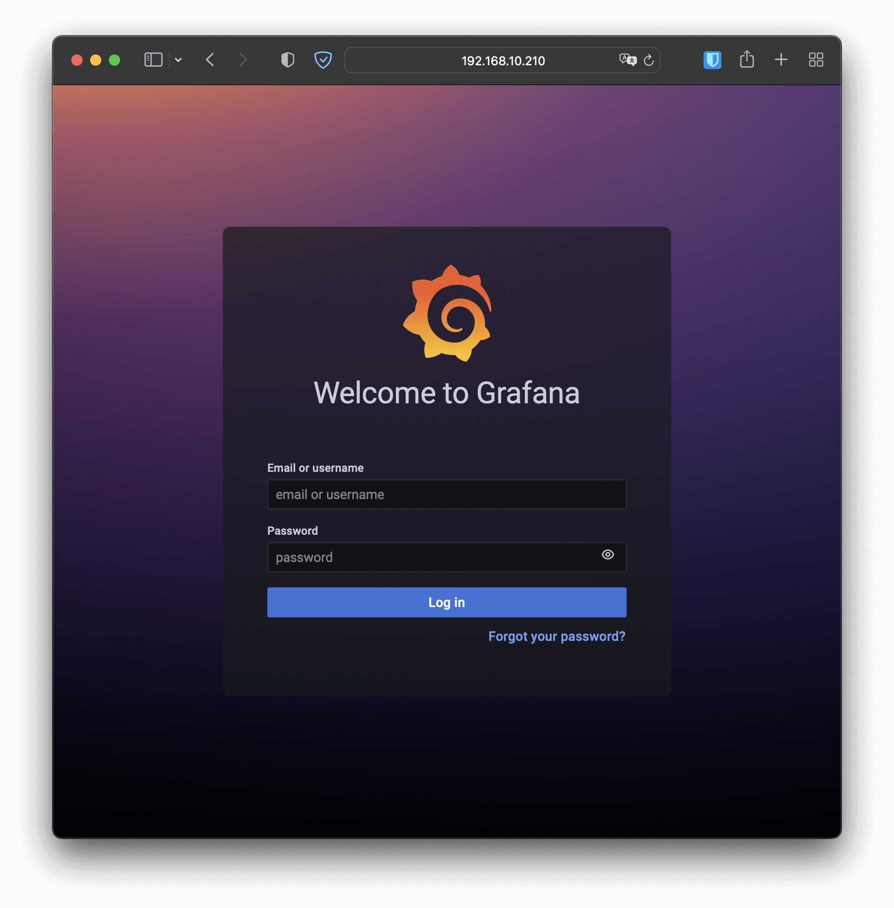
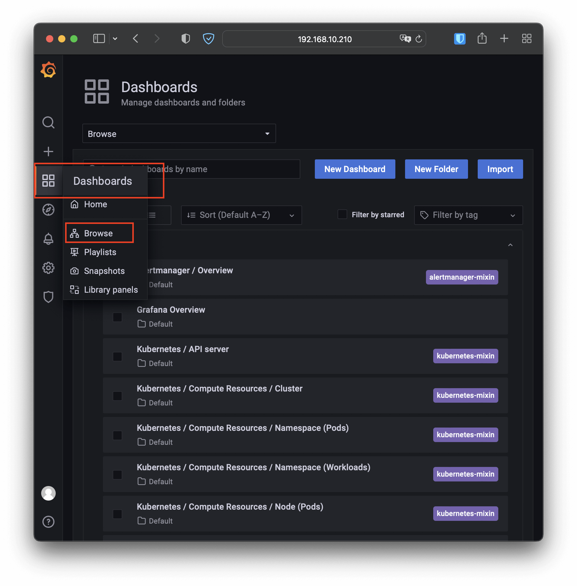
- 如，選擇 `Kubernetes / Compute Resources / Namespace (Pods)` Dashboard
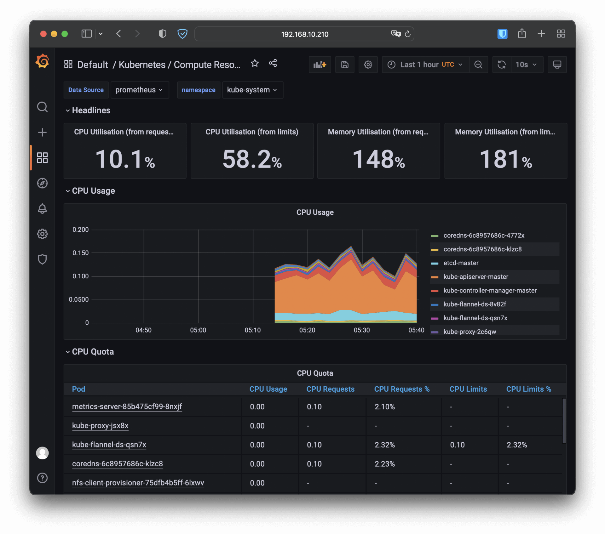

### 小結

- `Metrics Server` 是一個 Kubernetes 插件，能夠收集系統的核心資源指標，相關的命令是 `kubectl top`
- `Prometheus` 是雲原生監控領域的標準，用 `PromQL` 語言來查詢數據，配合 `Grafana` 可以展示直觀的圖形界面，方便監控
- `HorizontalPodAutoscaler` 實現了應用的自動水平伸縮功能，它從 Metrics Server 獲取應用的運行指標再實時調整 Pod 數量，適時地處理突發流量

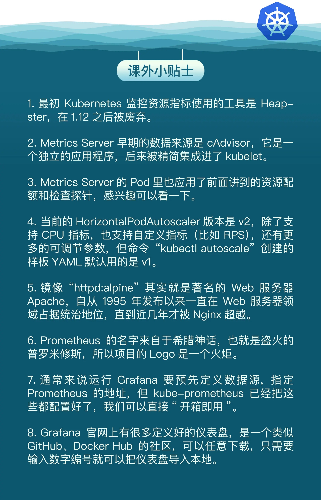
