# 《Kubernetes 入門實戰課》學習筆記 Day 18

## 網路通訊： CNI
> Ref:
> - [16 张图硬核讲解 Kubernetes 网络](https://mp.weixin.qq.com/s?__biz=MzAwNjQwNzU2NQ==&mid=2650374025&idx=1&sn=591fa8cbd5557539f90a2097a6c771f8&cur_album_id=2376478022641172480#rd)
### Kubernetes 網路模型

先來回顧 Docker 的網路模型：
- `null`: 沒有網路，但允許其他的網路插件來自定義網路連接
- `host`: **直接使用宿主機網路**，也就是去掉了容器的網路隔離，但其他隔離依然保留，**缺點為運行過多容器容易造成端口衝突**
- `bridge`: 橋接模式，Docker 創建出一個虛擬網卡，容器和宿主機再通過虛擬網卡接入這個網橋，那麼它們之間也就可以正常的收發網路數據包。不過和 host 模式相比，bridge 模式多了虛擬網橋和網卡，通訊效率會低一些

下圖為常見的 bridge 模型
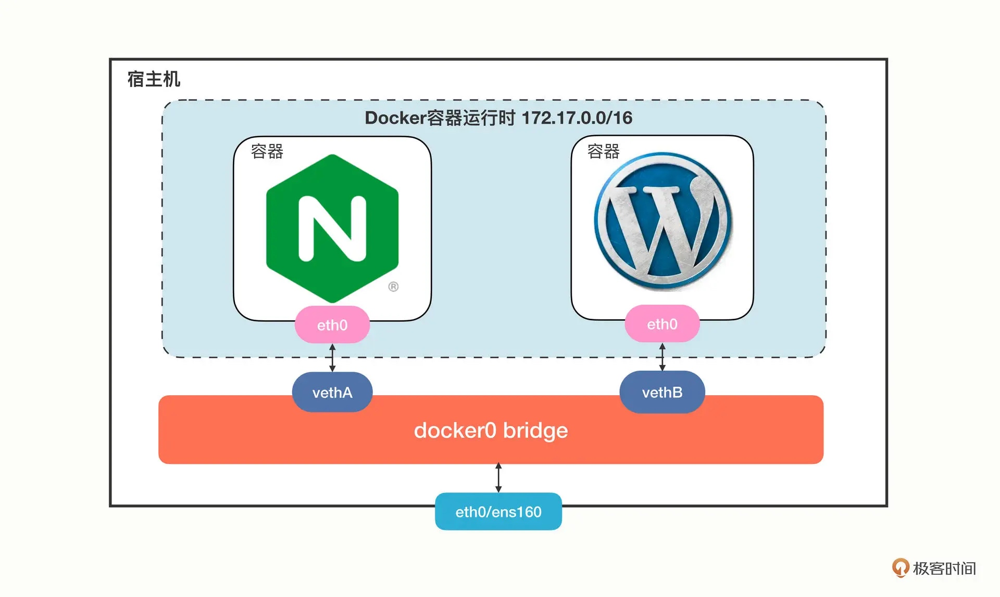

Docker 會建立一個虛擬網卡為 `docker0`，用來跟宿主機溝通，默認網段為 `172.17.0.0/16`。

Docker 網路方案簡單明瞭，但缺點只能在單機上運作，如果需要跨機操作的話，需要`實現端口映射`和`網路地址轉換（NAT）`。

Kubernetes 針對 Docker 網路模型缺點提出了 `IP-per-pod`方案，有以下幾點假設：

- 集群里的每個 Pod 都會有唯一的一個 IP 地址
- Pod 里的所有容器共享這個 IP 地址
- 集群里的所有 Pod 都屬於同一個網段
- Pod 直接可以基於 IP 地址直接訪問另一個 Pod，不需要做麻煩的網路地址轉換（NAT）

網路模型示意圖如下，節點間 Pod 直接溝通
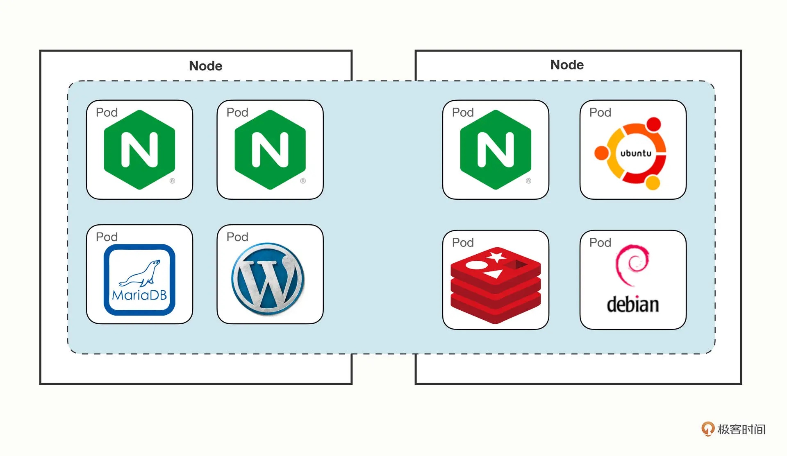

### 什麼是 CNI

CNI，全名為 Container Network Interface，一種網路通訊規範，為網路插件定義了溝通接口。開發者只要遵循這個規範就可以接入 Kubernetes，為 Pod 創建虛擬網卡、分配 IP 地址、設置路由規則，最後就能夠實現 `IP-per-pod`網路模型。

根據實現技術不同，可以分為：
- `Overlay`: 顧名思義為**覆蓋**之意，它**在真實底層網路之上構建了一個工作的邏輯網路**，把原始的 Pod 網路數據封包，再通過下層網路發送出去，到了目的地再拆包。因為這個特點，**它對底層網路的要求低，適應性強，缺點就是有額外的傳輸成本，性能較低**
- `Route`: **在底層網路之上工作**，但它沒有封包和拆包，而是**使用系統內置的路由功能來實現 Pod 跨主機通訊。它的好處是性能高，不過對底層網路的依賴性比較強**，如果底層不支持就沒辦法運作
- `Underlay`: **直接使用底層網路實現 CNI**。也就是說 Pod 和宿主機都在一個網路里，Pod 和宿主機是平等的。它對底層的硬件和網路的依賴性是最強的，因而不夠靈活，但性能最高

常見的 Kubernetes 網路插件，如下面幾種：


- [Flannel](https://github.com/flannel-io/flannel/)：由 CoreOS 公司（已被 Redhat 收購）開發，最早是一種 `Overlay` 模式的網路插件，使用 `UDP` 和 `VXLAN` 技術，後來又用 `Host-Gateway` 技術支持了 `Route` 模式。**簡單易用，但性能不佳，不適合用於生產環境**
- [Calico](https://github.com/projectcalico/calico)：是一種 `Route` 模式的網路插件，使用 `BGP` 去中心化自治路由協議（`Border Gateway Protocol`）來維護路由訊息，性能要比 Flannel 好，而且**支持多種網路策略，具備數據加密、安全隔離、流量整形等功能**
- [Cilium](https://github.com/cilium/cilium)：三個裡面最新的網路插件，**同時支持 `Overlay` 模式和 `Route` 模式，它的特點是深度使用了 `Linux eBPF` 技術，在內核層次操作網路數據，所以性能很高，可以靈活實現各種功能**

### CNI 插件如何工作

#### Flannel 網路插件

安裝方式透過一下指令，如果預設網段不是 `10.244.0.0/16`，需要調整 manifest 中的 `podCIDR`
```shell
$ kubectl apply -f https://github.com/flannel-io/flannel/releases/latest/download/kube-flannel.yml
---
...
  net-conf.json: |
    {
      "Network": "10.244.0.0/16", # 需要對應使用的 Pod network CIDR
      "Backend": {
        "Type": "vxlan"
      }
    }
...
```

Flannel 默認使用 `VXLAN` 的 `Overlay` 模式，從單機角度觀察，可以看基本雷同 Docker 網路模型，示意圖如下
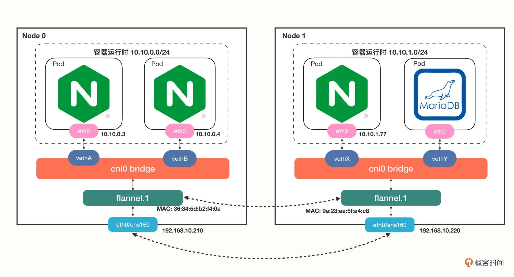
Pod 里的虛擬網卡是如何接入 `cni0` 網橋：

- 使用指令 `ip addr` 可以查看虛擬網卡 eth0
    - `3`： 為序列號 3 的設備
    - `@if45`：為另一端連接的虛擬網卡，序列號是 45
    
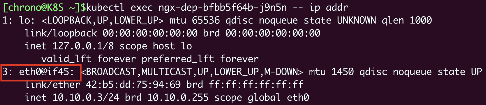

- 查看 master 節點的虛擬網卡
    - 序列號 45 的設備，名稱為 `veth41586979@if3`
    - `veth`: 表示為一張虛擬網卡
    - 連接上面提到的序列號 3 的網卡，eth0 網卡
    
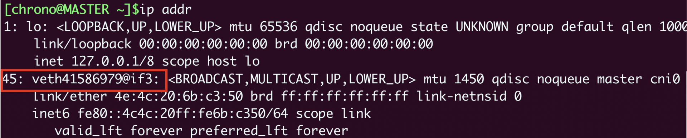

- 在 master 節點上使用指令 `brctl show` 查看 `cn0` 網橋

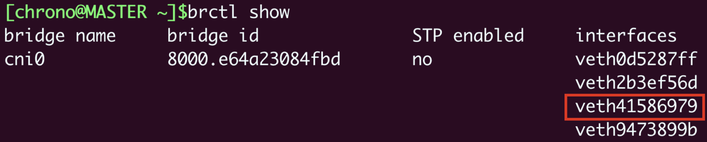

節點上網卡與網橋關係圖
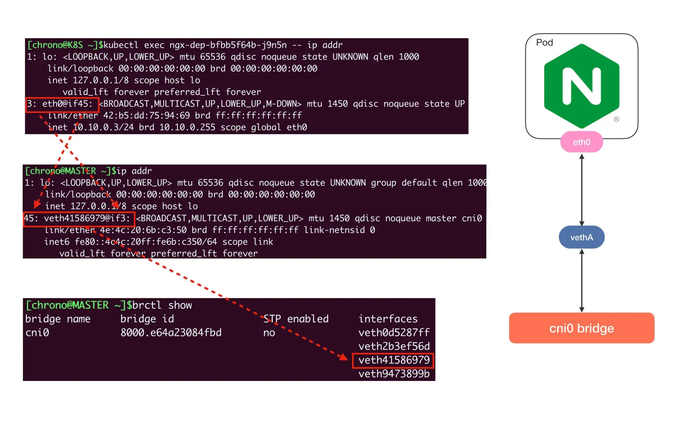
**查看跨主機的網路，關鍵為節點的路由表**，透過指令 `route` 查看

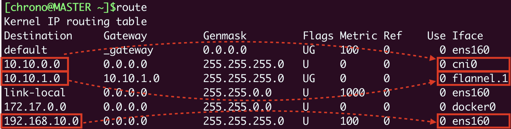

- 10.10.0.0/24 網段的數據，都要走 cni0 設備，也就是 cni0 網橋
- 10.10.1.0/24 網段的數據，都要走 flannel.1 設備，也就是 Flannel
- 192.168.10.0/24 網段的數據，都要走 ens160 設備，也就是我們宿主機的網卡

例如我們要從 master 節點的 `10.10.0.3` 訪問 worker 節點的 `10.10.1.77` ，因為 master 節點的 `cni0` 網橋管理的只是 `10.10.0.0/24` 這個網段，所以按照路由表，凡是 `10.10.1.0/24` 都要讓 `flannel.1` 來處理，這樣就進入了 flannel 插件的工作流程，flannel 再根據各種路由表決定如何發送。
- Flannel 得到的結果就是要把數據發到`192.168.10.220`，也就是 worker 節點，所以它就會在原始網路包前面加上這些額外的訊息，封裝成 VXLAN 報文，用 `ens160` 網卡發出去，worker 節點收到後再拆包，執行類似的反向處理，就可以把數據交給真正的目標 Pod
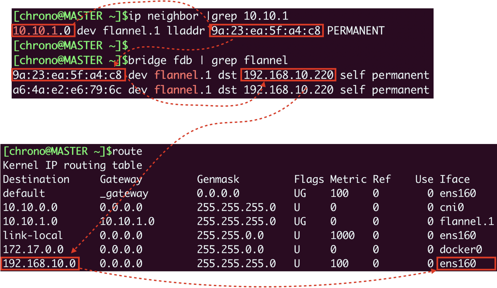

#### Calico 網路插件

安裝也是很簡單，預設網段 `192.168.0.0/16`，如果不是使用這個網段，需要調整 `custom-resources.yaml` 的 `CIDR`  
```shell
$ kubectl create -f https://raw.githubusercontent.com/projectcalico/calico/v3.25.0/manifests/tigera-operator.yaml
$ kubectl create -f https://raw.githubusercontent.com/projectcalico/calico/v3.25.0/manifests/custom-resources.yaml
---
...
kind: Installation
metadata:
  name: default
spec:
  # Configures Calico networking.
  calicoNetwork:
    # Note: The ipPools section cannot be modified post-install.
    ipPools:
    - blockSize: 26
      cidr: 192.168.0.0/16 # 需要對應使用的 Pod network CIDR
      encapsulation: VXLANCrossSubnet
      natOutgoing: Enabled
      nodeSelector: all()
...
```

可以看到 Pod 網卡情況，雖然還是有虛擬網卡，但宿主機的網卡變更為 `calica17a7ab6ab@if4`，而且沒有連結到 `cni0` 網橋

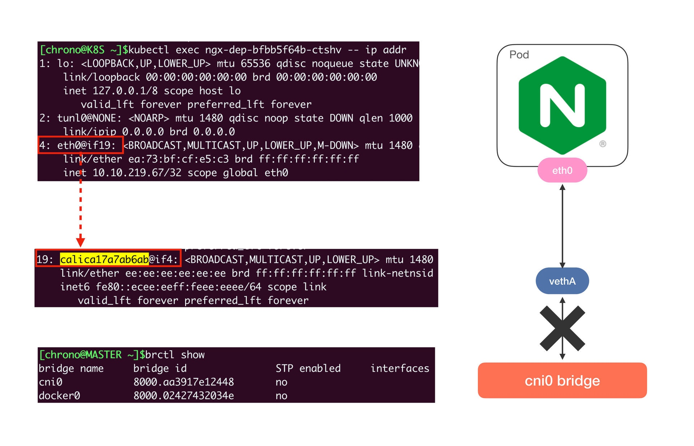
**因為 Calico 不是 `Overlay` 模式，而是 `Route` 模式**，所以它沒有走 Flannel 方式，而是**在宿主機上創建路由規則，讓數據包不經過網橋直接連到目標網卡**。

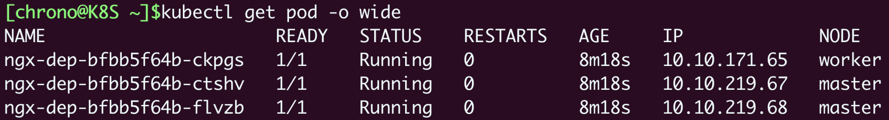
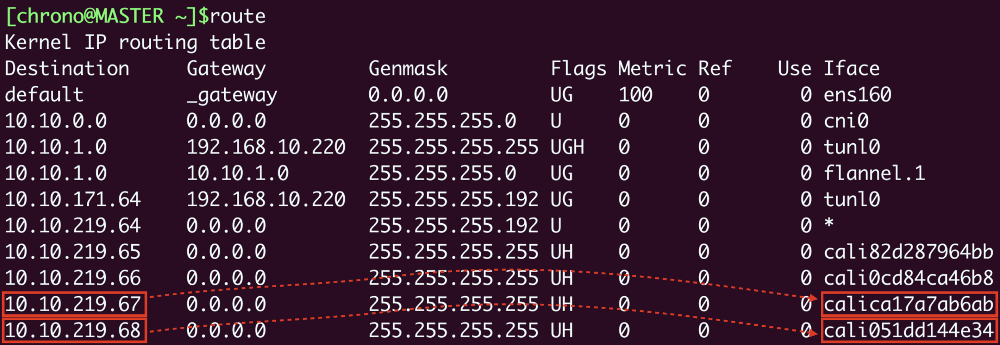

例如 Pod A `10.10.219.67` 要訪問 Pod B `10.10.219.68`，那麼查路由表，知道要走 `cali051dd144e34` 這個設備，而它恰好就在 Pod B 里，所以數據就會直接進 Pod B 的網卡，省去了網橋的中間步驟。

Calico 網路模型示意圖
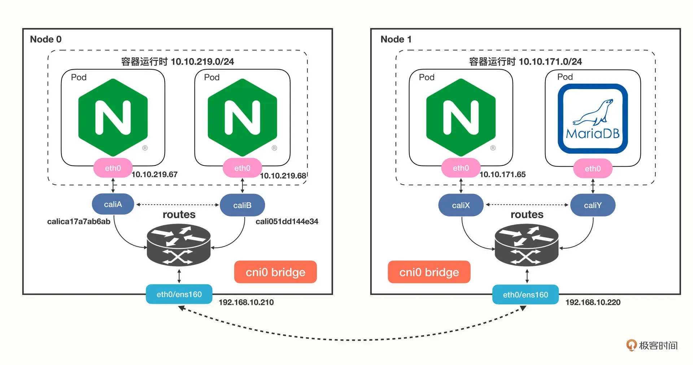

Calico 也有多種工作模式，默認是 `IPinIP`，**同節點的 Pod 間直接通過虛擬網卡結合路由表傳輸，跨節點間的 Pod 需要 IP 層的封裝，數據包通過 IP 隧道傳輸，如 `tunl0`。多節點間的路由通過 BGP 協議共享**。

### 小結

通過上面敘述發現，其實 Kubernetes 網路傳輸細節是很多的，不過 CNI 通過**依賴倒置**的原則把這些工作都交給**插件**解決，把具體實現交給第三方，就不用去關注底層變化。

- Kubernetes 使用的是 `IP-per-pod` 網路模型，每個 Pod 都會有唯一的 IP 地址，所以簡單易管理
- CNI 是 Kubernetes 定義的網路插件接口標準，按照實現方式可以分成 `Overlay`、`Route`、`Underlay` 三種，常見的 CNI 插件有 `Flannel`、`Calico` 和 `Cilium`
- `Flannel` 支持 `Overlay` 模式，它使用了 `cni0` 網橋和 `flannel.1` 設備，本機通信直接走 `cni0`，跨主機通信會把原始數據包封裝成 `VXLAN` 包再走宿主機網卡發送，有性能損失
- Calico 支持 `Route` 模式，它不使用 `cni0` 網橋，而是創建路由規則，把數據包直接發送到目標網卡，所以性能高

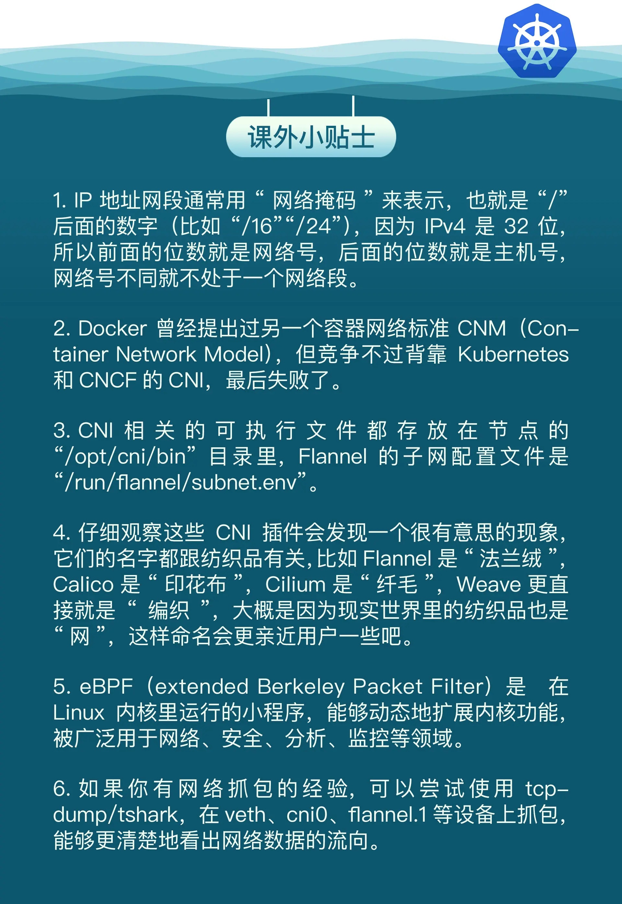
