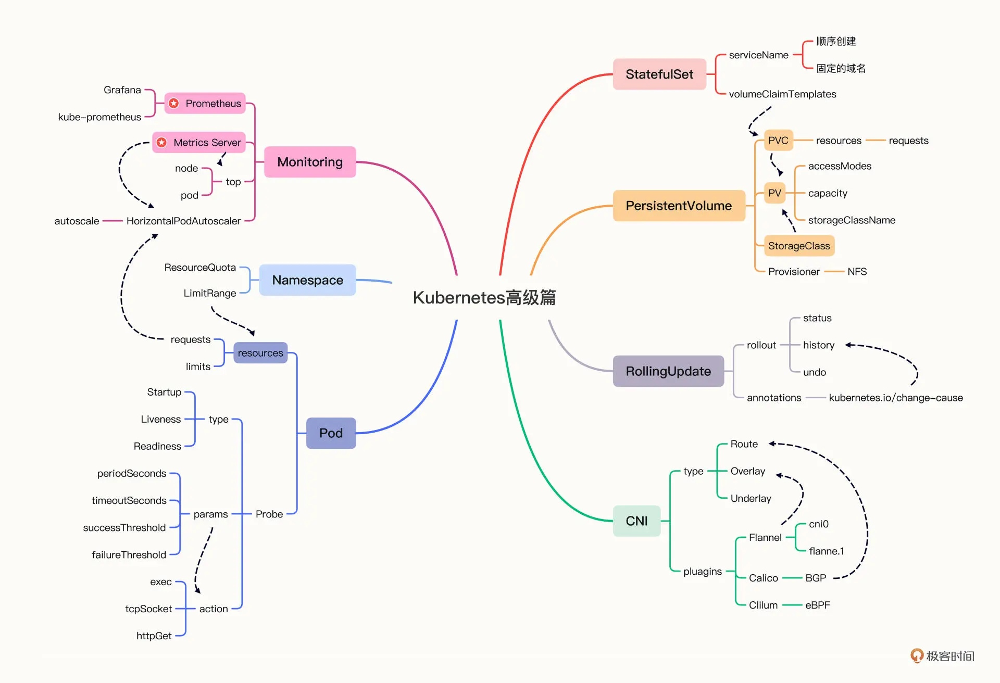
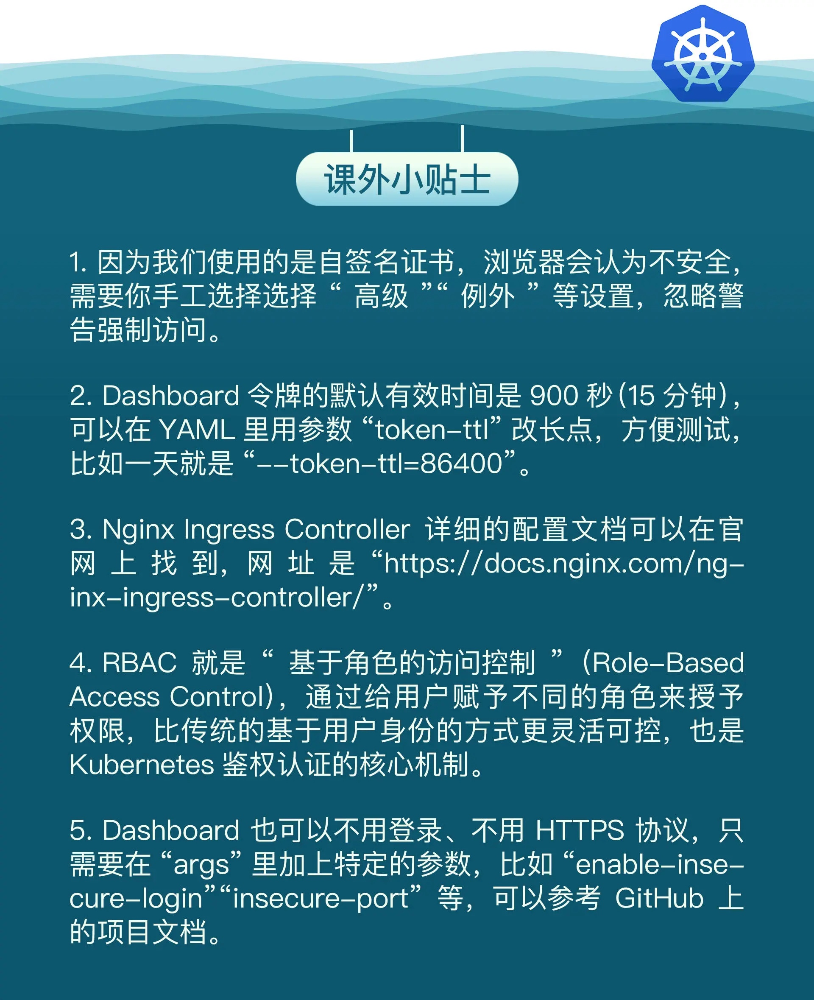

# 《Kubernetes 入門實戰課》學習筆記 Day 19

## Kubernetes 總結

### 重點回顧一：API 對象

回顧 `PersistentVolume`、`StatefulSet` 等 API 對象：

`PersistentVolume`：

- **簡稱 `PV`，是 Kubernetes 對持久化存儲的抽象**，代表了 **LocalDisk、NFS、Ceph 等存儲設備**，和 CPU、內存一樣，屬於集群的公共資源。

- **因為不同存儲設備間差異很大，為了更好描述 PV 特徵，出現了 `StorageClass`，它的作用為分類存儲設備**，使得我們更加容易選擇 PV 對象。

- PV 一般由系統管理員創建，我們只**需要透過 PVC（PersistentVolumeClaim） 申請**即可使用 PV。

- 因為手動創建 PV 工作量大，所以產生了**動態存儲卷**，只需要**在 StorageClass 中綁定一個 `Provisioner` 對象，就可以根據 PVC 自動創建出符合需求的 PV**。
- 在 Pod 中使用 `persistentVolumeClaim` 來使用 PVC 創建 PV，然後在容器內使用 `volumeMounts` 掛載路徑，即可達成容器讀寫 PV，實現數據永久存儲的目的。

`StatefulSet`：

- **持久化存儲目的是保存應用的狀態數據，管理有狀態的應用，就要使用新的對象 StatefulSet**。
- YAML 描述和 Deployment 非常像，**spec 里只是多了一個`serviceName`字段**，但它部署應用的方式卻與 Deployment 完全不同。
- **Deployment 創建的 Pod 是隨機的名字，而 StatefulSet 會對 Pod 順序編號、順序創建**，保證應用有一個確定的啓動先後次序，這樣就可以實現主從、主備等關係。
- Service 在創建服務時，也會**為每個 Pod 單獨創建域名，同樣也是順序編號，保證 Pod 有穩定的網路標識，外部用戶就可以用這個域名來準確地訪問到某個具體的 Pod**。
- 使用 `volumeClaimTemplates` 字段來定義持久化存儲。
    - 每個 Pod 可以用這個 PVC 模板來生成自己的 PVC 去申請 PV，實現存儲卷與 Pod 的獨立綁定。
- 通過`啟動順序`、`穩定域名`、`存儲模板`三點能力， StatefulSet即可處理 Redis、MySQl 等有狀態應用

### 重點回顧二：應用管理

回顧`滾動更新`、`資源配額`、`健康檢查`等內容：

- `滾動更新`：

    - 只要撰寫一個新的 YAML 描述文件即可 （`Delployment`、`DaemonSet`、`StatefulSet`）
    - 使用指令 `kubectl apply`
    - Kubernetes 採用的是`滾動更新`策略，也就是**同步進行擴容和縮容**的操作
    - 滾動歷史透過 `kubectl rollout history` 查看；使用 `kubectl rollout undo` 回滾
    
- `資源配額`：

    - 限制容器申請的 CPU 和內存使用量，有利 Kubernetes 調度

- `健康檢查`：、

    - Kubernetes built-in 監控工具
    - 三種探針：`Startup`、`Liveness`、`Readiness`
    - 三種探測模式：`shell`、`tcpSocket`、`httpGet`

### 重點回顧三：集群管理

回顧`命名空間`、`系統監控`、`網路通訊`等內容：

- `命名空間`：

    - 資源配額使用 API 對象為 `ResourceQuota`
        - 除了基本 CPU 和內存，還可以**限制`存儲容量和`API對象`**數量
    
- `系統監控`：

    - `Metrics Server`：

        - 專門用來收集 Kubernetes 核心資源指標
        - 可以指令 `kubectl top` 查看集群狀態
        - **為 `HorizontalPodAutoscaler` （HPA）的前置條件**

    - `Prometheus`： 

        - 雲原生監控領域中的標竿
        - 部署後，可以採用 `Grafana` 視覺化監控指標，包含**告警功能**

- `網路通訊`：

對底層網路設施，Kubernetes 根據 CNI 規範定義了的網路模型 `IP-per-pod`

- 常見網路插件：`Flannel`、`Calico`、`Cilium`等
    - Flannel 使用 Overlay 模式，性能低
    - Calico 使用 Route 模式，性能高
    - Cilium 同時支持 Overlay 模式和 Route 模式，使用 eBPF 技術，性能高，更加靈活

### 小結

