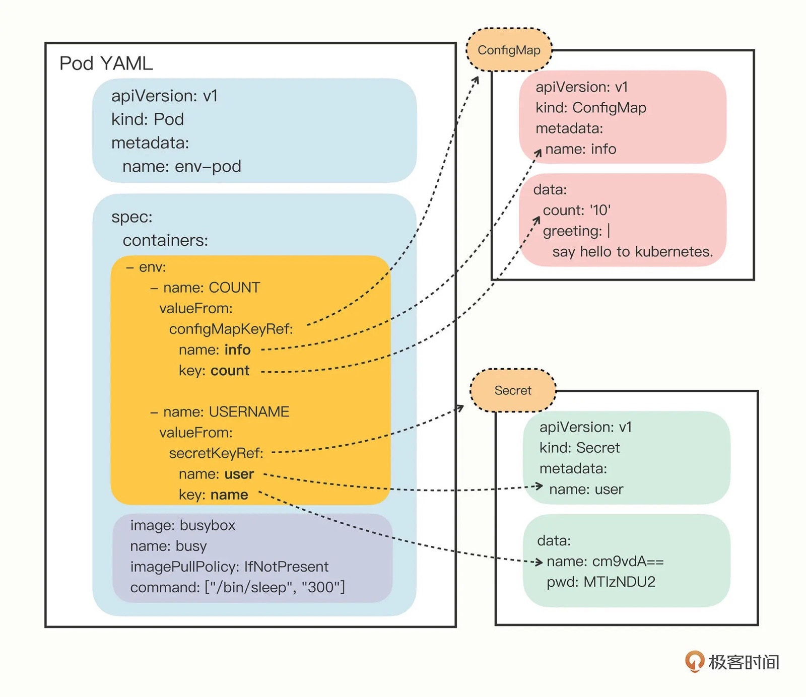
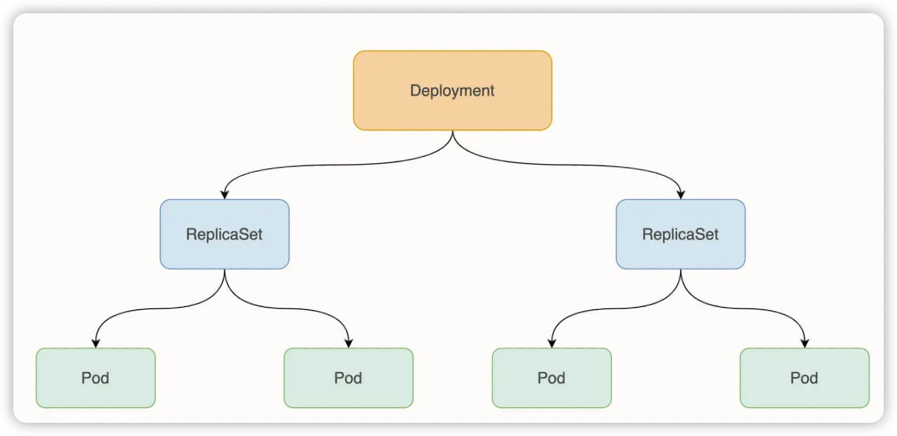
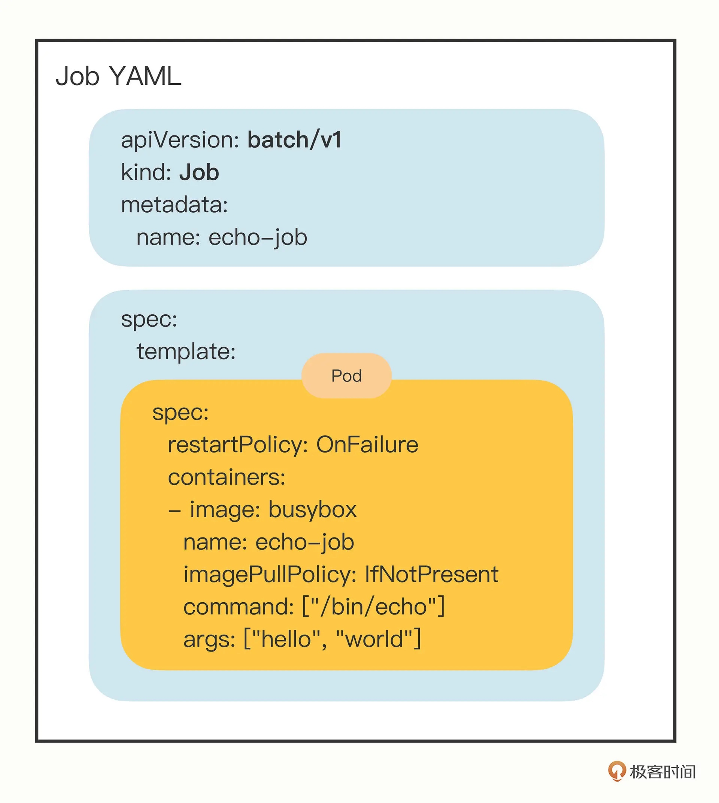
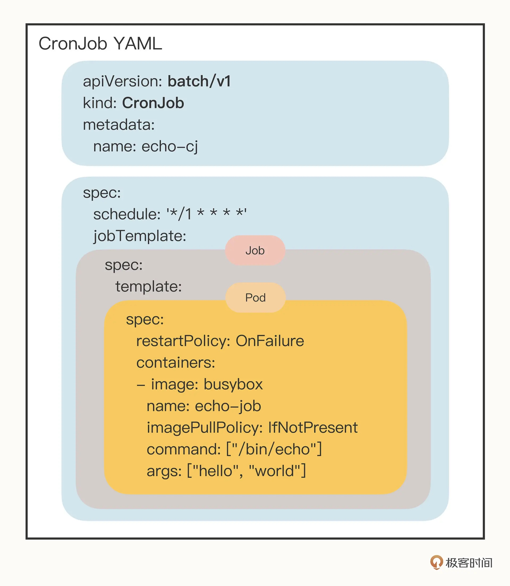

# 《Kubernetes 入門實戰課》學習筆記 Day 2



### Deployment instance yaml
```yaml
apiVersion: v1
kind: Deployment
metadata:
	labels:
		app: nginx
	name: nginx
spec:
	replica: 3 # 3 副本啟動
	selector:
		matchLabels:
			app: nginx
	template:
		metadata:
			labels:
				app: nginx
		spec:
			containers:
			- images: nginx:latest
				livenessProbe: # 探活
					httpGet:
						path: /
						port: 80
					initialDelaySeconds: 15
					timeoutSeconds: 1
				readinessProbe:
					httpGet:
						path: /ping
						port: 80
					initialDelaySeconds: 5
					timeoutSeconds: 1
				resources: # 資源限制
					limits:
					cpu: "500m"
					memory: "500Mi"
				volumeMounts:
				- name: data
				mountPath: /data
			volumes:
			- name: data
				emptyDit:{} # temp dir

# 資源限制也可以透過以下指令
$ kubectl set resources deployment hello-nginx -c=nginx --limis=cpu=500m, memory=128Mi
```

### ConfigMap

- 將`非機密數據`保存到kv-pairs中
- Pods可以將此用作`環境變數`、`命令參數`，或是`存儲卷中的配置文件`
- 此目的為將環境訊息跟鏡像解耦，便於應用配置更改

### Secret

- 保存和傳遞`key`、`憑證`等敏感訊息的對象
- 避免把敏感訊息直接明文寫在配置文件
- kubernetes集群中配置和使用服務難免要用到敏感訊息進行登陸、認證等功能，在配置文件中透過`secret`對象使用這些敏感訊息，來避免重覆，以及減少暴露機會

### User Account & Service Account

- user account：提供帳戶標示
- service account：為Pod提供帳戶標示
- 兩者區別為作用範圍
    - `user account`對應的是人的身分，與服務的Namespace無關，所以是跨Namespace的
    - `service account`對應的是一個運行中程序的身分，與特定Namespace相關

### Service

- 服務應用的抽象，通過`labels`提供`服務發現`和`負載均衡`
- 將與`labels`對應的`Pod IP`和`端口`組成`endpoints`，透過`Kube-proxy` 將服務負載均衡到這些`endpoints`上
- 每個`service`，會`自動分配一個只能在集群內部訪問的虛擬位址`（cluster ip）和 DNS，其他容器則透過該地址訪問服務

### Replica Set

- 提供高可用應用，構建多個同樣Pod的副本，為同一服務
- 每一個pod為一個無狀態模式進行管理
- 副本掛掉，`Controller`會自動重新創建一個新副本
- 為負載發生變更時，方便調整擴縮容策略

### Deployment

- 為集群中的一次更新操作
- 應用模式廣泛：`創建新服`、`更新服務`，甚至`滾動升級`服務
    - `滾動升級`服務，本質上是創建一個新的 RS ，然後將新 RS 中副本數加到想要的狀態，並將舊 RS 縮減到 0 的一個符合操作
- 可以當作管理 ReplicaSet 的工作負載
- 可以實時更新、回滾，橫向擴容
- **對於無狀態應用，Deployment是最好的選擇**
- 目前管理應用方式，皆為採用此來管理




### StatefulSet

- 用來管理有狀態應用的工作負載API對象
- statefulset中的每個Pod都掛載自己獨立的存儲
- `如果一個Pod有問題，從其他節點啟動一個同樣名稱的Pod，還需要掛載原Pod的存儲，繼續使用原本的狀態提供服務`
- 適合statefulset的業務，為有狀態之服務
    - 數據庫服務：MySQL、PostgreSQL
    - 集群化管理服務：ZooKeeper、etcd
- statefulset提供的是把`特定Pod和特定存儲關聯起來`，保證狀態的延續性，所以Pod仍可以通過飄移到不同節點提供高可用，而存儲也可以通過外掛存儲提供高可靠性
- 跟`Deployment`差異
    - 身分標示
        - statefulset controller為每個Pod提供編號，編號從0開始
    - 數據存儲
        - statefulset 可以讓用戶定義`PVC`的 `volumeClaimTemplates`
        - Pod被創建時，kubernetes會以`volumeClaimTemplates`中定義的模板創建存儲卷，並掛載給Pod
        
        ```yaml
        apiVersion: apps/v1
        kind: StatefulSet
        metadata:
          name: web
        spec:
          selector:
            matchLabels:
              app: nginx # 需匹配 .spec.template.metadata.labels
          serviceName: "nginx"
          replicas: 3 # default：1
          minReadySeconds: 10  #default：0
          template:
            metadata:
              labels:
                app: nginx # 需匹配 .spec.selector.matchLabels
            spec:
              terminationGracePeriodSeconds: 10
              containers:
              - name: nginx
                image: registry.k8s.io/nginx-slim:0.8
                ports:
                - containerPort: 80
                  name: web
                volumeMounts:
                - name: www
                  mountPath: /usr/share/nginx/html
          volumeClaimTemplates:
          - metadata:
              name: www
            spec:
              accessModes: [ "ReadWriteOnce" ]
              storageClassName: "my-storage-class"
              resources:
                requests:
                  storage: 1Gi
        ```
        
    - Statefulset升級策略不同
        - onDelete
        - 滾動升級
        - 分片升級

### Job

- 用來控制批次處理任務的API對象
- 任務完成即自動退出
- 成功完成的標誌根據不同的 `spec.completions` 策略而不同
    - 單Pod型任務有一個Pod成功就標示完成
    - 定數成功型任務保證有N個任務全部成功
    - 工作隊列型任務根據應用確認的全部成功才標示成功
- 特別要注意的是，**Job 的重啓時間是呈指數級增長的**，例如，下一次 Job 重新運行的時間可能是 10s、20s、40s，最大時間為 6 分鐘



### CronJob

- Kubernetes 為離線業務提供了 Job 和 CronJob 兩種 API 對象，分別處理「臨時任務」和「定時任務」
- Job 的關鍵字段是 `spec.template`，裡面定義了用來運行業務的 Pod 模板，其他的重要字段有 `completions`、`parallelism` 等
- CronJob 的關鍵字段是 `spec.jobTemplate` 和 `spec.schedule`，分別定義了 Job 模板和定時運行的規則




### DaemonSet

- 守護進程，保證每個節點都有一個此類Pod運行
- 節點可能是集群節點，或是通過`nodeSelector`選的特定節點
- 經典用法
    - 節點上運行集群守護進程
    - 節點上運行日誌收集守護進程
    - 節點上運行監控守護進程

### PV & PVC

- PersistentVolume （PV）
    - 集群中的一個存儲卷
    - 可以管理員手動建立，或是用戶建立`PVC`時根據`StorageClass`動態設置
- PersistentVolumeClaim （PVC）
    - 為用戶對存儲的請求
    - 每個PVC對象都有spec和status，分別對應申請部分和狀態
    - `CSI external-provisioner`是一個監控Kubernetes PVC對象的`Sidecar`容器
        - 當用戶創建PVC後，Kubernetes會檢查PVC對應的`StorageClass`，如果`SC`中的`provioner`與某個插件匹配，該容器通過`CSI Endpoint`（通常是unix socket）調用`CreateVolume`方法，調用成功則創建`PV`對象
- StorageClass
    - 常見不同情境，用戶需要具有不同屬性（如：`性能`、`訪問模式`）的PV
    - 集群管理員需要提供不同性質的PV，且這些PV卷之間的差別不僅限於`卷大小`和`訪問模式`，同時又無法將實現細節暴露給用戶，所以又誕生了StorageClass

```yaml
apiVersion: v1
kind: PersistentVolumeClaim
metadata:
  name: myclaim
spec:
  accessModes:
    - ReadWriteOnce
  volumeMode: Filesystem
  resources:
    requests:
      storage: 8Gi
  storageClassName: slow
  selector:
    matchLabels:
      release: "stable"
    matchExpressions:
      - {key: environment, operator: In, values: [dev]}
# ----
apiVersion: storage.k8s.io/v1
kind: StorageClass
metadata:
  name: standard
provisioner: kubernetes.io/aws-ebs
parameters:
  type: gp2
reclaimPolicy: Retain
allowVolumeExpansion: true
mountOptions:
  - debug
volumeBindingMode: Immediate
```