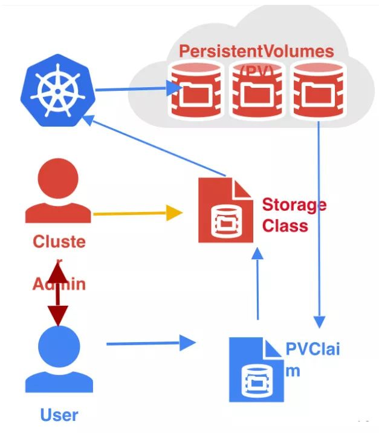
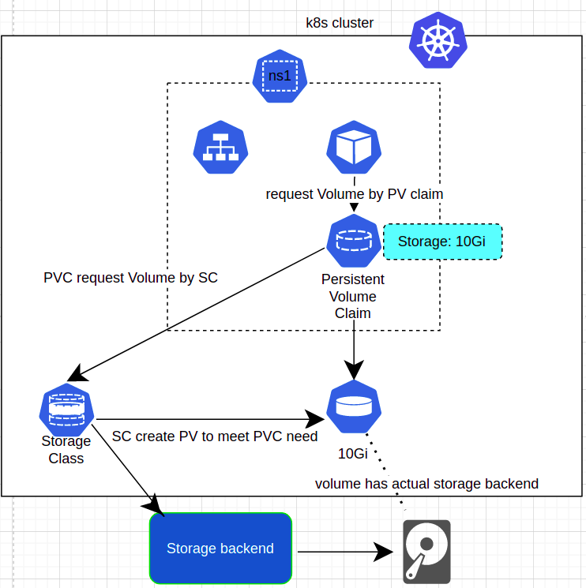

# 《Kubernetes 入門實戰課》學習筆記 Day 3
> Ref :
> - [Volume Storage](https://kubernetes.io/zh-cn/docs/concepts/storage/)

## Kubernetes Volumes & StorageClass

系統管理人員負責建置 PV ，而開發人員則是負責建立 PVC與 Storage Class，並交由 PVC 自動尋找合適的 PV進行綁定，或者透過StorageClass建立一個新的PV再和PVC綁定

那麼 PersistentVolume 數量這麼多，該如何找到適合的呢？ 這時候當然是要由系統管理人員對 PersistentVolume 進行分類，也就是說在建立 PersistentVolume 同時必須賦予有意義的 Label或者 storgeClassName 做為識別證，另外也需要規範回收策略，例如：

- **Delete**: 當不再使用 Storage Class 時，一併移除資料(default)
- **Retain**: 當不再使用 Storage Class 時，資料會保留等待手動刪除


- workflow




## 什麼是 StorageClass ?

如果要說明什麼是 **StorageClass** ，應該一併說明 **PersistentVolume** 與 **PersistentVolumeClaim**

當用戶在建立 Pod 服務使用到 PVC (`PersistentVolumeClaim`)，這時會自動找一個符合的 PV (`PersistentVolume`) 進行批配，若有批配到就直接逕行綁定(此時表示與PV進行「靜態」批配)，但是如果沒有符合的 PV，則會透過 `StorageClass` 建立一個新的 PV 再和 PVC 綁定(此時表示與 PV 進行「動態」批配)。

## 什麼是 PersistentVolume?

PersistentVolume 是存放資源的地方，簡單想像的話就是個 Disk 空間， PersistentVolume 分為兩種：

- **靜態**：手動建立 PersistentVolume 稱為「靜態」綁定
- **動態**：PVC在批配 PV 時，若不符合規則會透過 StorageClass 自動建立新的 PV ，此時 PV 我們會稱為「動態」綁定，並且繼承 StorageClass 規定的回收政策。
PV 建立時，可以設定以下內容：

PV 的屬性
- 存儲類型、Volume的大小等

創建這種PV需要用到的存儲插件

**相對的 StorageClass 也可以加入此兩項設定，當 PVC 無法批配符合的 PV 時，才可以透過 StorageClass 協助動態建置 PV**

## 什麼是 PersistentVolumeClaim?
**PVC (PersistentVolumeClaim) 負責批配符合條件的 PV，並與該 PV 進行綁定**

PVC提供三種與PV中的檔案存取模式：

- **ReadWriteOnce**：只可以掛載在同一個 Node 上提供讀寫功能。
- **ReadOnlyMany** ：可以在多個 Node 上提供讀取功能。
- **ReadWriteMany**：可以在多個 Node 上提供讀寫功能。
PVC 該如何與 PV 進行綁定：

透過 storageClassName 名稱，找到相同 PV。
透過 Label 標籤，找到相同 PV。

## 建立 StorageClass、PVC、PV
### storageclass.yaml
```yaml
# storageclass.yaml
apiVersion: storage.k8s.io/v1            ## API 版本
kind: StorageClass                       ## 元件種類
metadata:
  name: ssd                              ## storage class 名稱
provisioner: kubernetes.io/gce-pd        ## 指定 Volumn 類型
parameters:                              ## PV 符合條件
  type: pd-ssd
reclaimPolicy: Retain                    ## 回收機制
```

### pv.yaml
```yaml
apiVersion: v1
kind: PersistentVolume
metadata:
  name: local-pv
spec:
  capacity:
    storage: 10Gi
  accessModes:
  - ReadWriteOnce
  persistentVolumeReclaimPolicy: Retain
  storageClassName: ssd
  hostPath:
    path: /tmp
```
### pvc.yaml
```yaml
apiVersion: v1
kind: PersistentVolumeClaim
metadata:
  name: mysql-master-storage
spec:
  storageClassName: ssd
  accessModes:
  - ReadWriteOnce
  resources:
    requests:
      storage: 5Gi
```