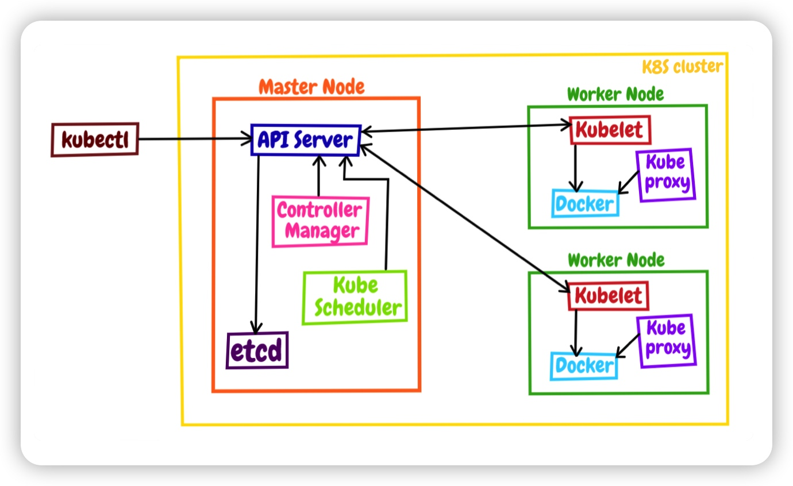
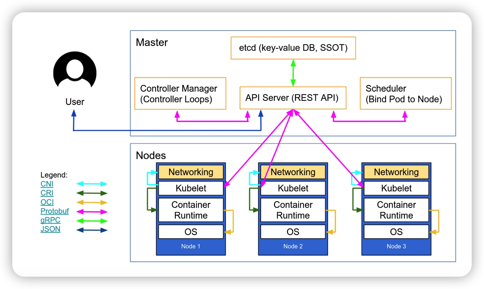
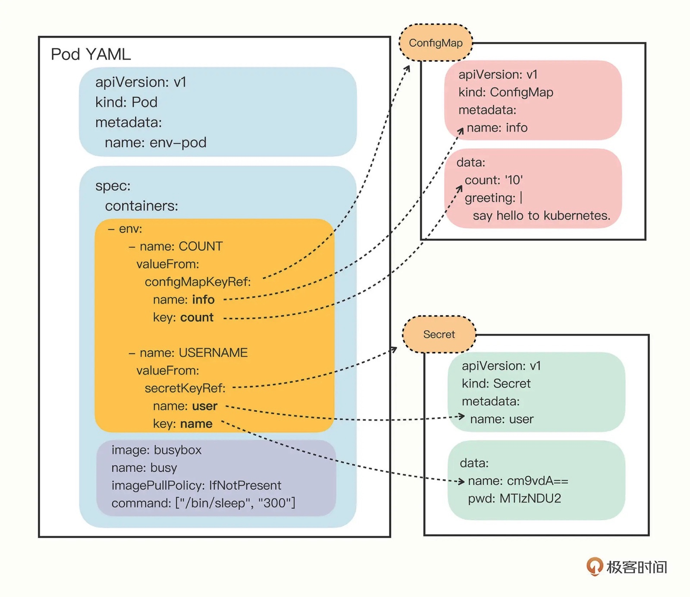
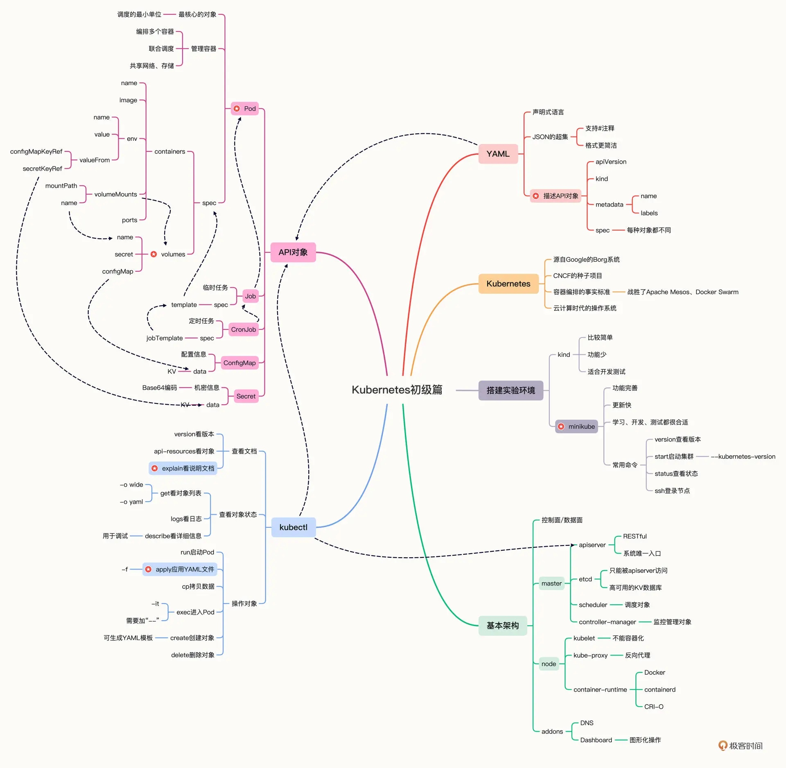

# 《Kubernetes 入門實戰課》學習筆記 Day 4

### 回顧
- 架構運行圖

Kubernetes 把集群里的計算資源定義為節點（Node），其中又劃分成控制面和數據面兩類:

- 控制面是 Master 節點，負責管理集群和運維監控應用，裡面的核心組件是 `apiserver`、`etcd`、`scheduler`、`controller-manager`
- 數據面是 Worker 節點，受 Master 節點的管控，裡面的核心組件是 `kubelet`、`kube-proxy`、`container-runtime`

此外，Kubernetes 還支持插件機制，能夠靈活擴展各項功能，常用的插件有 DNS 和 Dashboard等。

Kubernetes 里有很多的 API 對象，其中最核心的對象是 `Pod`，它捆綁了一組存在密切協作關係的容器，容器之間共享網絡和存儲，在集群里必須一起調度一起運行。通過 Pod 概念，Kubernetes 就簡化了對容器的管理工作，其他的所有任務都是通過對 Pod 再包裝來實現的。

除了核心的 Pod 對象，基於 `SRP` 和`組合對象`這兩個基本原則，又學習了 4 個比較簡單的 API 對象，分別是 Job/CronJob 和 ConfigMap/Secret

- **Job/CronJob 對應的是離線作業**，它們逐層包裝了 Pod，添加了作業控制和定時規則
- **ConfigMap/Secret 對應的是配置訊息**，需要以環境變量或者存儲卷的形式注入進 Pod，然後進程才能在運行時使用

Kubernetes 也提供一個客戶端工具 - kubectl，與 Master 節點的 apiserver 進行通訊，把 YAML 文件發送給 RESTful 接口，從而觸發 Kubernetes 的對象管理工作流程。kubectl 的命令很多：

- 查看自帶文檔可以用 **api-resources、explain** 等
- 查看對象狀態可以用 **get、describe、logs** 等
- 操作對象可以用 **run、apply、exec、delete** 等

YAML 內描述 API 對象也有固定的格式：
- apiVersion： 對象版本
- kind： 類型，如 Service、Pod、Deployment 等
- metadata： 元數據

如果為實體對象，會再有 `spec` 字段描述對象的期望狀態;非實體對象會採用 `data` 字段，記錄一些靜態字符串訊息。

- 實體對象： Pod、Deploymnet...
- 非實體對象: ConfigMap、Secret...

 

### 小結

