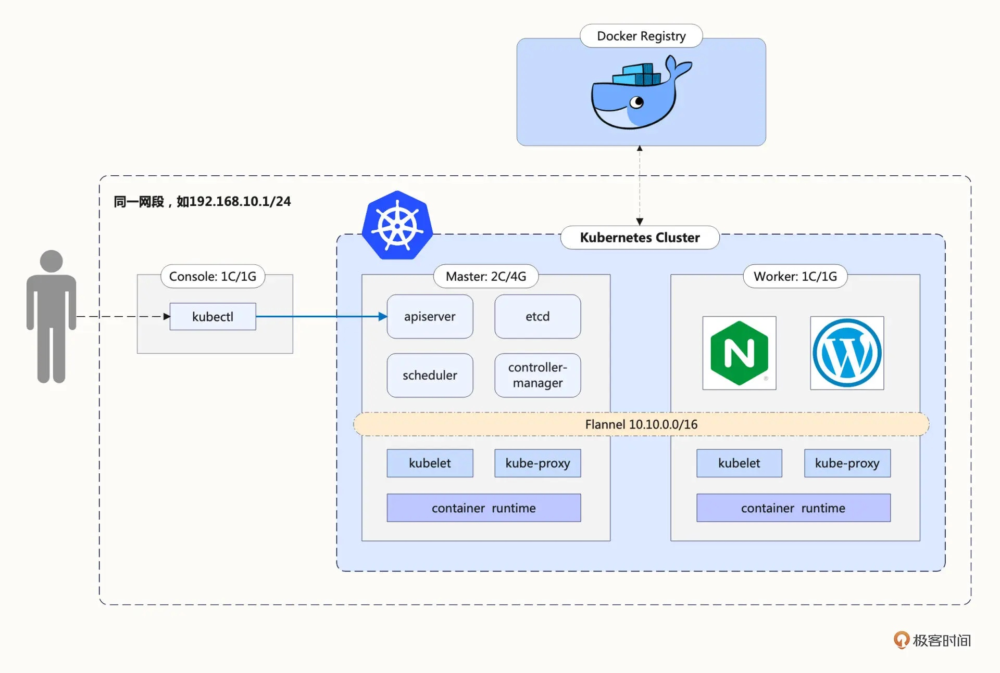
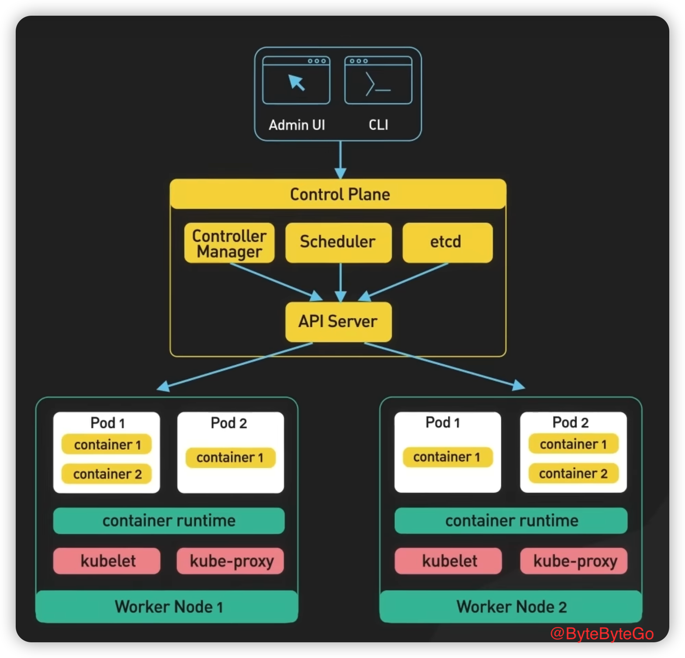
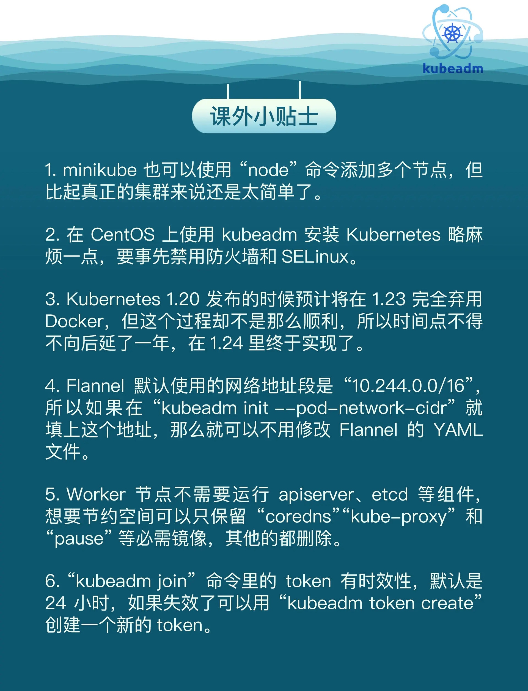

# 《Kubernetes 入門實戰課》學習筆記 Day 5

### 常用指令

- Kubernetes 版本支持的所有 api 對象
```shell
$ kubectl apt-resources
```

- Kubernetes `explian` 能夠給出 api 對象字段的詳細訊息
```shell
$ kubectl explain pod
$ kubectl explain pod.metadata
$ kubectl explain pod.spec
$ kubectl explain pod.spec.containers
```

- 創建 YAML 樣板要用到兩個特殊參數 `--dry-run=client`和`-o yaml`
    - 可以快速建立**一個 YAML 描述文件形式的 API 對象**
```shell
# 可以定義成 環境變數
# export out="--dry-run=client -o yaml"
$ kubectl run ngx --image=nginx:alpine $out > pod.yml
```

- kubectl create 創建 `ConfigMap`、`Secret` 的樣板文件，不過要命令後面多加一個參數 `--from-literal`，從字面值生成一些數據
    - Secret: 需要用 `generic` 表示一般的機密訊息
```shell
$ kubectl create cm info --from-literal=k=v $out
$ kubectl create secret generic user --from-literal=name=root $out
```

### Kubernetes Cluster Tool 簡要說明

#### kind

基於 Docker，意思是 Kubernetes in Docker。**它功能少，用法簡單，也因此運行速度快，容易上手。不過它缺少很多 Kubernetes 的標準功能，例如儀錶盤、網絡插件，也很難定制化，所以我認為它比較適合有經驗的 Kubernetes 用戶做快速開發測試，不太適合學習研究**。不選 kind 還有一個原因，它的名字與 Kubernetes YAML 配置里的字段 kind 重名，會對初學者造成誤解，干擾學習

#### minikube

最大特點就是小而美，可執行文件僅有不到 100MB，運行鏡像也不過 1GB，但就在這麼小的空間里卻**集成了 Kubernetes 的絕大多數功能特性，不僅有核心的容器編排功能，還有豐富的插件**，例如 Dashboard、GPU、Ingress、Istio、Kong、Registry 等等，綜合來看非常完善，缺點為**只能單一節點集群**

#### kubeadm

原理和 minikube 類似，也是用容器和鏡像來封裝 Kubernetes 的各種組件，但**它的目標不是單機部署，而是要能夠輕鬆地在集群環境里部署 Kubernetes，並且讓這個集群接近甚至達到生產級質量**。而在保持這個高水準的同時，kubeadm 還具有了和 minikube 一樣的易用性，只要很少的幾條命令，如 init、join、upgrade、reset 就能夠完成 Kubernetes 集群的管理維護工作，這讓**它不僅適用於集群管理員，也適用於開發、測試人員**

### 多節點集群

多節點集群，要求服務器應該有兩台或者更多，如這個 Kubernetes 集群就只有兩台主機，一台是 Master 節點，另一台是 Worker 節點

- 課程示意圖
 - 1 Master/ 1 Workers
 


- ByteByteGo 示意圖
    - 1 Master/ 2 Workers
    


- Master 節點需要運行 apiserver、etcd、scheduler、controller-manager 等組件，管理整個集群，所以對配置要求比較高，至少是 2 核 CPU、4GB 的內存

- Worker 節點沒有管理工作，只運行業務應用，所以配置可以低一些，為了節省資源我給它分配了 1 核 CPU 和 1GB 的內存，可以說是低到不能再低了

### Master 節點安裝

- kubeadm init 
    - 就可以把組件在 Master 節點上運行起來，不過它還有很多參數用來調整集群的配置，你可以用 -h 查看
    - 常用參數
        - `--pod-network-cidr`: 設置集群里 Pod 的 IP 地址段
        - `--apiserver-advertise-address`: 設置 apiserver 的 IP 地址，對於多網卡服務器來說很重要（比如 VirtualBox 虛擬機就用了兩塊網卡），可以指定 apiserver 在哪個網卡上對外提供服務
        - `--kubernetes-version`: 指定 Kubernetes 的版本號

    ```shell
    sudo kubeadm init \
     --pod-network-cidr=10.10.0.0/16 \ 
     --apiserver-advertise-address=192.168.10.210 \ 
     --kubernetes-version=v1.23.3
    ```

- 如果普通用戶需要透過 kubectl 執行，需要建立 `.kube` 目錄，然後複製配置文件即可
```shell
To start using your cluster, you need to run the following as a regular user:

$ mkdir -p $HOME/.kube 
$ sudo cp -i /etc/kubernetes/admin.conf $HOME/.kube/config 
$ sudo chown $(id -u):$(id -g) $HOME/.kube/config
```

### Workder 節點安裝

- kubeadm join
    
    - 其他節點需要加入集群，需要用到指令中的 `token` 和 `ca 憑證 (如果集群需要)`
```shell
Then you can join any number of worker  nodes by running the following on each as root:
$ kubeadm join <Master address>:6443 \
--token tv9mkx.tw7it9vphe158e74 \ 
--discovery-token-ca-cert-hash sha256:e8721b8630d5b562e23c010c70559a6d3084f629abad6a2920e87855f8fb96f3
``` 

### CNI 插件

- 常用 CNI 插件
    - [flannel](https://github.com/flannel-io/flannel/)
    - [calico](https://projectcalico.docs.tigera.io/getting-started/kubernetes/quickstart)
    - [cilium](https://github.com/cilium/cilium)

- 需要留意點
    - **kubeadm 的參數 `--pod-network-cidr` 設置的地址需要跟 CNI 插件的 config 網路地址一致**
    - Flannel: 10.244.0.0/16
    - Calico: 192.168.0.0/16

### 小結

- kubeadm 是一個方便易用的 Kubernetes 工具，能夠部署生產級別的 Kubernetes 集群
- **安裝 Kubernetes 之前需要修改主機的配置，包括主機名、Docker 配置、網絡設置、交換分區等**
- Kubernetes 的組件鏡像存放在 gcr.io
- 安裝 `Master` 節點需要使用命令 `kubeadm init`，安裝 `Worker` 節點需要使用命令 `kubeadm join`，還要部署如 Flannel、Calico 等網路插件才能讓集群正常工作
- 一些 script 部署腳本 https://github.com/chronolaw/k8s_study/tree/master/admin


