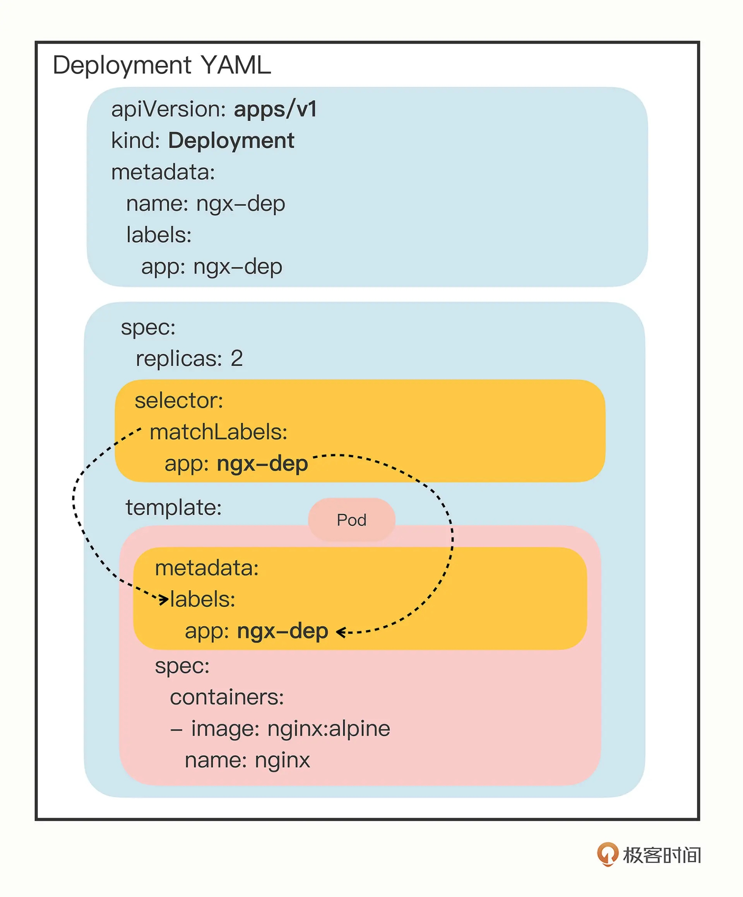
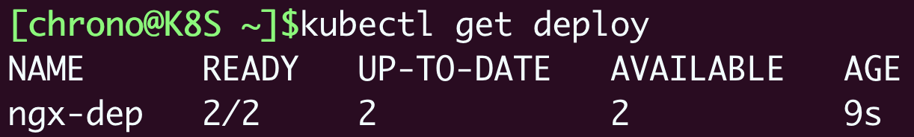
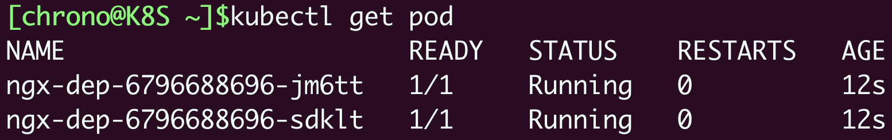
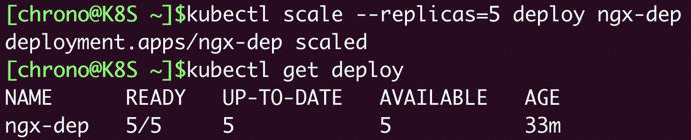
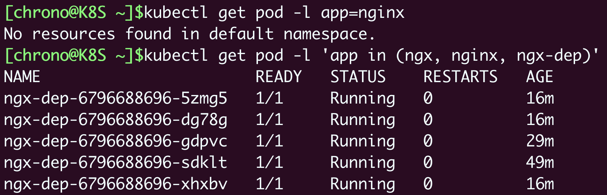
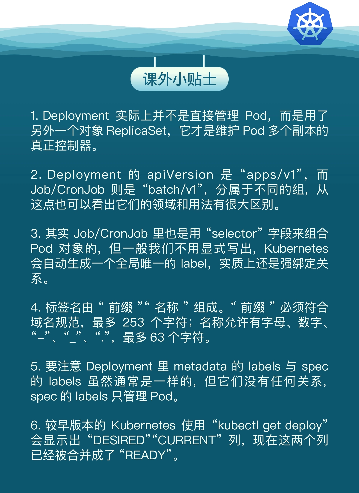

# 《Kubernetes 入門實戰課》學習筆記 Day 6

### Deployment：讓應用永不當機

- 它是專門用來部署應用程序的，能夠讓應用永不宕機，多用來發佈無狀態的應用，**是 Kubernetes 里最常用也是最有用的一個對象**

### 為什麼要有 Deployment

因為 Pod 在 YAML 里使用 `containers` 就可以任意編排容器，而且還有一個 `restartPolicy` 字段，默認值就是 Always，可以監控 Pod 里容器的狀態，一旦發生異常，就會自動重啓容器。

`restartPolicy` 只能保證容器正常工作。不知你有沒有想到，如果容器之外的 Pod 出錯了該怎麼辦？如有人不小心用 kubectl delete 誤刪了 Pod，或者 Pod 運行的節點發生了斷電故障，那麼 Pod 就會在集群里徹底消失，對容器的控制也就無從談起了。

而在線業務遠不是像 Job 單純啓動一個 Pod 這麼簡單，還有多實例、高可用、版本更新等許多複雜的操作。比如最簡單的多實例需求，為了提高系統的服務能力，應對突發的流量和壓力，我們需要創建多個應用的副本（replicas），還要即時監控它們的狀態。如果還是只使用 Pod，那就會又走回手工管理的老路，沒有利用好 Kubernetes 自動化運維的優勢。其實，解決的辦法也很簡單，因為 Kubernetes 已經給我們提供了處理這種問題的思路，就是`單一職責`和`對象組合`。既然 Pod 管理不了自己，那麼我們就採用和 Job/CronJob 一樣的形式—**對象套對象**

### 如何使用 YAML 描述 Deploymnet

- kubectl api-resources 確認 API 對象的基本訊息
```shell
$ kubectl api-resources

NAME        SHORTNAMES  APIVERSION  NAMESPACED  KIND
deployments deploy      apps/v1     true        Deployment
```

- 除了直接使用 YAML 文件外，也可以使用命令 kubectl create 來創建 Deployment 的 YAML 樣板，免去反復手工輸入的麻煩。創建 Deployment 樣板的方式和 Job 也差不多，先指定類型是 Deployment（簡寫 deploy），然後是它的名字，再用 `--image` 參數指定鏡像名字

    - 透過 `--dry-run` 和 `-o yaml` 可以不完整執行而得到 Deployment 的 YAML 文件
    ```shell
    $ export out="--dry-run=client -o yaml"
    $ kubectl create deploy ngx-dep --image=nginx:alpine $out
    ```
    
    - 創建出的 YAML 類似如下
        - 比 Job/CronJob 多出兩個字段，正是實現多實例、高可用的關鍵
            - `replicas`： 副本數量
            - `selector`： 透過 label 篩選要執行的 Pod

    ```yaml
    apiVersion: apps/v1
    kind: Deployment
    metadata:
      labels:
        app: ngx-dep
      name: ngx-dep
      
    spec:
      replicas: 2   # here
      selector:     # here
        matchLabels:
          app: ngx-dep
          
      template:
        metadata:
          labels:
            app: ngx-dep
        spec:
          containers:
          - image: nginx:alpine
            name: nginx
    ```    
    
    -  `selector.matchLabels` 定義了 Pod 對象要攜帶的 label，它必須要和 `template` 中的 Pod 定義 label 完全一致 
        -  為了保證 Deployment 成功創建，我們必須在 YAML 里把 label 重復寫兩次：一次是在 `selector.matchLabels`，另一次是在 `template.matadata`。像在這裡，你就要在這兩個地方連續寫 app: ngx-dep
    ```yaml
    ...
    spec:
      replicas: 2
      selector:
        matchLabels:
          app: ngx-dep
          
      template:
        metadata:
          labels:
            app: ngx-dep
    ...
    ```
    
**Deployment 和 Pod 實際上是一種鬆散的組合關係**，**Deployment 實際上並不持有Pod 對象，它只是幫助 Pod 對象能夠有足夠的副本數量運行**，僅此而已。如果像 Job 那樣，把 Pod 在模板里寫死，那麼其他的對象再想要去管理這些 Pod 就無能為力了

### 如何描述 Deployment 和 Pod 的組合關係

- Kubernetes 通過在 API 對象的 metadata 元訊息加各種標籤（labels），我們就可以使用類似關係數據庫里查詢語句的方式，篩選出具有特定標識的那些對象。通過標籤這種設計，**Kubernetes 就解除了 Deployment 和模板里 Pod 的強綁定，把組合關係變成了弱引用**



- 下圖顯示訊息皆重要
    - `READY`: 表示運行的 Pod 數量，前面的數字是當前數量，後面的數字是期望數量，所以 2/2 的意思就是要求有兩個 Pod 運行，現在已經啓動了兩個 Pod
    
    - `UP-TO-DATE`: 指的是當前已經更新到最新狀態的 Pod 數量。因為如果要部署的 Pod 數量很多或者 Pod 啓動比較慢，Deployment 完全生效需要一個過程，UP-TO-DATE 就表示現在有多少個 Pod 已經完成了部署，達成了模板里的期望狀態
    
    - `AVAILABLE`: 要比 READY、UP-TO-DATE 更進一步，不僅要求已經運行，還必須是健康狀態，能夠正常對外提供服務，它才是我們最關心的 Deployment 指標
    - `AGE`: 表示 Deployment 從創建到現在所經過的時間，也就是運行的時間。    



- 被 Deployment 管理的 Pod 自動帶上了名字，命名的規則是 Deployment 的名字加上兩串隨機數（其實是 Pod 模板的 Hash 值）
    - 整體 Pods 數量 跟 Deployment 的 replicas 副本會是一致
    - 如果其一 Pod 被刪除，Deplomnet Controller 會自動監聽重建



### Deploymnet 應用伸縮

- **在 Deployment 部署成功之後，你還可以隨時調整 Pod 的數量，實現所謂的應用伸縮**。這項工作在 Kubernetes 出現之前對於運維來說是一件很困難的事情，而現在由於有了 Deployment 就變得輕而易舉了

    - **`kubectl scale` 是專門用於實現擴容和縮容的命令**，你只要用參數 `--replicas` 指定需要的副本數量，Kubernetes 就會自動增加或者刪除 Pod，讓最終的 Pod 數量達到期望狀態
    
```shell
$ kubectl scale --replicas=5 deploy ngx-dep
```



- 需要留意點
    - **kubectl scale 是命令式操作，擴容和縮容只是臨時的措施**，如果應用需要長時間保持一個確定的 Pod 數量，最好還是編輯 Deployment 的 YAML 文件，改動 `replicas`，再以聲明式的 kubectl apply 修改對象的狀態


### Labels 字段使用方式

- 第一條命令找出 app 標籤是 nginx 的所有 Pod
- 第二條命令找出 app 標籤是 ngx、nginx、ngx-dep 的所有 Pod

```yaml
$ kubectl get pod -l app=nginx
$ kubectl get pod -l 'app in (ngx, nginx, ngx-dep)'
```


### 小結

