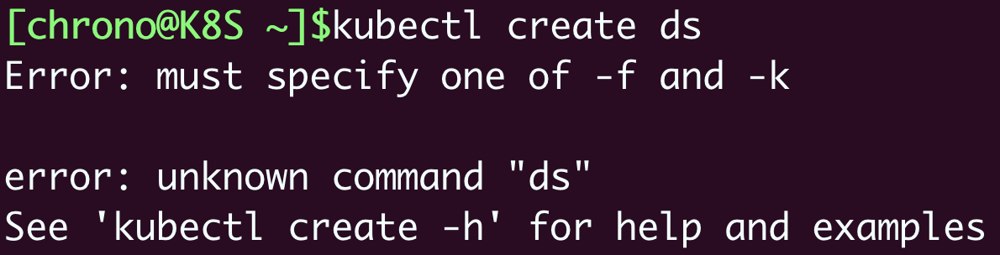
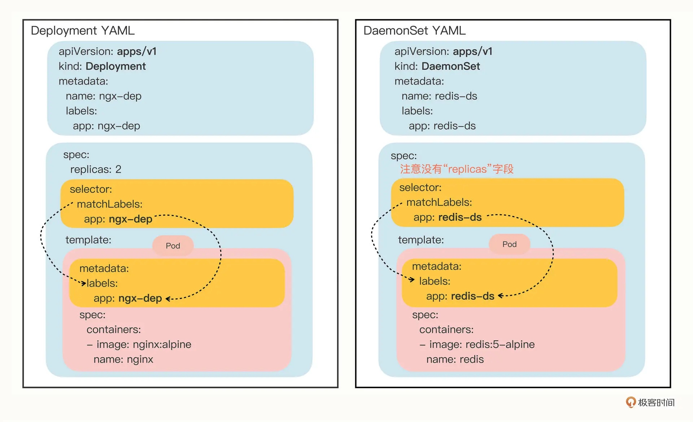
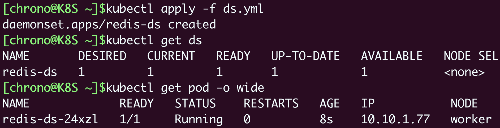
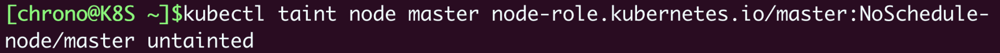
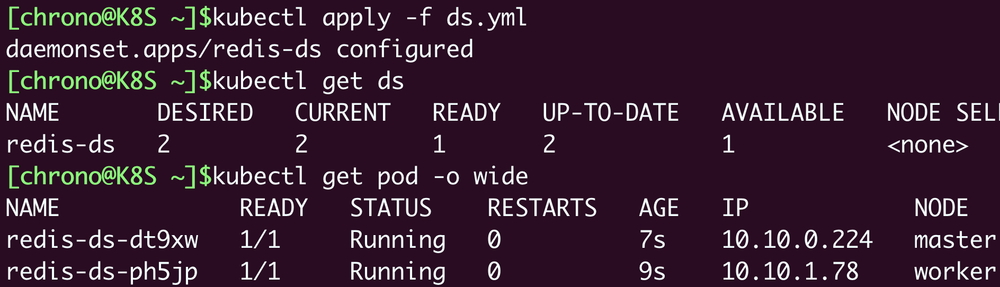
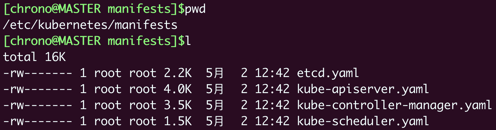
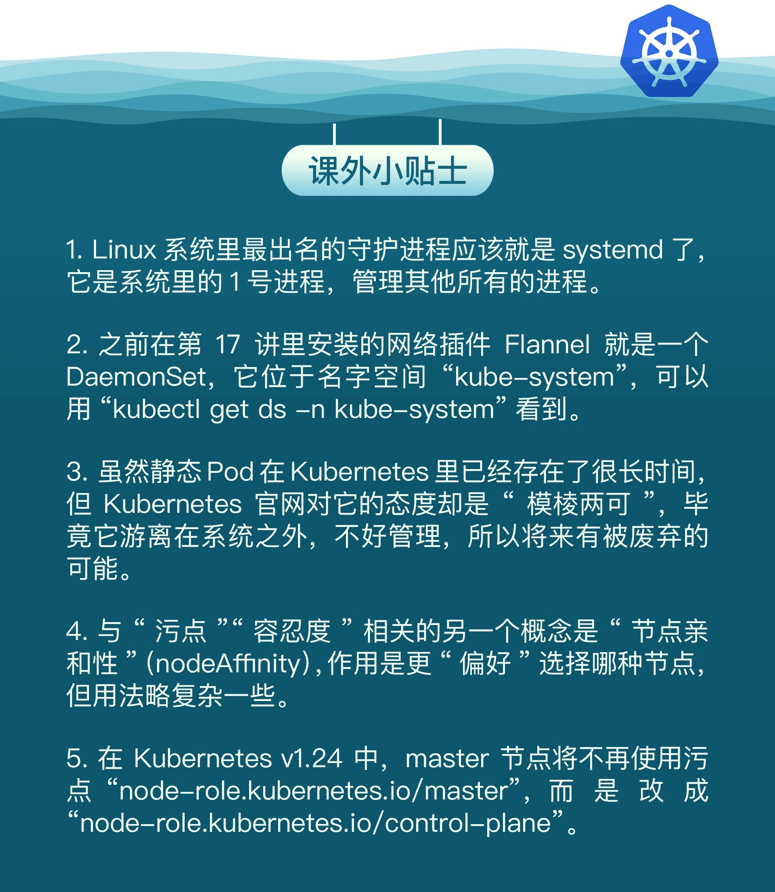

# 《Kubernetes 入門實戰課》學習筆記 Day 7

## Daemonset：守護進程

- Deployment，它能夠創建任意多個的 Pod 實例，並且維護這些 Pod 的正常運行，保證應用始終處於可用狀態

### 為什麼要有 Daemonset

有一些業務比較特殊，它們不是完全獨立於系統運行的，而是**與主機存在綁定關係，必須要依附於節點才能產生價值**，比如說：

- 網絡應用（如 kube-proxy），必須每個節點都運行一個 Pod，否則節點就無法加入 Kubernetes 網絡
- 監控應用（如 Prometheus），必須每個節點都有一個 Pod 用來監控節點的狀態，實時上報信息
- 日誌應用（如 Fluentd），必須在每個節點上運行一個 Pod，才能夠蒐集容器運行時產生的日誌數據
- 安全應用，同樣的，每個節點都要有一個 Pod 來執行安全審計、入侵檢查、漏洞掃描等工作

Deployment 不足之處：

- 只關心 Pod 的數量是否足夠，足夠則應用程序應該會正常工作

Kubernetes 就定義了新的 API 對象 `DaemonSet`，它在形式上和 Deployment 類似，都是管理控制 Pod，但管理調度策略卻不同。**DaemonSet 的目標是在集群的每個節點上運行且僅運行一個 Pod**，就好像是為節點配上一隻看門狗，忠實地守護著節點，這就是 DaemonSet 名字的由來。

### 如何使用 YAML 描述 Daemonset

- kubectl 不提供自動創建 DaemonSet YAML 樣板的功能


- 可以在 Kubernetes 的官网 [Daemonset](https://kubernetes.io/zh/docs/concepts/workloads/controllers/daemonset/) 上找到一份 DaemonSet 的 YAML 示例，去掉多餘部分如下所示：
```yaml
apiVersion: apps/v1
kind: DaemonSet
metadata:
  name: redis-ds
  labels:
    app: redis-ds

spec:
  selector:
    matchLabels:
      name: redis-ds

  template:
    metadata:
      labels:
        name: redis-ds
    spec:
      containers:
      - image: redis:5-alpine
        name: redis
        ports:
        - containerPort: 6379
```

- **DaemonSet 在 spec 里沒有 replicas 字段**，這是它與 Deployment 的一個關鍵不同點，意味著它不會在集群里創建多個 Pod 副本，而是要**在每個節點上只創建出一個 Pod 實例**



- 了解差異後，其實也是可以透過 kubectl create 先創建出 Deployment 對象後，**刪除 spec.replicas 字段，且把 kind 改成 Daemoset** 即可

```yaml
export out="--dry-run=client -o yaml"

# change "kind" to DaemonSet
kubectl create deploy redis-ds --image=redis:5-alpine $out
```

### 如何使用 Daemonset

- 測試環境裡有一個 Master 一個 Worker，而 **Master 默認是不跑應用的**，所以 DaemonSet 就只生成了一個 Pod，運行在了 worker 節點上


- 照 Daemonset 原意，是每個節點都會生成一個 Pod，為什麼 Master 被排除？它的設計跟 Kubernets 集群的工作機制衝突了

    - Kubernetes 為了應對 Pod 在某些節點的 `調度` 和 `驅逐` 問題，它定義了兩個新的概念：**污點（taint）和容忍度（toleration）**

### 什麼是污點（taint）和容忍度（toleration）
> Ref:
> - [taint-and-toleration](https://kubernetes.io/zh/docs/concepts/scheduling-eviction/taint-and-toleration/)

- 污點: 是 Kubernetes 節點的一個屬性，**它的作用也是給節點貼標籤，但為了不和已有的 labels 字段混淆，就改成了 taint**
- 容忍度: 就是 **Pod 的容忍度**，顧名思義，就是 Pod 能否容忍污點。

Pod 會根據自己對`污點`的`容忍程度`來選擇合適的節點目標

Kubernetes 在創建集群的時候會自動給節點 Node 加上一些「污點」，方便 Pod 的調度和部署。你可以用 `kubectl describe node` 來查看 Master 和 Worker 的狀態

- Master: 有一個污點，NoSchedule
- Worker: 沒有污點，none

```yaml
$ kubectl describe node master

Name:     master
Roles:    control-plane,master
...
Taints:   node-role.kubernetes.io/master:NoSchedule
...

$ kubectl describe node worker

Name:     worker
Roles:    <none>
...
Taints:   <none>
...
```

這正是 Master 和 Worker 在 Pod調度策略的差別

#### 讓 Daemonset 在 Master 節點運作 

- 方法有兩種

- 去污點
    - **這種方法修改的是 Node 的狀態**，影響面會比較大，可能會導致很多 Pod 都跑到這個節點上運行，所以我們**可以保留 Node 的污點，為需要的 Pod 添加容忍度，只讓某些 Pod 運行在個別節點上，實現精細化調度**，如第二種方式
```shell
# 去掉 Master 節點的 NoSchedule 效果
# NoSchedule- : 去除污點
# NoSchedule: 加污點
$ kubectl taint node master node-role.kubernetes.io/master:NoSchedule-
```


- 為 Pod 添加 `tolerations` 字段

```yaml
...
tolerations:
- key: node-role.kubernetes.io/master
  effect: NoSchedule
  operator: Exists
...
```

採用上述其一方式後，即可部署在 Master 上


### 靜態 Pod

- 為什麼會有靜態 Pod？
    - **它不受 Kubernetes 系統的管控，不與 apiserver、scheduler 發生關係**，所以是靜態的。但既然它是 Pod，也必然會在容器運行時上，也會有 YAML 文件來描述它，而唯一能夠管理它的 Kubernetes 組件也就只有在每個節點上運行的 kubelet 了。靜態 Pod 的 YAML 文件默認都存放在節點的 `/etc/kubernetes/manifests` 目錄下，它是 Kubernetes 的專用目錄
    - **Kubernetes 的 4 個核心組件 apiserver、etcd、scheduler、controller-manager 原來都以靜態 Pod 的形式存在的**，這也是為什麼它們能夠先於 Kubernetes 集群啓動的原因
    

**如果有一些 DaemonSet 無法滿足的特殊的需求，可以考慮使用靜態 Pod**，編寫一個 YAML 文件放到這個目錄里，節點的 kubelet 會定期檢查目錄里的文件，發現變化就會調用容器運行時創建或者刪除靜態 Pod

### 小結

- **DaemonSet 的目標是為集群里的每個節點部署唯一的 Pod，常用於`監控`、`日誌`等業務**
- DaemonSet 的 YAML 描述與 Deployment 非常接近，只是沒有 replicas 字段
- **`污點`和`容忍度`是與 DaemonSet 相關的兩個重要概念，分別從屬於 Node 和 Pod，共同決定了 Pod 的調度策略**
- 靜態 Pod 也可以實現和 DaemonSet 同樣的效果，但**它不受 Kubernetes 控制，必須在節點上純手動部署，應當慎用**


