# 《Kubernetes 入門實戰課》學習筆記 Day 8

## Service: 微服務架構的應對之道

- 前面兩者都是在線業務
    - Deployment: 創建任意多個實例
    - Daemonset: 為每個節點創建一個實例

- Service: 
    - 為了更好地支持微服務以及服務網格這樣的應用架構，Kubernetes 又專門定義了一個新的對象：Service，**它是集群內部的負載均衡機制，用來解決服務發現的關鍵問題**
    
### 為什麼要有 Service 

雖然 Deployment 和 DaemonSet 可以維持 Pod 總體數量的穩定，但在運行過程中，難免會有 Pod 銷毀又重建，這就會導致 Pod 集合處於動態的變化之中，但這種動態穩定卻不適合用在微服務架構中。

原先業界針對不穩定的後端服務已有處理方式，為負載均衡，如 LVS、Nginx 等等，它們在前端與後端之間加入了一個中間層，遮蔽後端的變化，為前端提供一個穩定的服務。但 LVS、Nginx 畢竟不是雲原生技術，所以 Kubernetes 就按照這個思路，定義了新的 API 對象：Service。

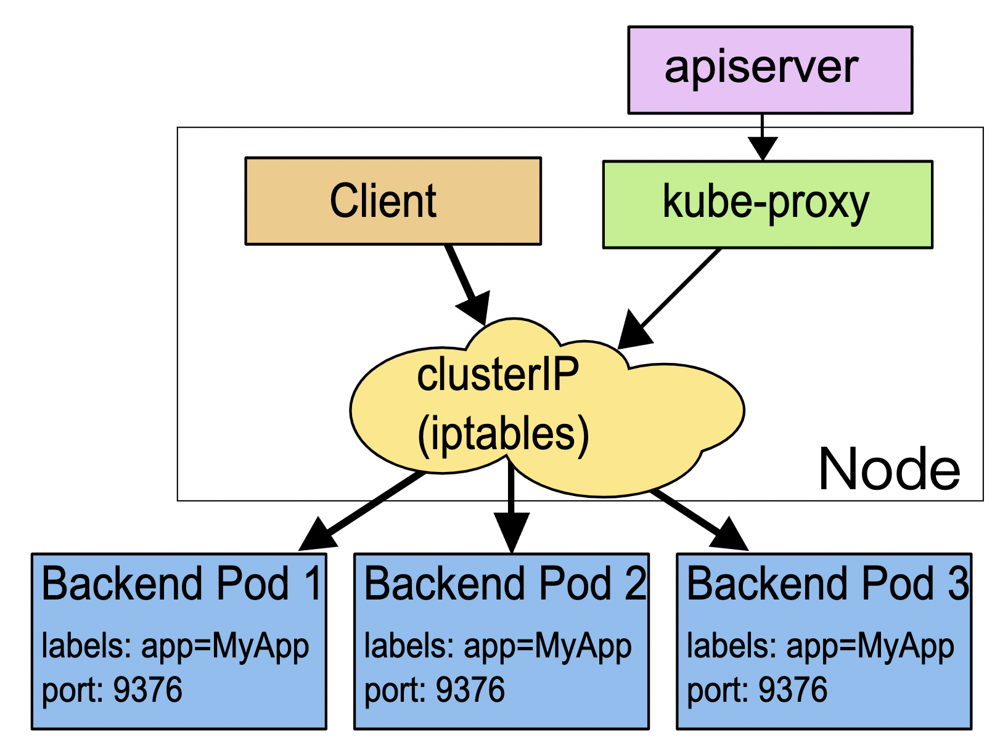

**這裡 Service 使用了 iptables 技術**，每個節點上的 kube-proxy 組件自動維護 iptables 規則，客戶不再關心 Pod 的具體地址，只要訪問 Service 的固定 IP 地址，Service 就會根據 iptables 規則轉發請求給它管理的多個 Pod，是典型的負載均衡架構。

不過 Service 並不是只能使用 iptables 來實現負載均衡，**它還有另外兩種實現技術：性能更差的 userspace 和性能更好的 ipvs**，但這些都屬於底層細節，我們不需要刻意關注。

### 如何使用 YAML 描述 Service

- `kubectl expose` 指令創建 YAML 模板
```shell
$ export out="--dry-run=client -o yaml"
$ kubectl expose deploy ngx-dep --port=80 --target-port=80 $out
```

- Service 模板代碼
```yaml
apiVersion: v1
kind: Service
metadata:
  name: ngx-svc
  
spec:
  selector: # 過濾選擇 Pods
    app: ngx-dep
    
  ports:
  - port: 80
    targetPort: 80
    protocol: TCP
```
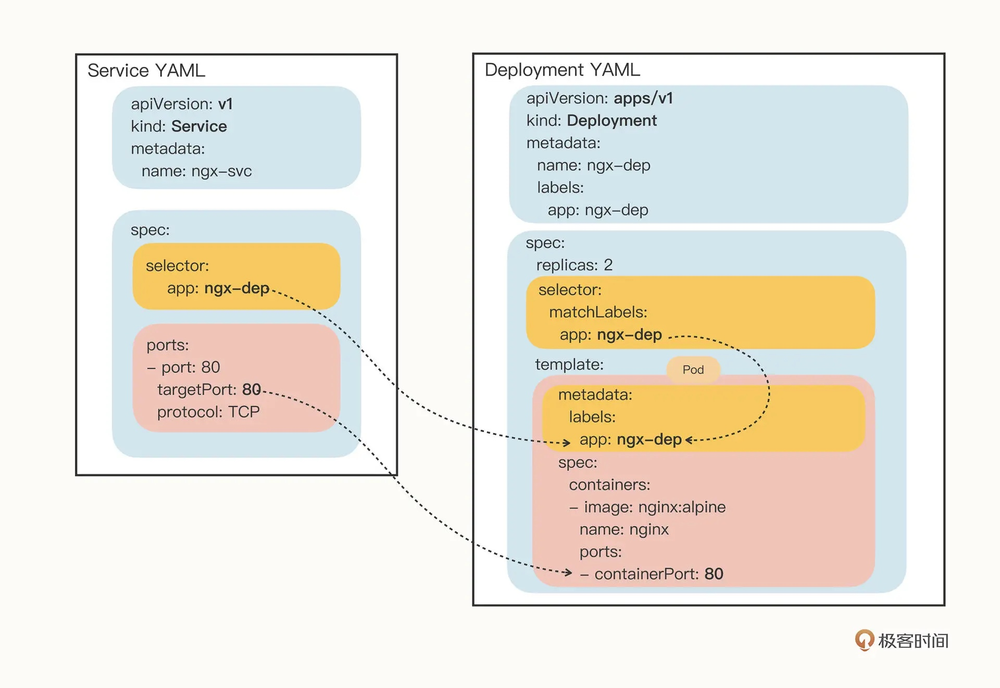

### 如何在 Kubernetes 裡使用 Service

如下示意
- 在 ComfigMap，定義一個 nginx 
```yaml
apiVersion: v1
kind: ConfigMap
metadata:
  name: ngx-conf

data:
  default.conf: |
    server {
      listen 80;
      location / {
        default_type text/plain;
        return 200
          'srv : $server_addr:$server_port\nhost: $hostname\nuri : $request_method $host $request_uri\ndate: $time_iso8601\n';
      }
    }
```

- 在 Deploymnet 中定義 template.volumes 存儲卷，再透過 volumeMounts 掛載到 Nginx 容器中
```yaml
apiVersion: apps/v1
kind: Deployment
metadata:
  name: ngx-dep

spec:
  replicas: 2
  selector:
    matchLabels:
      app: ngx-dep

  template:
    metadata:
      labels:
        app: ngx-dep
    spec:
      volumes:
      - name: ngx-conf-vol
        configMap:
          name: ngx-conf

      containers:
      - image: nginx:alpine
        name: nginx
        ports:
        - containerPort: 80

        volumeMounts:
        - mountPath: /etc/nginx/conf.d
          name: ngx-conf-vol
```

- 照上面說法，創建 Service
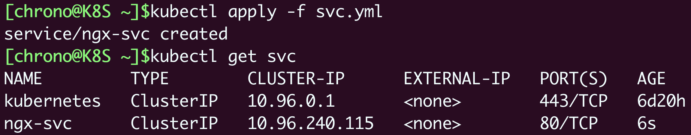


想要看 **Service 代理了哪些後端的 Pod**，可以用 `kubectl describe` 命令
```shell
$ kubectl describe svc ngx-svc
```
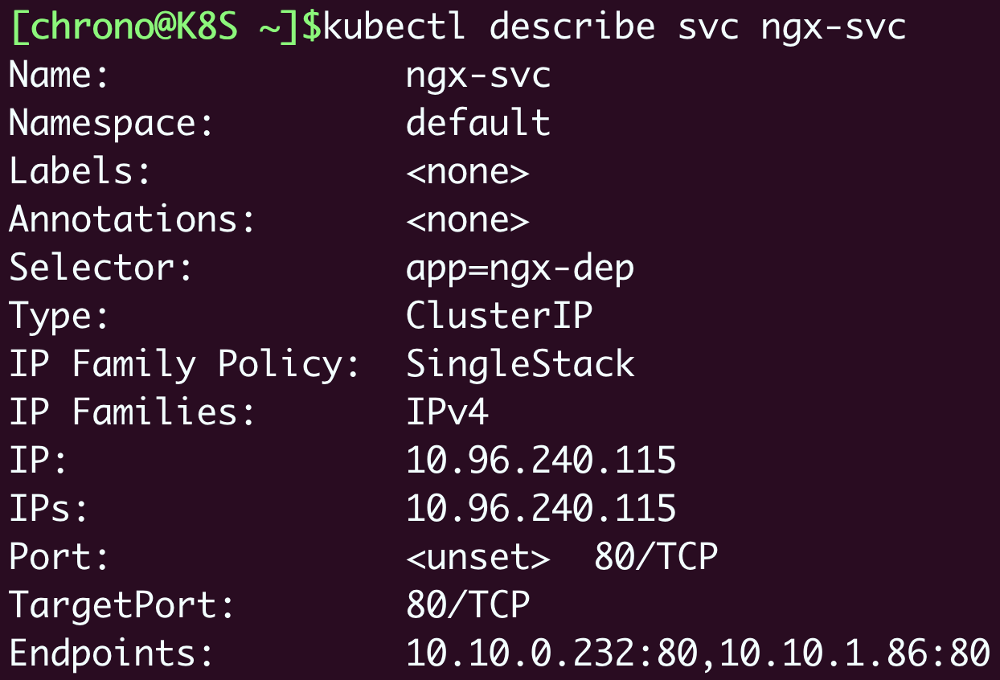

```shell
$ kubectl get pod -o wide
```
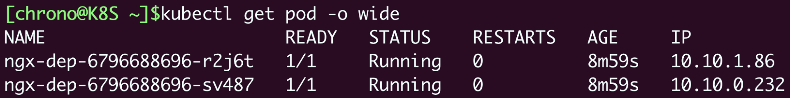

圖片中，可以觀察到 Endpoints 管理了兩組 IPs，**把 Pod 的地址與 Service 的訊息做個對比**，我們就能夠驗證 Service 確實用一個靜態 IP 地址代理了兩個 Pod 的動態 IP 地址

### 如何測試 Service 的負載均衡

因為 Service、 Pod 的 IP 地址都是 Kubernetes 集群的內部網段，所以我們需要用 kubectl exec 進入到 Pod 內部（或者 ssh 登錄集群節點），再用 curl 等工具來訪問 Service

- 可以觀察到 curl 訪問 Service IP，數據會轉發到後端的哪個 Pod

```shell
$ kubectl exec -it ngx-dep-6796688696-r2j6t -- sh
```
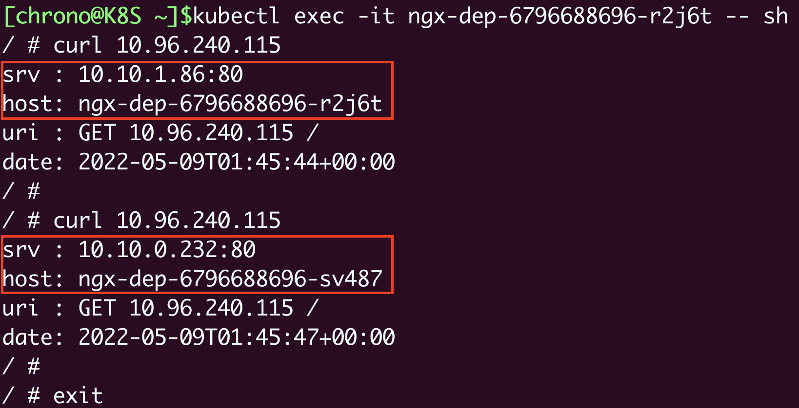

另外，由於 Pod 被 `Deployment` 對象管理，刪除後會自動重建，而 Service 又會通過 `controller-manager` 實時監控 Pod 的變化情況，所以就會立即更新它代理的 IP 地址。就可以看到有一個 IP 地址`10.10.1.86` 消失了，換成了新的 `10.10.1.87`，它就是新創建的 Pod
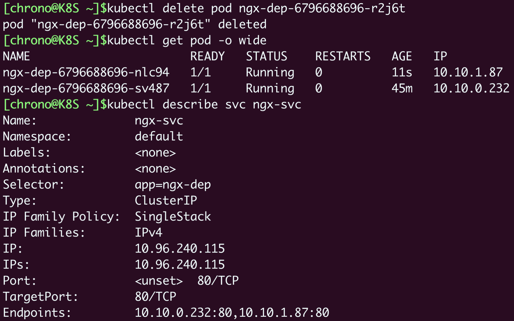

再者，可以採用 `PING` 來測試 IP 地址。因為 Service 的 IP 地址是**虛**的，**只用於轉發流量**，所以 ping 無法得到回應數據包
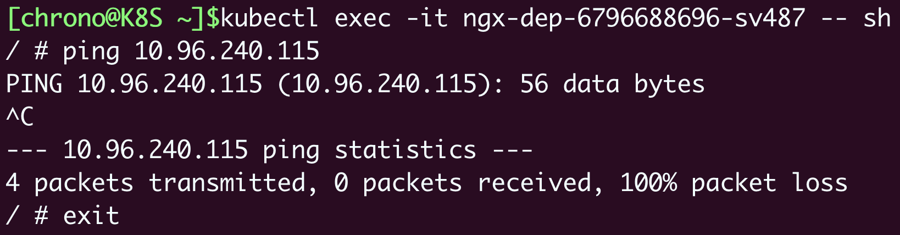

### 如何以域名方式使用 Service

Service 對象的 IP 地址是靜態的，這在微服務里確實很重要，不過數字形式的 IP 地址用起來還是不太方便。這個時候 Kubernetes 的 DNS 插件就派上了用處，它可以為 Service 創建容易記住的域名，讓 Service 更容易使用

使用 DNS 域名之前，我們要先瞭解一個新的概念: namespace，這跟用於資源隔離的 Linux namespace 技術完全不同。Kubernetes 只是借用了這個術語，但目標是類似的，**用來在集群里實現對 API 對象的隔離和分組**

- 透過 kubectl get ns 指令查看當前集群有哪些 namespaces
```shell
$ kubectl get ns
```
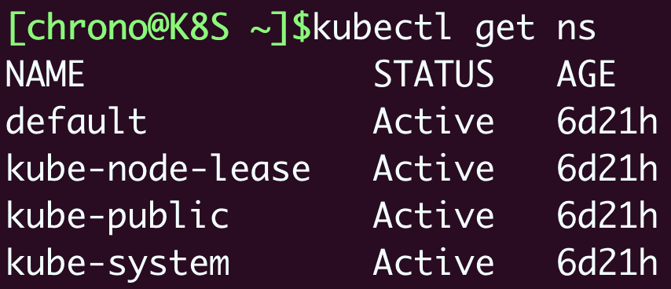

Service 對象的域名完全形式是 `<which svc>. <namespace>.svc.cluster.local`，在相同區域內很多時候也可以省略後面的部分，直接寫`<which svc>. <namespace>`,甚至 `<which svc>`，**默認會使用對象所在的 namespace**（比如這裡就是 default）
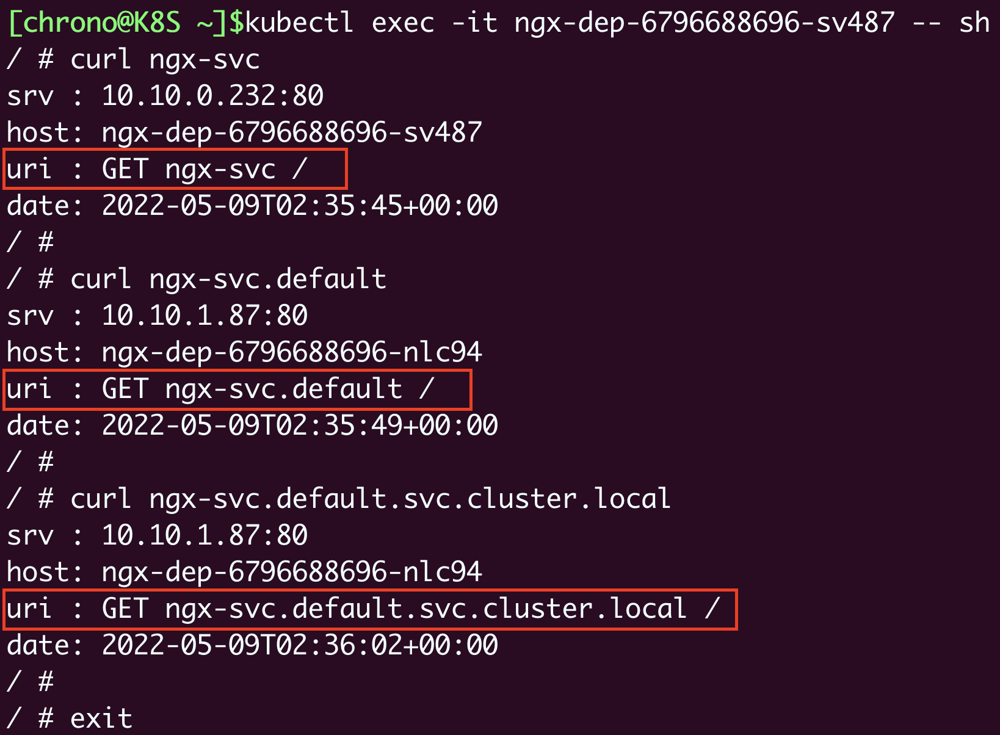

- 補充
    - Kubernetes 也為每個 Pod 分配了域名，形式是`<pod ip>.<namespce>.pod.cluster.local`，但需要把 IP 地址里的 . 改成 - :
        - 如地址 10.10.1.87，它對應的域名就是 10-10-1-87.default.pod

### 如何讓 Service 對外暴露

前面說到 Service 為一種負載均衡技術，所以它不僅能夠管理 Kubernetes 集群內部的服務，還能夠擔當向集群外部暴露服務的任務

Service 對象有一個關鍵字段 - `type`，表示 Service 是哪種類型的負載均衡。前面我們看到的用法都是對集群內部 Pod 的負載均衡，所以**這個字段的值就是默認的 ClusterIP**，Service 的靜態 IP 地址只能在集群內訪問。除了 ClusterIP，Service 還支持其他三種類型，分別是 ExternalName、LoadBalancer、NodePort。不過**前兩種類型一般由雲服務商提供**，測試環境，會以 NodePort 為主。

- `kubectl expose` 的時候**加上參數 --type=NodePort，或者在 YAML 里添加字段 type:NodePort**，那麼 Service 除了會對後端的 Pod 做負載均衡之外，還**會在集群里的每個節點上創建一個獨立的端口，用這個端口對外提供服務**，這也正是「NodePort」這個名字的由來

- 除了集群內部使用的 80 端口，還多出了一個 30651 端口，Kubernetes Service 創建的節點對外映射端口，故可以從所有集群上節點的 IP 地址，訪問此端口
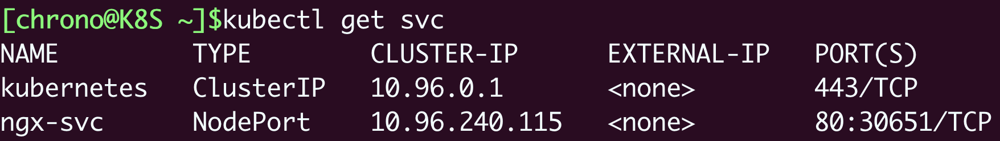

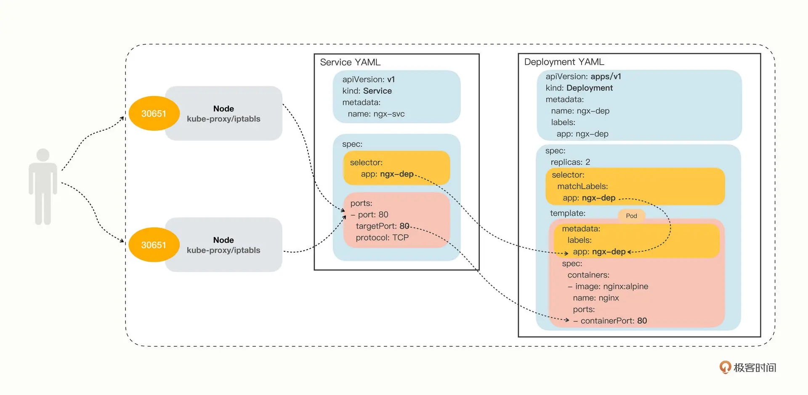

- NodePort Service 的缺點
    - **第一個缺點是它的端口數量很有限**。Kubernetes 為了避免端口衝突，**默認只在 30000 ~ 32767 這個範圍內隨機分配，只有 2000 多個**，而且都不是標準端口號，這對於具有大量業務應用的系統來說根本不夠用
    - **第二個缺點是它會在每個節點上都開端口**，然後使用 kube-proxy 路由到真正的後端 Service，**這對於有很多計算節點的大集群來說就帶來了一些額外網絡通訊成本**
    - **第三個缺點為它要求向外界暴露節點的 IP 地址**，這在很多時候是不可行的，**為了安全還需要在集群外再搭一個反向代理**，增加了方案的複雜度

### 小結

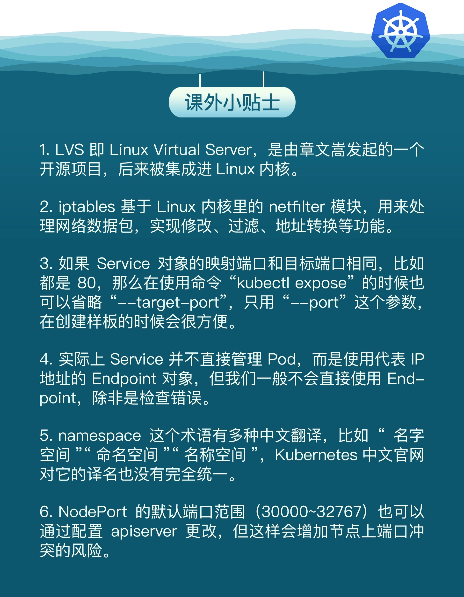
