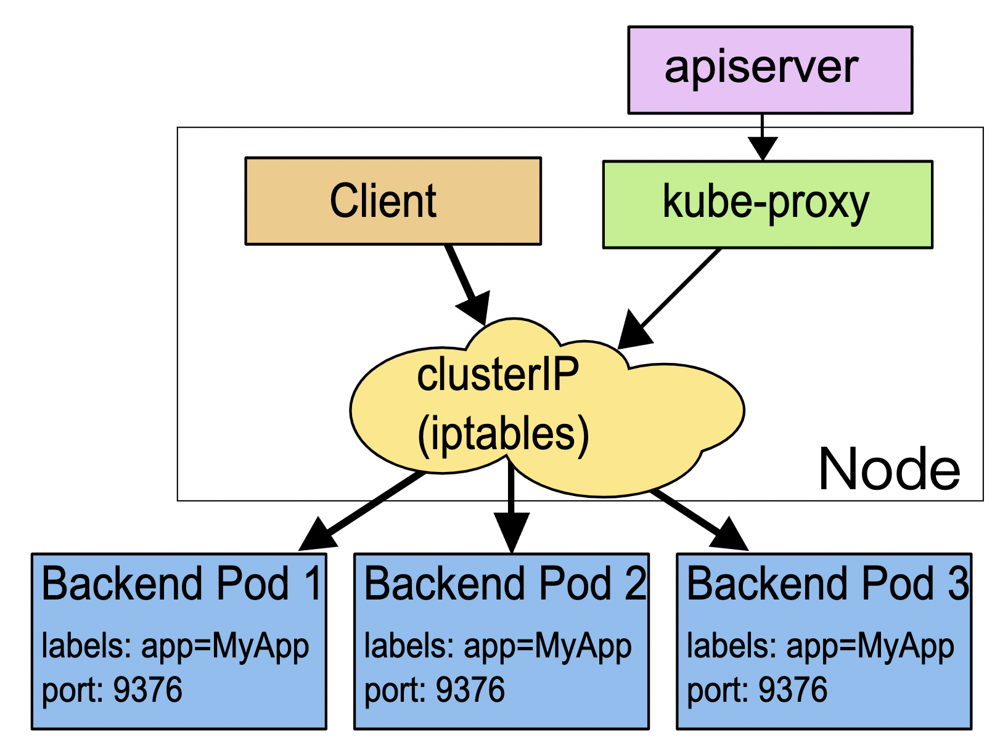
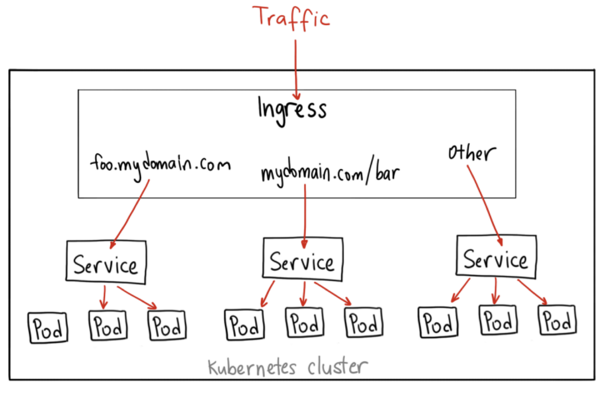
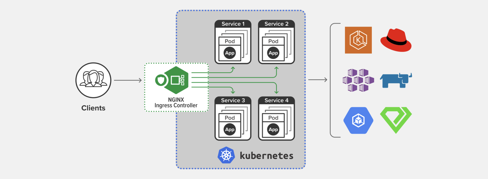
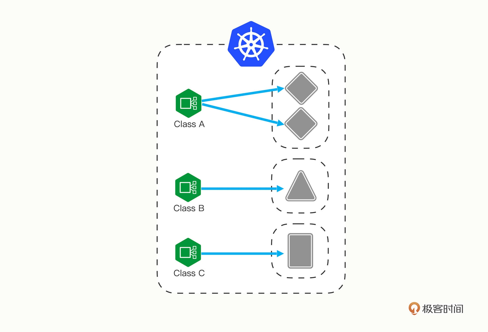
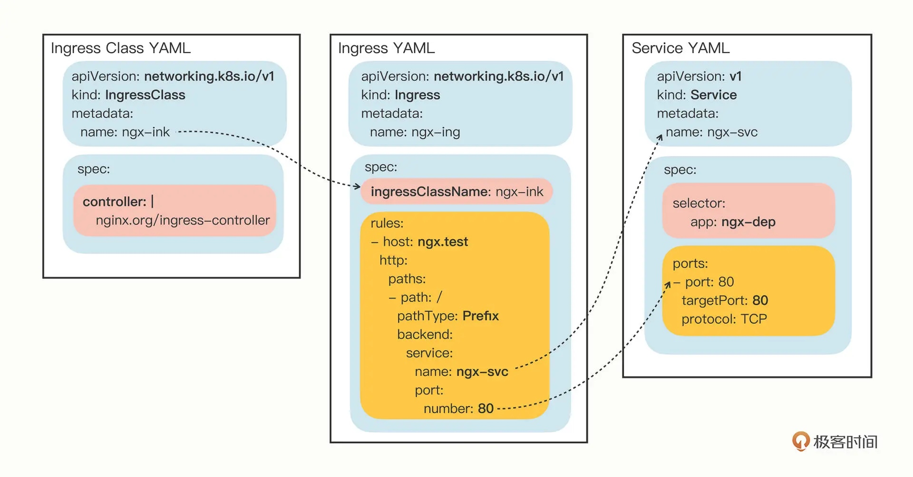
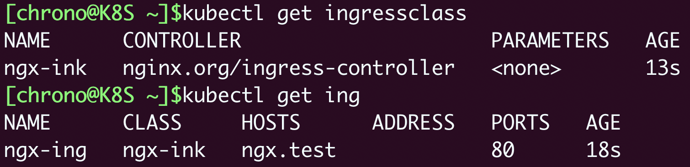
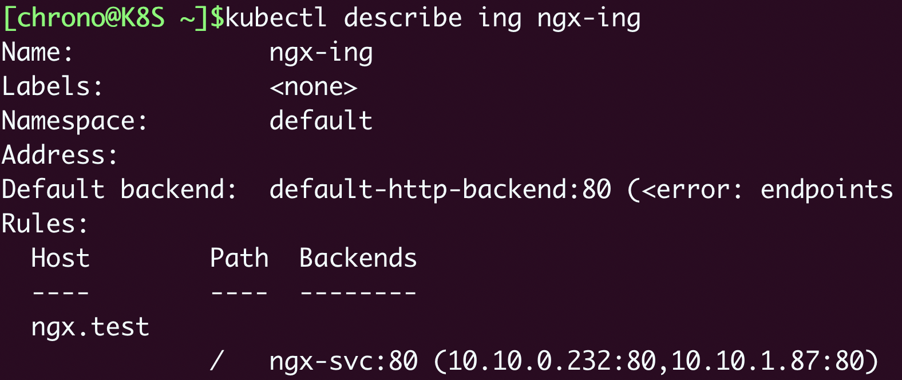
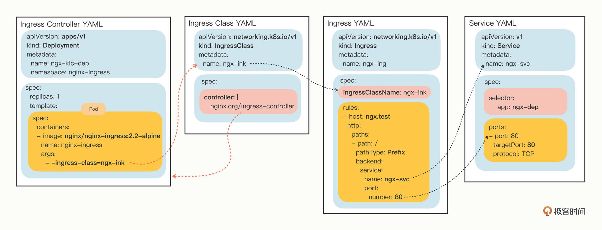
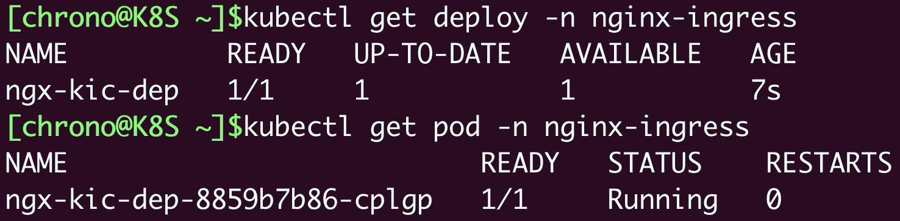
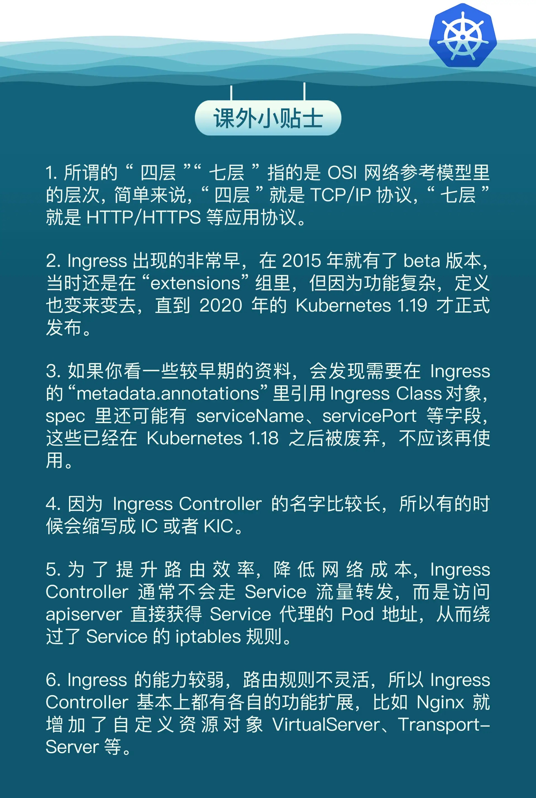

# 《Kubernetes 入門實戰課》學習筆記 Day 9

## Ingress: 集群流量進出管理

Kubernetes Service 的功能和運行機制，它本質上就是一個由 kube-proxy 控制的四層負載均衡，在 TCP/IP 協議上轉發流量。




### 為什麼要有 Ingress

Service 很有用，但也只能說是基礎設施，它對網絡流量的管理方案還是太簡單，離複雜的現代應用架構需求還有很大的差距，所以 Kubernetes 就在 Service 之上又提出了一個新的概念：Ingress。

Kubernetes 沿用了 Service 的思路，既然 Service 是四層的負載均衡，那麼再引入一個新對象在七層上做負載均衡。不過除了七層負載均衡，這個對象還應該承擔更多的職責，也就是**作為流量的總入口，統管集群的進出口數據，扇入、扇出流量（也就是我們常說的「南北向」）**，讓外部用戶能夠安全、順暢、便捷地訪問內部服務。這個對象就是 Ingress，意思就是集群內外邊界上的入口。



### 為什麼要有 Ingress Controller

**Ingress 可以說是在七層上另一種形式的 Service**，它同樣會代理一些後端的 Pod，也有一些路由規則來定義流量應該如何分配、轉發，只不過**這些規則都使用的是 HTTP/HTTPS 協議**。

**Service 本身是沒有服務能力的，實際上，它只是一些 iptables 規則，真正配置、應用這些規則的是節點里的 kube-proxy 組件**。如果沒有 kube-proxy，Service 定義得再完善也沒有用。

同樣的，Ingress 也只是一些 HTTP 路由規則的集合，相當於一份靜態的描述文件，真正要把這些規則在集群里實施運行，還需要有另外一個東西，**這就是 Ingress Controller，它的作用就相當於 Service 的 kube-proxy，能夠讀取、應用 Ingress 規則，處理、調度流量。**

不過 Ingress Controller 要做的事情太多，與上層業務聯繫太密切，所以 Kubernetes 把 Ingress Controller 的實現交給了社區，任何人都可以開發 Ingress Controller，只要遵守 Ingress 規則即可，但也造就了許多版本 Ingress Controller 的出現。

從 Ingress Controller 的描述上我們也可以看到，HTTP 層面的流量管理、安全控制等功能其實就是經典的反向代理，而這些實現中最著名的，為老牌的反向代理和負載均衡軟件 Nginx，因其穩定性最好、性能最高的產品，所以它也理所當然成為了 Kubernetes 里應用得最廣泛的 Ingress Controller。

- 下圖來自[Nginx 官網](https://www.nginx.com/products/nginx-ingress-controller/)



### 為什麼要有 IngressClass

最初 Kubernetes 在一個集群里配置一個 Ingress Controller，再給它配上許多不同的 Ingress 規則，覺得就可以解決請求的路由和分發問題了。

但隨著 Ingress 在實踐中的大量應用，很多用戶發現這種用法會帶來一些問題，比如：

- 由於某些原因，項目組需要引入不同的 Ingress Controller，但 Kubernetes 不允許這樣做
- Ingress 規則太多，都交給一個 Ingress Controller 處理會讓它不堪重負
- 多個 Ingress 對象沒有很好的邏輯分組方式，管理和維護成本很高
- 集群里有不同的租戶，他們對 Ingress 的需求差異很大甚至有衝突，無法部署在同一個 Ingress Controller 上。

因此，Kubernetes 就又提出了一個 Ingress Class 的概念，讓它介入在 Ingress 和 Ingress Controller 中間，**作為流量規則和控制器的協調者，解除了 Ingress 和 Ingress Controller 的強依賴關係**。

目前，Kubernetes 可以讓用戶可以轉向管理 Ingress Class，用它來**定義不同的業務邏輯分組**，簡化 Ingress 規則的複雜度。

- 不同 Class 處理不同業務



### 如何使用 YAML 描述 Ingress / IngressClass

Ingress 和 Ingress Class 的 apiVersion 都是networking.k8s.io/v1，而且 Ingress 有一個簡寫 ing，但 Ingress Controller 怎麼沒有？

- 是因為 Ingress Controller 和其他兩個對象不太一樣，它不只是描述文件，是一個要實際處理流量的應用程序，而應用程序在 Kubernetes 里早就有對象來管理了，那就是 Deployment 和 DaemonSet，所以我們只需要再學習 Ingress 和 Ingress Class 的的用法就可以了

```shell
$ kubectl api-resources

NAME          SHORTNAMES   APIVERSION           NAMESPACED   KIND
ingresses       ing          networking.k8s.io/v1   true         Ingress
ingressclasses               networking.k8s.io/v1   false        IngressClass
```

- 透過 kubectl create 創建樣板，需要加入兩個參數：
- `--class`: 指定 Ingress 從屬的 Ingress Class 對象
- `--rule`: 指定路由規則，基本形式是 `URI=Service`，也就是說是訪問 HTTP 路徑就轉發到對應的 Service 對象，再由 Service 對象轉發給後端的 Pod
```shell
export out="--dry-run=client -o yaml"
kubectl create ing ngx-ing --rule="ngx.test/=ngx-svc:80" --class=ngx-ink $out
```
```yaml
# sample 
apiVersion: networking.k8s.io/v1
kind: Ingress
metadata:
  name: ngx-ing
  
spec:
  ingressClassName: ngx-ink
  rules:
  - host: ngx.test
    http:
      paths:
      - path: /
        pathType: Exact
        backend:
          service:
            name: ngx-svc
            port:
              number: 80
```

其實 Ingress Class 本身並沒有什麼實際的功能，只是起到綁定 Ingress 和 Ingress Controller 的作用，所以它的定義非常簡單，在`spec`里只有一個必需的字段 `controller`，表示要使用哪個 Ingress Controller，**具體的名字就要看實現文檔**了

- e.g. 使用 Nginx Ingress Controller
```yaml
apiVersion: networking.k8s.io/v1
kind: IngressClass
metadata:
  name: ngx-ink

spec:
  controller: nginx.org/ingress-controller
```

- 下圖為 Ingress、Service、IngressClass 關係

### 如何在 Kubernetes 使用 Ingress / IngressClass

因為 IngressClass 很小，通常會跟 Ingress 合併
```shell
$ kubectl apply -f ingress.yml

# 查看對象
$ kubectl get ingressclass
$ kubectl get ing
```


- 查看 Ingress 的 rule 應用
```shell
$ kubectl describe ing ngx-ing
```


**可以忽略 Ingress 里 Default backend 的錯誤提示**，因為在找不到路由的時候，**它被設計用來提供一個默認的後端服務，但不設置也不會有什麼問題，所以大多數時候我們都忽略它**

### 如何在 Kubernetes 使用 Ingress Controller
> Ref:
> - [Nginx Ingress Controller](https://github.com/nginxinc/kubernetes-ingress)
> - [Installation with Manifests](https://docs.nginx.com/nginx-ingress-controller/installation/installation-with-manifests/)
> - [Installation with Helm](https://docs.nginx.com/nginx-ingress-controller/installation/installation-with-helm/)

Nginx Ingress Controller 的项目，以 Pod 運行在 Kubernetes 中，同時支持 Deployment 和 StatefulSet 兩種的部署方式。

Nginx Ingress Controller 的安裝略微麻煩一些，有很多個 YAML 需要執行，但如果只是做簡單的試驗，就只需要用到 4 個 YAML：
- 需要照順序安裝
```shell
$ kubectl apply -f common/ns-and-sa.yaml
$ kubectl apply -f rbac/rbac.yaml
$ kubectl apply -f common/nginx-config.yaml
$ kubectl apply -f common/default-server-secret.yaml
```
前兩條命令為 Ingress Controller 創建了一個獨立的名字空間 nginx-ingress，還有相應的帳號和權限，這是為了訪問 apiserver 獲取 Service、Endpoint 信息用的；後兩條則是創建了一個 ConfigMap 和 Secret，用來配置 HTTP/HTTPS 服務。

部署 Ingress Controller 不需要我們自己從頭編寫 Deployment，Nginx 已經為我們提供了示例 YAML，但創建之前為了適配我們自己的應用還必須要做幾處小改動：
- metadata 里的 name 要改成自己的名字，如 ngx-kic-dep
- spec.selector 和 template.metadata.labels 也要修改成自己的名字，或是直接延用 ngx-kic-dep
- containers.image 可以改用 apline 版本，加快下載速度，如 nginx/nginx-ingress:2.2-alpine
- 最下面的 args 要加上 `-ingress-class=ngx-ink`，也就是前面創建的 Ingress Class 的名字，這是讓 Ingress Controller 管理 Ingress 的關鍵。

修改完之後，Ingress Controller 的 YAML 大概是這個樣子：
```yaml

apiVersion: apps/v1
kind: Deployment
metadata:
  name: ngx-kic-dep
  namespace: nginx-ingress

spec:
  replicas: 1
  selector:
    matchLabels:
      app: ngx-kic-dep

  template:
    metadata:
      labels:
        app: ngx-kic-dep
    ...
    spec:
      containers:
      - image: nginx/nginx-ingress:2.2-alpine
        ...
        args:
          - -ingress-class=ngx-ink
```

- 部署關係圖如下



查看部署
```shell
$ kubectl apply -f kic.yml

$ kubectl get deploy -n nginx-ingress
$ kubectl get pod -n nginx-ingress
```


最後一道工序，**因為 Ingress Controller 本身也是一個 Pod**，想要向外提供服務還是要依賴於 Service 對象。所以你**至少還要再為它定義一個 Service，使用 NodePort 或者 LoadBalancer 暴露端口，才能真正把集群的內外流量打通。**

**不過現在也可以採用 `Helm chart` 進行 Ingress Controller 部署，就不需要上述麻煩的步驟，除非有特殊需求**
```shell
$ helm install my-ingress-controller nginx-stable/nginx-ingress
```

### 小結

- Service 是四層負載均衡，能力有限，所以就出現了 Ingress，它基於 HTTP/HTTPS 協議定義路由規則
- Ingress 只是規則的集合，自身不具備流量管理能力，需要 Ingress Controller 應用 Ingress 規則才能真正發揮作用
- Ingress Class 解耦了 Ingress 和 Ingress Controller，我們應當使用 Ingress Class 來管理 Ingress 資源
- 最流行的 Ingress Controller 是 Nginx Ingress Controller，它基於經典反向代理軟件 Nginx。

目前的 Kubernetes 流量管理功能主要集中在 Ingress Controller 上，已經不止於管理入口流量了，它還能管理出口流量，也就是 egress，甚至還可以管理集群內部服務之間的`東西向流量`。


