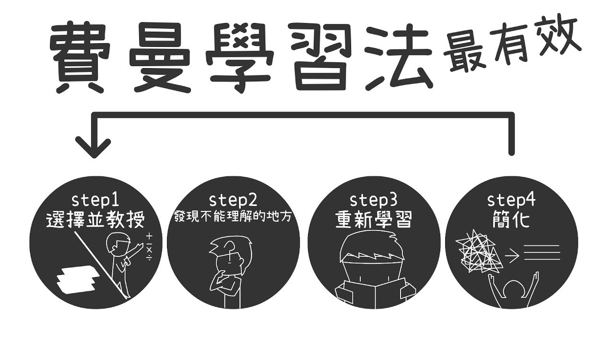

# Day 01 - 高效學習：端正學習態度

### 主動學習和被動學習

人的學習分為**被動學習和主動學習**兩個層次。
 - `被動學習`：如聽講、閱讀、視聽、演示，學習內容的平均留存率為 5%、10%、20% 和 30%。
- `主動學習`：如通過討論、實踐、教授給他人，會將原來被動學習的內容留存率從 5% 提升到 50%、75% 和 90%。

學習金字塔

### 淺度學習和深度學習

在目前時代下，種種跡象表明，快速、簡單、輕鬆的方式給人帶來的快感更強烈，而高層次的思考、思辨和邏輯則被這些頻度高的快餐訊息感所弱化。

- 如付費知識學習就類似快餐學習

可見深度學習十分重要，但應該如何進行深度學習？下面為幾個關鍵點。

- **高質量的訊息源和第一手的知識**
- **把知識連成地圖，將自己的理解反述出來**
- **不斷地反思和思辨，與不同年齡段的人討論**
- **舉一反三，並踐行之，把知識轉換成技能**

學習歸納三個步驟：
- `知識採集`: 訊息源是非常重要的，獲取訊息源頭、破解表面訊息的內在本質、多方數據印證，是這個步驟的關鍵
- `知識縫合`: 所謂縫合就是把訊息組織起來，成為結構體的知識。這裡，連接記憶，邏輯推理，知識梳理是很重要的三部分
- `技能轉換`: 通過舉一反三、實踐和練習，以及傳授教導，把知識轉化成自己的技能。這種技能可以讓你進入更高的階層。

> 費曼學習法
> 

### 如何學習

學習不僅僅是為了找到答案，而更是為了找到方法。
> 學習是為了找到通往答案的路徑和方法，是為了擁有無師自通的能力

學習不僅僅是為了知道，而更是為了思考和理解。
> 一旦理解和掌握了這些本質的東西，你就會發現，整個複雜多變的世界在變得越來越簡單。你就好像找到了所有問題的最終答案似的，一通百通了。

學習不僅僅是為了開拓眼界，而更是為了找到自己的未知，為了瞭解自己。
> 開拓眼界的目的就是發現自己的不足和上升空間，從而才能讓自己成長。

學習不僅僅是為了成長，而更是為了改變自己。
> 學習是為了改變自己的思考方式，改變自己的思維方式，改變自己與生俱來的那些垃圾和低效的算法。總之，學習讓我們改變自己，行動和踐行，反思和改善，從而獲得成長。

## 小結

學習是一件逆人性的事，就像鍛鍊身體一樣，需要人**持續付出**，但會讓人痛苦，並隨時可能找理由放棄。

**端正的學習態度**和**正確的學習觀念**，是高效學習的第一步，若連第一步都跨不過去，更別說什麼高效學習方式了。

此文章為3月Day01學習筆記，內容來源於極客時間[《左耳聽風》](https://time.geekbang.org/column/article/14271)