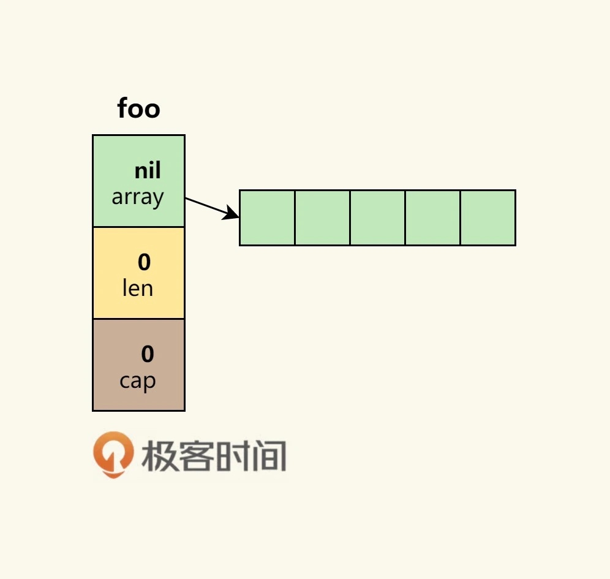
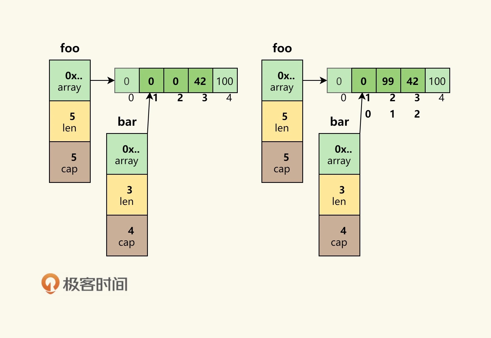
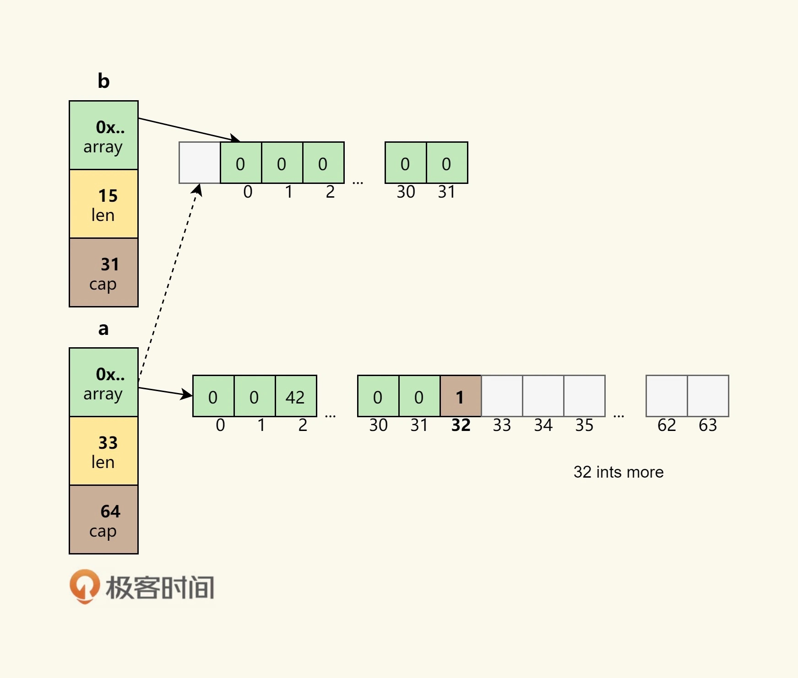
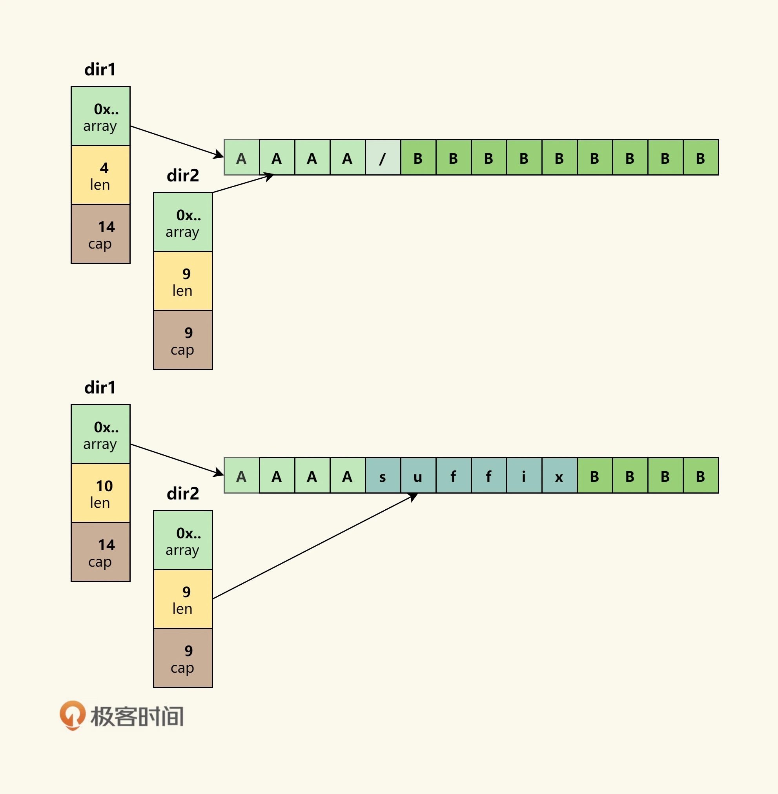

# Day 12 - Go編程模式：切片、接口、時間和性能

## Slice 切片

Slice（切片）代表變長的序列，序列中每個元素都有相同的類型。一個slice類型一般寫作[]T，其中T代表slice中元素的類型；slice的語法和數組很像，只是沒有固定長度而已。

結構體定義:
```go
type slice struct {
    array unsafe.Pointer //指向存放數據的數組指針
    len   int            //長度有多大
    cap   int            //容量有多大
}
```

一個空 slice 如下所示：


熟悉 C/C++ 的人一定會知道**在結構體里用數組指針的問題——數據會發生共享**。
如下操作：
```go
foo = make([]int, 5)
foo[3] = 42
foo[4] = 100

bar  := foo[1:4]
bar[1] = 99
```


從這張圖片中，我們可以看到，因為 **foo 和 bar 的內存是共享的**，所以，foo 和 bar 對數組內容的修改都會影響到對方。

但下面情況就完全不一樣了
如使用 `append()` 操作：
```go
a := make([]int, 32)
b := a[1:16]
a = append(a, 1)
a[2] = 42
```


> 內建函數 append 將元素追加到切片的末尾。**若它有足夠的容量，其目標就會重新切片以容納新的元素。否則，就會分配一個新的數組**。append 返回更新後的切片，因此必須存儲追加後的結果。
> 簡而言之，**append()這個函數在 cap 不夠用的時候，就會重新分配內存以擴大容量，如果夠用，就不會重新分配內存。**

另一個例子
```go
func main() {
    path := []byte("AAAA/BBBBBBBBB")
    sepIndex := bytes.IndexByte(path,'/')

    dir1 := path[:sepIndex]
    dir2 := path[sepIndex+1:]

    fmt.Println("dir1 =>",string(dir1)) //prints: dir1 => AAAA
    fmt.Println("dir2 =>",string(dir2)) //prints: dir2 => BBBBBBBBB

    dir1 = append(dir1,"suffix"...)

    fmt.Println("dir1 =>",string(dir1)) //prints: dir1 => AAAAsuffix
    fmt.Println("dir2 =>",string(dir2)) //prints: dir2 => uffixBBBB
}
```


雖然 dir1 有一個 append 操作，但是因為 cap 足夠，於是數據擴展到了dir2 的空間。（留意兩個切片的 len 和 cap 變化）

如果要避免這類問題，可以使用下面方式，
採用了完整的切片表達式 (Full Slice Expression)，
最後參數為 `Limited Capacity`
```go
# slice[start:end:cap] // cap為新切片的容量大小
dir1 := path[:sepIndex]
# 修改為
dir1 := path[:sepIndex:sepIndex] 
```

### 深度比較

在複製結構體的時候，如果我們需要**比較兩個結構體中的數據是否相同，就要使用深度比較**，而不只是簡單地做淺度比較。這裡需要使用到**反射** `reflect.DeepEqual()`。

```go
import (
    "fmt"
    "reflect"
)

func main() {

    v1 := data{}
    v2 := data{}
    fmt.Println("v1 == v2:",reflect.DeepEqual(v1,v2))
    //prints: v1 == v2: true

    m1 := map[string]string{"one": "a","two": "b"}
    m2 := map[string]string{"two": "b", "one": "a"}
    fmt.Println("m1 == m2:",reflect.DeepEqual(m1, m2))
    //prints: m1 == m2: true

    s1 := []int{1, 2, 3}
    s2 := []int{1, 2, 3}
    fmt.Println("s1 == s2:",reflect.DeepEqual(s1, s2))
    //prints: s1 == s2: true
}
```

## 接口編程

下面為兩個方法，它們都是要輸出一個結構體，其中一個使用一個函數，另一個使用一個成員函數（Go 中稱之為`方法`）。
```go
func PrintPerson(p *Person) {
    fmt.Printf("Name=%s, Sexual=%s, Age=%d\n",
  p.Name, p.Sexual, p.Age)
}

# p 為方法的接收器 Receiver
func (p *Person) Print() {
    fmt.Printf("Name=%s, Sexual=%s, Age=%d\n",
  p.Name, p.Sexual, p.Age)
}

func main() {
    var p = Person{
        Name: "Hao Chen",
        Sexual: "Male",
        Age: 44,
    }

    PrintPerson(&p)
    p.Print()
}
```
> 在 Go 語言中，使用成員函數的方式叫 `Receiver`，這種方式是一種封裝，因為 PrintPerson() 本來就是和 Person 強耦合的，所以理應放在一起。更重要的是，這種方式可以進行接口編程，**對於接口編程來說，也就是一種抽象，主要是用在多態**。

另一個接口編程特性，隱性接口

```go
type Country struct {
    Name string
}

type City struct {
    Name string
}

type Printable interface {
    PrintStr()
}
func (c Country) PrintStr() {
    fmt.Println(c.Name)
}
func (c City) PrintStr() {
    fmt.Println(c.Name)
}

c1 := Country {"China"}
c2 := City {"Beijing"}
c1.PrintStr()
c2.PrintStr()
```
可以改為**結構體嵌入**方式。
但引入一個叫 WithName 的結構體，但是這會帶來一個問題：
在初始化的時候變得有點亂
```go
type WithName struct {
    Name string
}

type Country struct {
    WithName
}

type City struct {
    WithName
}

type Printable interface {
    PrintStr()
}

func (w WithName) PrintStr() {
    fmt.Println(w.Name)
}

c1 := Country {WithName{ "China"}}
c2 := City { WithName{"Beijing"}}
c1.PrintStr()
c2.PrintStr()
```
更好方式如下：
使用了一個叫 `Stringable` 的接口，我們**用這個接口把業務類型 Country 和 City 和控制邏輯 Print() 給解耦了**。只要實現了 `Stringable` 接口，都可以傳給 PrintStr() 來使用。
```go
type Country struct {
    Name string
}

type City struct {
    Name string
}

type Stringable interface {
    ToString() string
}
func (c Country) ToString() string {
    return "Country = " + c.Name
}
func (c City) ToString() string{
    return "City = " + c.Name
}

func PrintStr(p Stringable) {
    fmt.Println(p.ToString())
}

d1 := Country {"USA"}
d2 := City{"Los Angeles"}
PrintStr(d1)
PrintStr(d2)
```
> 這種編程模式在 Go 的標準庫有很多的示例，**最著名的就是 io.Read 和 ioutil.ReadAll 的玩法**，其中 io.Read 是一個接口，你需要實現它的一個 `Read(p []byte) (n int, err error)` 接口方法，只要滿足這個規則，就可以被 ioutil.ReadAll 這個方法所使用。這就是**面向對象編程方法的黃金法則——Program to an interface not an implementation**。

### 接口完整性檢查

Go 語言的編譯器並沒有嚴格檢查一個對象是否實現了某接口所有的接口方法。

可以聲明一個 `_` 變量（沒人用）會把一個 nil 的空指針從 Square 轉成 Shape，這樣，**如果沒有實現全部相關的接口方法，編譯器就會報錯**：
> cannot use (*Square)(nil) (type *Square) as type Shape in assignment: *Square does not implement Shape (missing Area method)

這樣就做到了強驗證的方法。
```go
type Shape interface {
    Sides() int
    Area() int
}
type Square struct {
    len int
}
// 加入這行，可以在編譯時候檢查是否有實現接口的全部方法
var _ Shape = (*Square)(nil)

func (s* Square) Sides() int {
    return 4
}
func main() {
    s := Square{len: 5}
    fmt.Printf("%d\n",s.Sides())
}
```

## 時間

時間有時區、格式、精度等問題，其複雜度不是一般人能處理的。所以一定要重用已有的時間處理，而不是自己處理。

**在 Go 語言中，一定要使用 `time.Time` 和 `time.Duration` 這兩個類型。**

- 在命令行上，flag 通過 **time.ParseDuration** 支持了 time.Duration
- JSON 中的 **encoding/json** 中也可以把 time.Time 編碼成 [RFC 3339](https://www.rfc-editor.org/rfc/rfc3339) 的格式
- 數據庫使用的 **database/sql** 也支持把 DATATIME 或 TIMESTAMP 類型轉成 time.Time
- YAML 也可以使用 **gopkg.in/yaml** 支持 time.Time、time.Duration 和 [RFC 3339](https://www.rfc-editor.org/rfc/rfc3339) 格式

如果你要和第三方交互，實在沒有辦法，也請使用 [RFC 3339](https://www.rfc-editor.org/rfc/rfc3339) 的格式。最後，如果你要做全球化跨時區的應用，一定要把所有服務器和時間全部使用 UTC 時間。

## 性能提示

Go 語言是一個高性能的語言，但並不是說這樣我們就不用關心性能了，我們還是需要關心的。下面提供一份在編程方面和性能相關的提示。

- 如果需要把數字轉換成字符串，使用 `strconv.Itoa()` 比 `fmt.Sprintf()` 要快一倍左右
- 盡可能避免把 `String` 轉成 `[]Byte`，這個轉換會導致性能下降
- **如果在 for-loop 里對某個 Slice 使用 `append()`，請先把 Slice 的容量擴充到位，這樣可以避免內存重新分配**以及系統自動按 2 的 N 次方冪進行擴展但又用不到的情況，從而避免浪費內存 （版本 1.18 後，不是直接 2 倍擴展）
- 使用 `StringBuffer` 或是 `StringBuild` 來拼接字符串，性能會比使用 `+` 或 `+=` 高三到四個數量級
- 盡可能使用併發的 goroutine，然後使用 `sync.WaitGroup` 來同步分片操作
- 避免在熱代碼中進行內存分配，這樣會導致 gc 很忙。盡可能使用 `sync.Pool` 來重用對象
- 使用 **lock-free** 的操作，避免使用 `mutex`，盡可能使用 `sync/Atomic` 包（關於無鎖編程的相關話題，可參看[無鎖隊列實現](https://coolshell.cn/articles/8239.html)或[無鎖 Hashmap 實現](https://coolshell.cn/articles/9703.html)）
- 使用 I/O 緩衝，**I/O 是個非常非常慢的操作**，使用 `bufio.NewWrite()` 和 `bufio.NewReader()` 可以帶來更高的性能
- 對於在 for-loop 里的固定的正則表達式，**一定要使用 `regexp.Compile()` 編譯正則表達式。性能會提升兩個數量級**
- **如果你需要更高性能的協議，就要考慮使用 `protobuf` 或 `msgp` 而不是 `JSON`，因為 `JSON` 的序列化和反序列化里使用了反射**
- 你在使用 `Map` 的時候，使用整型的 key 會比字符串的要快，因為整型比較比字符串比較要快

> 補充：
> - slice 內存擴展源碼 （SDK 1.20）
```go
# runtime/slice.go
func growslice(et *_type, old slice, cap int) slice {
...
	newcap := oldCap
	doublecap := newcap + newcap
	if newLen > doublecap {
		newcap = newLen
	} else {
		const threshold = 256
		if oldCap < threshold {
			newcap = doublecap
		} else {
			// Check 0 < newcap to detect overflow
			// and prevent an infinite loop.
			for 0 < newcap && newcap < newLen {
				// Transition from growing 2x for small slices
				// to growing 1.25x for large slices. This formula
				// gives a smooth-ish transition between the two.
				newcap += (newcap + 3 * threshold) / 4
			}
			// Set newcap to the requested cap when
			// the newcap calculation overflowed.
			if newcap <= 0 {
				newcap = newLen
			}
		}
	}
...
```

## 參考文檔

建議閱讀！

- [Effective Go](https://golang.org/doc/effective_go.html)
- [Uber Go Style](https://github.com/uber-go/guide/blob/master/style.md)
- [50 Shades of Go: Traps, Gotchas, and Common Mistakes for New Golang Devs](http://devs.cloudimmunity.com/gotchas-and-common-mistakes-in-go-golang/)
- [Go Advice](https://github.com/cristaloleg/go-advice)
- [Practical Go Benchmarks](https://www.instana.com/blog/practical-golang-benchmarks/)
- [Benchmarks of Go serialization methods](https://github.com/alecthomas/go_serialization_benchmarks)
- [Debugging performance issues in Go programs](https://github.com/golang/go/wiki/Performance)
- [Go code refactoring: the 23x performance hunt](https://medium.com/@val_deleplace/go-code-refactoring-the-23x-performance-hunt-156746b522f7)


此文章為3月Day12學習筆記，內容來源於極客時間[《左耳聽風》](https://time.geekbang.org/column/article/332600)