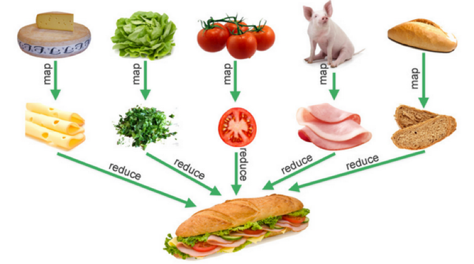

# Day 16 - Go編程模式：Map-Reduce

對於一些需要統計的業務場景來說，`Map`、`Reduce`、`Filter` 是非常通用的玩法。

## Map 例子

兩個 Map 函數，需要兩個參數：

- 一個是字符串數組 `[] string`，說明需要處理的數據是一個字符串
- 另一個是一個函數 `func(s string) string` 或 `func(s string) int`

```go
func MapStrToStr(arr []string, fn func(s string) string) []string {
    var newArray = []string{}
    for _, it := range arr {
        newArray = append(newArray, fn(it))
    }
    return newArray
}

func MapStrToInt(arr []string, fn func(s string) int) []int {
    var newArray = []int{}
    for _, it := range arr {
        newArray = append(newArray, fn(it))
    }
    return newArray
}
```
> 整個 Map 函數的運行邏輯都很相似，**函數體都是在遍歷第一個參數的數組，然後，調用第二個參數的函數，把它的值組合成另一個數組返回**。

使用 Map 函數
- 透過回調函數，賦予業務邏輯
```go
var list = []string{"Hao", "Chen", "MegaEase"}

x := MapStrToStr(list, func(s string) string {
    return strings.ToUpper(s) // 轉大寫
})
fmt.Printf("%v\n", x)
//["HAO", "CHEN", "MEGAEASE"]

y := MapStrToInt(list, func(s string) int {
    return len(s) // 求字串長度
})
fmt.Printf("%v\n", y)
//[3, 4, 8]
```

## Reduce 例子

```go
func Reduce(arr []string, fn func(s string) int) int {
    sum := 0
    for _, it := range arr {
        sum += fn(it)
    }
    return sum
}

var list = []string{"Hao", "Chen", "MegaEase"}

x := Reduce(list, func(s string) int {
    return len(s)
})
fmt.Printf("%v\n", x)
// 15
```

## Filter 例子

```go
func Filter(arr []int, fn func(n int) bool) []int {
    var newArray = []int{}
    for _, it := range arr {
        if fn(it) {
            newArray = append(newArray, it)
        }
    }
    return newArray
}

var intset = []int{1, 2, 3, 4, 5, 6, 7, 8, 9, 10}
out := Filter(intset, func(n int) bool {
   return n%2 == 1
})
fmt.Printf("%v\n", out)

out = Filter(intset, func(n int) bool {
    return n > 5
})
fmt.Printf("%v\n", out)
```

> Map-Reduce 的業務語義，可以用下面如形象表示
> 
> 


## 業務例子

從前面例子，可以觀察到 **`Map`、`Reduce`、`Filter` 只是一種控制邏輯，真正的業務邏輯是以傳給它們的數據和函數來定義的**。

## 員工訊息

下面以一個業務邏輯的代碼，來幫助理解什麼是**業務邏輯**和**控制邏輯**是解耦：

```go
type Employee struct {
    Name     string
    Age      int
    Vacation int
    Salary   int
}

var list = []Employee{
    {"Hao", 44, 0, 8000},
    {"Bob", 34, 10, 5000},
    {"Alice", 23, 5, 9000},
    {"Jack", 26, 0, 4000},
    {"Tom", 48, 9, 7500},
    {"Marry", 29, 0, 6000},
    {"Mike", 32, 8, 4000},
}
```
相關的 Reduce、Map 函數

- **EmployeeConutIf** 和 **EmployeeSumIf**：分別用於統計滿足某個條件的個數或總數。它們都是 `Filter + Reduce` 的語義
- **EmployeeFilterIn**：依某種條件過濾，就是 `Fitler` 的語義

```go
func EmployeeCountIf(list []Employee, fn func(e *Employee) bool) int {
    count := 0
    for i, _ := range list {
        if fn(&list[i]) {
            count += 1
        }
    }
    return count
}

func EmployeeFilterIn(list []Employee, fn func(e *Employee) bool) []Employee {
    var newList []Employee
    for i, _ := range list {
        if fn(&list[i]) {
            newList = append(newList, list[i])
        }
    }
    return newList
}

func EmployeeSumIf(list []Employee, fn func(e *Employee) int) int {
    var sum = 0
    for i, _ := range list {
        sum += fn(&list[i])
    }
    return sum
}
```

### 各種自定義的統計例子

1. 統計員工大於 40 歲的有多少人？
```go
old := EmployeeCountIf(list, func(e *Employee) bool {
    return e.Age > 40
})
fmt.Printf("old people: %d\n", old)
//old people: 2
```

2. 統計有多少員工薪資大於 6000？
```go
high_pay := EmployeeCountIf(list, func(e *Employee) bool {
    return e.Salary > 6000
})
fmt.Printf("High Salary people: %d\n", high_pay)
//High Salary people: 4
```

3. 列出沒有休假的員工
```go
no_vacation := EmployeeFilterIn(list, func(e *Employee) bool {
    return e.Vacation == 0
})
fmt.Printf("People no vacation: %v\n", no_vacation)
//People no vacation: [{Hao 44 0 8000} {Jack 26 0 4000} {Marry 29 0 6000}]
```

4. 統計員工薪資總和
```go
total_pay := EmployeeSumIf(list, func(e *Employee) int {
    return e.Salary
})

fmt.Printf("Total Salary: %d\n", total_pay)
//Total Salary: 43500
```

5. 統計 30 歲以下員工的薪資總和
```go
younger_pay := EmployeeSumIf(list, func(e *Employee) int {
    if e.Age < 30 {
        return e.Salary
    } 
    return 0
})
```

## 泛型 Map-Reduce

前面的 Map-Reduce 處理的數據類型都不相同，但是代碼確實類似的，這時候就可以採用泛型編程。

### 簡單版 Generic Map

先以文章提到的做法為主。使用 `interface{} + reflect` 實現。
- 利用反射獲得數據值，再通過 **vfn.Call()** 方法調用函數，通過 **[]refelct.Value{vdata.Index(i)}** 獲得數據
```go
// 不做類型檢查
func Map(data interface{}, fn interface{}) []interface{} {
    vfn := reflect.ValueOf(fn)
    vdata := reflect.ValueOf(data)
    result := make([]interface{}, vdata.Len())

    for i := 0; i < vdata.Len(); i++ {
        result[i] = vfn.Call([]reflect.Value{vdata.Index(i)})[0].Interface()
    }
    return result
}
```

接著，不同類型的數據就可以使用相同邏輯的 Map 代碼：
```go
square := func(x int) int {
  return x * x
}
nums := []int{1, 2, 3, 4}

squared_arr := Map(nums,square)
fmt.Println(squared_arr)
//[1 4 9 16]


upcase := func(s string) string {
  return strings.ToUpper(s)
}
strs := []string{"Hao", "Chen", "MegaEase"}
upstrs := Map(strs, upcase);
fmt.Println(upstrs)
//[HAO CHEN MEGAEASE]
```
> 反射是**運行時**（runtime）的事，如果類型出問題的話，就會有運行時的 panic 錯誤。
> 
> **panic: reflect: call of reflect.Value.Len on int Value**

### 健壯版 Generic Map

要去**檢查 interface{} 的類型，避免過度泛型**。

代碼重點

- 代碼中沒有使用 Map 函數，因為和數據結構有含義衝突的問題，所以使用Transform，這個來源於 C++ STL 庫中的命名
- 有兩個版本的函數，一個是返回一個全新的數組  Transform()，一個是就地完成 T ransformInPlace()
- 在主函數中，用 Kind() 方法檢查了數據類型是不是 Slice，函數類型是不是 Func
- 檢查函數的參數和返回類型是通過 verifyFuncSignature() 來完成的：
    - NumIn()：用來檢查函數的**入參**；
    - NumOut()：用來檢查函數的**返回值**。如果需要新生成一個 Slice，會使用 reflect.MakeSlice() 來完成。

```go
func Transform(slice, function interface{}) interface{} {
  return transform(slice, function, false)
}

func TransformInPlace(slice, function interface{}) interface{} {
  return transform(slice, function, true)
}

func transform(slice, function interface{}, inPlace bool) interface{} {
 
  //check the `slice` type is Slice
  sliceInType := reflect.ValueOf(slice)
  if sliceInType.Kind() != reflect.Slice {
    panic("transform: not slice")
  }

  //check the function signature
  fn := reflect.ValueOf(function)
  elemType := sliceInType.Type().Elem()
  if !verifyFuncSignature(fn, elemType, nil) {
    panic("trasform: function must be of type func(" + sliceInType.Type().Elem().String() + ") outputElemType")
  }

  sliceOutType := sliceInType
  if !inPlace {
    sliceOutType = reflect.MakeSlice(reflect.SliceOf(fn.Type().Out(0)), sliceInType.Len(), sliceInType.Len())
  }
  for i := 0; i < sliceInType.Len(); i++ {
    sliceOutType.Index(i).Set(fn.Call([]reflect.Value{sliceInType.Index(i)})[0])
  }
  return sliceOutType.Interface()

}

func verifyFuncSignature(fn reflect.Value, types ...reflect.Type) bool {

  //Check it is a funciton
  if fn.Kind() != reflect.Func {
    return false
  }
  // NumIn() - returns a function type's input parameter count.
  // NumOut() - returns a function type's output parameter count.
  if (fn.Type().NumIn() != len(types)-1) || (fn.Type().NumOut() != 1) {
    return false
  }
  // In() - returns the type of a function type's i'th input parameter.
  for i := 0; i < len(types)-1; i++ {
    if fn.Type().In(i) != types[i] {
      return false
    }
  }
  // Out() - returns the type of a function type's i'th output parameter.
  outType := types[len(types)-1]
  if outType != nil && fn.Type().Out(0) != outType {
    return false
  }
  return true
}
```

#### 各種泛型例子

1. 字符串數據

```go
list := []string{"1", "2", "3", "4", "5", "6"}
result := Transform(list, func(a string) string{
    return a +a +a
})
//{"111","222","333","444","555","666"}
```

2. 整形數組

```go
list := []int{1, 2, 3, 4, 5, 6, 7, 8, 9}
TransformInPlace(list, func (a int) int {
  return a*3
})
//{3, 6, 9, 12, 15, 18, 21, 24, 27}
```

3. 結構體

```go
var list = []Employee{
    {"Hao", 44, 0, 8000},
    {"Bob", 34, 10, 5000},
    {"Alice", 23, 5, 9000},
    {"Jack", 26, 0, 4000},
    {"Tom", 48, 9, 7500},
}

result := TransformInPlace(list, func(e Employee) Employee {
    e.Salary += 1000
    e.Age += 1
    return e
})
```

### 健壮版 Generic Reduce

```go
func Reduce(slice, pairFunc, zero interface{}) interface{} {
  sliceInType := reflect.ValueOf(slice)
  if sliceInType.Kind() != reflect.Slice {
    panic("reduce: wrong type, not slice")
  }

  len := sliceInType.Len()
  if len == 0 {
    return zero
  } else if len == 1 {
    return sliceInType.Index(0)
  }

  elemType := sliceInType.Type().Elem()
  fn := reflect.ValueOf(pairFunc)
  if !verifyFuncSignature(fn, elemType, elemType, elemType) {
    t := elemType.String()
    panic("reduce: function must be of type func(" + t + ", " + t + ") " + t)
  }

  var ins [2]reflect.Value
  ins[0] = sliceInType.Index(0)
  ins[1] = sliceInType.Index(1)
  out := fn.Call(ins[:])[0]

  for i := 2; i < len; i++ {
    ins[0] = out
    ins[1] = sliceInType.Index(i)
    out = fn.Call(ins[:])[0]
  }
  return out.Interface()
}
```

### 健壯版 Generic Filter

```go
func Filter(slice, function interface{}) interface{} {
  result, _ := filter(slice, function, false)
  return result
}

func FilterInPlace(slicePtr, function interface{}) {
  in := reflect.ValueOf(slicePtr)
  if in.Kind() != reflect.Ptr {
    panic("FilterInPlace: wrong type, " +
      "not a pointer to slice")
  }
  _, n := filter(in.Elem().Interface(), function, true)
  in.Elem().SetLen(n)
}

var boolType = reflect.ValueOf(true).Type()

func filter(slice, function interface{}, inPlace bool) (interface{}, int) {

  sliceInType := reflect.ValueOf(slice)
  if sliceInType.Kind() != reflect.Slice {
    panic("filter: wrong type, not a slice")
  }

  fn := reflect.ValueOf(function)
  elemType := sliceInType.Type().Elem()
  if !verifyFuncSignature(fn, elemType, boolType) {
    panic("filter: function must be of type func(" + elemType.String() + ") bool")
  }

  var which []int
  for i := 0; i < sliceInType.Len(); i++ {
    if fn.Call([]reflect.Value{sliceInType.Index(i)})[0].Bool() {
      which = append(which, i)
    }
  }

  out := sliceInType

  if !inPlace {
    out = reflect.MakeSlice(sliceInType.Type(), len(which), len(which))
  }
  for i := range which {
    out.Index(i).Set(sliceInType.Index(which[i]))
  }

  return out.Interface(), len(which)
}
```

## 小結

- **使用反射的代碼性能會很差**。所以，上面的代碼不能用在需要高性能的地方
- 前面示例代碼大量參考了 [Rob Pike 的代碼版本](https://github.com/robpike/filter)
- **Map-Reduce 在數據處理的時候還是很有用的**，但是在業務邏輯處理上，效果就不明顯了，使用到反射，還會影響到運作性能

此文章為3月Day16學習筆記，內容來源於極客時間[《左耳聽風》](https://time.geekbang.org/column/article/332606)