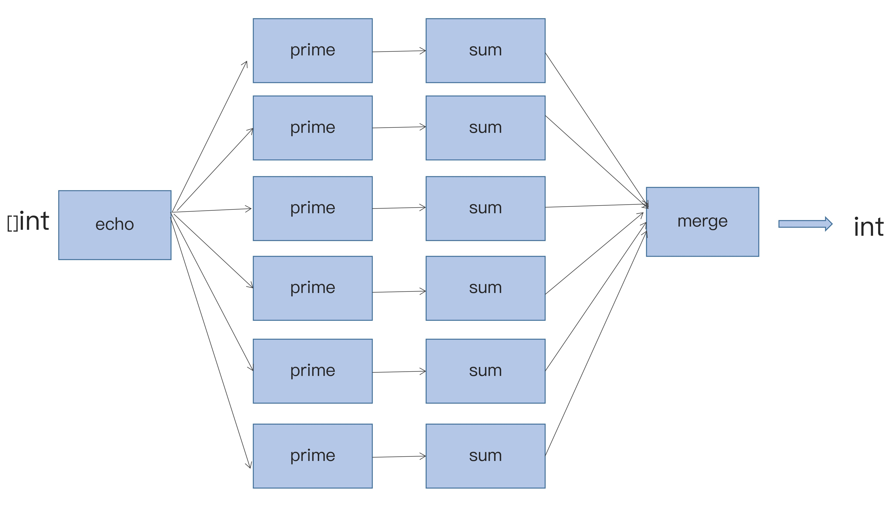

# Day 19 - Go編程模式：Pipeline

它是一種把各種命令拼接起來完成一個更強功能的技術方法。用過 **Unix/Linux 命令行**的人都不會陌生。

`Pipeline` 可以很容易地把代碼按單一職責的原則拆分成多個高內聚低耦合的小模塊，然後輕鬆地把它們拼裝起來，去完成比較複雜的功能。

## HTTP 處理

以上篇提到的 HTTP 例子而言，  `WithServerHead()` 、`WithBasicAuth()`、`WithDebugLog()` 這樣的小功能代碼，在需要實現某個 HTTP API 的時候，把它們組織起來即可。
```go
http.HandleFunc("/v1/hello", WithServerHeader(WithAuthCookie(hello)))
http.HandleFunc("/v2/hello", WithServerHeader(WithBasicAuth(hello)))
http.HandleFunc("/v3/hello", WithServerHeader(WithBasicAuth(WithDebugLog(hello))))
```
但是，通過一個代理函數就可以解除層層嵌套的情況，如下：
```go
// 代理函數
type HttpHandlerDecorator func(http.HandlerFunc) http.HandlerFunc
func Handler(h http.HandlerFunc, decors ...HttpHandlerDecorator) http.HandlerFunc {
    for i := range decors {
        d := decors[len(decors)-1-i] // iterate in reverse
        h = d(h)
    }
    return h
}
```
```go
http.HandleFunc("/v4/hello", Handler(hello,
                WithServerHeader, WithBasicAuth, WithDebugLog))
```

## Channel 管理

Rob Pike 在 [Go Concurrency Patterns: Pipelines and cancellation](https://go.dev/blog/pipelines) 這篇博客中介紹了一種編程模式：

### Channel 轉發函數

需要一個 echo()函數，它會把一個整型數組放到一個 Channel 中，並返回這個 Channel。

```go
func echo(nums []int) <-chan int {
  out := make(chan int)
  go func() {
    for _, n := range nums {
      out <- n
    }
    close(out)
  }()
  return out
}
```

接著，依照這個模式，即可產出以下函數例子：

### 平方函數

```go
func sq(in <-chan int) <-chan int {
  out := make(chan int)
  go func() {
    for n := range in {
      out <- n * n
    }
    close(out)
  }()
  return out
}
```

### 過濾奇數函數
```go
func odd(in <-chan int) <-chan int {
  out := make(chan int)
  go func() {
    for n := range in {
      if n%2 != 0 {
        out <- n
      }
    }
    close(out)
  }()
  return out
}
```

### 求和函數

```go
func sum(in <-chan int) <-chan int {
  out := make(chan int)
  go func() {
    var sum = 0
    for n := range in {
      sum += n
    }
    out <- sum
    close(out)
  }()
  return out
}
```

sum()，odd() 和 sq() 太過於相似，其實這邊也可以用 `Map/Reduce` 編程模式或者是 `Go Generation` 的方式合併一下。

```go
var nums = []int{1, 2, 3, 4, 5, 6, 7, 8, 9, 10}
for n := range sum(sq(odd(echo(nums)))) {
  fmt.Println(n)
}
```

上面的代碼類似於我們執行了 Unix/Linux 命令： `echo $nums | sq | sum`。

如同前面說到，可以借用一個代理函數，解決多層嵌套問題
```go
type EchoFunc func ([]int) (<- chan int) 
type PipeFunc func (<- chan int) (<- chan int) 

func pipeline(nums []int, echo EchoFunc, pipeFns ... PipeFunc) <- chan int {
  ch  := echo(nums)
  for i := range pipeFns {
    ch = pipeFns[i](ch)
  }
  return ch
}
```
```go
// Pipeline result
var nums = []int{1, 2, 3, 4, 5, 6, 7, 8, 9, 10}    
for n := range pipeline(nums, gen, odd, sq, sum) {
    fmt.Println(n)
  }
```

## Fan in/out

使用 Channel 還有一個好處，就是可以寫出 1 對多，或多對 1 的 Pipeline，也就是 Fan In/ Fan Out。

Fan in 例子如下：
```go
// main 函數
func makeRange(min, max int) []int {
  a := make([]int, max-min+1)
  for i := range a {
    a[i] = min + i
  }
  return a
}

func main() {
  nums := makeRange(1, 10000)
  in := echo(nums)

  const nProcess = 5
  var chans [nProcess]<-chan int
  for i := range chans {
    chans[i] = sum(prime(in))
  }

  for n := range sum(merge(chans[:])) {
    fmt.Println(n)
  }
}
---
// Prime 函數
func is_prime(value int) bool {
  for i := 2; i <= int(math.Floor(float64(value) / 2)); i++ {
    if value%i == 0 {
      return false
    }
  }
  return value > 1
}

func prime(in <-chan int) <-chan int {
  out := make(chan int)
  go func ()  {
    for n := range in {
      if is_prime(n) {
        out <- n
      }
    }
    close(out)
  }()
  return out
}
---
// merge 函數
func merge(cs []<-chan int) <-chan int {
  var wg sync.WaitGroup
  out := make(chan int)

  wg.Add(len(cs))
  for _, c := range cs {
    go func(c <-chan int) {
      for n := range c {
        out <- n
      }
      wg.Done()
    }(c)
  }
  go func() {
    wg.Wait()
    close(out)
  }()
  return out
}
```

上述代碼流程為：
- 首先，製造了從 1 到 10000 的數組
- 把這堆數組全部 echo 到一個 Channel 里（fan in）
- 此時，生成 5 個 Channel，接著都調用 sum(prime(in)) ，於是，每個 Sum 的 goroutine 都會開始計算和
- 最後，再把所有的結果再求和拼起來，得到最終的結果

程序結構示意圖：



## 參考文檔

- [Go Concurrency Patterns – Rob Pike – 2012 Google I/O presents the basics of Go‘s concurrency primitives and several ways to apply them.](https://www.youtube.com/watch?v=f6kdp27TYZs)
- [Advanced Go Concurrency Patterns – Rob Pike – 2013 Google I/O](https://go.dev/blog/io2013-talk-concurrency)
- [Squinting at Power Series – Douglas McIlroy’s paper](https://swtch.com/~rsc/thread/squint.pdf)


此文章為3月Day19學習筆記，內容來源於極客時間[《左耳聽風》](https://time.geekbang.org/column/article/332610)