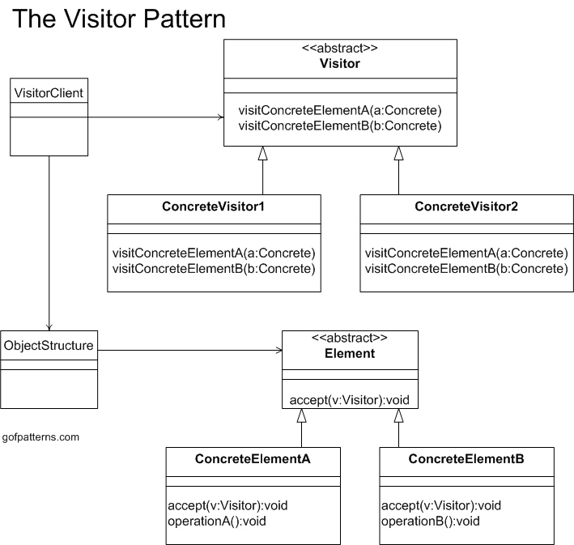

# Day 20 - Go編程模式：Kubernetes Visitor模式

探討 Kubernetes 的 kubectl 使用到的編程模式： Vistor
> 但其實有兩個：Visitor 和 Builder

**Visitor 模式是面向對象設計模式中一個設計模式，是將算法與操作對象的數據結構分離的一種方法**。這種分離的結果是能夠在不修改結構情況下，向現有的對象結構加入新操作，為遵循 OCP 原則（開閉原則）的一種方法。

其 UML 圖如下



## 簡單示例

- 代碼中有一個 `Visitor` 函數定義和一個 `Shape` 接口，需要使用 `Visitor` 函數作為參數
- 實例對象 `Circle` 和 `Rectangle` 實現了接口 `Shape` 的 `accept()` 方法，會傳遞一個 Visitor
```go
package main

import (
    "encoding/json"
    "encoding/xml"
    "fmt"
)

type Visitor func(shape Shape)

type Shape interface {
    accept(Visitor)
}

type Circle struct {
    Radius int
}

func (c Circle) accept(v Visitor) {
    v(c)
}

type Rectangle struct {
    Width, Heigh int
}

func (r Rectangle) accept(v Visitor) {
    v(r)
}
```
接著，實現兩個 Visitor：
- 一個為 JSON 序列化
- 一個為 XML 序列化
```go
func JsonVisitor(shape Shape) {
    bytes, err := json.Marshal(shape)
    if err != nil {
        panic(err)
    }
    fmt.Println(string(bytes))
}

func XmlVisitor(shape Shape) {
    bytes, err := xml.Marshal(shape)
    if err != nil {
        panic(err)
    }
    fmt.Println(string(bytes))
}
```
使用 Visitor 模式代碼，如下：
```go
func main() {
  c := Circle{10}
  r :=  Rectangle{100, 200}
  shapes := []Shape{c, r}

  for _, s := range shapes {
    s.accept(JsonVisitor)
    s.accept(XmlVisitor)
  }

}
```
**目的為解耦數據結構和算法**，也是可以採用其他模式解決此問題，如 Strategy 模式。但**在有些情況，多個 Visitor 是來訪問一個數據結構的不同部分**，如前面提到的 `kubectl` 。（類似數據結構像數據庫，各個 Visitor 為一個小應用）

## Kubernetes 相關背景

* Kubernetes 抽象了很多種的 Resource，比如 Pod、ReplicaSet、ConfigMap、Volumes、Namespace、Roles……種類非常繁多，這些東西構成了 Kubernetes 的數據模型（你可以看看 [Kubernetes Resources 地圖](https://github.com/kubernauts/practical-kubernetes-problems/blob/master/images/k8s-resources-map.png)，瞭解下有多複雜）
* `kubectl` 是 Kubernetes 中的一個客戶端命令，操作人員用這個命令來操作 Kubernetes。kubectl 會聯繫到 Kubernetes 的 API Server，API Server 會聯繫每個節點上的 `kubelet`，從而控制每個節點
* `kubectl` 的主要工作是處理用戶提交的東西（包括命令行參數、YAML 文件等），接著會把用戶提交的這些東西組織成一個數據結構體，發送給 API Server
* 相關的源代碼在 [`src/k8s.io/cli-runtime/pkg/resource/visitor.go`](https://github.com/kubernetes/kubernetes/blob/cea1d4e20b4a7886d8ff65f34c6d4f95efcb4742/staging/src/k8s.io/cli-runtime/pkg/resource/visitor.go)

kubectl 基本原理，為它**從命令行和 YAML 文件中獲取訊息，通過 Builder 模式把其轉成一系列的資源，最後用 Visitor 模式來迭代處理這些資源（Resources）**。

## kubectl 實現方法

### Visitor 模式實現

kubectl 主要是用來處理 `Info` 結構體，定義如下：
```go
type VisitorFunc func(*Info, error) error

type Visitor interface {
    Visit(VisitorFunc) error
}

type Info struct {
    Namespace   string
    Name        string
    OtherThings string
}
func (info *Info) Visit(fn VisitorFunc) error {
  return fn(info, nil)
}
```
* 有一個 `VisitorFunc` 的函數類型的定義
* 一個 `Visitor` 的接口，其中需要 `Visit(VisitorFunc) error` 的方法（這就像是我們上面那個例子的 `Shape` ）
* 最後，為 `Info` 實現 `Visitor` 接口中的 `Visit()` 方法，實現就是直接調用傳進來的方法（與前面的例子相仿）

### Name Visitor

主要用來訪問 `Info` 結構體中的 `Name` 和 `Namespace`。
```go 
type NameVisitor struct {
  visitor Visitor
}

func (v NameVisitor) Visit(fn VisitorFunc) error {
  return v.visitor.Visit(func(info *Info, err error) error {
    fmt.Println("NameVisitor() before call function")
    err = fn(info, err)
    if err == nil {
      fmt.Printf("==> Name=%s, NameSpace=%s\n", info.Name, info.Namespace)
    }
    fmt.Println("NameVisitor() after call function")
    return err
  })
}
```
- 聲明了 NameVisitor 結構體，裡面有 Visitor 接口，意味著多態
- 實現 Visit() 方法，其調用了自己結構體內的 Visitor 的 Visitor() 方法，為一種修飾器模式，用另一個 Vistor 修飾自己

### Other Vistor

主要用來訪問 `Info` 結構體中的 OtherThing。
```go
type OtherThingsVisitor struct {
  visitor Visitor
}

func (v OtherThingsVisitor) Visit(fn VisitorFunc) error {
  return v.visitor.Visit(func(info *Info, err error) error {
    fmt.Println("OtherThingsVisitor() before call function")
    err = fn(info, err)
    if err == nil {
      fmt.Printf("==> OtherThings=%s\n", info.OtherThings)
    }
    fmt.Println("OtherThingsVisitor() after call function")
    return err
  })
}
```

### Log Visitor

```go
type LogVisitor struct {
  visitor Visitor
}

func (v LogVisitor) Visit(fn VisitorFunc) error {
  return v.visitor.Visit(func(info *Info, err error) error {
    fmt.Println("LogVisitor() before call function")
    err = fn(info, err)
    fmt.Println("LogVisitor() after call function")
    return err
  })
}
```

## Client 代碼使用

使用前面提到的方法來構建應用。

```go
func main() {
  info := Info{}
  var v Visitor = &info
  v = LogVisitor{v}
  v = NameVisitor{v}
  v = OtherThingsVisitor{v}

  loadFile := func(info *Info, err error) error {
    info.Name = "Hao Chen"
    info.Namespace = "MegaEase"
    info.OtherThings = "We are running as remote team."
    return nil
  }
  v.Visit(loadFile)
}
---
// output
LogVisitor() before call function
NameVisitor() before call function
OtherThingsVisitor() before call function
==> OtherThings=We are running as remote team.
OtherThingsVisitor() after call function
==> Name=Hao Chen, NameSpace=MegaEase
NameVisitor() after call function
LogVisitor() after call function
```

可以觀察到
- loadFile 模擬讀取檔案
- v.Visit(loadFile)，啟動工作
- Visitor 層層套下來

client 代碼實現了：
- 解耦數據和對代碼
- 使用修飾器模式
- 還使用了 Pipeline 模式

## Visitor 修飾器

使用修飾器模式重構上面示例代碼
```go
type DecoratedVisitor struct {
  visitor    Visitor
  decorators []VisitorFunc
}

func NewDecoratedVisitor(v Visitor, fn ...VisitorFunc) Visitor {
  if len(fn) == 0 {
    return v
  }
  return DecoratedVisitor{v, fn}
}

// Visit implements Visitor
func (v DecoratedVisitor) Visit(fn VisitorFunc) error {
  return v.visitor.Visit(func(info *Info, err error) error {
    if err != nil {
      return err
    }
    if err := fn(info, nil); err != nil {
      return err
    }
    for i := range v.decorators {
      if err := v.decorators[i](info, nil); err != nil {
        return err
      }
    }
    return nil
  })
}
```
> 這個其實稱為 **DecoratedVistor**，其包含一個 Visitor 和一些 decorators(VisitorFunc)，當執行 `Visit()` 方法時候，會照順序執行 全部 decorators。

client 代碼修改為：
```go
info := &Info{}
NameVisitor := func() VisitorFunc {
	return func(info *Info, err error) error {
		fmt.Println("NameVisitor() before call function")
		fmt.Println("NameVisitor() after call function")
		return nil
	}
}
NameVisitor1 := func(info *Info, err error) error {
		fmt.Println("NameVisitor1() before call function")
		fmt.Println("NameVisitor1() after call function")
		return nil
	}
}
v = NewDecoratedVisitor(v, NameVisitor(), NameVisitor1)

v.Visit(LoadFile)
```
> 雖然都可以 work，但 `NameVisitor1` 較為符合修飾器模式用法。

此文章為3月Day20學習筆記，內容來源於極客時間[《左耳聽風》](https://time.geekbang.org/column/article/332612)