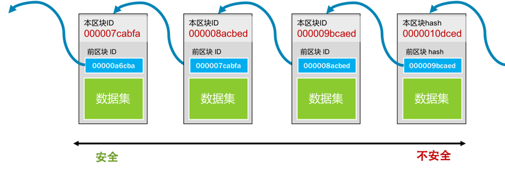

# 區塊鏈技術本質

## 關鍵問題

1. 為什麼區塊鏈技術會成為熱點技術？它解決了什麼問題？
2. 區塊鏈（blockchain）究竟是個什麼技術？這裡，我會帶你抽絲剝繭看看區塊鏈技術，看看區塊鏈是如何做到不可篡改的。同時，我還會解釋什麼是「挖礦」，以及為什麼要 " 挖礦 "，全是技術乾貨。
3. 去中心意味著沒有一個公司，沒有公司就意味著沒有服務器，沒有服務器的軟件是怎樣提供服務的？這裡主要會講一下無中心化的系統是怎麼運作的，是怎麼達成一致的？
4. 智能合約是個什麼鬼？它有什麼意思？
5. 簡單地談一談金融，你可以自行思考一下，區塊鏈虛擬貨幣是否有可能取代現有的金融服務？並重組整個社會架構？

## 區塊鏈技術

區塊鏈技術是一種分散式、去中心化的數據庫技術，它的本質是通過**加密算法和共識機制**，實現了一個公開、透明、不可篡改的數據資料庫，其中的數據被存儲在多個節點上，每個節點都具有相同的數據副本。區塊鏈技術的核心概念是**區塊**，每個區塊包含了一定時間內的交易數據以及前一個區塊的哈希值，通過不斷地將新的區塊添加到區塊鏈中，形成了一個不斷增長的鏈式數據結構，這樣的設計使得區塊鏈上的數據具有高度的可信度、安全性和可靠性。區塊鏈技術被廣泛應用於加密貨幣、金融、供應鏈管理、物聯網等領域，以實現更高效、更安全、更可信的數據交換和管理。

* 每個塊的 ID 都是通過其內容生成的，生成 ID 的內容中還包括上一個塊的 ID。
* 越舊的區塊的篡改會造成越大面積的修改，於是越舊的區塊就不容易篡改，就越安全。反之，越新的區塊就越不安全。

而真正讓區塊鏈做到非常難篡改的是工作量證明的共識機制。

區塊鏈的本質主要是:

1. 分散式記錄本（帳本）

區塊鏈是一種分散式金鑰加密的交易紀錄本。資料儲存在全球眾多節點的分佈式鏈接清單中。這保證了交易記錄的不可變性和完整性。
> 在去中心化的網絡下，我們只能認為，大多數人認識的數據是對的。

2. 共享真相

交易紀錄被所有節點共用，它產生了一種所有節點都同意的共享真相。不同於傳統需信任中央機構的方式。

3. 通過加密和計算實現信任

**節點通過密碼學手段來驗證交易，利用計算力來形成共識**。這消除了信任中央機構或單一實體的需求。
> 極度消耗計算力的方式來提高成本，從而有效地遏制或解決下面幾個問題：
> 1. 修改幾乎變得不可能
> 2. 能掌握 51% 的算力的人變得幾乎不可能
> 3. 解決分歧(多個合法帳本）

4. 永久記錄，不可逆

已經記錄進鏈的交易很難或者不可能被修改或擦除。這保證了交易的透明性和永久有效性。

5. 自我製衡

區塊鏈節點之間沒有中央管理，但各節點的計算為區塊鏈提供了結構完整性和自我製衡能力。

區塊鏈的核心價值在於通過加密技術和分佈式數據共享創建出信任機制。也正是這種信任機制，使得不需要第三方中介機構也能建立有效的交易和資產轉移。

## 工作量證明共識機制

比特幣使用了 Proof-of-Work 工作量證明機制，也就是**挖礦**。所謂的挖礦其實就是用**大規模的計算來找到一個符合系統要求的區塊 ID**。要找到符合條件的區塊 ID 只能通過暴力窮舉的方式，所以要付出大量的系統計算資源和電力。

文章 5 月 Day16 學習筆記，內容來源於極客時間 [《左耳聽風》](http://gk.link/a/123CH)