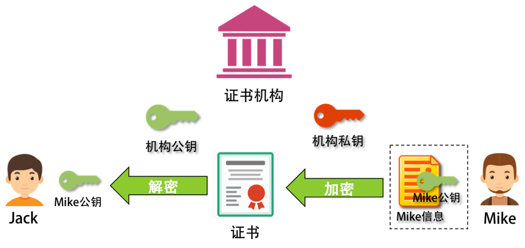
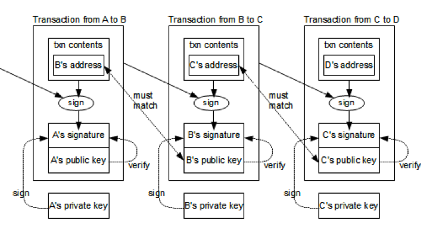

# 區塊鏈技術：加密和挖礦

加密(Encryption): 區塊鏈使用複雜的加密算法保護數據安全。所有交易記錄和數據都使用加密算法進行加密， 只有通過密鑰才能解密。這保證了區塊鏈的數據完整性和安全性。主要使用的加密算法包括 AES、RSA 等。
挖礦(Mining): 對於區塊鏈來說，挖礦是驗證和添加新區塊的過程。當有新交易需要完成時， 就會觸發挖礦過程。參與挖礦的節點會通過計算密集型演算法嘗試找到一個難讀的哈希值， 當找到後就可以將交易打包進新區塊並加入區塊鏈。做出貢獻越多的節點， 獲得的挖礦報酬也越高。

## 密鑰對 / 簽名 / 憑證
### 密鑰對
密鑰對 (key pairs) 是加密的基礎， 是公鑰加密的重要組成部分。

密鑰對由通過非對稱加密演算法 (如 RSA、ECDSA 等)， 根據一組參數計算出一對公開密鑰(public key) 和私人密鑰 (private key) 組成。

兩個密鑰的作用是:
* 公開密鑰: 用來加密訊息。任何人都可以得到這個公開密鑰， 然後使用這個公開密鑰對訊息進行加密。
* 私人密鑰: 用來解密被公開密鑰加密過的訊息。只有私人密鑰的擁有者才可以取得這個私人密鑰， 然後使用它來解密被公開密鑰加密過的訊息。

這樣一來， 就達到了公開密鑰加密的效果:
* 任何人都可以取得公開密鑰來加密訊息
* 但是只有私人密鑰的擁有者才能解密這個訊息

下圖為基本密鑰對流程：
* 缺點沒有身份驗證

下圖加入身份驗證(簽名)：


下圖為第三方公證憑證驗證：


### 簽名

數字簽名 (Signature) 是公鑰加密的一個重要應用， 用來驗證消息的完整性與來源。

數字簽名運作的方式:

1. 用訊息產生雜湊值 - 使用雜湊演算法 (如 SHA256) 計算訊息的雜湊值
2. 用私鑰加密雜湊值 - 使用私鑰對雜湊值進行加密， 產生一個簽名值
3. 傳送訊息和簽名 - 將訊息和簽名一起傳送給接收者
4. 接收者取得公鑰 - 接收者獲得發送者的公鑰
5. 解密簽名並比對雜湊值 - 使用發送者的公鑰對簽名解密， 獲得原始的雜湊值。接收者同時對訊息計算雜湊值， 比對兩個雜湊值是否一致
6. 驗證簽名 - 如果兩個雜湊值相同， 則代表訊息完整且確實來自發送者

數字簽名的特性:

- 簽名僅使用私鑰生成， 可保證訊息的完整性 (內容是否有誤) 和可靠性(確實來自簽名者)
- 簽名也可以防止否認， 因為只有私鑰的擁有者才能生成簽名
- 公鑰加密技術的安全基礎， 是公鑰與私鑰之間的數學關係

## 比特幣加密

下圖為一個交易鏈流程(圖片來源：Ken Shirriff Blog)，這個交易鏈的錢從 A -> B -> C -> D，一共 3 筆交易：


* 發起交易：我們從第一筆交易可以看到，A 用自己的私鑰為交易信息和自己的地址生成了交易的簽名，然後把交易信息、自己的地址、交易簽名和自己的公鑰放出去，這樣方便別人來驗證的確是 A 發起的。
* 驗證交易：在驗證時，使用 A 的公鑰解密交易簽名，得到交易的 hash 值。把交易信息和自己的地址做 hash，看看是不是和簽名解密後的 hash 值一致。
> 當一個用戶想要轉移比特幣時，會生成一個交易，該交易需要簽名。用戶使用私鑰對交易進行ECDSA簽名後，發送到區塊鏈網路。
其他節點接收到交易後，使用公鑰驗證交易的合法性。挖礦者則嘗試解決難題，找到合法的區塊，從而獲得比特幣報酬。
> 
> 比特幣的地址是由公鑰生成的，生成規則比較複雜，可以參看 Bitcoin 的 Wiki 頁 - [Technical background of version 1 Bitcoin addresses](https://en.bitcoin.it/wiki/Technical_background_of_version_1_Bitcoin_addresses)。

## 比特幣挖礦

比特幣區塊 hash 算法，要滿足下面公式
```
SHA-256(SHA-256 (Block Header)) < Target
```

比特幣的挖礦需要解決困難的雜湊難題，具體運作如下:

1. 比特幣區塊鏈需要不斷產生新的區塊，記錄最新的交易。
2. 挖礦者通過計算，不斷嘗試尋找難以預測的雜湊值。 
3. 當挖礦者找到符合難題規定的雜湊值時，他就成功挖掘出一個新的區塊。
4. 他可以在新區塊中記錄最新一組交易，然後加入區塊鏈。
5. 作爲獎勵，他會獲得目前設定的比特幣金額。

比特幣挖礦的主要特點:

- 使用 SHA-256 算法生成雜湊值
- 難題難度不斷調節，保持每10分鐘生成一個新區塊
- 挖礦難度越高，解決難題需要的計算力就越大
- 挖礦獎勵是動態調整的，每4年減半一次

> 比特幣挖礦需要大量計算資源和電力，這使它的可擴展性和能效成為議題。


文章 5 月 Day18 學習筆記，內容來源於極客時間 [《左耳聽風》](https://time.geekbang.org/column/article/5438)
