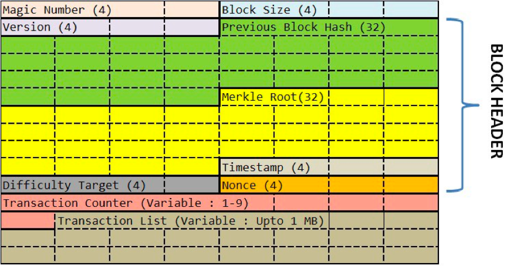

# 區塊鏈技術：哈希算法

哈希算法是一個重要的主題，它在密碼學和區塊鏈技術中都有廣泛應用。

介紹哈希算法:

- 哈希算法是一種單向算法，它接受任何長度的數據作為輸入，並輸出固定長度的哈希值。

- 哈希算法具有各數據輸入生成唯一哈希值的屬性，而且無法從哈希值反向計算輸入數據。

- 常見的哈希算法包括MD5、SHA-1、SHA-256等。它們主要做的是:
  - 數據壓縮:將任意長度輸入壓縮至固定長度輸出。
  - 混淆:消除輸入數據的任何可辨識特徵。
  - 一致性:相同輸入總得出相同輸出。 
  - 不可逆:無法從輸出推斷輸入。

## 比特幣的哈希算法

下圖為區塊鏈的協議格式：

* Version：當前區塊鏈協議的版本號，4 個字節。如果升級了，這個版本號會變。
* Previous Block Hash：前面那個區塊的 hash 地址。32 個字節。
* Merkle Root：這個字段可以簡單理解為是後面交易信息的 hash 值（後面具體說明一下） 。32 個字節。
* Timestamp：區塊生成的時間。這個時間不能早於前面 11 個區塊的中位時間，不能晚於 " 網絡協調時間 "——你所連接的所有結點時間的中位數。4 個字節。
* Bits：也就是上圖中的 Difficulty Tagrget，表明瞭當前的 hash 生成的難度（後面會說）。4 個字節。
* Nonce：一個隨機值，用於找到滿足某個條件的 hash 值。4 字節。

## 區塊鏈中哈希算法的應用

- 哈希值用於生成塊的ID，以標識數據塊，作為塊鏈接時的參考。

- 新的區塊總是基於前一個區塊的哈希值生成，這樣就形成了鏈接的鏈式結構。

- 每個 participant 都可以使用相同的哈希算法驗證數據塊、交易是否被篡改。如果哈希值不匹配，說明數據已被修改。

- 對哈希值進行數字簽名可以證明數據來自特定participant，防止欺詐。

- 哈希算法的單向性、不可逆性確保了區塊鏈的不可篡改性。

文章 5 月 Day17 學習筆記，內容來源於極客時間 [《左耳聽風》](http://gk.link/a/123CH)
