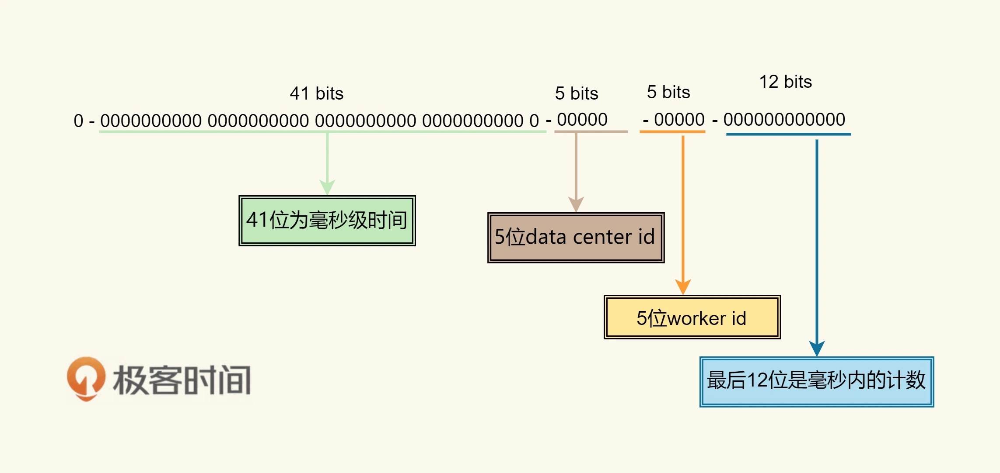
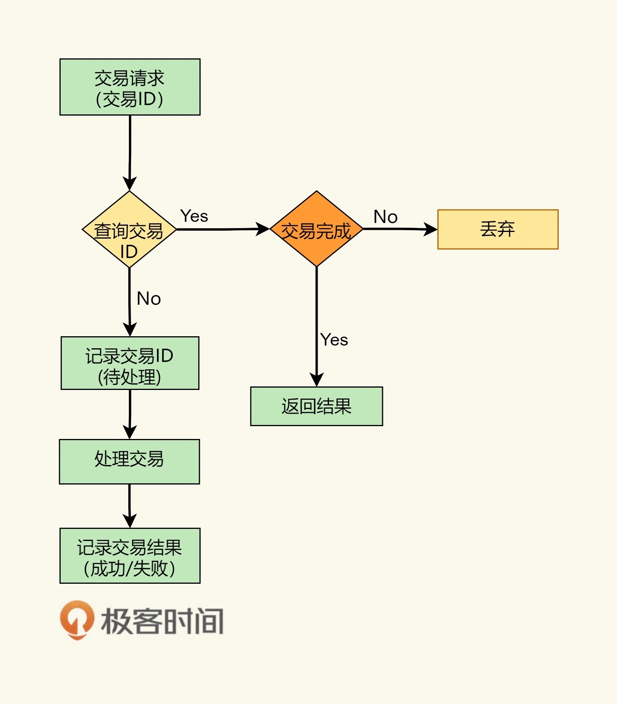

# 彈力設計篇之冪等性設計

冪等性設計，就是說，**一次和多次請求某一個資源應該具有同樣副作用**。用數學的語言來表達就是：f(x) = f(f(x))，如絕對值函數：abs(x) = abs(abs(x))。

把系統解耦隔離後，服務間的調用可能會有三個狀態，一個是**成功（Success）**，一個是**失敗（Failed）**，一個是**超時（Timeout）**。前兩者都是明確的狀態，而超時則是完全不知道是什麼狀態。

然而超時狀態，可能會因為調用方重試，導致系統帶來不一樣的副作用。

一般情況下，會有兩種處理方式：

- 一種是**需要下游系統提供相應的查詢接口**。上游系統在 timeout 後去查詢一下，處理重試結果是成功還是失敗。
- 另一種是**通過冪等性接口的方式**。也就是說，把這個查詢操作交給下游系統，我上游系統只管重試，下游系統保證一次和多次的請求結果是一樣的。

## 全局 ID

Twitter 的開源項目 Snowflake，一個分佈式 ID 的生成算法。

* 41bits 作為毫秒數。大概可以用 69.7 年。
* 10bits 作為機器編號（5bits 是數據中心，5bits 的機器 ID），支持 1024 個實例。
* 12bits 作為毫秒內的序列號。一毫秒可以生成 4096 個序號。

## 處理流程

就是**需要一個存儲來記錄收到的交易**。收到交易請求，就會去存儲中查詢，查到返回，沒查到記錄下來。

**最好是當這個存儲出現衝突的時候會報錯**。如，數據庫中可以使用 `insert into … values … on DUPLICATE KEY UPDATE … `這樣的操作。

對於更新的場景來說，如果只是狀態更新，可以使用如下的方式：

- 如果出錯，要麼是非法操作，要麼是已被更新，要麼是狀態不對
- 多次調用是不會有副作用的。如數據庫指令 `update table set status = “paid” where id = xxx and status = “unpaid”;`

> 其他方式還有 MVCC 通過使用版本號等等，這些都不標準，我們希望我們有一個**標準方式**來做這個事，**最好還是用一個 ID**

**可以使用關係型數據庫，或是 key-value 的 NoSQL（如 MongoDB）來構建這個存儲系統**。

## HTTP 的冪等性

* HTTP GET 方法用於獲取資源，不應有副作用，所以是冪等的。
* HTTP HEAD 和 GET 本質是一樣的，區別在於 HEAD 不含有呈現數據，而僅僅是 HTTP 頭信息，不應有副作用，也是冪等的。
* HTTP OPTIONS 主要用於獲取當前 URL 所支持的方法，所以也是冪等的。
* HTTP DELETE 方法用於刪除資源，有副作用，但它應該滿足冪等性。
* HTTP POST 方法用於創建資源，所對應的 URI 並非創建的資源本身，而是去執行創建動作的操作者，有副作用，不滿足冪等性。
* HTTP PUT 方法用於創建或更新操作，所對應的 URI 是要創建或更新的資源本身，有副作用，它應該滿足冪等性。

一般的幂等性的设计如下：

* 首先，在表單中需要隱藏一個 token，這個 token 可以是前端生成的一個唯一的 ID。用於防止用戶多次點擊了表單提交按鈕，而導致後端收到了多次請求，卻不能分辨是否是重復的提交。**這個 token 是表單的唯一標識**。（這種情況其實是通過前端生成 ID 把 POST 變成了 PUT。）
* 當用戶點擊提交後，後端會把用戶提交的數據和這個 token 保存在數據庫中。如果有重復提交，那麼**數據庫中的 token 會做排它限制，從而做到冪等性。**
* 更為穩妥的做法是，後端成功後向前端返回 302 跳轉，把用戶的前端頁跳轉到 GET 請求，把剛剛 POST 的數據給展示出來。如果是 Web 上的最好還把之前的表單設置成過期，這樣用戶不能通過瀏覽器後退按鈕來重新提交。這個模式又叫做 [PRG 模式](https://en.wikipedia.org/wiki/Post/Redirect/Get)（Post/Redirect/Get）。

文章 4 月 Day27 學習筆記，內容來源於極客時間 [《左耳聽風》](https://time.geekbang.org/column/article/3926)