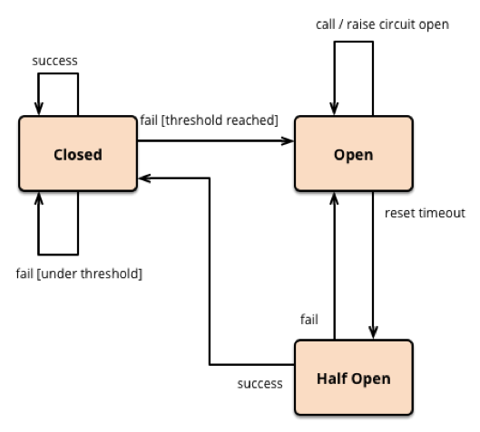
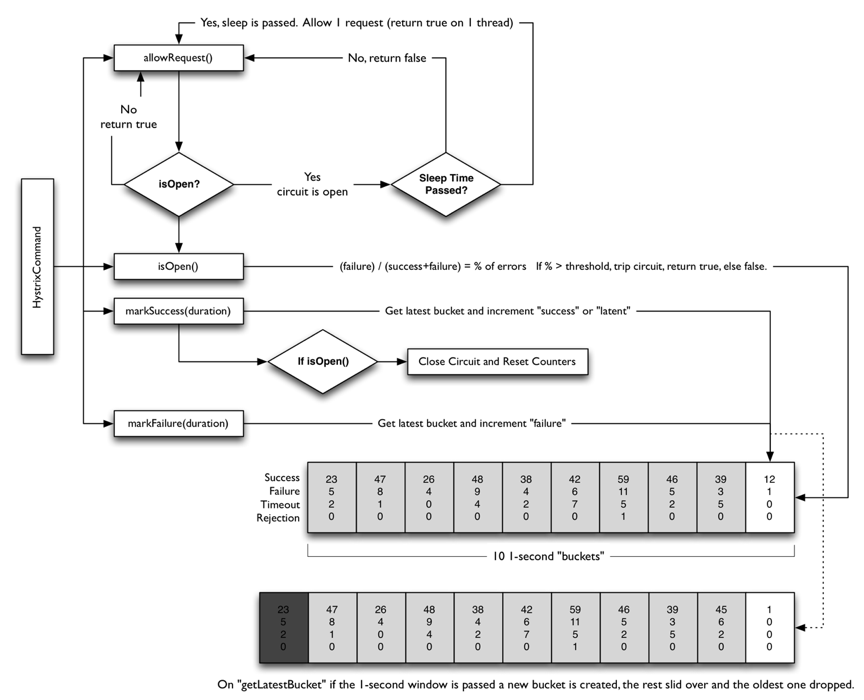

# 彈力設計篇之熔斷設計

熔斷器模式可以防止應用程序不斷地嘗試執行可能會失敗的操作，使得應用程序繼續執行而不用等待修正錯誤，或者浪費 CPU 時間去等待長時間的超時產生。

## 熔斷設計

熔斷器可以使用狀態機來實現，內部模擬以下幾種狀態：

* 閉合狀態 (Closed)：有一個錯誤計數器，查看時間段內是否超過預設閾值，超過則進入斷開狀態，直到超時後，轉成半開狀態。
* 斷開狀態 (Open)：針對請求會直接返回錯誤，不繼續調用服務。
* 半開狀態 (Half-Open)：允許一定數量的請求調用。如果這些調用都成功，將會轉變成閉合狀態。

下圖為 Martin Fowler 的 Circuit Breaker 

實現熔斷器模式使得系統更加穩定和有彈性，**在系統從錯誤中恢復的時候提供穩定性，並且減少了錯誤對系統性能的影響**。它快速地拒絕那些有可能導致錯誤的服務調用。

下圖是 Netflix 的開源項目 Hystrix 中的熔斷的實現邏輯

## 熔斷設計重點

熔斷設計是軟體設計的重要組成部分，主要有以下幾個方面:

1. 異常預測分析。在設計過程中進行異常預測分析，識別潛在異常發生的場景和原因，可有效定位和設計熔斷機制。通常使用風險分析、故障注入、駁論分析等技術。

2. 熔斷級別設計。根據異常影響程度设置多級熔斷，例如系統熔斷、模塊熔斷、操作熔斷等。更高級別熔斷會停止更下層系統運作，避免影響擴散。

3. 異常處理程序設計。對每個識別出的異常都設計明確的處理程序，包括啟動條件、處理步驟和恢復方式等。處理程序也設置在相應的熔斷級別下執行。

4. 異常轉換設計。在高級別熔斷觸發時，系統會自動切換至預設的異常轉換模式。異常轉換模式提供簡化的功能特性，**讓熔斷人員恢復控制權**。異常轉換條件和過程也需要設計。

5. 重試機制。對於暫時性異常,設置重試機制以恢復整合運行。重試時需調整重試間隔和重試次數以免陷入無限循環。 

6. 熔斷監測設計。在運行過程中持續監測異常閾值，以快速發現潛在異常並啟動熔斷機制。監測項目包括執行時間、資源占用率、異常情報量等。

7. 復位流程設計。對於熔斷狀態恢復正常後，需執行系統復位檢查流程，確保各個子系統已恢復至預期狀態，再次開放系統功能使用。復位流程設計同樣重要。

8. 熔斷測試設計。在部署前對設計好的熔斷機制進行熔斷測試，測試異常模擬、熔斷啟動、處理恢復等功能是否正常工作，找出潛在問題並進行修復。

文章 5 月 Day01 學習筆記，內容來源於極客時間 [《左耳聽風》](https://time.geekbang.org/column/article/4241)