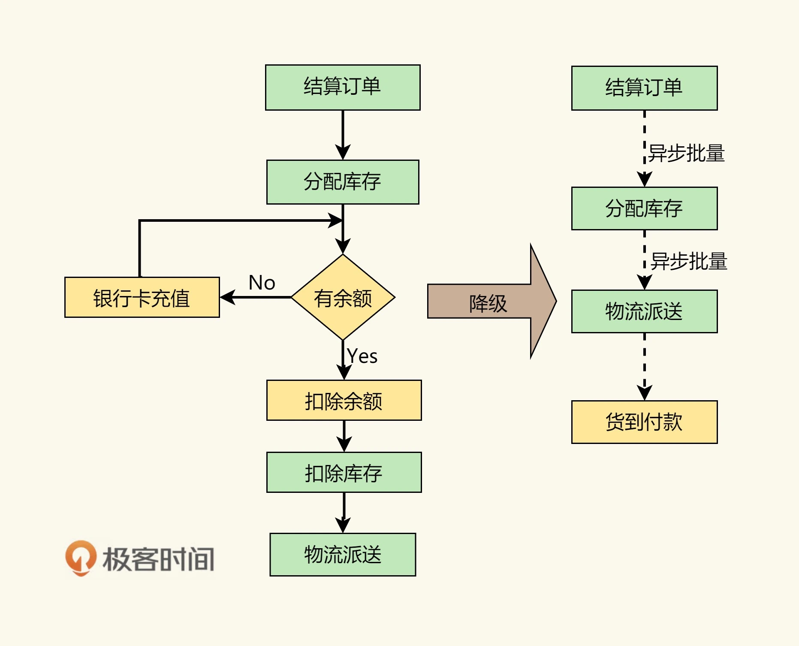
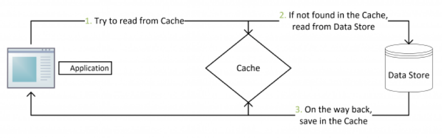

# 彈力設計篇之降級設計

降級設計是指在系統設計中，為了應對硬體或軟體故障而針對性地降低系統的性能和功能，保證系統的可用性。

降級需要犧牲：
* 降低一致性：強一致性變成最終一致性
* 停止次要功能：停止訪問不重要的功能，從而釋放出更多的資源。
* 簡化功能：把一些功能簡化掉，如簡化業務流程，或是不再返回全量數據，只返回部分數據。

## 降低一致性

有兩種做法：
* 簡化流程的一致性
* 降低數據的一致性

### 使用異步簡化流程

如電商的下單交易系統，在強一致的情況下，需要結算賬單，扣除庫存，扣除賬戶上的餘額（或發起支付），最後進行發貨流程，這一系列的操作。

在系統降級時，我們可以把操作做成異步的，快速結算訂單，不佔庫存，然後把在線支付降級成用戶到付，這樣就省去支付環節，然後批量處理用戶的訂單，向用戶發貨，用戶貨到。

### 降低數據的一致性

降低數據的一致性一般來說會使用緩存的方式，或是直接就去掉數據。如，在頁面上不顯示庫存的具體數字，只顯示有還是沒有庫存這兩種狀態。

對於降級後的系統，不再通過數據庫獲取數據，而是通過緩存獲取數據。在功能降級中，我們一般使用 Cache Aside 模式或是 Read Through 模式。也就是下圖所示的這個策略：

Read Through 模式就是在查詢操作中更新緩存，也就是說，當緩存失效的時候（過期或 LRU 換出），Cache Aside 是由調用方負責把數據加載到緩存，而 Read Through 則用緩存服務自己來加載，從而對應用方是透明的。

## 降級設計重點

功能降級需要梳理業務功能，哪些是 must-have 的功能，哪些是 nice-to-have 的功能；哪些是必須要死保的功能，哪些是可以犧牲的功能。

設計一個降級策略，需要考慮事項包括:

1. 定義降級的目標。了解你尋求降級的具體原因和目標是非常重要的。例如，降低延遲、提高吞吐量、減輕叢集負載等。這將驅動其他設計決策。

2. 確定哪些服務或元件需要降級。可能是整個應用程序，也可能只是其中一部分。明確劃定範圍將有助於實施正確的降級策略。

3. 選擇何時啟動降級。需要一些觸發條件，用於定義何時應該啟動降級演算法。例如，CPU 使用率達到閾值、request latency 超過限制、存儲使用率增加等。 

4. 選擇降級的方式。可能的選項包括:減少實例數、調整分配的資源(CPU、存儲、記憶體等)、調整工作人員的複雜性等。選擇適合你的目標和應用程序的方式。

5. 定義降級的程度和速度。決定在每次降級中將如何大幅度降低資源或服務的能力。同時也要考慮降級的速度，以免對應用程序的穩定性和可用性造成太多影響。

6. 設計提高的機制。你需要一些觸發條件來標識是否該恢復使用原有的資源配置，以提高應用程序的表現能力。略過提高機制會導致應用程序永遠處於降級狀態。

7. 測試和監控。廣泛測試您的降級演算法，以確保它按預期工作且不會導致不良的結果。在生產中部署後，持續監控其效果和影響，並在必要時進行調整。

文章 5 月 Day03 學習筆記，內容來源於極客時間 [《左耳聽風》](http://gk.link/a/122Nr)