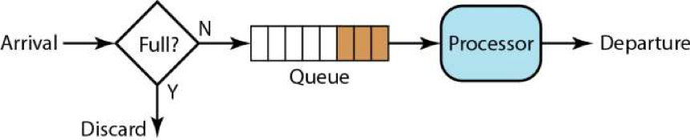
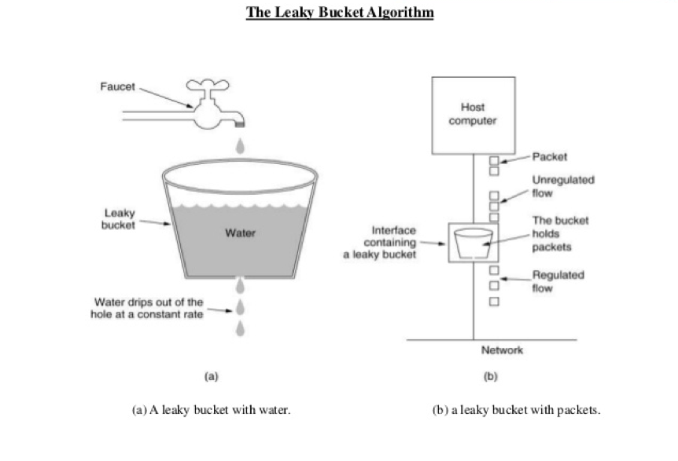
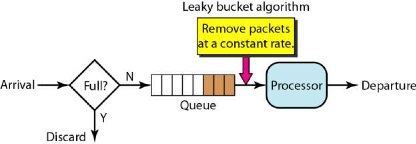
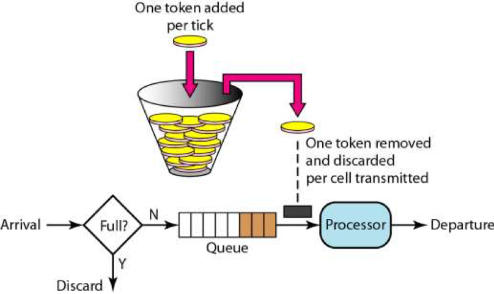

# 彈力設計篇之限流設計

限流是指通過添加一定的限制控制存取速度的設計方式。它主要用於保護系統資源免受惡意攻擊或不正常工作負載。

一般來說，觸發的限流行為如下：
* 拒絕服務
* 服務降級：如一種是把一些不重要的服務給停掉，把 CPU、內存或是數據的資源讓給更重要的功能；一種是不再返回全量數據，只返回部分數據。
* 特權請求
* 延遲處理
* 彈性伸縮

限流的基本類型:

- 速率限制:限制每秒/每分鐘所允許的請求數量或攻擊頻率。例如每秒10次請求。
- 權限控制:限制使用者、API key或IP地址可以進行的操作。例如每日1000次對/api/users的讀取權限。
- 頁面限流:為單個路由、訪問控制甚至整個API設定限流配額。每天100次對/api/users的讀取操作。
- Token限流:限制Token流量，例如SIP註冊請求。每10分鐘100次註冊。

## 限流實現方式

限流的基本原理是通過計算指定時間窗口內的請求數，並在向網路資源發出新請求前驗證該數量是否超過預定限制，最簡單的限流算法就是維護一個計數器 Counter。 

實現基本限流控制的主要步驟包括: 

1. 定義限制：設定要控制的 API 路由、資源和相應的最大請求速率或配額。例如每秒10次對/users的讀取操作。
2. 計算請求數：在每次獲取新請求前檢查時間窗口內已發出的請求數。可以使用計數器或資料庫記錄管理此信息。
3. 進行限制驗證：如果請求數超過您的限制，則拒絕整個請求。否則，擴展許可，更新請求計數器並讓請求繼續進行。
4. 增加時間窗口：每次有限流程完成後，轉移到新時間窗口並重置請求計數器。這有助於管理不同時間階段的擾流活動。
5. 記錄過多活動：為任何被限流的請求建立記錄項，以便在需要時進行復原或追蹤攻擊。

## 漏斗（桶）算法 Leaky Bucket

漏桶算法的原理是維護一個固定容量的漏桶，請求先進入漏桶，然後以恆定速率出漏桶，當漏桶滿時，則拒絕請求。**漏桶算法可以平滑限制請求流量，但是無法應對突發流量。**

## 令牌桶算法 Token Bucket

令牌桶算法的原理是維護一個固定容量的令牌桶，以恆定速率往令牌桶中放入令牌，請求需要在令牌桶中獲取一個令牌才能被處理，當令牌桶為空時，則拒絕請求。**令牌桶算法可以應對突發流量，但是無法平滑限制請求流量。**

## 基於響應時間的動態限流

前面提到的作法都需要一個明確的限流值。

基於響應時間的動態限流是一種進階的限流技術，它根據API的平均響應時間和無響應時間來偵測可能存在攻擊的情況。它的基本原理是:如果響應時間明顯超過平均值，很可能存在一定程度的攻擊或擁擠狀態。

實施基於響應時間的動態限流的主要步驟包括:

1. 監測API響應時間：使用時間戳記錄每次API請求的開始和結束時間。計算響應時間和計算平均值。 

2. 定義阻擋閥值：設定一個閥值，例如平均值的2倍，用於識別可能受攻擊的請求。任何超過此閥值的響應時間可能表示存在攻擊。

3. 計算限流比例：如果響應時間超過阻擋閥值，則計算相應API路由所允許的限流比例。例如，如果平均值是100毫秒，閥值是200毫秒，則每個響應時間超過200毫秒的請求都會釋放30%的限流配額(100毫秒x0.3=30毫秒)。

4. 累計限流配額：使用每次請求釋放的限流配額標，不斷累計已實施的限流百分比比例。如果攻擊持續，將達到整個API的停機。

5. 疏通限流：如果響應時間返回至正常水平，限流設置會逐漸釋放，以便重新允許 100% 流量訪問 API。此過程與攻擊期間的限流累計相反。

基於響應時間的動態限流是一種預先主動的技術，它可以在攻擊開始之前就監控狀態並發動限流措施，以保護API免受中斷。其**主要優點在於它對正常工作流程的干擾較小，並且可以自適應管理不同類型攻擊的限流要求**。此方法適用於任何Web服務，尤其適用於高流量和敏感API。

這方面設計的典範是 **TCP 協議的擁塞控制的算法**。TCP 使用 RTT - Round Trip Time 來探測網絡的延時和性能，從而設定相應的滑動窗口的大小，以讓發送的速率和網絡的性能相匹配。這個算法是非常精妙的。

## 限流設計的重點

限流的主要目的:

* 防止流量過載和服務中斷。通過將訪問流量限制在可用資源的容量內，限流可以保證服務持續運行而無需中斷。當流量驟增時，限流可以緩解流量擁擠，讓你有時間進行擴容。

* 管理突發流量。限流可以將大規模突發流量推遲到資源可供處理時，而無需完全中斷服務。它通過逐步調整限制來緩解流量壓力增長。

* 擾流和DDoS攻擊防護。嚴格的限流設置可以阻止大部分擾流代理和DDoSbotnet對服務的訪問。它使真正的合法用戶仍可存取服務，而擾流活動被限制在可接受水平。

* 保證服務穩定性。適當的限流可以防止突發流量增加導致服務功能不穩定或可用性下降。它確保每個組成部分(伺服器、網絡設備、資料庫等)都處在其設計限制內。

* 改進用戶體驗。限流可以排除低品質流量，讓合法用戶獲得更快、更穩定和更可靠的服務體驗。它可以減少延遲、超時錯誤和其他干擾用戶的問題。

* 遵循服務等級協議(SLA)。對關鍵業務API和服務設置明確的限流要求可以確保實現與您的SLA和用戶協議相一致的性能。根據需求，可以提供更高或更低的限制。

設計限流時需要考慮的要素:

* 限制類型:我們可以通過要求驗證、API key、IP限制、計算機等來限制存取。選擇適用於您的案例最為恰當的一種或多種方法。

* 限制清單:我們需要指定明確的資源及其相應的限制級別。例如，每個IP每天僅允許100次對/api/users的請求。

* 漏洞時間:任何限制設計都存在一定的漏洞時間，允許惡意活動發生。我們需要考慮合理的漏洞時間閥值。

* 可能的擾亂:嚴格的限制設計可能導致合法用戶的正常使用受到影響。我們需要評估不同限制級別的權衡，以確保使用者體驗不受不必要的干擾。

* 記錄和監控:我們需要記錄所有超過限制的活動，並適當監控系統以檢測異常行為。這有助於在新一波攻擊發生時快速作出反應。

* 靈活性:對於某些案例，固定限制可能並不適用。我們需要將調整限制級別的能力納入考慮，以允許在活動模式或威脅水平變化時作出調整。

限流是保護系統資源免受攻擊的有力方法。但它必須滿足使用者需求和正常工作流程，否則將導致不相稱的使用者體驗下降。

文章 5 月 Day02 學習筆記，內容來源於極客時間 [《左耳聽風》](http://gk.link/a/122L5)
