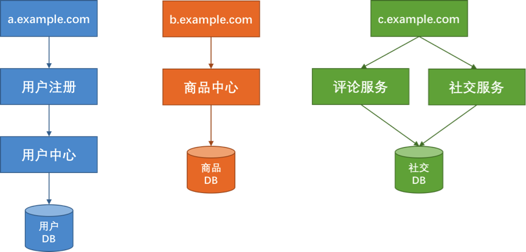

# 彈力設計篇之隔離設計

一般來說，對於系統的分離有兩種方式，一種是以服務的種類來做分離，一種是以用戶來做分離。

## 以服務種類做分離

從上圖看到，將系統分成了用戶、商品、社區三個服務，分別使用不同的域名、服務器和數據庫，做到從接入層到應用層再到數據層三層**完全隔離**。這樣一來，在物理上來說，一個服務的故障就不會影響到另一服務。

雖然完全隔離架構不錯，但也有缺點：

- 如果我們需要同時獲得多個不同服務間的數據，那麼就需要調用多個服務，這會降低性能。注意，這裡**性能降低指的是響應時間**，而不是吞吐量（相反，在這種架構下，吞吐量可以得到提高）。

一般來說，我們需要小心地設計用戶交互，最好不要讓用戶在一個頁面上獲得所有的數據：

* 如果有大數據平台，就需要把這些數據都抽取到一個數據倉庫中進行計算，這也增加了數據合併的複雜度。對於這個問題，我們**需要一個框架或是一個中間件來對數據進行相應的抽取**。
* 如果我們的業務邏輯或是業務流程需要**跨服務**的話，那麼**一個服務的故障也會同樣會導致整體業務故障**。對於這個問題，一方面，我們需要保證這個業務流程中各個子系統的高可用性，並且在業務流程上做成 Step-by-Step 的方式，這樣用戶交互的每一步都可以保存，以便故障恢復後可以繼續執行，而不是從頭執行。
* 如果需要有跨服務的交互也會變得有點複雜。對此我們需要一個類似於 **Pub/Sub 的高可用、且可以持久化的消息訂閱通知中間件**來打通各個服務的數據和信息交換。
* 最後還會有在多個服務中分布式事務的問題。對此，我們需要**二階段提交**這樣的方案。在亞馬遜中，使用的是 **Plan – Reserve – Commit/Cancel** 模式。

也就是說，先做一個 plan 的 API 調用，然後各個子系統 reserve 住相應的資源，如果成功，則 Commit；如果有一個失敗，則整體 Cancel。這其實很像阿里的 **TCC – try confirm/cancel**。

**這樣的系統通常會引入大量的異步處理模型。**

## 以用戶做分離

我們將用戶分成不同的組，並把後端的同一個服務根據這些不同的組分成不同的實例。讓同一個服務對於不同的用戶進行冗余和隔離，這樣服務實例掛了，只會影響一部分用戶。這樣的方案其實就是**多租戶模式**。

通常來說多租戶的做法有三種：
* 完全獨立的設計。每個租戶有自己完全獨立的服務和數據。
* 獨立的數據分區，共享的服務。多租戶的服務是共享的，但數據是分開隔離的。
* 共享的服務，共享的數據分區。每個租戶的數據和服務都是共享的。

方案優缺點，如下圖：

一般來說，技術方案會使用折中方案，也就是中間方案，服務是共享的，數據通過分區來隔離，而對於一些比較重要的租戶（需要好的隔離性），則使用完全獨立的方式。

## 隔離設計的重點

需要下面一些设计考量：

1. 我們需要**定義好隔離業務的大小和粒度**，過大和過小都不好。這需要認真地做業務上的需求和系統分析。
2. **無論是做系統服務還是多租戶的隔離，都需要考慮系統的複雜度、成本、性能、資源使用的問題，找到一個合適的均衡方案**，或是分布實施的方案尤其重要，這其中需要你定義好要什麼和不要什麼。因為，我們不可能做出一個什麼都能滿足的系統。
3. **隔離模式需要配置一些高可用、重試、異步、消息中間件，流控、熔斷等設計模式的方式配套使用**。
4. 不要忘記了分布式系統中的運維複雜度的提升，要能使用得當，還需要很多**自動化運維的工具**，尤其是使用像容器或是虛擬機這樣的虛擬化技術可以幫助我們更方便地管理，和對比資源更好地利用。否則做出來了也管理不好。
5. 最後需要一個非常完整的能夠**看得到所有服務的監控系統**，這點非常重要。

文章 4 月 Day25 學習筆記，內容來源於極客時間 [《左耳聽風》](https://time.geekbang.org/column/article/3917)