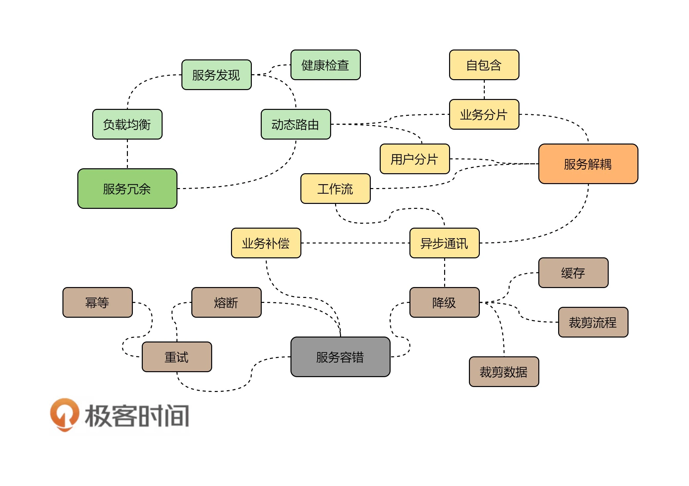

# 彈力設計篇總結

## 冗余服務

架構中冗余服務，意指多副本高可用，需要使用的技術為：
* 負載均衡 + 服務健康檢查–可以使用像 Nginx 或 HAProxy 這樣的技術。
* 服務發現 + 動態路由 + 服務健康檢查，比如 Consul 或 ZooKeeper。
* 自動化運維，Kubernetes 服務調度、伸縮和故障遷移。

## 隔離服務（服務解耦）

對服務解耦與拆分：
* bulkheads 模式：業務分片 、用戶分片、數據庫拆分。
* 自包含系統：所謂自包含的系統是從單體到微服務的中間狀態，其把一組密切相關的微服務給拆分出來，只需要做到沒有外部依賴就行。
* 異步通訊：服務發現、事件驅動、消息隊列、業務工作流。
* 自動化運維：需要一個服務調用鏈和性能監控的監控系統。

## 容錯設計

* 錯誤方面：調用重試 + 熔斷 + 服務的冪等性設計。
* 一致性方面：強一致性使用兩階段提交、最終一致性使用異步通訊方式。
* 流量控制方面：使用限流 + 降級技術。
* 自動化運維方面：網關流量調度，服務監控。

下圖總結

文章 5 月 Day04 學習筆記，內容來源於極客時間 [《左耳聽風》](http://gk.link/a/122Qj)
