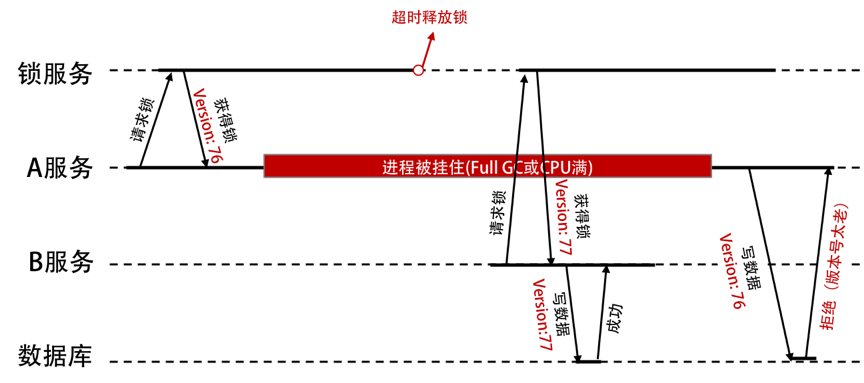

# 管理設計篇之分布式鎖

**分布式鎖是一種用於協調分布式系統中多個進程或線程訪問共享資源的機制**。在分布式系統中，避免多個進程或線程同時訪問同一共享資源，如數據庫、文件系統或緩存等，而導致的數據不一致問題。

分布式鎖通常需要滿足以下要求：

1. 互斥性：同一時刻只能有一個進程或線程持有鎖。
2. 可重入性：同一個進程或線程可以多次獲取同一個鎖。
3. 容錯性：當節點發生故障時，系統能夠繼續正常工作。
4. 性能：鎖的獲取和釋放操作應該盡可能快。

分布式鎖通常使用基於時間的算法來控制鎖的獲取和釋放。例如，可以使用基於 ZooKeeper 的分布式鎖，其中鎖的狀態存儲在 ZooKeeper 的節點上，每個節點在獲取鎖之前需要先創建一個臨時節點，並嘗試獲取鎖。如果獲取鎖失敗，則等待其他節點釋放鎖，並在一定時間後重試獲取鎖。當進程或線程釋放鎖時，它將刪除相應的臨時節點，從而釋放鎖。

總之，分布式鎖是一種非常重要的分布式系統組件，可以保證分布式系統中共享資源的一致性，從而提高系統的可靠性和性能。

## Redis 的分布式鎖服務

### 加鎖

透過下面指令進行加鎖：
```
SET resource_name my_random_value NX PX 30000
```
指令參數為：

* **SET NX 命令只會在 key 不存在的時候給 key 賦值，PX 命令通知 Redis 保存這個 key 30000ms。**
* my_random_value 必須是全局唯一的值。這個隨機數在釋放鎖時保證釋放鎖操作的安全性。
* PX 操作後面的參數代表的是這個 key 的存活時間，稱作鎖過期時間。
* 當資源被鎖定超過這個時間時，鎖將自動釋放。
* 獲得鎖的客戶端如果沒有在這個時間窗口內完成操作，就可能會有其他客戶端獲得鎖，引起爭用問題。

### 解鎖

透過下面指令解鎖：
```lua
if redis.call("get",KEYS[1]) == ARGV[1] then 
    return redis.call("del",KEYS[1]) 
else 
    return 0 
end
```
**通過 lua 腳本方式釋放鎖是為了避免 Client 釋放了其他 Client 申請的鎖。** 

## 分佈式鎖的一個問題

沒有檢查持有者，就會出現被誤刪除鎖的情況。

如果沒有檢查是誰持有鎖的問題，解釋例子如下：
1. Client A 獲得了一個鎖。當嘗試釋放鎖的請求發送給 Redis 時被阻塞，沒有及時到達 Redis。
2. 鎖定時間超時，Redis 認為鎖的租約到期，釋放了這個鎖。
3. Client B 重新申請到了這個鎖。
4. Client A 的解鎖請求到達，將 Client B 鎖定的 key 解鎖。
5. Client C 也獲得了鎖。Client B 和 Client C 同時持有鎖。


我們可以加入版本號進行身份確認，也就是樂觀鎖機制。



* 鎖服務需要有一個單調遞增的版本號。
* 寫數據的時候，也需要帶上自己的版本號。
* 數據庫服務需要保存數據的版本號，然後對請求做檢查。

如果使用 ZooKeeper 做鎖服務的話，那麼可以使用 zxid 或 znode 的版本號來做這個 fence 版本號。

## 樂觀鎖和 CAS

延伸上面例子說明，如果數據庫都有版本號，是不是就直接使用數據庫來加鎖？

* 使用數據版本（Version）記錄機制，即為數據增加一個版本標識，一般是通過為數據庫表增加一個數字類型的 version 字段來實現的。當讀取數據時，將 version 字段的值一同讀出，數據每更新一次，對此 version 值加一。


SQL 指令類似如下：

```sql
UPDATE table_name SET xxx = #{xxx}, version=version+1 where version =#{version};
```
> 這是樂觀鎖常見實現方式。樂觀鎖通常需要使用一些額外的元數據（metadata）來記錄**資源的版本號**或者**時間戳**等訊息，以便在進行比較和更新操作時使用。
> 
> 如果使用版本號，或是 fence token 這種方式，就不需要使用分布式鎖服務了。

### CAS 操作

直接以下面指令說明：
```sql
SELECT stock FROM tb_product where product_id=#{product_id};
UPDATE tb_product SET stock=stock-#{num} WHERE product_id=#{product_id} AND stock=#{stock};
```
* 先查詢當前庫存量。這個庫存量值被用作後續更新操作的條件之一，確保只有當庫存量符合預期時才會進行庫存扣減操作。
* 這個 UPDATE 語句中 stock=#{stock}，這個條件確保只有當庫存量符合 SELECT 語句中獲取的庫存量時，才會更新庫存量。這樣可以避免在多線程環境下可能出現的庫存量更新競爭問題。

### 兩者比較

分佈式鎖和 CAS（Compare-And-Swap）都是用於多線程環境下實現同步和互斥的機制。

分佈式鎖是一種在分佈式系統中實現互斥的機制，它通常用於解決多個應用程序或服務之間對共享資源的競爭問題。分佈式鎖的優點是可以在分佈式系統中實現全局的互斥，避免多個應用程序或服務對共享資源的競爭問題，但是需要考慮分佈式系統的時延和可用性等問題。

CAS 是一種在單機多線程環境下實現同步和互斥的機制，它通常用於實現非阻塞算法和鎖-free 算法等。**CAS 的基本思路是比較當前值和期望值是否相等，如果相等，則進行更新操作，否則重新讀取當前值再進行比較和更新**。**CAS 操作通常使用原子指令實現，保證操作的原子性和可見性**。CAS 的優點是可以實現高效的非阻塞算法和鎖-free 算法，避免了鎖的開銷和死鎖等問題，但是需要考慮 ABA 問題、內存模型等問題。

對比分佈式鎖和CAS的特點：

| 特點 | 分佈式鎖 | CAS |
| --- | --- | --- |
| 適用範圍 | 分佈式系統中的資源競爭問題 | 單機多線程環境下的同步和互斥 |
| 實現方式 | 在分佈式系統中引入共享的鎖資源 | 原子指令實現比較和更新操作 |
| 優點 | 可以實現全局的互斥 | 可以實現高效的非阻塞算法和鎖-free算法 |
| 缺點 | 需要考慮分佈式系統的時延和可用性等問題 | 存在ABA問題、內存模型等問題 |
| 應用場景 | 多個應用程序或服務之間對共享資源的競爭問題 | 實現非阻塞算法和鎖-free算法 |


## 分佈式鎖設計重點

需要分清楚：是用來修改某個共享資源的，還是用來不同進程間的同步或是互斥的。如果使用 CAS 這樣的方式（無鎖方式）來更新數據，那麼我們是不需要使用分布式鎖服務的，而後者可能是需要的。

**我們在決定使用分布式鎖服務前需要考慮的第一個問題——我們是否需要？**

在設計分佈式鎖時，需要考慮以下幾個重點：

1. 選擇適合的分佈式系統：不同的分佈式系統有不同的特點和限制，例如 ZooKeeper、Redis、etcd 等，需要根據具體的需求和場景選擇適合的分佈式系統。

2. 設計合適的鎖資源：鎖資源的設計需要考慮到被鎖定對象的粒度和類型，例如是鎖定整個數據庫還是某個表格、某個頁面等。同時，還需要考慮鎖的模式，例如獨佔模式、共享模式等。

3. 選擇合適的鎖算法：分佈式鎖的實現方式有很多種，例如基於 ZooKeeper 實現的 ZooKeeper 分佈式鎖、基於 Redis 實現的 Redis 分佈式鎖等。不同的鎖算法有不同的特點和限制，需要根據具體需求選擇適合的鎖算法。

4. 考慮分佈式系統的時延和可用性等問題：由於分佈式系統往往存在時延和可用性等問題，因此在設計分佈式鎖時需要考慮到這些問題，避免鎖操作的開銷和故障。

5. 考慮競爭條件和死鎖等問題：在設計分佈式鎖時需要考慮到競爭條件和死鎖等問題，避免多個應用程序或服務之間產生競爭或者死鎖問題，從而保證分佈式鎖的正確性和可靠性。


## 小結

分布式鎖可以通過以下方式實現：

1. 基於數據庫實現：將鎖訊息存儲在數據庫中，進程或線程需要獲取鎖時，先向數據庫發送請求，如果獲取到鎖，則將鎖訊息寫入數據庫，釋放鎖時則將鎖訊息從數據庫中刪除。這種方式的缺點是性能較差，容易出現死鎖等問題。

2. 基於緩存實現：將鎖訊息存儲在緩存中，進程或線程需要獲取鎖時，先向緩存發送請求，如果獲取到鎖，則將鎖訊息寫入緩存，釋放鎖時則將鎖訊息從緩存中刪除。這種方式的優點是性能較好，但是需要考慮緩存失效的問題。

3. 基於 ZooKeeper 實現：ZooKeeper 是一個分布式協調服務，可以用於實現分布式鎖。當進程或線程需要獲取鎖時，先向 ZooKeeper 發送請求，如果獲取到鎖，則在 ZooKeeper 上創建一個臨時節點，釋放鎖時則刪除該節點。這種方式的優點是可靠性較高，但是需要依賴於 ZooKeeper 服務。

使用分布式鎖可以避免多個進程或線程同時對共享資源進行修改，從而保證數據的一致性和正確性。但是需要注意，使用分布式鎖也會帶來一些額外的開銷和複雜性，需要權衡利弊。

文章 5 月 Day05 學習筆記，內容來源於極客時間 [《左耳聽風》](https://time.geekbang.org/column/article/5175)