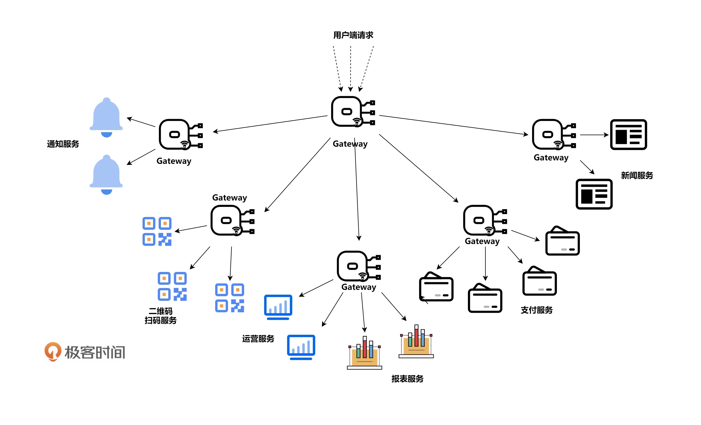

# 管理設計篇之網關模式

網關 (Gateway) 是微服務網路中非常重要的組成部分。

## 網關模式設計

以下為網關的設計和功能:

1. 負載均衡，網關的基本功能是提供對外的入口。作為**服務網路與外部網路交互的唯一組件(入口)**。  
2. **支持多種協議和 API**。網關通常包括多種協議和接口的支持，如 HTTP、HTTPS、gRPC、TCP 等。根據不同的流量入口和協議，部署多種類型的網關。
3. **路由轉發**。網關具有路由和轉發流量的能力。接收外部請求後，根據 URL、權鍵或其他特徵，智能地轉發到內部服務。
4. **負載均衡與限流**。網關還提供流量控制和負載均衡的功能。支持多種負載均衡策略，實現對流量的配額管理和限速。
5. **安全是重要的考量因素**。網關通常提供 TLS 驗證、密碼加密以及請求金鑰和授權、OAuth 認證等安全機制。
6. **服務發現**。網關需要與服務發現和註冊系統集成，獲取內部服務的動態狀態和元數據。實現動態路由和發現。
7. **彈力設計**。為了實現高可用性，通常部署多個網關實例，並使用外部負載均衡器作為唯一入口。提供多網關備援和地域備援。 並且可以把彈力設計中的那些異步、重試、冪等、流控、熔斷、監視等都可以實現進去。

以及進階有趣的設計：
 
1. **監控系統**。網關還可以集成監控系統，收集流量數據並報警。同時提供健康檢查接口，檢查後端服務是否可用。
2. **分佈式追蹤**。網關可以與分佈式追蹤系統集成,自動帶入上下文信息,幫助跟蹤請求生成的各個微服務的調用信息。
3. **灰度發佈**。網關完全可以做到對相同服務不同版本的實例進行導流，還可以收集相關的數據。這樣對於軟件質量的提升，甚至產品試錯都有非常積極的意義。
4. **API 聚合**。使用網關可以將多個單獨請求聚合成一個請求。如讓網關來幫客戶端請求多個後端的服務（有些場景下完全可以併發請求），然後把後端服務的響應結果拼裝起來，回傳給客戶端。
5. **API 編排**。同樣在微服務的架構下，要走完一個完整的業務流程，我們需要調用一系列 API，可以通過一個 DSL 來定義和編排不同的 API，也可以通過像 AWS Lambda 服務那樣的方式來串聯不同的 API。

一些常見的開源網關有 **Nginx Ingress controller**、**Envoy**、**Traefik** 等。

下圖為多層網關架構

## Gateway、Sidecar 和 Service Mesh

Gateway、Sidecar 和 Service Mesh 是微服務架構中的三個重要組成部分。主要的區別和功能如下:

Gateway:

* 作為外部流量的唯一入口, 對外提供統一的 API 介面。
* 負責路由轉發外部請求到內部微服務, 提供負載均衡和流量調控功能。
* 提供 TLS 終止、API 鍵驗證等安全機制。

Sidecar:

* 部署在與微服務同一內部 Pod 中, 可緊密集成。
* 負責與 Service Mesh 的交互, 提供安全、可觀測和控制能力。 
* 微服務本身不需要直接編程集成 Service Mesh。

Service Mesh:

* 管理微服務之間的通訊, 提供軟體定義的網絡。
* 提供安全 (LDAP 認證、加密)、可頻繁性和流量管理、故障注入和自我修復等能力。
* 所有處理由 Sidecar 完成, 微服務本身不需要更改。

下表為功能比較:

|  | Gateway | Sidecar | Service Mesh |
| - | - | - | - | 
| 角色 | 外部流量入口和路由 | 內部流量代理 | 管理內部通訊 | 
| 處理對象 | 外部請求 | 微服務內部通訊 | 微服務間通訊 |
| 主要功能 | 路由轉發外部流量   負載均衡   安全控制 | 集成 Service Mesh  代理微服務 | 網絡定義   安全控制   流量管理 | 
| 依賴 | 獨立 | 依賴 Service Mesh| 依賴 Sidecar|
| 集成方式 | 直接配置 | 緊密內嵌 | 軟體定義 |

文章 5 月 Day09 學習筆記，內容來源於極客時間 [《左耳聽風》](http://gk.link/a/1232R)
