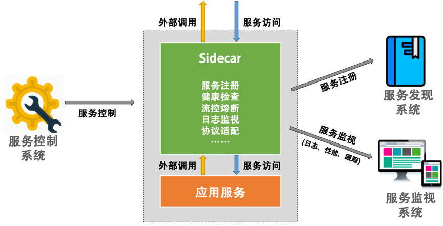

# 管理設計篇之邊車模式

邊車模式，Sidecar 是一種常見的架構模式，**用於解決微服務應用程序中的通訊、故障恢復、監控和其他非業務問題**。在這種模式中，一個特殊的輔助容器（Sidecar）與主應用程序容器一起部署，並提供一些額外的功能，如服務註冊、服務發現、負載均衡、安全認證、流量控制、日誌記錄和指標收集。

在容器編排工具（如 Kubernetes）中，Sidecar 模式被廣泛使用。Kubernetes 中的 Pod 是最小的部署單元，一個 Pod 中可以包含多個容器，其中一個是主容器，其餘的容器就可以作為 Sidecar 容器來提供輔助功能。例如，可以使用 Sidecar 容器來將應用程序的日誌輸出到中央日誌系統，或者收集應用程序的指標數據以進行監控。

## 邊車模式設計

Sidecar 可以理解為一個服務的 Agent，這個服務所有對外的進出通訊都通過這個 Agent 來完成。重點需要跟主程序一起啟動關閉。

使用 Sidecar 模式，可以將應用程序的不同功能分離成獨立的容器，使得每個容器只負責一項功能，並且可以獨立地進行部署、升級和管理。這樣，應用程序的整體可維護性和擴展性都可以得到大大提高，且對應用程序沒有侵入性，並且不用受到應用服務的語言和技術的限制。

Sidecar 模式的一個重要優點是它可以提供額外的安全性，例如通過對主應用程序進行身份驗證和授權，或者提供加密和解密服務等。通過將這些安全性功能放在 Sidecar 中，我們可以更好地保護應用程序免受惡意攻擊和數據洩露。

如下圖，應用服務可以完全專注於業務邏輯，非業務邏輯交由 sidecar 處理：

### Sidecar 優缺點：

| 優點 | 缺點 |
| --- | --- |
| 可維護性和可擴展性 | 複雜性 |
| Sidecar 可以為主應用程序提供額外的功能和服務，例如日誌記錄、監控、安全性、負載均衡和服務發現等，從而提高應用程序的可維護性和可擴展性。 | Sidecar 的設計和實現可能會增加系統的複雜性，需要額外的管理和維護。 |
| 安全性 | 性能 |
| Sidecar 可以提供額外的安全性功能，例如通過對主應用程序進行身份驗證和授權，或者提供加密和解密服務等，從而更好地保護應用程序免受惡意攻擊和數據洩露。 | Sidecar 的存在可能會對主應用程序的性能產生一定影響，特別是在高負載情況下。 |
| 靈活性和可組合性 | 部署和管理 |
| Sidecar 的設計和實現可以非常靈活和可組合，可以選擇合適的技術棧來實現其功能。 | Sidecar 的部署和管理可能會增加一些額外的複雜性和成本，需要使用適當的工具和流程來管理。 |
| 可靠性和可用性 |  |
| Sidecar 的設計和實現可以增加系統的可靠性和可用性，例如通過實現負載均衡和服務發現等功能來保證應用程序的高可用性。 |  |

## 邊車模式設計重點

Sidecar 重點解決下面問題：

* 控制與邏輯分離
* 服務調用上下文的問題

Sidecar 的一些設計重點：

1. **明確 Sidecar 的角色和功能**：在設計 Sidecar 時，需要明確它的角色和功能。Sidecar 通常是一個獨立的進程，與主應用程序運行在同一個主機或容器中，通過共享網路和文件系統來與主應用程序通訊。Sidecar 的主要功能是提供額外的服務和功能，例如日誌記錄、監控、安全性、負載均衡和服務發現等。

2. **考慮 Sidecar 和主應用程序的通訊方式**：在設計 Sidecar 時，需要考慮它和主應用程序之間的通訊方式。通常情況下，Sidecar 和主應用程序之間的通訊可以通過共享網路和文件系統來實現。此外，還可以考慮使用 RPC、消息隊列或 API 網關等方式來實現通訊。

3. **選擇合適的技術棧**：在設計 Sidecar 時，需要選擇合適的技術棧。通常情況下，Sidecar 可以使用與主應用程序相同的技術棧，或者使用專門的技術棧來實現其功能。例如可以使用 Fluentd 或 Logstash 來實現日誌記錄，使用 Prometheus 或 Zipkin 來實現監控，使用 Envoy 或 Istio 來實現負載均衡和服務發現等。

4. **考慮安全性**：在設計 Sidecar 時，需要考慮安全性。通常情況下，Sidecar 可以提供額外的安全性功能，例如通過對主應用程序進行身份驗證和授權，或者提供加密和解密服務等。通過將這些安全性功能放在 Sidecar 中，可以更好地保護應用程序免受惡意攻擊和數據洩露。

5. **考慮 Sidecar 的可擴展性**：在設計 Sidecar 時，需要考慮其可擴展性。通常情況下，Sidecar 應該能夠處理大量的請求和數據流量，而不會影響主應用程序的性能。為此，可以使用水平擴展或垂直擴展等方式來實現 Sidecar 的可擴展性。

## 邊車模式不適用場景

以下是一些可能不適合使用 Sidecar 的場景：

1. 資源受限的環境：在資源受限的環境中，如嵌入式設備或低配服務器等，Sidecar 可能會佔用過多的資源，從而影響主應用程序的性能。

2. 高性能要求的場景：在對性能要求非常高的場景中，如高頻交易系統或實時數據處理系統等，Sidecar 可能會對主應用程序的性能產生不利影響，從而無法滿足應用程序的需求。

3. 簡單應用程序：在簡單的應用程序，如單體應用程序或簡單的 Web 應用程序等，以及非分佈式架構應用，Sidecar 可能會增加不必要的複雜性和成本，從而不適合使用。

4. 服務間協議不標準且無法轉換：在跨服務或跨語言應用程序中，如使用不同語言編寫的微服務，Sidecar 可能會增加額外的複雜性和成本，從而不適合使用。

5. 數據隔離要求嚴格的場景：在對數據隔離要求非常嚴格的場景中，如金融或醫療領域等，Sidecar 可能會對數據隔離產生不利影響，從而無法滿足應用程序的需求。

文章 5 月 Day07 學習筆記，內容來源於極客時間 [《左耳聽風》](https://time.geekbang.org/column/article/5909)