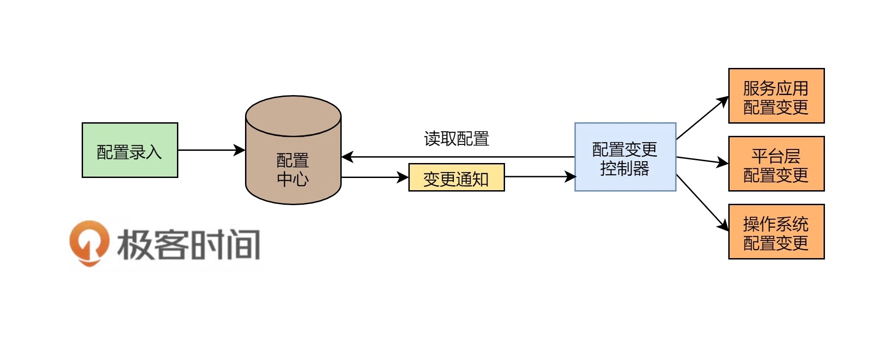

# 管理設計篇之配置中心

配置中心（Configuration Center）是一種用於集中管理應用程序配置的系統。它可以幫助應用程序在不同的環境下（如開發、測試、生產等）使用不同的配置，並且可以隨時修改這些配置，以適應應用程序的變化。

配置中心通常由一個服務器和一個或多個客戶端組成。服務器用於存儲和管理配置訊息，而客戶端則從服務器中獲取配置並將其應用於應用程序。配置中心通常提供一個易於使用的用戶界面，以幫助管理員添加、修改和刪除配置訊息。

在微服務架構中，配置中心也被廣泛使用。每個微服務都可以有自己的配置文件，而配置中心可以集中管理這些配置文件，並確保它們在整個微服務架構中保持一致。這使得在部署和管理微服務時更加容易，因為管理員只需要修改配置中心中的配置，而無需修改每個微服務的配置文件。

## 設定配置

分為靜態配置和動態配置：

* 靜態配置：初始化進行的配置，啟動後基本不會修改。
* 動態配置：指在運行時動態修改系統或應用程序的配置，而不需要重新啓動系統或應用程序。

動態配置的管理可以通過多種方式實現：

* 使用 **配置管理工具**，例如 Ansible、Puppet、Chef 等，這些工具可以自動化配置的部署和管理。這些工具可以輕鬆地在多個服務器上進行配置的修改和更新，而無需手動干預。

* 另一種方式是使用 **配置中心**，例如 Zookeeper、Etcd、Consul 等，這些工具可以將配置訊息存儲在中心化的位置，並在需要時將其提供給應用程序。這種方式可以使配置的修改變得更加容易，並且可以確保所有應用程序都使用相同的配置。

動態配置的管理都可以使系統更加靈活和可靠，因為它可以讓系統在不停機的情況下適應變化的需求。

## 配置中心架構設計

配置中心是一種用於集中管理系統或應用程序配置的架構，通常由以下組件組成：

1. **配置存儲**：配置中心需要提供一個存儲配置的地方。這個存儲可以是一個數據庫、文件系統、鍵值存儲（例如 Redis）或任何其他類型的存儲。配置存儲應該具有高可用性，以確保在任何時候都能獲取到配置。

2. **配置管理 API**：配置中心應該提供一組 API，用於管理配置。這些 API 應該支持配置的讀取、寫入、更新和刪除。配置管理 API 可以使用 REST API、gRPC 或其他協議實現。

3. **配置發佈 / 訂閱機制**：配置中心應該提供一種機制，使得應用程序可以訂閱配置的變化。這個機制可以是長輪詢、Webhooks 或其他機制。當配置發生變化時，配置中心應該通知所有訂閱者。

4. **認證和授權**：配置中心需要提供一種認證和授權機制，以確保只有授權的用戶可以訪問和修改配置。這可以通過基於角色的訪問控制（RBAC）或其他授權機制實現。

5. **監控和報警**：配置中心應該提供一種監控和報警機制，以便系統管理員可以監測配置中心的狀態並在必要時採取措施。如 Prometheus。

6. 客戶端庫：配置中心應該提供一組客戶端庫，以便應用程序可以輕鬆地與配置中心進行交互。這些客戶端庫可以是針對不同編程語言和框架的 SDK 或庫。

下圖為架構示意圖：

還需要留意下面一些問題：

### 為什麼需要一個變更通知的組件，而不是讓配置中心直接推送？ 
*  分布式環境下，服務器太多，推送不太現實，而採用一個 Pub/Sub 的通知服務可以讓數據交換經濟一些。

### 為什麼不直接 Pub 數據過去，還要訂閱方反向拉數據？
* 直接推數據當然可以，但讓程序反過來用 API 讀配置的好處是，一方面，API 可以校驗請求者的權限，另一方面，有時候還是需要調用配置中心的基本 API，比如下載最新的證書之類的。還有服務啓動時需要從服務中心拉一份配置下來。

### 配置變更控制器部署在哪裡？是在每個服務器上呢，還是在一個中心的地方？ 
* 為了執行效率更好，事務成功率更大，建議把這個配置變更的控制放在每一台主機上。

### 平台層的配置變更，有的參數是在服務啓動的命令行上，這個怎麼變更呢？
* 一般來說，命令行上的參數需要通過 Shell 環境變量做成配置項，然後通過更改系統環境變量，並重啓服務達到配置變更。

### 操作系統的配置和平台層的配置操作
* 配置變更最好模塊化掉，就像雲服務中的不同尺寸的主機型號一樣。 這樣有利於維護和減少配置的複雜性。

### 應用服務配置更新的標準化?
* 因為一個公司的應用由不同的團隊完成，可能其配置會因為應用的屬性不同而不一樣。為了便於管理，最好有統一的配置更新。一般來說，有的應用服務的配置是在配置文件中，有的應用服務的配置是通過調用 Admin API 的方式變更，不同的應用系統完全不一樣，似乎完全沒有方法做成統一的。有幾個方案可以參考：
    * 使用 SDK 配置：缺點為耦合開發語言
    * 標準運維腳本：缺點為依賴不同應用的配置，容易出問題
    * 為每個服務獨立使用一個 Agent

## 配置中心設計重點

配置中心主要的用處是統一和規範化管理所有的服務配置，也算是一種配置上的治理活動，其設計重點應該放在**如何統一和標準化軟件的配置項**，其還會涉及到軟件版本、運行環境、平台、中間件等一系列的配置參數。

### 配置中心

配置中心的設計需要考慮以下幾個重點：

1. 可靠性：配置中心必須是高可靠的，因為它管理著應用程序的關鍵配置訊息。如果配置中心不可用或數據丟失，將導致應用程序無法正常運行。

2. 安全性：由於配置中心管理著敏感的應用程序配置訊息，因此必須具備一定的安全性。配置中心應該提供身份驗證和授權機制，以確保只有授權的用戶才能訪問和修改配置訊息。

3. 可擴展性：隨著應用程序的增長，配置中心需要支持更多的應用程序和配置訊息。因此，配置中心應該具有良好的可擴展性，能夠輕鬆地擴展存儲容量和處理能力。

4. 版本控制：配置中心應該能夠支持配置訊息的版本控制，以便管理員可以查看歷史配置訊息並進行回滾操作。

5. 實時性：配置中心應該能夠提供實時更新配置訊息的功能，以便應用程序可以及時獲取最新的配置訊息。

6. 易用性：配置中心應該提供一個易於使用的界面，使管理員可以方便地添加、修改和刪除配置訊息，而無需瞭解底層技術。

7. 兼容性：配置中心應該能夠與各種應用程序和技術棧兼容，以滿足不同應用程序的需求。

### 配置更新控制器

配置更新控制器（Configuration Update Controller）是配置中心中的一個組件，**用於控制配置訊息的更新和發佈**。其主要功能包括：

1. 配置更新策略：配置更新控制器可以定義不同的更新策略，例如全量更新或增量更新。全量更新將覆蓋所有配置訊息，而增量更新只會修改變化的配置訊息。

2. 版本控制：配置更新控制器可以對配置訊息進行版本控制，以便管理員可以查看歷史配置訊息並進行回滾操作。

3. 發佈管理：配置更新控制器可以管理配置訊息的發佈，以確保配置訊息在發佈前經過適當的測試和審核。

4. 配置驗證：配置更新控制器可以驗證新的配置訊息是否符合預期的格式和規範，以避免錯誤的配置訊息導致應用程序出現異常或故障。

5. 同步控制：配置更新控制器可以控制配置訊息的同步，以確保所有的客戶端都能夠及時獲取最新的配置訊息。

6. 通知機制：配置更新控制器可以通過通知機制通知客戶端有新的配置訊息可用，以便客戶端能夠及時獲取新的配置訊息。

配置更新控制器是配置中心中的一個重要組件，它可以確保配置訊息的更新和發佈過程安全可靠，避免配置訊息出錯或丟失，並且可以有效地控制配置訊息的同步和通知。

文章 5 月 Day06 學習筆記，內容來源於極客時間 [《左耳聽風》](https://time.geekbang.org/column/article/5819)