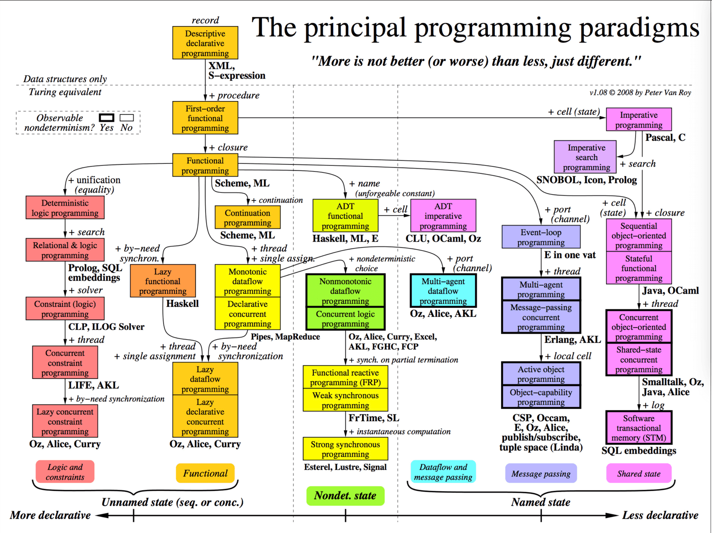
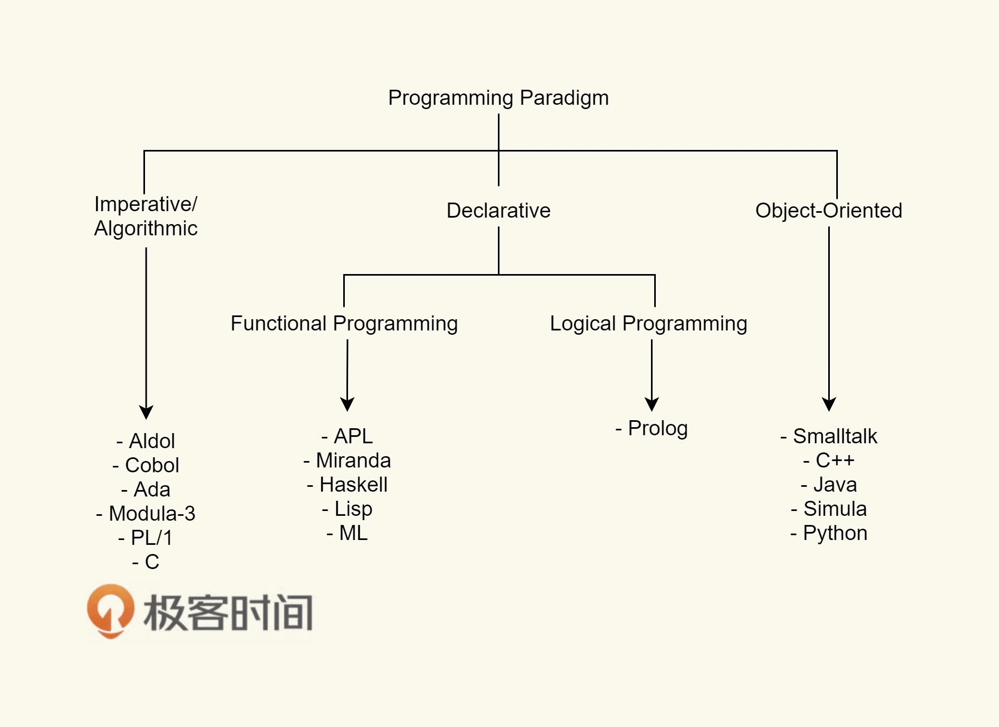
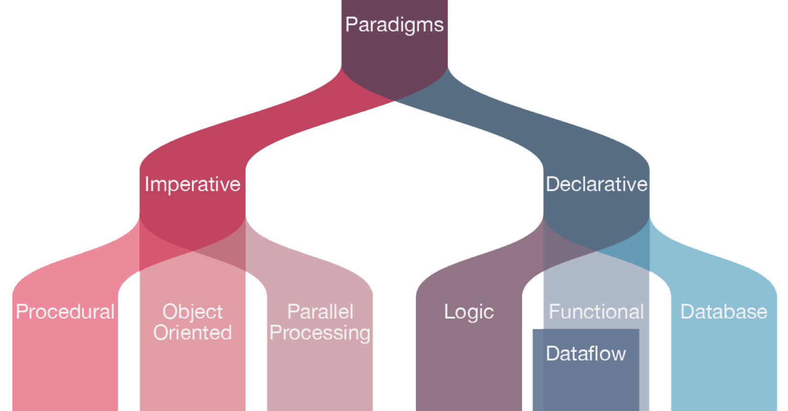
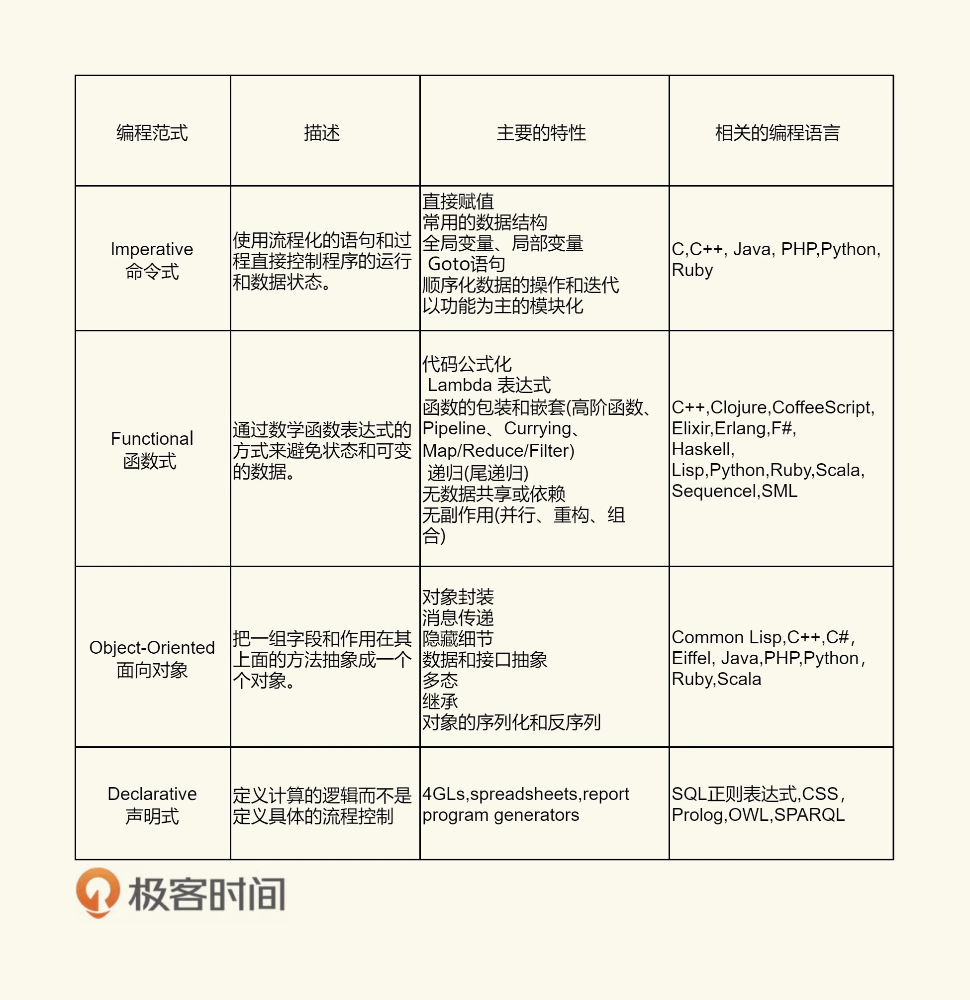

# 編程範式遊記（11）- 程序世界里的編程範式

下圖為現在的編程範式

總體來說，分成這幾類：**聲明式、命令式、邏輯的、函數式、面向對象的、面向過程的**。

再做個分類，歸納如下圖：
- 中間兩個聲明式編程範式（函數式和邏輯式）偏向於你定義要什麼，而不是怎麼做。
- 而兩邊的命令式編程範式和面向對象編程範式，偏向於怎麼做，而不是要做什麼。

## 小結

基本兩大分支：一是解決數據和算法；另一是解決邏輯與控制。

下圖為目前四大編程範式的比較：

文章 4 月 Day23 學習筆記，內容來源於極客時間 [《左耳聽風》](https://time.geekbang.org/column/article/2752)