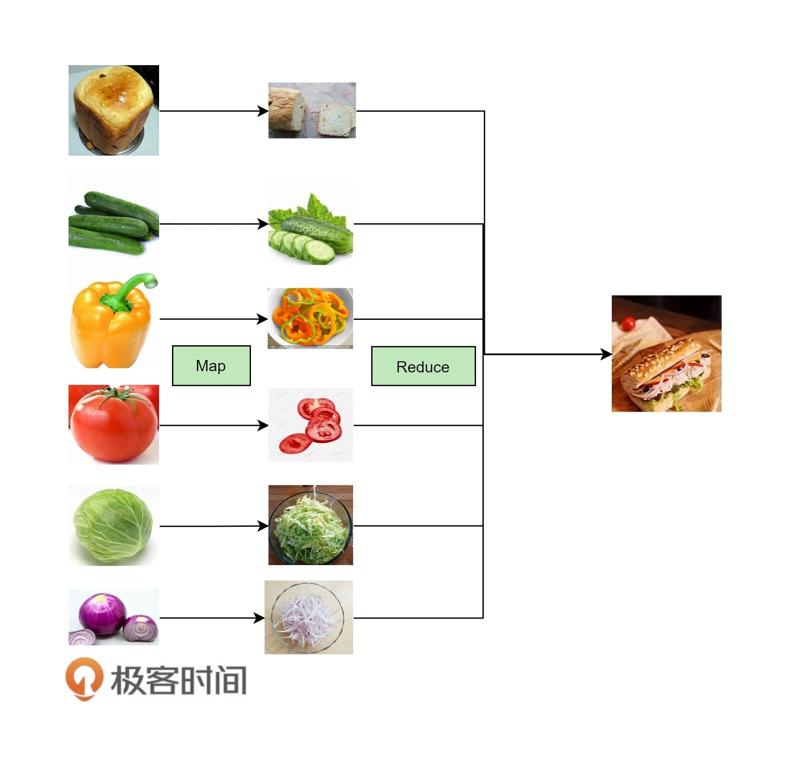

# 編程範式遊記（4）- 函數式編程

對於函數式編程來說，它**只關心定義輸入數據和輸出數據相關的關係**，數學表達式裡面其實是在做**一種映射（mapping）**，**輸入的數據和輸出的數據關係是什麼樣的，是用函數來定義的**。

## 函數式編程特點：

特徵：
- **stateless**：函數不維護任何狀態。函數式編程的核心精神是 stateless，簡而言之就是它不能存在狀態，打個比方，你給我數據我處理完扔出來。裡面的數據是不變的。
- **immutable**：輸入數據是不能動的，動了輸入數據就有危險，所以要返回新的數據集。

優勢：
- 沒有狀態就沒有傷害。
- 並行執行安全。
- Copy-Paste 重構代碼無傷害。
- 函數的執行沒有順序上的問題。

缺點：
- 劣勢數據複製比較嚴重。

## 函數式編程用到的技術

下面是函數式編程用到的一些技術：

- **first class function（頭等函數**） ：這個技術可以讓你的函數就像變量一樣來使用。也就是說，你的函數可以像變量一樣被創建、修改，並當成變量一樣傳遞、返回，或是在函數中嵌套函數。
- **tail recursion optimization（尾遞歸優化）** ： 我們知道遞歸的害處，那就是如果遞歸很深的話，stack 受不了，並會導致性能大幅度下降。因此，我們使用尾遞歸優化技術——每次遞歸時都會重用 stack，這樣能夠提升性能。當然，這需要語言或編譯器的支持。Python 就不支持。
- **map & reduce** ：這個技術不用多說了，函數式編程最常見的技術就是對一個集合做 Map 和 Reduce 操作。這比起過程式的語言來說，在代碼上要更容易閱讀。（傳統過程式的語言需要使用 for/while 循環，然後在各種變量中把數據倒過來倒過去的）這個很像 C++ STL 中 foreach、find_if、count_if 等函數的玩法。
- **pipeline（管道）：這個技術的意思是，將函數實例成一個一個的 action，然後**將一組 action 放到一個數組或是列表中，再把數據傳給這個 action list，數據就像一個 pipeline 一樣順序地被各個函數所操作，最終得到我們想要的結果。
- **recursing（遞歸）** ：遞歸最大的好處就是簡化代碼，它可以把一個複雜的問題用很簡單的代碼描述出來。注意：遞歸的精髓是描述問題，而這正是函數式編程的精髓。
- **currying（柯里化）** ：將一個函數的多個參數分解成多個函數， 然後將函數多層封裝起來，每層函數都返回一個函數去接收下一個參數，這可以簡化函數的多個參數。在 C++ 中，這很像 STL 中的 bind1st 或是 bind2nd。
- **higher order function（高階函數）**：所謂高階函數就是函數當參數，把傳入的函數做一個封裝，然後返回這個封裝函數。現象上就是函數傳進傳出，就像面向對象滿天飛一樣。這個技術用來做 Decorator 很不錯。

## 函數式語言的三套件

函數式語言有三套件，**Map**、**Reduce** 和 **Filter**。

下面為一般方式和函數式編程的例子，求平均值：
```python
# 計算數組中正數的平均值
num =  [2, -5, 9, 7, -2, 5, 3, 1, 0, -3, 8]
positive_num_cnt = 0
positive_num_sum = 0
for i in range(len(num)):
    if num[i] > 0:
        positive_num_cnt += 1
        positive_num_sum += num[i]
 
if positive_num_cnt > 0:
    average = positive_num_sum / positive_num_cnt
 
print average
```
```python
# 函數式編程
# 計算數組中正數的平均值
positive_num = filter(lambda x: x>0, num)
average = reduce(lambda x,y: x+y, positive_num) / len( positive_num )
```
我們可以看到，**隱藏了數組遍歷並過濾數組控制流程的 filter 和 reduce， 不僅讓代碼更為簡潔，因為代碼里只有業務邏輯了，而且讓我們能更容易地理解代碼。**

對於函數式編程的思路，下圖是一個比較形象的例子，麵包和蔬菜 map 到切碎的操作上，再把結果給 reduce 成漢堡。

我們可以看到 map 和 reduce 不關心輸入數據，它們只是控制，並不是業務。**控制是描述怎麼做，而業務是描述要做什麼**。

## 函数式的 pipeline 模式

pipeline（管道）借鑒於 Unix Shell 的管道操作：把若干個命令串起來，前面命令的輸出成為後面命令的輸入，如此完成一個流式計算。
> 注：Pipeline 是一個偉大的發明，它的設計哲學就是 KISS – 讓每個功能就做一件事，並把這件事做到極致，軟件或程序的拼裝會變得更為簡單和直觀。這個設計理念影響非常深遠，包括今天的 Web Service、雲計算，以及大數據的流式計算等。

如下 shell 指令
- 查看一個用戶執行的進程列表，列出來以後，然後取第二列 (第二列是它的進程 ID)，排個序，再把它顯示出來
```sh
ps auwwx | awk '{print $2}' | sort -n | xargs echo
```

下面為一個示例的 pipeline 實現步驟：

1. 求偶數
2. 乘 3
3. 轉成字符串返回

一般實現如下：
```python
def process(num):
    # filter out odd number
    if num % 2 != 0:
        return
    num = num * 3
    num = 'The Number: %s' % num
    return num
 
nums = [1, 2, 3, 4, 5, 6, 7, 8, 9, 10]
 
for num in nums:
    print process(num)
    
# Output：
# None
# The Number: 6
# None
# The Number: 12
# None
# The Number: 18
# None
# The Number: 24
# None
# The Number: 30
```

函數式實現如下：
```python
# 先定義函數
def even_filter(nums):
    for num in nums:
        if num % 2 == 0:
            yield num
def multiply_by_three(nums):
    for num in nums:
        yield num * 3
def convert_to_string(nums):
    for num in nums:
        yield 'The Number: %s' % nums
        
# 把函數串起來
nums = [1, 2, 3, 4, 5, 6, 7, 8, 9, 10]
pipeline = convert_to_string(multiply_by_three(even_filter(nums)))
for num in pipeline:
    print num

# Output：
# The Number: 6
# The Number: 12
# The Number: 18
# The Number: 24
# The Number: 30
```
> 例子用了 Python 的關鍵字 **yield**，它是一個類似 return 的關鍵字，只是這個函數返回的是 Generator（生成器）。所謂**生成器，指的是 yield 返回的是一個可迭代的對象，並沒有真正的執行函數**。也就是說，只有其返回的迭代對象被迭代時，yield 函數才會真正運行，運行到 yield 語句時就會停住，然後等下一次的迭代。（ yield 是個比較詭異的關鍵字）這就是 lazy evluation（懶惰加載）。

使用三件套(map. filter, reduce)重構上面例子：
```python
def even_filter(nums):
    return filter(lambda x: x%2==0, nums)
 
def multiply_by_three(nums):
    return map(lambda x: x*3, nums)
 
def convert_to_string(nums):
    return map(lambda x: 'The Number: %s' % x,  nums)
 
nums = [1, 2, 3, 4, 5, 6, 7, 8, 9, 10]
pipeline = convert_to_string(
               multiply_by_three(
                   even_filter(nums)
               )
            )
for num in pipeline:
    print num
```

如果再把上面的嵌套去掉，如下：
```python
# 採用 reduce 求嵌套結果
def pipeline_func(data, fns):
    return reduce(lambda a, x: x(a),   fns,   data)
    
pipeline_func(nums, [even_filter, multiply_by_three, convert_to_string])
```

使用 Python 的 force 函數以及 decorator 模式可以把上面的代碼寫得更像管道，這個自己求證，或是去看原文即可。

## 小結

函數式編程是個非常古老的概念，它的**核心思想是將運算過程盡量寫成一系列嵌套的函數調用，關注的是做什麼而不是怎麼做，因而被稱為聲明式編程**。以 Stateless（無狀態）和 Immutable（不可變）為主要特點，代碼簡潔，易於理解，能便於進行並行執行，易於做代碼重構，函數執行沒有順序上的問題，支持惰性求值，具有函數的確定性，無論在什麼場景下都會得到同樣的結果。

比較了 recursion、map 和 reduce，以及 pipeline 等技術，對比了非函數式編程和函數式編程在解決相同問題時的不同處理思路，不僅讓代碼更為簡潔，因為代碼里只有業務邏輯了，而且讓我們能更容易地理解代碼。

文章 4 月 Day16 學習筆記，內容來源於極客時間 [《左耳聽風》](https://time.geekbang.org/column/article/2017)