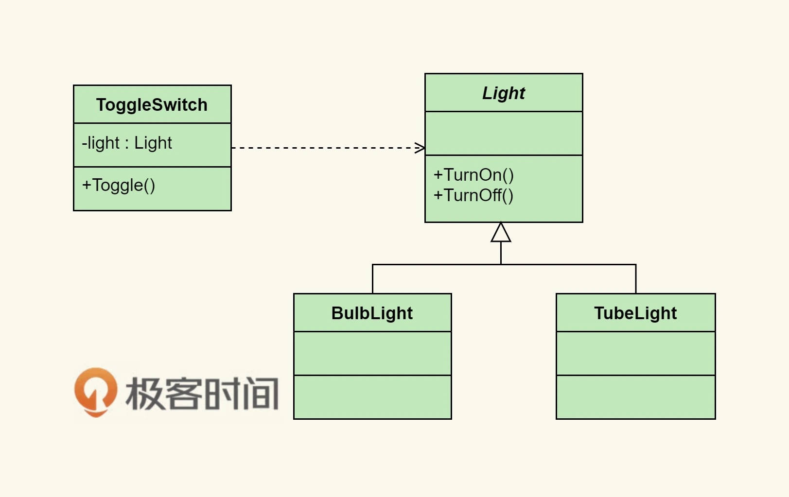

# 編程範式遊記（6）- 面向對象編程

面向對象的編程有三大特性：**封裝**、**繼承**和**多態**。

**對象則指的是類的實例**。它將對象作為程序的基本單元，將程序和數據封裝其中，以提高軟件的可重用性、靈活性和可擴展性，對象里的程序可以訪問及修改對象相關聯的數據。

這本書的 23 個經典的設計模式，基本上就是說了兩個面向對象的核心理念：

- **Program to an ‘interface’, not an ‘implementation’**.
    - 使用者不需要知道數據類型、結構、算法的細節。
    - 使用者不需要知道實現細節，只需要知道提供的接口。
    - 利於抽象、封裝、動態綁定、多態。
    - 符合面向對象的特質和理念。
- **Favor ‘object composition’ over ‘class inheritance’**.
    - 繼承需要給子類暴露一些父類的設計和實現細節。
    - 父類實現的改變會造成子類也需要改變。
    - 我們以為繼承主要是為了代碼重用，但實際上在子類中需要重新實現很多父類的方法。
    - 繼承更多的應該是為了多態。

## 拼裝對象


這個模式也表現了面向對象的拼裝數據的另一個精髓——**喜歡組合，而不是繼承**。這個模式在設計模式里叫橋接（Bridge）模式。

## 拼裝功能

假設我們用 Java 語言，我們需要先寫一個接口—— BillingStrategy，其中一個方法就是 getActPrice(double rawPrice)，輸入一個原始的價格，輸出一個根據相應的策略計算出來的價格。

```java
interface BillingStrategy {
    public double getActPrice(double rawPrice);
}
```
```java
// Normal billing strategy (unchanged price)
class NormalStrategy implements BillingStrategy {
    @Override
    public double getActPrice(double rawPrice) {
        return rawPrice;
    }
}

// Strategy for Happy hour (50% discount)
class HappyHourStrategy implements BillingStrategy {
    @Override
    public double getActPrice(double rawPrice) {
        return rawPrice * 0.5;
    }
}
```
把上面功能封裝成類，進行使用
```java
class OrderItem {
    public String Name;
    public double Price;
    public int Quantity;
    public BillingStrategy Strategy;
    public OrderItem(String name, double price, int quantity, BillingStrategy strategy) {
        this.Name = name;
        this.Price = price;
        this.Quantity = quantity;
        this.Strategy = strategy;
    }
}
```
```java
class Order {
    private List<OrderItem> orderItems = new ArrayList<OrderItem>();
    private BillingStrategy strategy = new NormalStrategy();

    public void Add(String name, double price, int quantity, BillingStrategy strategy) {
        orderItems.add(new OrderItem(name, price, quantity, strategy));
    }
    
    // Payment of bill
    public void PayBill() {
        double sum = 0;
        for (OrderItem item : orderItems) {
            
            actPrice = item.Strategy.getActPrice(item.price * item.quantity);
            sum += actPrice;
            
            System.out.println("%s -- %f(%d) - %f", 
                item.name, item.price, item.quantity, actPrice);
        }
        System.out.println("Total due: " + sum);
    }
}
```

這個設計模式叫 策略模式。我認為，這是設計模式中最為經典的模式了，其充分體現了面向對象編程的方式。

## 資源管理

```java
mutex m;

void foo() {
    m.lock();
    Func();
    if ( ! everythingOk() ) return; 
    ...
    ...
    m.unlock();
}
```
上面例子，在 if 返回時候，沒有解鎖。可以改成下面例子，缺點不好維護。
```java
mutex m;

void foo() {
    m.lock();
    Func();
    if ( ! everythingOk() ) {
        m.unlock();
        return;
    } 
    ...
    ...
    m.unlock();
}
```
面向對象的編程方式，設置一個代理
```java
class lock_guard {
  private: 
    mutex &_m;
  public:
    lock_guard(mutex &m):_m(m) { _m.lock(); }
    ~lock_guard() { _m.unlock(); }
};
```
代碼即可改成
```java
mutex m;

void foo() {
  lock_guard guard(m);
  Func();
  if ( ! everythingOk() ) {
    return;
  } 
  ...
  ...
}
```

這個技術叫 **RAII**（Resource Acquisition Is Initialization，資源獲取就是初始化）， 是 C++ 中的一個利用了面向對象的技術。這個設計模式叫 代理模式。我們可以**把一些控制資源分配和釋放的邏輯交給這些代理類，然後只需要關注業務邏輯代碼**。

從上面的代碼中，我們可以看到下面幾個面向對象的事情：

- 使用接口抽象了具體的實現類。
- 其它類耦合的是接口而不是實現類。這就是多態，其增加了程序的可擴展性。
- 因為這就是接口編程，所謂**接口也就是一種協議**，就像 HTTP 協議一樣。瀏覽器和後端的程序都依賴於這一種協議，而不是具體實現（如果是依賴具體實現，那麼瀏覽器就要依賴後端的編程語言或中間件了，這就太惡心了）。**瀏覽器和後端的程序就完全解除依賴關係，而去依賴於一個標準的協議**。
- 這就是面向對象的編程範式的精髓！同樣也是 IoC / DIP（控制反轉 / 依賴倒置）的本質。

## IoC 控制反轉

有一個開關可以控制燈泡


需要擴展，需要抽象出來 (這時候就已經可以初見耦合效果了)。若繼續擴展，就會發現開關跟燈泡耦合了，開關不能獨立出來跟其他電器配合。



因此，我們需要把開關給抽象出來，當做電器開關的一個控制協議，這樣每個電器都可以使用這個開關操作，依賴於一個標準的通電和斷電的接口，於是產生了 IoC 控制反轉，如下圖。


所謂控制反轉的意思是，開關從以前設備的專用開關，轉變到了控制電源的開關。只要符合開關廠定義的電源連接的接口，這個開關可以控制所有符合這個電源連接接口的設備。

## 小結

上面討論可以歸納幾點：

- 我們每天都在標準化和定制化中糾結。我們痛苦於哪些應該是平台要做的，哪些應該要甩出去的。
- 這裡面會出現大量的與業務無關的軟件或中間件，包括協議、數據、接口……等。
- 通過面向對象的這些方式，我們可以通過抽象來解耦，通過中間件來解耦，這樣可以降低軟件的複雜度。

總而言之，我們就是想通過**一種標準來讓業務更為規範**。

面向對象的優缺點：

優點

- 能和真實的世界交相輝映，符合人的直覺。
- 面向對象和數據庫模型設計類型，更多地關注對象間的模型設計。
- 強調於名詞而不是動詞，更多地關注對象和對象間的接口。
- 根據業務的特徵形成一個個高內聚的對象，有效地分離了抽象和具體實現，增強了可重用性和可擴展性。
- 擁有大量非常優秀的設計原則和設計模式。
- S.O.L.I.D（單一功能、開閉原則、里氏替換、接口隔離以及依賴反轉，是面向對象設計的五個基本原則）、IoC/DIP……等。

缺點

- 代碼都需要附著在一個類上，從一側面上說，其鼓勵了類型。
- 代碼需要通過對象來達到抽象的效果，導致了相當厚重的代碼粘合層。
- 因為太多的封裝以及對狀態的鼓勵，導致了大量不透明並在併發下出現很多問題。

文章 4 月 Day18 學習筆記，內容來源於極客時間 [《左耳聽風》](https://time.geekbang.org/column/article/2729)