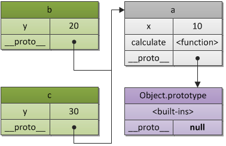

# 編程範式遊記（7）- 基于原型的编程范式

基於原型（Prototype）的編程其實也是面向對象編程的一種方式。沒有 class 化的，直接使用對象。又叫，基於實例的編程。其主流的語言就是 JavaScript，與傳統的面向對象編程的比較如下：

- 在基於類的編程當中，對象總共有兩種類型。類定義了對象的基本佈局和函數特性，而接口是可以使用的對象，它基於特定類的樣式。在此模型中，類表現為行為和結構的集合，對所有接口來說這些類的行為和結構都是相同的。因而，區分規則首先是基於行為和結構，而後才是狀態。
- 原型編程的主張者經常爭論說，基於類的語言提倡使用一個關注分類和類之間關係的開發模型。與此相對，原型編程看起來提倡程序員關注一系列對象實例的行為，而之後才關心如何將這些對象劃分到最近的使用方式相似的原型對象，而不是分成類。

## JavaScript 的原型概念

基於原型編程，不要 Class，就直接在對象上修改，基於編程的修改，直接對類型進行修改。

如果我们把 foo 赋值给 bar.__proto__，那就意味着，bar 的原型就成了 foo 的。
```JavaScript
bar.__proto__ = foo; // foo is now the prototype of bar.
```

需要解釋一下 JavaScript 的兩個東西，一個是 __proto__，另一個是 prototype，這兩個東西很容易混淆。這裡說明一下：

- __proto__ 主要是安放在一個實際的對象中，用它來產生一個鏈接，一個原型鏈，用於尋找方法名或屬性，等等。
- prototype 是用 new 來創建一個對象時構造 __proto__ 用的。它是構造函數的一個屬性。

可以簡單地認為，__proto__ 是所有對象用於鏈接原型的一個指針，而 prototype 則是 Function 對象的屬性，其主要是用來當需要new一個對象時讓 __proto__ 指針所指向的地方。 對於超級對象 Function 而言， Function.__proto__ 就是 Function.prototype。

```js
var a = {
  x: 10,
  calculate: function (z) {
    return this.x + this.y + z;
  }
};
 
var b = {
  y: 20,
  __proto__: a
};
 
var c = {
  y: 30,
  __proto__: a
};
 
// call the inherited method
b.calculate(30); // 60
c.calculate(40); // 80
```
其中 原型鏈 如下所示：



## JavaScript 原型編程的面向對象


## 小結

其實就是一種委託的方式。在使用委託的基於原型的語言中，運行時語言可以**僅僅通過序列的指針找到匹配**這樣的方式來定位屬性或者尋找正確的數據。所有這些創建行為、共享的行為需要的是委託指針。

這種在對象裡面直接修改的玩法，雖然可以帶來運行時的靈活性，但是其帶來了執行的不確定性，也有安全性的問題。

文章 4 月 Day19 學習筆記，內容來源於極客時間 [《左耳聽風》](https://time.geekbang.org/column/article/2741)