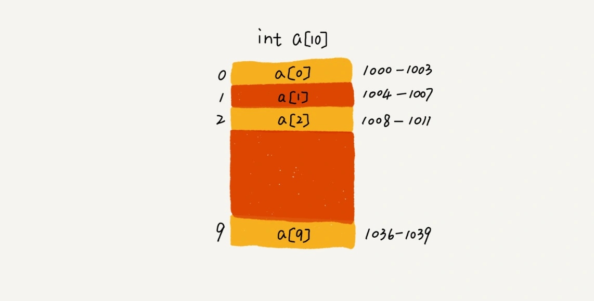

# 數組

## 如何實現隨機訪問？

數組（Array）是一種線性表數據結構。它用**一組連續的內存空間**，來存儲一組具有**相同類型的數據**。

兩個關鍵點：

1. 線性表（Linear List）：**每個線性表上的數據最多只有前和後兩個方向**。其實除了數組，鏈表、隊列、棧等也是線性表結構。


在非線性表中，數據之間並不是簡單的前後關係。


2. 連續的內存空間和相同類型的數據： 因為有這兩個限制，才能隨機訪問，但相對很多操作也因此低效。

如何實現隨機訪問數組元素？

假設給數組 a[10]，分配了一塊連續內存空間 1000～1039，其中，內存塊的首地址為 base_address = 1000。



尋址公式為
```
a[i]_address = base_address + i * data_type_size
```

代入上面假設，就是數組中存儲的是 int 類型數據，所以 data_type_size 就為 4 個字節，也就可以快速找到每個地址。

> 補充：數組和鏈表的區別為數組支持隨機訪問，根據下標隨機訪問的時間複雜度為 O(1)。

## 低效的插入和刪除

數組為了保持內存數據的連續性，會導致插入、刪除這兩個操作比較低效。

### 插入操作

- **頭部**：在數組的開頭插入元素，那所有的數據都需要依次往後移動一位，所以最壞時間複雜度是 O(n)。 因為我們在每個位置插入元素的概率是一樣的，所以平均情況時間複雜度為 (1+2+...n)/n=O(n)。
- **末尾**：在數組的末尾插入元素，那就不需要移動數據了，這時的時間複雜度為 O(1)

假设数组 a[10]中存储了如下 5 个元素：a，b，c，d，e。

现在需要将元素 x 插入到第 3 个位置。我们只需要将 c 放入到 a[5]，将 a[2]赋值为 x 即可。最后，数组中的元素如下： a，b，x，d，e，c。


利用這種處理技巧，在特定場景下，在第 k 個位置插入一個元素的時間複雜度就會降為 O(1)。

### 刪除操作

和插入類似，如果刪除數組末尾的數據，則最好情況時間複雜度為 O(1)；如果刪除開頭的數據，則最壞情況時間複雜度為 O(n)；平均情況時間複雜度也為 O(n)。

在某些特殊場景下，我們並不一定非得追求數組中數據的連續性。如果我們**將多次刪除操作集中在一起執行，刪除的效率會不會提高**很多？

假設數組 a[10]中存儲了 8 個元素：a，b，c，d，e，f，g，h。現在，我們要依次刪除 a，b，c 三個元素。


為了避免 d，e，f，g，h 這幾個數據會被搬移三次，我們可以先記錄下已經刪除的數據。**每次的刪除操作並不是真正地搬移數據，只是記錄數據已經被刪除**。當數組沒有更多空間存儲數據時，我們再觸發執行一次真正的刪除操作，這樣就大大減少了刪除操作導致的數據搬移。

JVM 的標記清除算法的核心思想也是這邏輯。

## 數組越界訪問

直接上例子，下面為 C 語言例子
```c
int main(int argc, char* argv[]){
    int i = 0;
    int arr[3] = {0};
    for(; i<=3; i++){
        arr[i] = 0;
        printf("hello world\n");
    }
    return 0;
}
```
在 C 語言中，只要不是訪問受限的內存，所有的內存空間都是可以自由訪問的，a[3]=0 就相當於 i=0，所以就會導致代碼無限循環。

訪問數組的本質就是訪問一段連續內存，只要數組通過偏移計算得到的內存地址是可用的，那麼程序就可能不會報任何錯誤。

并非所有的语言都像 C 一样，把数组越界检查的工作丢给程序员来做，像 Java 本身就会做越界检查，比如下面这几行 Java 代码，就会抛出 **java.lang.ArrayIndexOutOfBoundsException**。

```java
int[] a = new int[3];
a[3] = 10;
```

## 容器能否完全替代數組

針對數組類型，很多語言都提供了容器類，比如 Java 中的 ArrayList、C++ STL 中的 vector。

ArrayList 最大的優勢就是可以**將很多數組操作的細節封裝起來**。比如前面提到的數組插入、刪除數據時需要搬移其他數據等，以及**支持動態擴容**。

需要留意的是，因為**擴容操作**涉及內存申請和數據搬移，是比較**耗時**的。所以，**如果事先能確定需要存儲的數據大小，最好在創建 ArrayList 的時候事先指定數據大小**。

## 小結

1. Java ArrayList 無法存儲基本類型，比如 int、long，需要封裝為 Integer、Long 類，而 Autoboxing、Unboxing 則有一定的性能消耗，所以如果特別關注性能，或者希望使用基本類型，就可以選用數組。
2. 如果數據大小事先已知，並且對數據的操作非常簡單，用不到 ArrayList 提供的大部分方法，也可以直接使用數組。
3. 要表示多維數組時，用數組往往會更加直觀。比如 Object[][] array；而用容器的話則需要這樣定義：ArrayList<ArrayList<object> > array。

對於**業務開發，可以直接使用容器**就足夠了，省時省力。畢竟損耗一丟丟性能，完全不會影響到系統整體的性能。但如果是做一些非常底層的開發，比如開發網絡框架，性能的優化需要做到極致，這個時候數組就會優於容器，成為首選。

另外，**數組下標為什麼從 0 開始**？
> 從數組存儲的內存模型上來看，下標最確切的定義應該是偏移（offset）。
> ```
> // 從 0 開始
> a[k]_address = base_address + k * type_size
> // 從 1 開始
> a[k]_address = base_address + (k-1)*type_size
> ```
> 從 1 開始編號，每次隨機訪問數組元素都**多了一次減法運算**，對於 CPU 來說，就是**多了一次減法指令**。

## 補充知識

### JVM標記清除算法

大多數主流虛擬機採用**可達性分析算法**來判斷對象是否存活，在標記階段，會遍歷所有 GC ROOTS，將所有 GC ROOTS 可達的對象標記為存活。只有當標記工作完成後，清理工作才會開始。

不足：
1. 效率問題。標記和清理效率都不高，但是當知道只有少量垃圾產生時會很高效。
2. 空間問題。會產生不連續的內存空間碎片。

### 二維數組內存尋址

對於 m * n 的數組，a [ i ][ j ] (i < m,j < n) 的地址為：

```
address = base_address + ( i * n + j ) * type_size
```

對於不同的編譯器，在內存分配時，會按照內存地址遞增或遞減的方式進行分配。老師的程序，如果是內存地址遞減的方式，就會造成無限循環。

文章 4 月 Day2 學習筆記，內容來源於極客時間 [《數據結構與算法之美》](https://time.geekbang.org/column/article/40961)