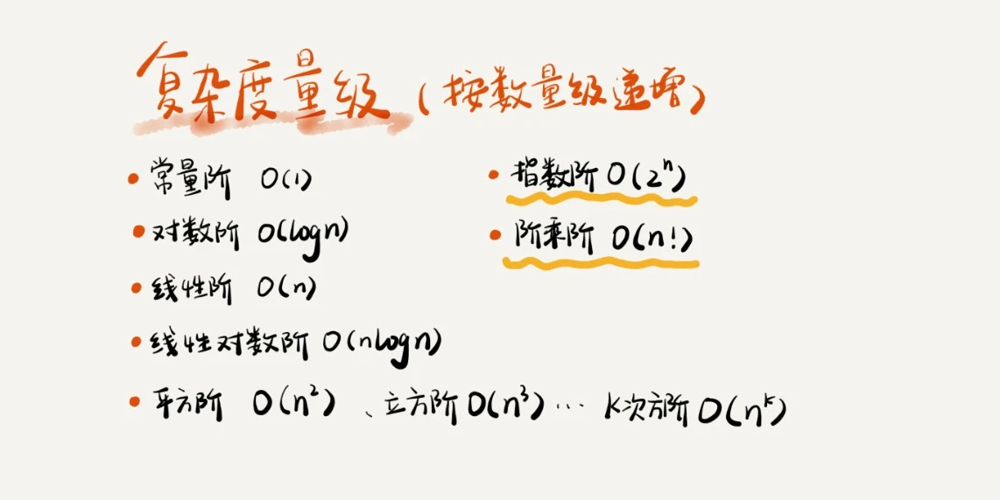
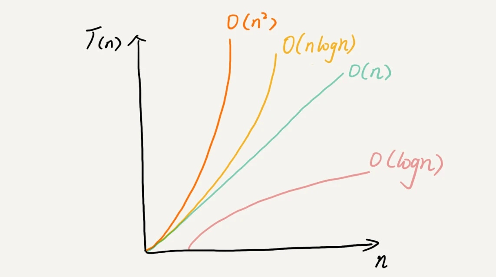
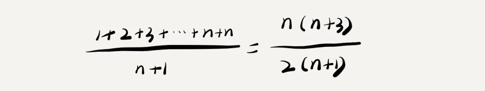
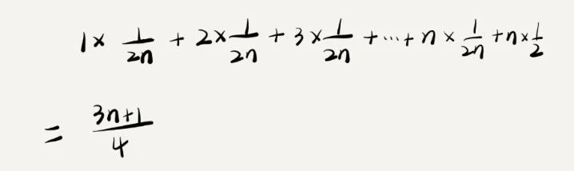
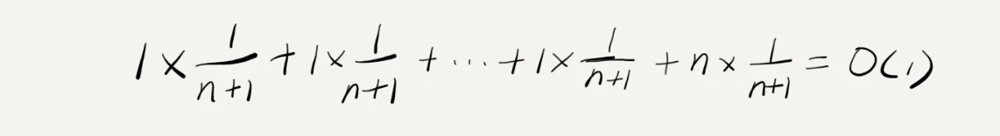

# 複雜度分析

複雜度分析是整個算法學習的精髓，只要掌握了它，數據結構和算法的內容基本上就掌握了一半，才能知道各數據結構和相應算法下的性能和效率。

## 為什麼需要複雜度分析？

**把代碼跑一遍，通過統計、監控，就能得到算法執行時間和佔用的內存大小**，這種成為**事後統計法**，但會有以下局限性：

1. 測試結果依賴於測試環境
2. 測試結果受數據規模的影響很大

我們**需要一個不用具體的測試數據來測試，就可以粗略地估計算法的執行效率的方法**。這就是我們今天要討論的時間、空間複雜度分析方法。

## 大 O 複雜度表示法

粗略地估計算法的執行效率，也就是算法代碼的執行時間。

下面累加的兩個例子：
```java
 int cal(int n) {
   int sum = 0;
   int i = 1;
   for (; i <= n; ++i) {
     sum = sum + i;
   }
   return sum;
 }
```
```java
 int cal(int n) {
   int sum = 0;
   int i = 1;
   int j = 1;
   for (; i <= n; ++i) {
     j = 1;
     for (; j <= n; ++j) {
       sum = sum +  i * j;
     }
   }
 }
```
儘管每行代碼對應的 CPU 執行的個數、執行的時間都不一樣，但是，我們這裡只是粗略估計，所以可以**假設每行代碼執行的時間都一樣**，為 **unit_time**。

第一段代碼執行時間為 (2n+2)*unit_time。
第二段代碼執行時間為 (2n2+2n+3)*unit_time。

可以得知，**所有代碼的執行時間 T(n) 與每行代碼的執行次數 f(n) 成正比**。
```math
T(n) = O(f(n))
```
> T(n) 表示代碼執行的時間；n 表示數據規模的大小；f(n) 表示每行代碼執行的次數總和。因為這是一個公式，所以用 f(n) 來表示。公式中的 O，表示代碼的執行時間 T(n) 與 f(n) 表達式成正比。

## 時間複雜度分析

1. 只關注執行次數最多的一段代碼
2. 加法法則：總時間復雜度等於量級最大的那段代碼複雜度
3. 乘法法則：嵌套代碼的複雜度等於嵌套內外代碼複雜度的乘積
    ```math
    T1(n)=O(f(n))，T2(n)=O(g(n))；
    ```
    
    ```math
    T(n)=T1(n)+T2(n)=max(O(f(n)), O(g(n))) =O(max(f(n), g(n))).
    ```
## 常見時間負責度示例分析

把**時間複雜度為非多項式量級的**算法問題叫作 **NP（Non-Deterministic Polynomial，非確定多項式）**問題。因此，我們只討論常見的多項式時間複雜度。



1. O(1)
```java
 int i = 8;
 int j = 6;
 int sum = i + j;
```
1. O(logn)、O(nlogn)
對數之間是可以互相轉換的，log3n 就等於 log32 * log2n。
採用大 O 標記複雜度的時候，可以忽略系數，即 O(Cf(n)) = O(f(n))。
```java
 # O(log2n) 以 2 為底
 i=1;
 while (i <= n)  {
   i = i * 2;
 }
 ---
 # O(log3n) 以 3 為底
 i=1;
 while (i <= n)  {
   i = i * 3;
 }
```
3. O(m+n)、O(m*n)
m 和 n 是表示兩個數據規模。我們無法事先評估 m 和 n 誰的量級大，所以我們在表示複雜度的時候，就不能簡單地利用加法法則，省略掉其中一個。
```java
int cal(int m, int n) {
  int sum_1 = 0;
  int i = 1;
  for (; i < m; ++i) {
    sum_1 = sum_1 + i;
  }

  int sum_2 = 0;
  int j = 1;
  for (; j < n; ++j) {
    sum_2 = sum_2 + j;
  }

  return sum_1 + sum_2;
}
```

## 空間複雜度分析

**時間複雜度**的全稱是漸進時間複雜度，表示**算法的執行時間與數據規模之間的增長關係**。
**空間複雜度**全稱就是漸進空間複雜度（asymptotic space complexity），表示**算法的存儲空間與數據規模之間的增長關係**。

```java
# 為了方便解釋
void print(int n) {
  int i = 0;
  int[] a = new int[n]; # 申請空間存儲變量 
  for (i; i <n; ++i) {
    a[i] = i * i;
  }

  for (i = n-1; i >= 0; --i) {
    print out a[i]
  }
}
```
代碼空間複雜度為 O(n)

## 基礎複雜度

複雜度也叫漸進複雜度，包括時間複雜度和空間複雜度，用來分析算法執行效率與數據規模之間的增長關係，可以粗略地表示，越高階複雜度的算法，執行效率越低。



#  複雜度分析知識點

## 最好、最壞情況時間複雜度

直接進代碼
```java
// n 表示數組 array 長度
int find(int[] array, int n, int x) {
  int i = 0;
  int pos = -1;
  for (; i < n; ++i) {
    if (array[i] == x) pos = i;
  }
  return pos;
}
```
代碼複雜度為 O(n)
```java
// n 表示數組 array 長度
int find(int[] array, int n, int x) {
  int i = 0;
  int pos = -1;
  for (; i < n; ++i) {
    if (array[i] == x) {
       pos = i;
       break;
    }
  }
  return pos;
}
```
改成這樣情況，就會討論到三個概念：**最好情況時間複雜度**、**最壞情況時間複雜度**和**平均情況時間複雜度**。

## 平均情況時間複雜度 (平均時間複雜度)

因為最好情況時間複雜度和最壞情況時間複雜度對應的都是極端情況下的代碼複雜度，發生機率其實不大。為了更好地表示平均情況下的複雜度，我們需要引入另一個概念：平均情況時間複雜度，也可以稱為平均時間複雜度。



我們假設在數組中與不在數組中的機率都為 1/2。要查找的數據出現在 0～n-1 這 n 個位置的機率也是一樣的，為 1/n。所以，根據機率乘法法則，要查找的數據出現在 0～n-1 中任意位置的機率就是 1/(2n)。



這數值就是機率中的加權平均值，也為期望值，所以平均時間複雜度的全稱應該叫**加權平均時間複雜度**或者**期望時間複雜度**。

**只有同一塊代碼在不同的情況下，時間複雜度有量級的差距，我們才會使用這三種複雜度表示法來區分。**

## 均攤時間複雜度

平均複雜度只在某些特殊情況下才會用到，而均攤時間複雜度應用的場景比它更加特殊、更加有限。

以下例子方便說明
```java
 // array 表示一個長度為 n 的數組
 // 代碼中 array.length 就等於 n
 int[] array = new int[n];
 int count = 0;
 
 void insert(int val) {
    if (count == array.length) {
       int sum = 0;
       for (int i = 0; i < array.length; ++i) {
          sum = sum + array[i];
       }
       array[0] = sum;
       count = 1;
    }

    array[count] = val;
    ++count;
 }
```
平均時間複雜度為 O(1)。可以通過前面講的方法來分析。

根據數據插入的位置的不同，我們可以分為 n 種情況，每種情況的時間複雜度是 O(1)。除此之外，還有一種**額外**的情況，就是在數組沒有空閒空間時插入一個數據，這個時候的時間複雜度是 O(n)。而且，這 n+1 種情況發生的概率一樣，都是 1/(n+1)。所以，根據加權平均的計算方法，我們求得的平均時間複雜度就是：



對比一下前面提到的 insert() 和 find() 兩個例子，就會發現這兩者有很大差別：
- find() 函數在極端情況下，複雜度才為 O(1)。但 insert() 在大部分情況下，時間複雜度都為 O(1)。只有個別情況下，複雜度才比較高，為 O(n)。這是 insert()第一個區別於 find() 的地方。
- 第二個不同的地方。對於 insert() 函數來說，O(1) 時間複雜度的插入和 O(n) 時間複雜度的插入，出現的頻率是非常有規律的，而且有一定的前後時序關係，一般都是一個 O(n) 插入之後，緊跟著 n-1 個 O(1) 的插入操作，循環往復。

針對這種特殊的場景，我們引入了一種更加簡單的分析方法：**攤還分析法**，通過攤還分析得到的時間複雜度我們起了一個名字，叫**均攤時間複雜度**。

以 insert() 例子，一個 O(n) 插入之後，緊跟著 n-1 個 O(1) 的插入操作，**耗時多的那次操作均攤到接下來的 n-1 次耗時少的操作上**，均攤下來，這一組連續的操作的均攤時間複雜度就是 O(1)。這就是均攤分析的大致思路。

在能夠應用均攤時間複雜度分析的場合，一般均攤時間複雜度就等於最好情況時間複雜度。

# 小結

學習了幾個複雜度分析相關的概念，分別有：最好情況時間複雜度、最壞情況時間複雜度、平均情況時間複雜度、均攤時間複雜度。之所以引入這幾個複雜度概念，是因為，同一段代碼，在不同輸入的情況下，複雜度量級有可能是不一樣的。

均攤時間複雜度就是一種特殊的平均時間複雜度，我們沒必要花太多精力去區分它們。你最應該掌握的是它的分析方法，攤還分析。至於分析出來的結果是叫平均還是叫均攤，這只是個說法，並不重要。

文章 4 月 Day1 學習筆記，內容來源於極客時間 [《數據結構與算法之美》](https://time.geekbang.org/column/article/40036)