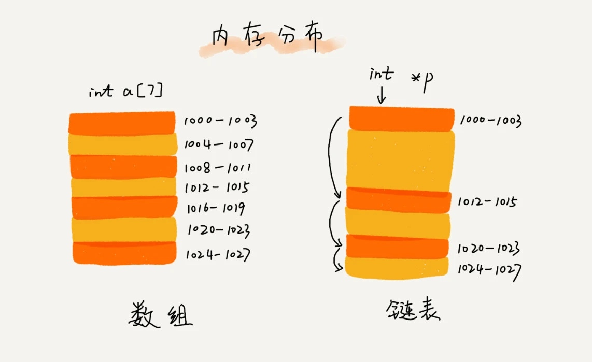
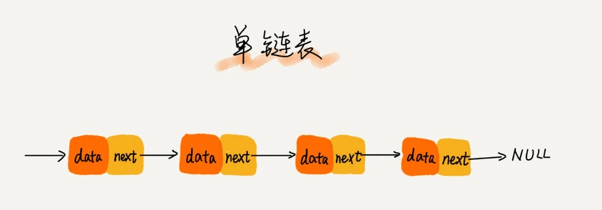
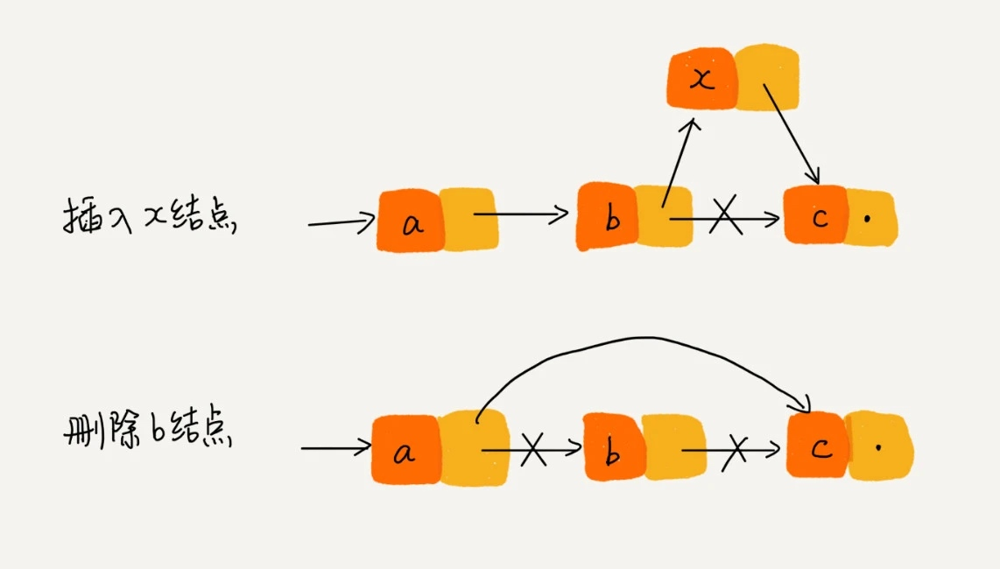
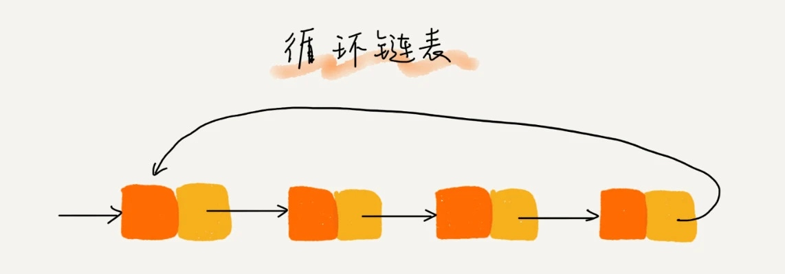
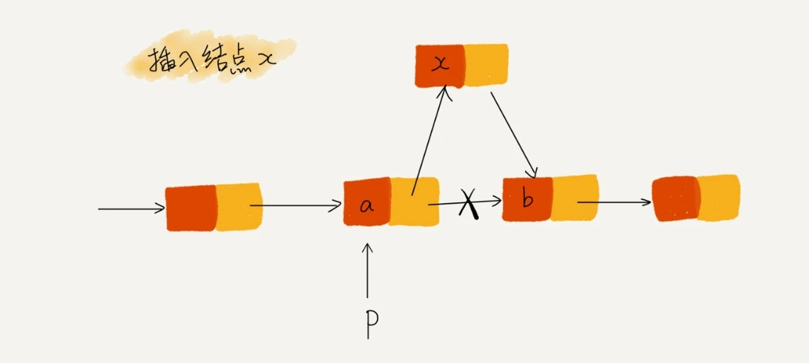
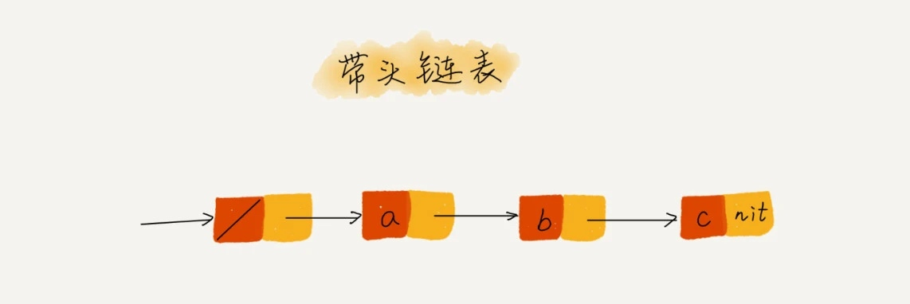
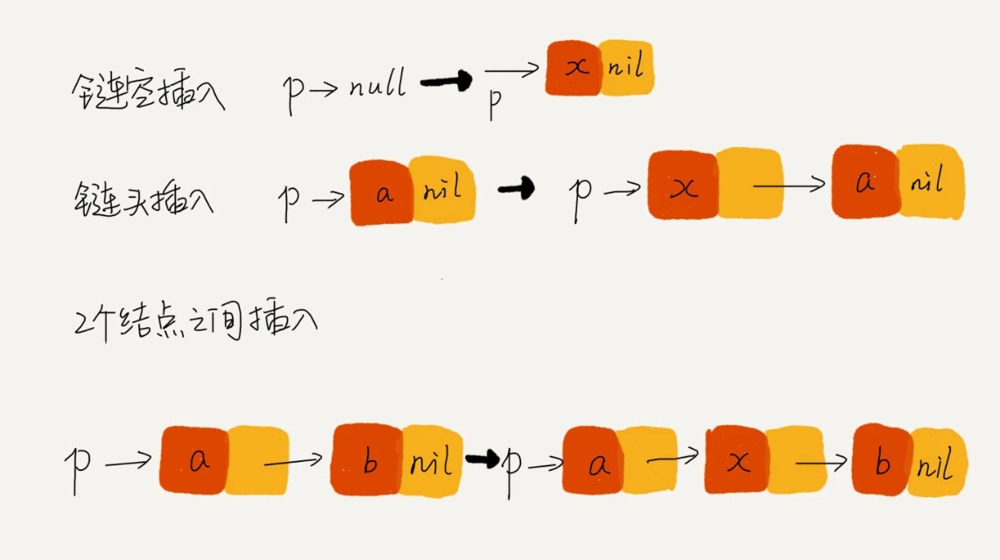

# 鏈表 LinkedList

經典鏈表應用場景：LRU 緩存淘汰算法。

緩存是一種提高數據讀取性能的技術，在硬件設計、軟件開發中都有著非常廣泛的應用，比如常見的 CPU 緩存、數據庫緩存、瀏覽器緩存等等。

常見的緩存策略有三種：**先進先出策略 FIFO（First In，First Out）**、**最少使用策略 LFU（Least Frequently Used）**、**最近最少使用策略 LRU（Least Recently Used）**。

## 鏈表結構

鏈表通過指針將一組零散的內存塊串聯起來使用。



常見的鏈表結構分為：單鏈表、雙向鏈表、循環鏈表。

單鏈表



從圖中可以看到，鏈表的插入、刪除操作，只需要考慮旁邊的節點指針，因此時間復雜度為 O(1)。但隨機訪問，因為不知道確切位置，只能一個一個找，故需要 O(n) 的時間複雜度。

雙向鏈表


從圖中可以看到，雙向鏈表需要額外的兩個空間來存儲後繼節點和前驅節點的地址。
雙向鏈表支持 O(1) 時間複雜度的情況下找到前驅節點。

### 雙向鏈表跟單鏈表實際應用差異

刪除操作：

在實際開發中，從鏈表中刪除一個數據無外乎這兩種情況：
- 刪除節點中值等於某個給定值的節點；
- 刪除給定指針指向的節點。

單鏈表雖然刪除操作的時間複雜度是 O(1)，但只能一個個找確切節點的前後節點關係，遍歷查找的時間複雜度為 O(n)；
雙向鏈表刪除操作的時間複雜度是 O(1)，但因為刪除節點有包含前後節點因素，故可以直接刪除，查找時間複雜度為 O(1)。

這就是為什麼在實際軟件開發中，雙向鏈表儘管比較花費內存，但還是比單鏈表的應用更加廣泛的原因。如果熟悉 Java 語言，肯定用過 **LinkedHashMap** 這個容器。如果你深入研究 LinkedHashMap 的實現原理，就會發現其中就用到了**雙向鏈表**這種數據結構。

可以得出，**對於執行較慢的程序，可以通過消耗更多的內存（空間換時間）來進行優化；而消耗過多內存的程序，可以通過消耗更多的時間（時間換空間）來降低內存的消耗**。

循環鏈表


跟單鏈表唯一的差別為末尾節點：單鏈表指向空地址；循環鏈表指向鏈表頭節點。
當數據具有環形結構特點時，就很適合採用循環鏈表。

## 鏈表 vs 數組性能比較

| 比較項目      | 鏈表                                                 | 數組                                                                           |
|:-------------:|:----------------------------------------------------:|:------------------------------------------------------------------------------:|
| 插入/刪除操作 | O(1)                                                 | O(n)                                                                           |
| 隨機訪問      | O(n)                                                 | O(1)                                                                           |
| 順序訪問      | O(n)                                                 | O(n)                                                                           |
| 內存佔用      | 較大，因為需要為每個節點分配內存空間                  | 較小，因為數組中的元素在內存中是連續存儲的                                      |
| 線性增長      | 不需要重新分配內存，因為只需要分配新節點的內存空間    | 需要重新分配內存，因為數組中的元素是連續存儲的，當數組大小不足時需要重新分配內存 |
| 緩存效能      | 較差，因為鏈表的節點不是連續存儲的，容易產生緩存未命中 | 較好，因為數組中的元素在內存中是連續存儲的，容易產生緩存命中                     |

因為鏈表中的每個節點都需要消耗額外的存儲空間去存儲一份指向下一個節點的指針，所以內存消耗會翻倍。而且，對鏈表進行頻繁的插入、刪除操作，還會導致頻繁的內存申請和釋放，容易造成內存碎片，如果是 Java 語言，就有可能會導致頻繁的 GC（Garbage Collection，垃圾回收）。

## 如何基於鏈表實現 LRU 緩存淘汰算法？

設計思路：
- 使用一個單鏈表，尾節點放最少使用，頭節點放最常使用。
- 當數據在緩存鏈表中，遍歷得到確切節點，把該節點移到頭節點。
- 當數據沒有在緩存鏈表中，會分為兩種情況：
    - 緩存未滿，直接插入到鏈表頭節點
    - 緩存已滿，先刪除鏈表末尾節點，再將新節點插入頭部節點
- 優化可以把數據位置記錄下來(像是加入 Hash table)，這樣緩存訪問的時間複雜度從 O(n) 變成 O(1)。

## 技巧一：理解指針或引用的含義

將某個變量賦值給指針，實際上就是將這個變量的地址賦值給指針，或者反過來說，**指針中存儲了這個變量的內存地址**，指向了這個變量，通過指針就能找到這個變量。

例如
```java
# p 節點中的 next 指針存儲了 q 節點的內存地址。
p->next=q

# p 節點的 next 指針存儲了 p 節點的下下一個節點的內存地址。
p->next=p->next->next
```

## 技巧二：警惕指針丟失和內存洩漏



假設我們要在節點 a、b 中插入 x，當前指針 p 指向節點 a。
如果我們代碼如下，將會發生指針丟失和內存洩漏問題
```java
p->next = x;  // 將 p 的 next 指針指向 x 節點；
x->next = p->next;  // 將 x 的節點的 next 指針指向 b 節點；
```
只要把上述代碼反過來，則可以正常訪問。

**當編程語言沒有支持自動管理內存，刪除鏈表節點時，要記得手動釋放內存空間**。

## 技巧三：利用哨兵簡化實現難度

針對鏈表的插入、刪除操作，需要對插入第一個節點和刪除最後一個節點的情況進行特殊處理。
```java
# 頭節點處理
if (head == null) {
  head = new_node;
}
# 尾節點處理
if (head->next == null) {
   head = null;
}
```

哨兵，解決的是國家之間的邊界問題。同理，這裡說的**哨兵也是解決邊界問題**的，不直接參與業務邏輯。

引入哨兵節點，在任何時候，不管鏈表是不是空，**head 指針都會一直指向這個哨兵節點**。我們也把這種有哨兵節點的鏈表叫帶頭鏈表。相反，沒有哨兵節點的鏈表就叫作不帶頭鏈表。

針對上面提到的插入第一個節點和插入其他節點，刪除最後一個節點和刪除其他節點，就可以統一使用相同的代碼了。


> 這種利用哨兵簡化編程難度的技巧，在很多代碼實現中都有用到，比如插入排序、歸並排序、動態規劃等。

## 技巧四：重點留意邊界條件處理

代碼在一些邊界或者異常情況下，最容易產生 Bug。

經常用來檢查鏈表代碼是否正確的邊界條件有這樣幾個：
* 如果鏈表為空時，代碼是否能正常工作？
* 如果鏈表只包含一個節點時，代碼是否能正常工作？
* 如果鏈表只包含兩個節點時，代碼是否能正常工作？
* 代碼邏輯在處理頭節點和尾節點的時候，是否能正常工作？

> 預先思考過邊界情況或者異常情況，這樣寫出來的代碼才夠健壯。

## 技巧五：舉例畫圖，輔助思考

把問題畫在紙上，減少大腦思考問題的時間和容量，留更多的給邏輯思考，這樣就會感覺到思路清晰很多。

如圖所示：



## 技巧六：多寫多練，沒有捷徑

熟能生巧！

作者精選了 5 個常見的鏈表操作，練熟就不會害怕寫鏈表代碼：

* 單鏈表反轉
* 鏈表中環的檢測
* 兩個有序的鏈表合併
* 刪除鏈表倒數第 n 個節點
* 求鏈表的中間節點

> leetcode：
>  1.單鏈表反轉：206 
>  2.鏈表中環的檢測：141 
>  3.兩個有序的鏈表合併：21 
>  4.刪除鏈表倒數第n個結點：19 
>  5.求鏈表的中間結點：876

## 小結

需要**根據具體情況，權衡選擇數組還是鏈表**。
和數組相比，鏈表更適合插入、刪除操作頻繁的場景，查詢的時間複雜度較高。

探討寫出正確鏈表代碼的六個技巧。分別是**理解指針或引用的含義、警惕指針丟失和內存洩漏、利用哨兵簡化實現難度、重點留意邊界條件處理，以及舉例畫圖、輔助思考，還有多寫多練**。

寫鏈表代碼是最考驗邏輯思維能力的。

文章 4 月 Day3 學習筆記，內容來源於極客時間 [《數據結構與算法之美》](https://time.geekbang.org/column/article/41013)