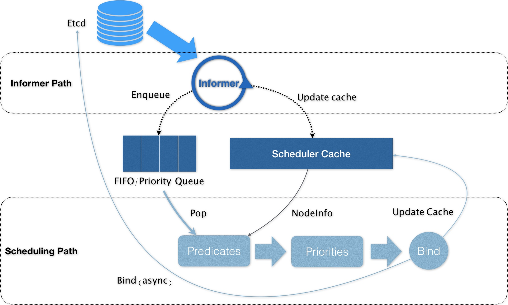
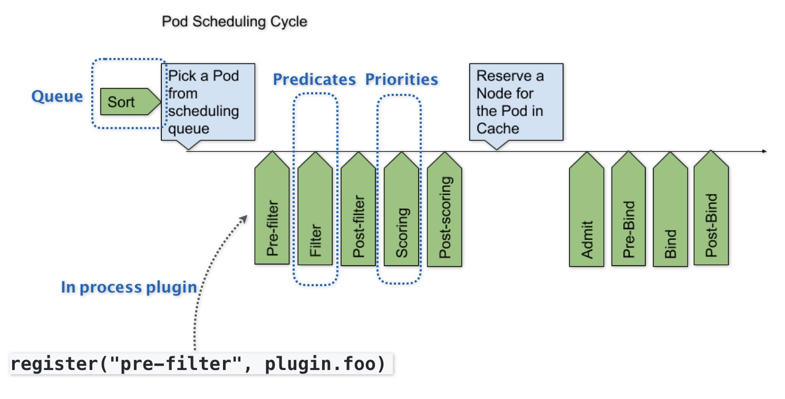

# Day02 深入剖析 Kubernetes - 十字路口上的Kubernetes默認調度器

## 十字路口上的Kubernetes默認調度器
> Ref:
> - [Scheduling Framework](https://kubernetes.io/docs/concepts/scheduling-eviction/scheduling-framework/)

在 Kubernetes 項目中，默認調度器（`default scheduler`）的**主要職責，就是為一個新創建出來的 Pod，尋找一個最合適的節點（Node）**。

- 從集群所有的節點中，根據 `Predicate` 調度算法挑選出所有可以運行該 Pod 的節點
- 從第一步的結果中，再根據 `Priority` 調度算法挑選一個最符合條件的節點作為最終結果

`Scheduling Path` 主要邏輯，就是不斷地從調度隊列拿出一個 `Pod`，調用 `Predicate` 算法進行過濾，會得到一組 Nodes，為所有可以運行此 Pod 的宿主機（ `Node` 訊息，從 `Scheduler Cache` 拿到）列表，再調用 `Priority` 算法幫列表裡的每個 `Node` 打分，得分最高者為此次調度結果，這一些系列稱為 `Bind` 階段操作。

- Kubernetes 調度器只有對`調度隊列`和 `Scheduler Cache` 進行操作時，才需要加鎖

為了不在關鍵調度遠程訪問 `API Server`，默認調度器採用樂觀 API 對象更新，只會更新 `Scheduler Cache` 中的 Pod 和 Node 訊息，稱之為 `Assume` 階段。

等 `Assume` 後，調度器再起一個 `Goroutine` 去異步向 `API Server` 發起 Pod 更新請求，完成 `Bind` 階段操作。更新失敗，等 `Scheduler Cache` 回滾同步即可。

> 在 Scheduling Path 上，調度器會啓動多個 Goroutine 以節點為粒度併發執行 Predicates 算法，從而提高這一階段的執行效率。而與之類似的，Priorities 算法也會以 MapReduce 的方式並行計算然後再進行匯總。而在這些所有需要併發的路徑上，調度器會避免設置任何全局的競爭資源，從而免去了使用鎖進行同步帶來的巨大的性能損耗。

Kubernetes 默認調度器的可擴展性設計，示意圖

- 默認調度器的可擴展機制，在 Kubernetes 裡面叫作 `Scheduler Framework`
- 這個設計的主要目的，就是在**調度器生命週期的各個關鍵點上，為用戶暴露出可以進行擴展和實現的接口**，從而實現由用戶自定義調度器的能力

缺點為關鍵插入點接口設計不善，導致整個生態或是鏈路沒法把插件機制串連起來

此文章為2月Day02學習筆記，內容來源於極客時間[《深入剖析Kuberentes》](https://time.geekbang.org/column/article/69890)