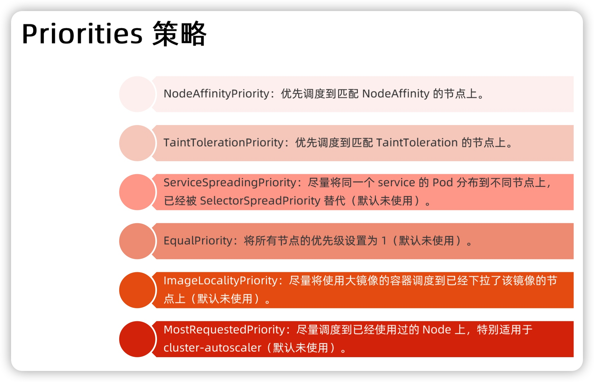

# Day03 深入剖析 Kubernetes - Kubernetes 默認調度器策略解析

## Kubernetes 默認調度器策略解析

### Predicate

- `Predicate` 在調度過程中，作用為 **filter**

默認調度策略有 4 種：

#### GeneralPredicates
    
- **負責最基礎的調度策略**，如 `PodFitsResources` 計算宿主機的 CPU 和內存資源是否足夠
- `PodFitsResources` 檢查的只是 Pod 的 `requests` 字段

> Kubernetes 調度器沒有為 GPU 等硬件資源定義具體的資源類型，而是統一用 `Extended Resource` 的 Key-Value 格式擴展字段來描述。Node 的 `Capacity` 字段裡也要加上對應的 Key-Value。

- 聲明使用 2 個 NVIDIA 類型的 GPU 資源
```yaml
apiVersion: v1
kind: Pod
metadata:
  name: extended-resource-demo
spec:
  containers:
  - name: extended-resource-demo-ctr
    image: nginx
    resources:
      requests:
        alpha.kubernetes.io/nvidia-gpu: 2 
      limits:
        alpha.kubernetes.io/nvidia-gpu: 2
```

- `PodFitsResources` 中，調度器不知道字段 key 是要用 GPU，而是直接使用後面的 value 進行計算

- `kubelet` 在啓動 Pod 前，會執行一個 `Admit` 操作來進行二次確認。這裡二次確認的規則，就是執行一遍 `GeneralPredicates`

#### 跟 volume 相關過濾規則:

- 負責跟容器持久化 `Volume` 相關的調度策略
- `NoDiskConflict`: 是多個 Pod 聲明掛載的持久化 Volume 是否有衝突
- `MaxPDVolumeCountPredicate`: 是一個節點上某種類型的持久化 Volume 是不是已經超過了一定數目
- `VolumeZonePredicate`: 檢查持久化 Volume 的 Zone（高可用域）標籤，是否與待考察節點的 Zone 標籤相匹配
- `VolumeBindingPredicate`: 檢查 Pod 對應 PV 的 nodeAffinity 字段是否跟節點名稱是否相同

**根據 Pod 聲明的 PVC 來選定對應的節點（與 PV 親和的）進行相應的調度**
```yaml
apiVersion: v1
kind: PersistentVolume
metadata:
  name: example-local-pv
spec:
  capacity:
    storage: 500Gi
  accessModes:
  - ReadWriteOnce
  persistentVolumeReclaimPolicy: Retain
  storageClassName: local-storage
  local:
    path: /mnt/disks/vol1
  nodeAffinity:
    required:
      nodeSelectorTerms:
      - matchExpressions:
        - key: kubernetes.io/hostname
          operator: In
          values:
          - my-node # 節點名稱
```

#### 跟宿主機相關過濾規則:

- 主要考察待調度 Pod 是否滿足 Node 本身的某些條件
- `PodToleratesNodeTaints`: 檢查污點（taint），可以容忍污點的 Pod 才可以被調度到相應的節點上
- `NodeMemoryPressurePredicate`: 檢查節點內存是否足夠，不夠不調度

#### 跟 Pod 相關過濾規則:

- 大多雷同 `GeneralPredicates` 規則
- `PodAffinityPredicate`: 檢查待調度 Pod 與 Node 上已有 Pod 之間的 親和（`affinity`）與反親和（`anti-affinity`）關係

反親和例子： **只作用於 `kubernetes.io/hostname` 標籤的節點 Node 上，且不會跟帶有 `security=S2` 標籤的 Pod 共存於同一個 Node**。
```yaml
apiVersion: v1
kind: Pod
metadata:
  name: with-pod-antiaffinity
spec:
  affinity: # Pod Affinity
    podAntiAffinity: 
      requiredDuringSchedulingIgnoredDuringExecution: 
      - weight: 100  
        podAffinityTerm:
          labelSelector:
            matchExpressions:
            - key: security 
              operator: In 
              values:
              - S2
          topologyKey: kubernetes.io/hostname
  containers:
  - name: with-pod-affinity
    image: docker.io/ocpqe/hello-pod
```

親和例子： **作用域為 `failure-domain.beta.kubernetes.io/zone` 標籤的節點上，且只會被調度到符合 `security=S1` 標籤的 Pod 的 Node 上**。
```yaml
apiVersion: v1
kind: Pod
metadata:
  name: with-pod-affinity
spec:
  affinity: # Pod Affinity
    podAffinity: 
      requiredDuringSchedulingIgnoredDuringExecution: 
      - labelSelector:
          matchExpressions:
          - key: security 
            operator: In 
            values:
            - S1 
        topologyKey: failure-domain.beta.kubernetes.io/zone
  containers:
  - name: with-pod-affinity
    image: docker.io/ocpqe/hello-pod
```

在具體執行的時候， 當開始調度一個 Pod 時，Kubernetes 調度器會同時啓動 16 個 Goroutine，來併發地為集群里的所有 Node 計算 Predicates，最後返回可以運行這個 Pod 的宿主機列表。


### Priority

- `Priority` 在調度過程中，作用為 **score** 打分，分數最高就是最適合部署 Pod 的節點

- 最常見的打分規則 `LeastRequestedPriority`
    - 選擇空閒最多（CPU、Memory）的宿主機 Node
```shell
score = (cpu((capacity-sum(requested))10/capacity) + memory((capacity-sum(requested))10/capacity))/2
```

- 與上述規則一同作用的，還有 **`BalancedResourceAllocation`，找所有節點里各種資源分配最均衡的那個節點，從而避免一個節點上 CPU 被大量分配、而 Memory 大量剩餘的情況**
    - variance 算法的作用，則是計算每兩種資源 `Fraction` 之間的距離，選擇差距最小的節點。
```shell
score = 10 - variance(cpuFraction,memoryFraction,volumeFraction)*10
```

- `NodeAffinityPriority`、`TaintTolerationPriority` 和 `InterPodAffinityPriority` 三種 Priority，雷同前面 Predicate，差別為 `Priority` 是找滿足規則字段越多，分數越高

- 在默認 `Priorities` 里，還有一個叫作 `ImageLocalityPriority` 的策略。它是在 Kubernetes v1.12 里新開啓的調度規則，即：如果待調度 Pod 需要使用的鏡像很大，並且已經存在於某些 Node 上，那麼這些 Node 的得分就會比較高。
    - 也就是說，減少在大鏡像部署時間

> 複雜調度算法 `PodAffinityPredicate`，它們在計算的時候不只關注待調度 Pod 和待考察 Node，還需要關注整個集群的訊息。如遍歷所有節點，讀取它們的 Labels。這時候，Kubernetes 調度器會在為每個待調度 Pod 執行該調度算法之前，先將算法需要的集群訊息初步計算一遍 （**Scheduler Cache**），然後緩存起來。這樣，在真正執行該算法的時候，調度器只需要讀取緩存訊息進行計算即可，從而避免了為每個 Node 計算 Predicates 的時候反復獲取和計算整個集群的訊息。 


**思考：如何能夠讓 Kubernetes 的調度器盡可能地將 Pod 分布在不同機器上，避免堆疊？**

- `Anti-affinity`（反親和方式，為一種 predicate ）: Kubernetes 官網也給出了相同應用的例子。
    > https://k8smeetup.github.io/docs/concepts/configuration/assign-pod-node/
    - `preferredDuringSchedulingIgnoredDuringExecution` 反親和性的一個例子是 **在整個域內平均分布這個服務的所有 pod**

-  `SelectorSpreadPriority`: kubernetes 內置的一個 priority 策略
    - 具體：與services上其他pod盡量不在同一個節點上，節點上同一個Service里pod數量越少得分越高。
-  自定義策略，實現自己的負載均衡算法（一次性哈希等）。

### 小結






此文章為2月Day03學習筆記，內容來源於極客時間[《深入剖析Kuberentes》](https://time.geekbang.org/column/article/70211)