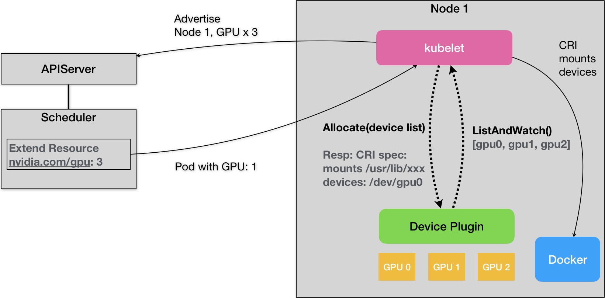

# Day05 深入剖析 Kubernetes - Kubernetes GPU管理與Device Plugin機制

## Kubernetes GPU管理與Device Plugin機制

**Device Plugin** 機制示意圖

此文章為2月Day05學習筆記，內容來源於極客時間[《深入剖析Kuberentes》](https://time.geekbang.org/column/article/70876)