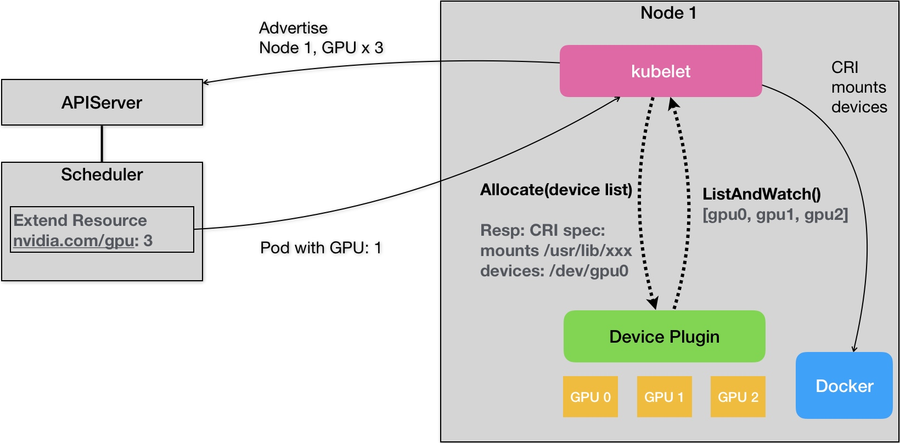

# Day05 深入剖析 Kubernetes - Kubernetes 作業調度與資源管理

## Kubernetes GPU 管理與 Device Plugin 機制
> Ref:
> - [Schedule GPUs](https://kubernetes.io/docs/tasks/manage-gpus/scheduling-gpus/)
>
目前 Pod 沒有直接支持 GPU 的能力，所以無法透過 YAML 直接定義 GPU 數量和 GPU 裝置路徑。

> 以 **NVIDIA 的 GPU 設備**為例，上面的需求就意味著當用戶的容器被創建之後，這個容器里必須出現如下兩部分設備和目錄：
> 
> - GPU 設備: 如 `/dev/nvidia0`
> - GPU 驅動目錄: 如 `/usr/local/nvidia/*`
>
>其中，GPU 設備路徑，正是該容器啓動時的 Devices 參數；而驅動目錄，則是該容器啓動時的 Volume 參數。所以，在 Kubernetes 的 GPU 支持的實現里，**kubelet 實際上就是將上述兩部分內容，設置在了創建該容器的 CRI （Container Runtime Interface）參數裡面**。這樣，等到該容器啓動之後，對應的容器里就會出現 GPU 設備和驅動的路徑了。

**Kubernetes 使用了一種 `Extended Resource`（ER）特殊字段來傳遞 GPU 裝置訊息。**

Kubernetes 調度器不知道該字段的意義，只會採用這個類型的可用數量，減去 Pod 所申請的資源。
```yaml
apiVersion: v1
kind: Pod
metadata:
  name: cuda-vector-add
spec:
  restartPolicy: OnFailure
  containers:
    - name: cuda-vector-add
      image: "k8s.gcr.io/cuda-vector-add:v0.1"
      resources:
        limits:
          nvidia.com/gpu: 1
```

Kubernetes 中各種類型的資源可用量，即為 Node 對象的 `Status` 內容。
```yaml
apiVersion: v1
kind: Node
metadata:
  name: node-1
...
Status:
  Capacity:
   cpu:  2
   memory:  2049008Ki
```

為了添加自訂義字段內容，需要使用指令 `kubectl patch` 更新 Node 對象。
```yaml
# 為了方便跟 API Server 交互，可以使用 kubectl proxy 功能
$ kubectl proxy

# Patch 更新操作
$ curl --header "Content-Type: application/json-patch+json" \
--request PATCH \
--data '[{"op": "add", "path": "/status/capacity/nvidia.com/gpu", "value": "1"}]' \
http://localhost:8001/api/v1/nodes/<your-node-name>/status

---
# 完成上述指令，可以看到類似下面訊息
apiVersion: v1
kind: Node
...
Status:
  Capacity:
   cpu:  2
   memory:  2049008Ki
   nvidia.com/gpu: 1 # 加入的自訂義資源
``` 

### Device Plugins
> Ref:
> - [Device Plugins](https://kubernetes.io/docs/concepts/extend-kubernetes/compute-storage-net/device-plugins/)
> - [NVIDIA GPU device plugin](https://github.com/NVIDIA/k8s-device-plugin)

在 Kubernetes 中，對**所有硬體加速設備進行管理的，為 `Device Plugin`**

**Device Plugin** 機制示意圖


從上圖可以看到，每一種硬體設備都有相對的 `Device Plugin` 管理，都通過 `gPRC` 溝通，連結 `kubelet`。

想要在 Kubernetes 管理的容器中使用硬體設備，需要遵循 Device Plugin 實現以下 API : `ListAndWatch`、`Allocate`。
```go
  service DevicePlugin {
        // ListAndWatch returns a stream of List of Devices
        // Whenever a Device state change or a Device disappears, ListAndWatch
        // returns the new list
        rpc ListAndWatch(Empty) returns (stream ListAndWatchResponse) {}
        // Allocate is called during container creation so that the Device
        // Plugin can run device specific operations and instruct Kubelet
        // of the steps to make the Device available in the container
        rpc Allocate(AllocateRequest) returns (AllocateResponse) {}
  }
```

此文章為2月Day05學習筆記，內容來源於極客時間[《深入剖析Kuberentes》](https://time.geekbang.org/column/article/70876)