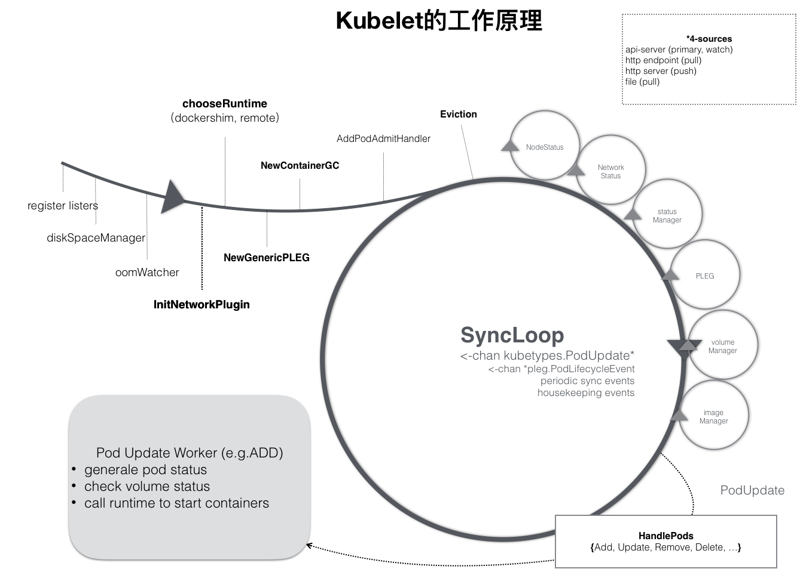
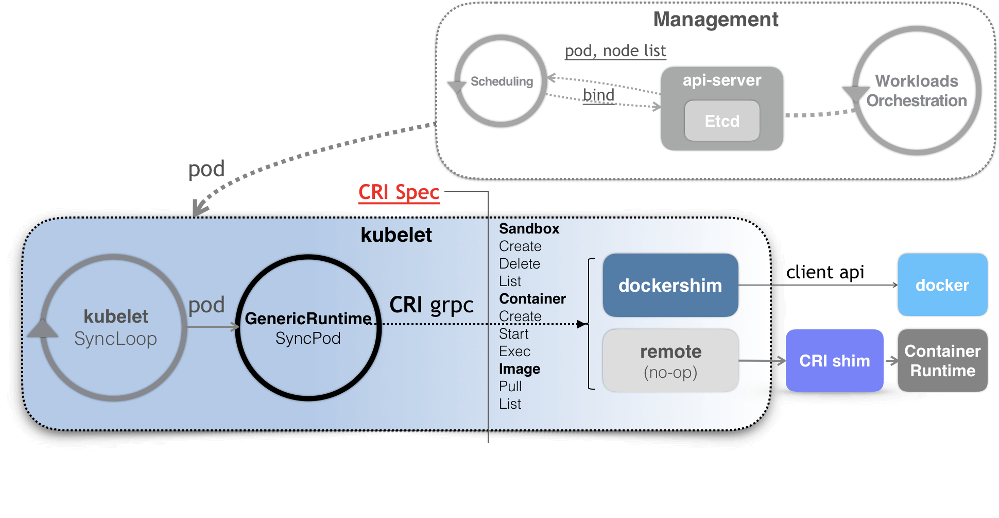

# Day06 深入剖析 Kubernetes - Kubernets 容器運行時（Container Runtime）

## SIG-Node 與 CRI

`kubelet` 主要功能：在**調度**完成後，kubelet 需要負責將這個調度成功的 Pod，在宿主機上創建出來，並把它所定義的各個容器啓動起來。

SyncLoop 事件驅動來自於：

- Pod 更新事件
- Pod 生命週期變化
- Kubelet 本身執行週期
- 定時清理事件

這些控制循環的責任，就是通過**控制器模式**，完成 kubelet 的某項具體職責。

kubelet 也是通過 `Watch` 機制，監聽了與自己相關的 Pod 對象的變化，觸發 `Handler` 執行，並且把 Pod 訊息緩存在內存中。

**kubelet 調用下層容器運行時的執行過程**，並不會直接調用 Docker 的 API，而是**通過一組叫作 `CRI`（Container Runtime Interface，容器運行時接口）的 gRPC 接口來間接執行的**。

- 引入這一層抽象 CRI，是為了遮蔽下層容器運行時的差異變化

- 如創建 Pod，kubelet 實際上就會調用一個叫作 `GenericRuntime` 的通用組件來發起創建 Pod 的 **CRI 請求**
- CRI 請求響應，為相對採用的 CRI 後端容器項目實現，如 `Docker`、`Containerd`、`CRI-O` 等
    - **CRI 自訂義插件，作用為把具體的 CRI 請求轉換成對後端容器項目的請求或者操作**

## 小結

kubelet 如何將 Kubernetes 對應用的定義，轉換成最終對 Docker 或者其他容器項目的 API 請求的？

- 透過 `SyncLoop` 和 `CRI` 兩個關鍵設計

**SyncLoop 本身就要求這個控制循環是絕對不可以被阻塞的**。

- 凡是在 kubelet 里有可能會耗費大量時間的操作，如準備 Pod 的 Volume、拉取鏡像等，**SyncLoop 都會開啓單獨的 Goroutine 來進行操作**。

此文章為2月Day06學習筆記，內容來源於極客時間[《深入剖析Kuberentes》](https://time.geekbang.org/column/article/71056)