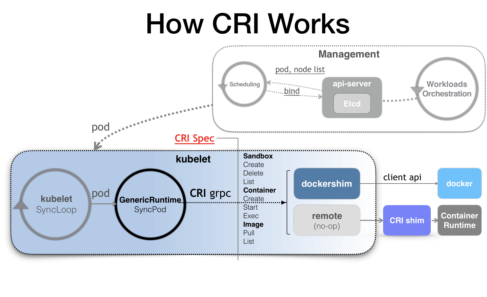
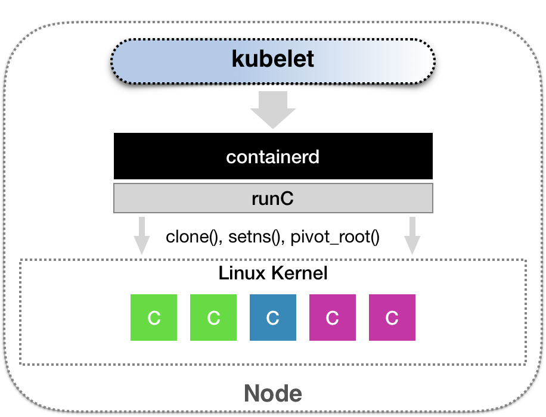
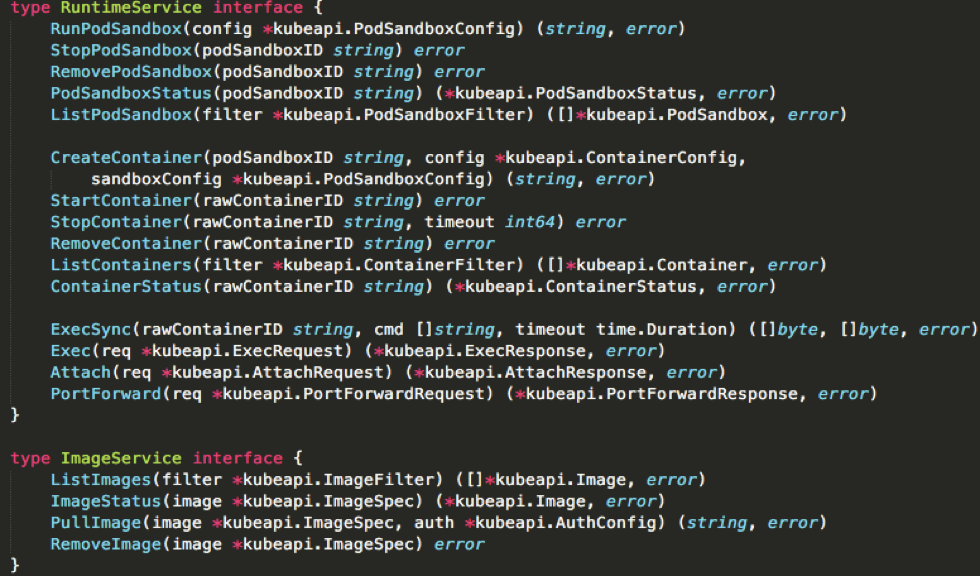
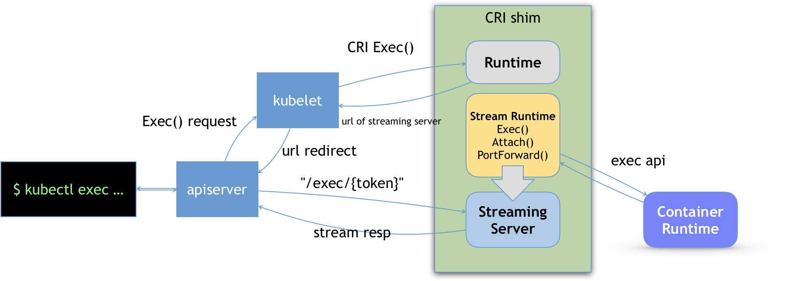

# Day07 深入剖析 Kubernetes - Kubernets 容器運行時（Container Runtime）

## 解讀 CRI 與 容器運行時 （Container Runtime）

CRI 機制優勢在於，每種容器項目都可以實現自己的 CRI shim，也就是各自對 CRI 請求有自己的處理方式。

- 容器項目： `Docker`、`Containerd`、`CRI-O` 等等

如下圖 CNCF 的 `containerd` 項目

- 將 Kubernetes 發出的 **CRI 請求，轉換成對 `containerd` 的調用，然後創建出 `runC` 容器**。而 `runC` 項目，才是負責執行我們前面講解過的設置容器 Namespace、Cgroups 和 chroot 等基礎操作的組件

下圖為 CRI 接口定義

可以把 CRI 分為兩組：
- `RuntimeService`：它提供的接口，主要是跟容器相關的操作。如 創建和啓動容器、刪除容器、執行 exec 命令等等

    - **CRI 設計的一個重要原則，確保接口只關注容器，不關注 Pod**
    - Pod 是 Kubernetes 容器編排概念，不是容器運行時的概念
    - 如果關注 Pod，那在 Kubernetes 開發時候，會頻繁改變，對與 CRI 標準接口來說，變化頻率高就麻煩了

- `ImageService`：它提供的接口，主要是容器鏡像相關的操作，如 拉取鏡像、刪除鏡像等等

`CRI shim` 除了`管理容器生命週期`的實現外，還有就是如何實現 `exec`、`logs` 等接口。**這種接口需要 kubelet 跟容器項目維持一個`長連接`來傳輸數據**，這種 API 為 **Streaming API**。

- `kubelet` 調用 `CRI Exec` 接口，其響應為 `CRI shim`
- **CRI shim 不是直接調用後端容器項目**，而是回傳 URL 給 `kubelet`
    - 這個 **URL 為 Streaming Server 的地址和端口**
- `kubelet` 以 `Redirect` 重定向方式給 `API Server`，讓其與 `Streaming Server` 以長連接方式建立 `exec`
- `Streaming Server` 與 `CRI shim` 一併啟動
- `Streaming Server` 實現方式由 `CRI shim` 維護者決定

此文章為2月Day07學習筆記，內容來源於極客時間[《深入剖析Kuberentes》](https://time.geekbang.org/column/article/71499)

