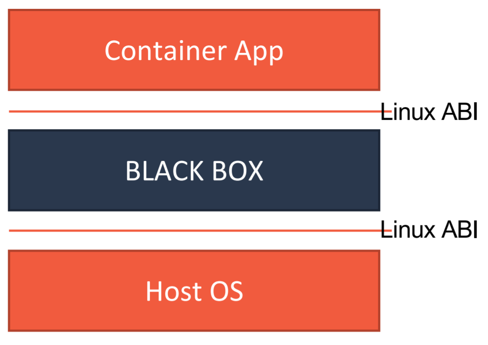
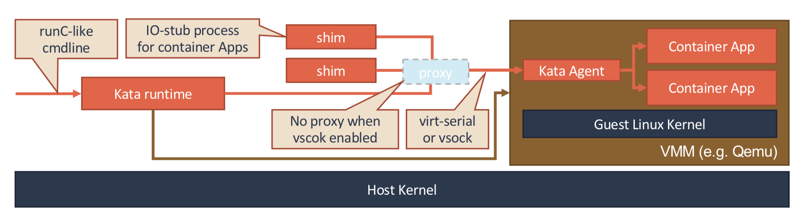
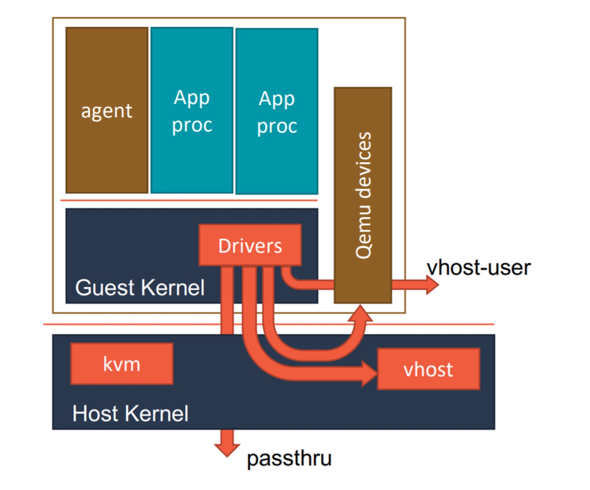
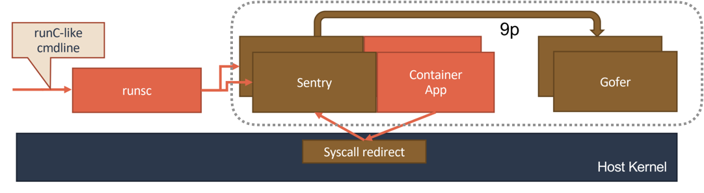
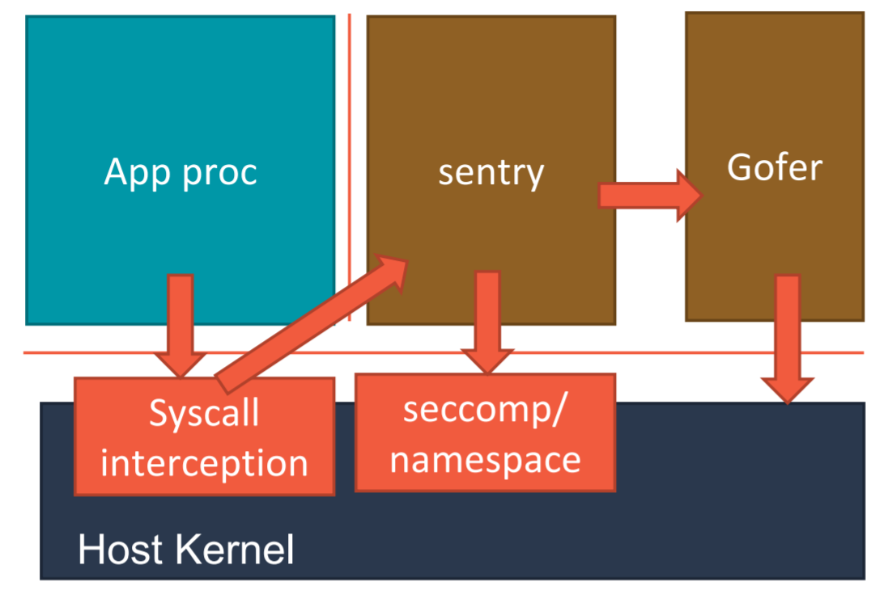
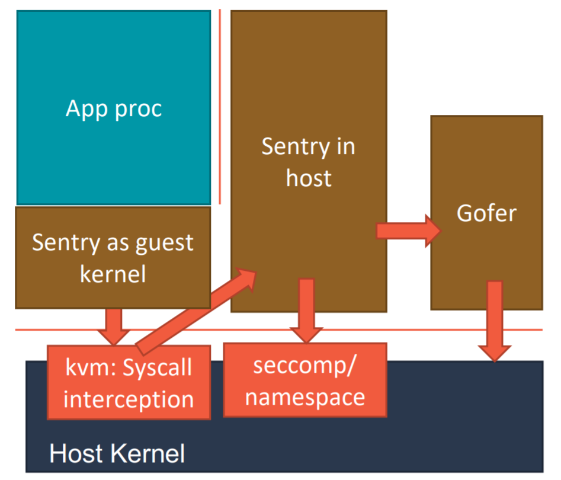
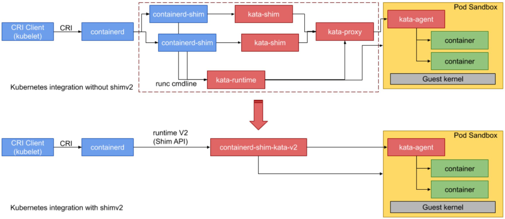

# Day08 深入剖析 Kubernetes - Kubernets 容器運行時（Container Runtime）

## Kata Containers & gVisor

Kata Containers: 兩個項目合併

- Intel OTC （Open Source Technology Center）： Intel Clear Container 項目
- HyperHQ： runV 項目

**兩者本質，為給進程分配一個獨立的操作系統內核，避免讓容器共享宿主機的內核。**

- 避免共享內核，有效解決容器進程逃逸，或是奪權問題

兩者差別在於：

- `Kata Containers` 使用傳統虛擬機技術，通過虛擬硬件模擬
- `gVisor` 直接採用 Golang 模擬一個用戶態的操作系統內核

### Kata Containers

一個標準的虛擬機管理程序（**Virtual Machine Manager**, VMM）是運行 Kata Containers 必備的一個組件。如圖為 VMM 就是 `Qemu`。

使用了虛擬機作為進程的隔離環境之後，Kata Containers 原生就帶有了 Pod 的概念。

虛擬機里會有一個特殊的 `Init` 進程負責管理虛擬機裡面的用戶容器，並且只為這些容器開啓 **Mount Namespace**。

用戶容器原生就是共享 Network 以及其他 Namespace。

優化手段與常規虛擬機一致：

- `vhost` 技術: 實現 Guest 與 Host 的高效網路通訊
- `PCI Passthrough`（PCI 穿透）技術: 讓 Guest 裡的進程可以直接訪問的物理設備

### gVisor

`gVisor` 項目給容器進程配置一個用 Go 語言實現的、**運行在用戶態的、極小的獨立內核**。這個內核**對容器進程暴露 Linux 內核 ABI**，扮演著 Guest Kernel 的角色，從而達到了**將容器和宿主機隔離開**的目的。

- 第一種實現，**使用 `Ptrace` 機制來攔截用戶應用的系統調用（System Call）**，然後把這些系統調用交給 Sentry 來進行處理
    - 缺點**性能差**，只能 demo 使用

- 第二種實現，Sentry 會使用 KVM 來進行系統調用的攔截

`Sentry` 並不是使用 Go 語言重新實現了一個完整的 Linux 內核，而只是一個對應用進程偽裝內核的系統組件。

- 需要自己實現一個完整的 Linux 內核網絡棧，以便處理應用進程的通信請求。

- 對於 Volume 的操作，則需要通過 `9p` 協議交給一個叫做 Gofer 的代理進程來完成。

第二種實現里，Sentry 並不會真的像虛擬機那樣去虛擬出硬件設備、安裝 Guest 操作系統。它只是**借助 KVM 進行系統調用的攔截，以及處理地址空間切換等細節**。

## 小結
> Ref:
> - [gvisor](https://github.com/google/gvisor)

|                                         | KataContainers | KVM 實現的 gVisor            |
|-----------------------------------------|----------------|------------------------------|
| 性能                                    | V              | V                            |
| 啓動速度                                |                | V                            |
| 佔用資源                                |                | V                            |
| 系統調用密集的應用 (如 重 I/O、網路調用) | V              | （頻繁攔截系統而導致性能下降） |

對每個容器提供單獨的虛擬機器則是一個好方法，Google 表示，每個容器擁有自己獨立的執行環境，把核心以及虛擬化裝置從主機分離，即使 Guest 虛擬機器存在漏洞，管理程序仍然會隔離主機以及在主機執行的其他應用程式或是容器。雖然在個別虛擬機器執行容器，能取得更好的隔離性、相容性以及執行效能，但也占用了更多的資源與空間。

gVisor 雖然現在沒有任何優勢，但是這種通過在**用戶態運行一個操作系統內核，來為應用進程提供強隔離的思路**，的確是**未來安全容器進一步演化的方向**。

下圖為 Kata Containers 怎麼去和 Kubernetes 集成

如 `PodSandbox` 就是演化的產物

- **shim-v2 就是一個 PodSandbox 的代表**
- **實際上只有一個 Guest Kernel 跑著容器本身的打包和容器應用，並不包含一個完整的操作系統**。就是說，這個過程，它用起來並不像是傳統的虛擬機，對於容器來說，它只有容器的引擎，並且通過少用不必要的內存、共享能共享的內存來進一步地降低內存的開銷。

此文章為2月Day08學習筆記，內容來源於極客時間[《深入剖析Kuberentes》](https://time.geekbang.org/column/article/71606)