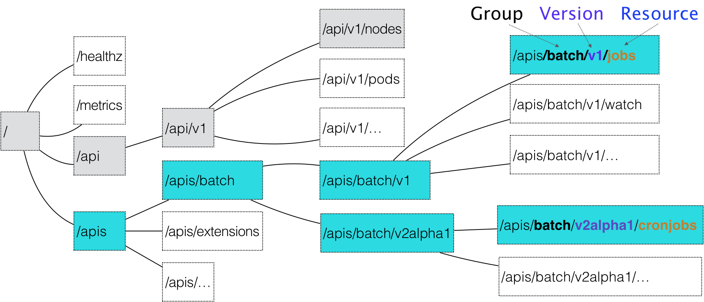
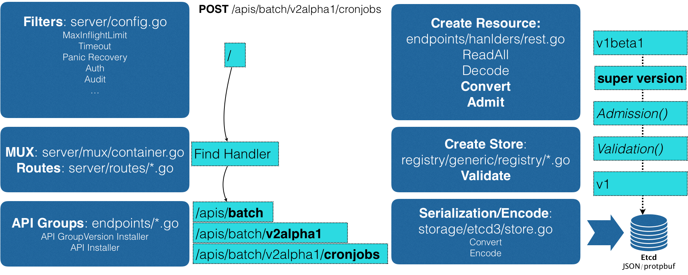

# Day10 深入剖析 Kubernetes - 容器編排與 Kubernetes 作業管理

## 深入解析聲明式API（一）： API 對象的奧秘


一個 API 對象在 Etcd 里的完整資源路徑，是由三部分組成：
- Group（API 組）
- Version（API 版本）
- Resource（API 資源類型）



對應 YAML 文件，如下所示
- CronJob： 為 API 對象的資源類型（Resource）
- batch： 為它的組（Group）
- v2alpha1： 為它的版本（Version）

```yaml
apiVersion: batch/v2alpha1
kind: CronJob
...
```

所示流程圖如下



POST 請求後，就會被提到 API Server，而 API Server 首先需要先過濾請求和前置處理。

- 如`授權`、`超時處理`、`審計`等

API Server 會先後進行 `Admission()` 和 `Validation()` 操作，前一則筆記提到的 Admission Controller 和 Initalizer 都是屬於 Admission 的操作。

- **一個 API 對象的定義能在 Registry 數據結構里查到，它就是一個有效的 Kubernetes API 對象**
- APIServer 會把驗證過的 API 對象轉換成用戶最初提交的版本，進行**序列化操作**，並調用 Etcd 的 API 把它保存起來


在 Kubernetes v1.7 之前，只能靠 API Server 新增 Kubernetes 風格的 API 資源類型，但後來版本 Kubernetes 提供了新的插件來完成這件事：`CRD`。

CRD，其全名為 `Custom Resource Definition`，允許用戶在 Kubernetes 中添加一個跟 Pod、Node 類似的、新的 API 資源類型，即：**自定義 API 資源**。

### 以 Network CRD 例子說明
以例子說明，為 Kubernetes 添加一個名叫 **Network 的 API 資源類型**：

- **作用為，用戶創建 Network 對象後，Kubernetes 就可以採用這個對象定義的網路參數，調用真實的網路插件**

Network 對象的 YAML 文件
```yaml
apiVersion: samplecrd.k8s.io/v1
kind: Network
metadata:
  name: example-network
spec:
  cidr: "192.168.0.0/16"
  gateway: "192.168.0.1"
```

CRD 對象的 YAML 文件 : **為了讓 Kubernetes 知道這個 CR**

- Group（API 組）： samplecrd.k8s.io
- Version（API 版本）： v1
- Resource（API 資源類型）： Network
```yaml
apiVersion: apiextensions.k8s.io/v1beta1
kind: CustomResourceDefinition
metadata:
  name: networks.samplecrd.k8s.io 
spec:
  group: samplecrd.k8s.io
  version: v1
  names:
    kind: Network
    plural: networks
  scope: Namespaced
```

接著，就要進行代碼處理

```shell
$ tree $GOPATH/src/github.com/<your-name>/k8s-controller-custom-resource
.
├── controller.go
├── crd
│   └── network.yaml
├── example
│   └── example-network.yaml
├── main.go
└── pkg
    └── apis
        └── samplecrd
            ├── register.go
            └── v1
                ├── doc.go
                ├── register.go
                └── types.go
```

`pkg/apis/samplecrd` 就是 API 組的名字，v1 是版本，而 v1 下面的 **types.go 文件里，則定義了 Network 對象的完整描述**。

在 `pkg/apis/samplecrd` 目錄下

- 創建 `register.go`
```go
package samplecrd

const (
 GroupName = "samplecrd.k8s.io"
 Version   = "v1"
)
```

- 創建 `doc.go` （Golang 的文檔源文件）
    -  **`+<tag_name>[=value]`格式的注釋**，為 Kubernetes **進行代碼生成要用的 `Annotation` 風格的注釋**
```go
// +k8s:deepcopy-gen=package

// +groupName=samplecrd.k8s.io
package v1
```

- **添加 `type.go`，為定義一個 Network 類型對象有什麼字段**

```go
package v1
...
// +genclient
// +genclient:noStatus
// +k8s:deepcopy-gen:interfaces=k8s.io/apimachinery/pkg/runtime.Object

// Network describes a Network resource
type Network struct {
 // TypeMeta is the metadata for the resource, like kind and apiversion
 metav1.TypeMeta `json:",inline"`
 // ObjectMeta contains the metadata for the particular object, including
 // things like...
 //  - name
 //  - namespace
 //  - self link
 //  - labels
 //  - ... etc ...
 metav1.ObjectMeta `json:"metadata,omitempty"`
 
 Spec networkspec `json:"spec"`
}
// networkspec is the spec for a Network resource
type networkspec struct {
 Cidr    string `json:"cidr"`
 Gateway string `json:"gateway"`
}

// +k8s:deepcopy-gen:interfaces=k8s.io/apimachinery/pkg/runtime.Object

// NetworkList is a list of Network resources
type NetworkList struct {
 metav1.TypeMeta `json:",inline"`
 metav1.ListMeta `json:"metadata"`
 
 Items []Network `json:"items"`
}
```
如果類型定義包括了 `Status` 字段的話，就不需要這句 `+genclient:noStatus` 注釋了
```go
// +genclient

// Network is a specification for a Network resource
type Network struct {
 metav1.TypeMeta   `json:",inline"`
 metav1.ObjectMeta `json:"metadata,omitempty"`
 
 Spec   NetworkSpec   `json:"spec"`
 Status NetworkStatus `json:"status"` # here，上面定義沒有
}
```

- 創建 `pkg/apis/samplecrd/v1/register.go` 
    - **向 API Server 註冊一個類型（Type）對象**
```go
package v1
...
// addKnownTypes adds our types to the API scheme by registering
// Network and NetworkList
func addKnownTypes(scheme *runtime.Scheme) error {
 scheme.AddKnownTypes(
  SchemeGroupVersion,
  &Network{},
  &NetworkList{},
 )
 
 // register the type in the scheme
 metav1.AddToGroupVersion(scheme, SchemeGroupVersion)
 return nil
}
```

## 小結

`register.go` 文件里的內容其實是非常固定的，可以直接使用這部分代碼做模板，然後把其中的 **`Resource`、`GroupName` 和 `Version` 替換成其他 CRD 定義即可。**

CRD 定義分為兩部分：

- 自定義資源類型的 API 描述
- 自定義資源類型的 對象 描述

一般來說，擴展 API Server (或者說添加 CR ) 有兩種方式：
1. `CRD`: API server 可以處理 CRD 的 REST 請求（CRUD）和持久性存儲。簡單，不需要其他的編程。**更適用於聲明式的 API，和 kubernetes 高度集成統一**。
2. `API Aggregation`: 一個獨立的 API server。API server 委託此獨立的API server 處理 CR。需要編程，但能夠更加靈活的控制 API 的行為，更加靈活的自定義存儲，以及與 API 不同版本之間的轉換。一**般更適用於命令模式，或者復用已經存在 REST API 代碼，不直接支持 kubectl 和 k8s UI, 不支持 scope resource in a cluster/namespace**。

**CR 可以使用戶方便的存取結構化 Resource 數據，但是只有和 Operator （自定義 Controller） 組合在一起才是聲明式API**。聲明式 API 允許用戶定義一個期望的狀態。Operator 通過解讀結構化 Resource 數據，獲得期望狀態，從而不斷的協調期望狀態和實際狀態。

此文章為2月Day10學習筆記，內容來源於極客時間[《深入剖析Kuberentes》](https://time.geekbang.org/column/article/41876)