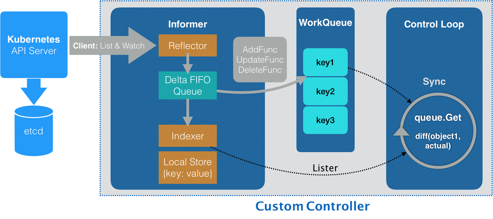

# Day11 深入剖析 Kubernetes - 容器編排與 Kubernetes 作業管理

## 深入解析聲明式API（二）：編寫自定義控制器

編寫自定義控制器代碼的過程包括三部分：
- 編寫 main 函數
- 編寫自定義控制器的定義
- 編寫控制器里的業務邏輯


### main 函數定義

- 主要為定義並初始化一個自定義控制器（Custrom Controller）

```go
func main() {
  ...
  
  cfg, err := clientcmd.BuildConfigFromFlags(masterURL, kubeconfig)
  ...
  kubeClient, err := kubernetes.NewForConfig(cfg)
  ...
  networkClient, err := clientset.NewForConfig(cfg)
  ...
  
  networkInformerFactory := informers.NewSharedInformerFactory(networkClient, ...)
  
  controller := NewController(kubeClient, networkClient,
  networkInformerFactory.Samplecrd().V1().Networks())
  
  go networkInformerFactory.Start(stopCh)
 
  if err = controller.Run(2, stopCh); err != nil {
    glog.Fatalf("Error running controller: %s", err.Error())
  }
}
```

根據用戶提供的 Master `kubeconfig` 創建一個 kubernetes 和 Network 對象的 client。

**如果沒有提供配置，main 函數會直接使用一種名叫 `InClusterConfig` 的方式來創建這個 client**。這方式會假設自定義控制器以 Pod 運作在 Kubernetes 中。

Kubernetes 里所有的 Pod 都會以 `Volume` 的方式自動掛載 Kubernetes 的`默認 ServiceAccount`。所以，這個控制器就會直接**使用默認 ServiceAccount 數據卷里的授權信息**，來訪問 APIServer。


### Operator Workflow


- Operator 從 API Server 拿取相關對象
    - 如例子 Network 對象
    - Network Informer 使用註冊的 network client 跟 API Server 連接，由 Informer 的 `Reflector` 包維護連接狀態

> client-go/tools/cache/reflector.go +187 func (r *Reflector) ListAndWatch(stopCh <-chan struct{}) error

- 監聽到的事件，都會先被放入 `Delta （增量） FIFO 隊列`，**Imformer 從這個隊列拿取 Delta，判斷事件類型，並創建更新放入內地緩存**，這個緩存在 Kubernets 內為 `Store`
    - 事件類型為 `Added`，Informer 透過 `Indexer` 方法把 Delta 中的 API 對象放入緩存，並創建索引
    - 事件類型為 `Deleted`，Informer 直接從本地緩存刪除對象

- `ResourceEventHandler` 為一個簡單過濾方法，就是檢查對象是否發生了狀態變更(add, update, delete)，如果是，就往 `WorkQueue` 裡面放
    - **`WorkQueue`： 作用為同步 Informer 和控制循環間的數據**
    
> Informer 職責
> - **同步本地緩存**的工作，也是它最重要的職責
> - 根據事件類型，觸發註冊好的 `ResourceEventHandler`（需要在創建 Operator 註冊給對應 Informer）


### Operator 定義
```go
func NewController(
  kubeclientset kubernetes.Interface,
  networkclientset clientset.Interface,
  networkInformer informers.NetworkInformer) *Controller {
  ...
  controller := &Controller{
    kubeclientset:    kubeclientset,
    networkclientset: networkclientset,
    networksLister:   networkInformer.Lister(),
    networksSynced:   networkInformer.Informer().HasSynced,
    workqueue:        workqueue.NewNamedRateLimitingQueue(...,  "Networks"),
    ...
  }
    networkInformer.Informer().AddEventHandler(cache.ResourceEventHandlerFuncs{
    AddFunc: controller.enqueueNetwork,
    UpdateFunc: func(old, new interface{}) {
      oldNetwork := old.(*samplecrdv1.Network)
      newNetwork := new.(*samplecrdv1.Network)
      if oldNetwork.ResourceVersion == newNetwork.ResourceVersion {
        return
      }
      controller.enqueueNetwork(new)
    },
    DeleteFunc: controller.enqueueNetworkForDelete,
 return controller
}
```
> Informer，其實就是一個帶有本地緩存和索引機制的、可以註冊 EventHandler 的 client。

main 函數最後調用 `controller.Run()` 啓動的控制循環
```go
func (c *Controller) Run(threadiness int, stopCh <-chan struct{}) error {
 ...
  if ok := cache.WaitForCacheSync(stopCh, c.networksSynced); !ok {
    return fmt.Errorf("failed to wait for caches to sync")
  }
  
  ...
  for i := 0; i < threadiness; i++ {
    go wait.Until(c.runWorker, time.Second, stopCh)
  }
  
  ...
  return nil
}
```

- 首先，完成一次同步本地緩存操作
- 採用 goroutine 執行無限循環的任務

### Operator 業務邏輯

```go
func (c *Controller) runWorker() {
  for c.processNextWorkItem() {
  }
}

func (c *Controller) processNextWorkItem() bool {
  obj, shutdown := c.workqueue.Get()
  
  ...
  
  err := func(obj interface{}) error {
    ...
    if err := c.syncHandler(key); err != nil {
     return fmt.Errorf("error syncing '%s': %s", key, err.Error())
    }
    
    c.workqueue.Forget(obj)
    ...
    return nil
  }(obj)
  
  ...
  
  return true
}

func (c *Controller) syncHandler(key string) error {

  namespace, name, err := cache.SplitMetaNamespaceKey(key)
  ...
  
  network, err := c.networksLister.Networks(namespace).Get(name)
  if err != nil {
    if errors.IsNotFound(err) {
      glog.Warningf("Network does not exist in local cache: %s/%s, will delete it from Neutron ...",
      namespace, name)
      
      glog.Warningf("Network: %s/%s does not exist in local cache, will delete it from Neutron ...",
    namespace, name)
    
     // FIX ME: call Neutron API to delete this network by name.
     //
     // neutron.Delete(namespace, name)
     
     return nil
  }
    ...
    
    return err
  }
  
  glog.Infof("[Neutron] Try to process network: %#v ...", network)
  
  // FIX ME: Do diff().
  //
  // actualNetwork, exists := neutron.Get(namespace, name)
  //
  // if !exists {
  //   neutron.Create(namespace, name)
  // } else if !reflect.DeepEqual(actualNetwork, network) {
  //   neutron.Update(namespace, name)
  // }
  
  return nil
}
```

- **Operator 拿到的 CR API 對象，為 API Server 中保存的用戶期望狀態**，也被 Informer 保存在本地緩存。
- 控制循環需要通過 `Neutron API` 來查詢實際的 API 對象情況

通過對比**期望狀態**和**實際狀態**的差異，就可以完成一次調協（Reconcile）的過程

## 小結

- **`Informer`，其實就是一個自帶緩存和索引機制，可以觸發 Handler 的 client**。這個本地緩存在 Kubernetes 中一般被稱為 Store，索引一般被稱為 Index。

- `Informer` 使用了 `Reflector` 包，通過 `ListAndWatch` 機制獲取並監視 API 對象變化的客戶端封裝

- `Reflector` 和 `Informer` 之間，用到了一個`增量先進先出隊列` (Delta FIFO Queue) 進行協同。而 `Informer` 與用戶要編寫的控制循環之間，則使用了一個工作隊列來進行協同

**在實際應用中，除了控制循環之外的所有代碼，實際上都是 Kubernetes 自動生成的**，即：`pkg/client/{informers, listers, clientset}`里的內容。

**作為開發者，只需要關注如何拿到實際狀態，跟期望狀態做對比，從而決定接下來要做的業務邏輯即可**。

具體例子項目，可以從原文底部進行操作了解。

此文章為2月Day11學習筆記，內容來源於極客時間[《深入剖析Kuberentes》](https://time.geekbang.org/column/article/42076)